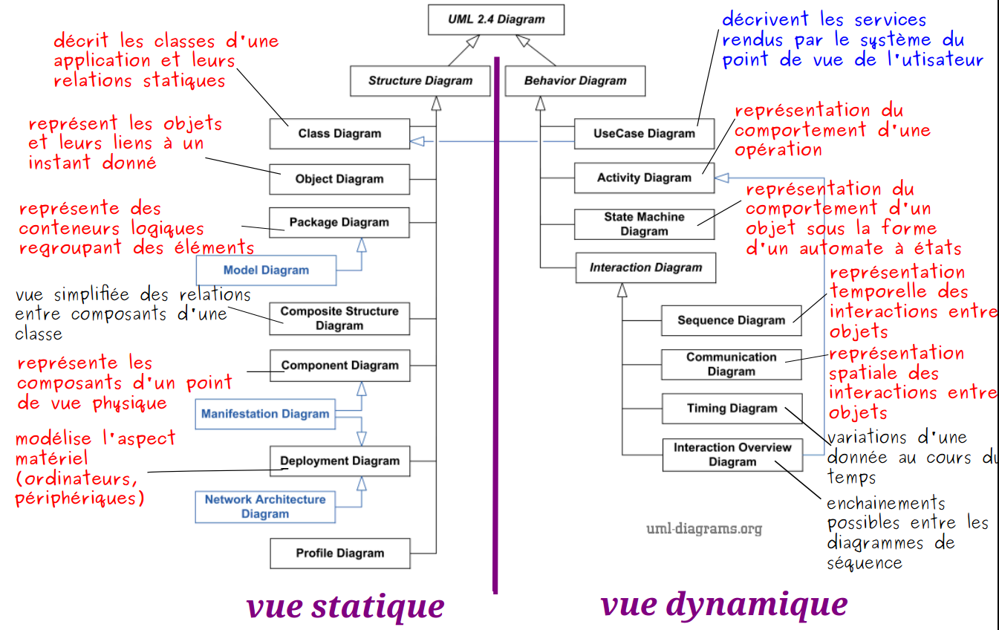
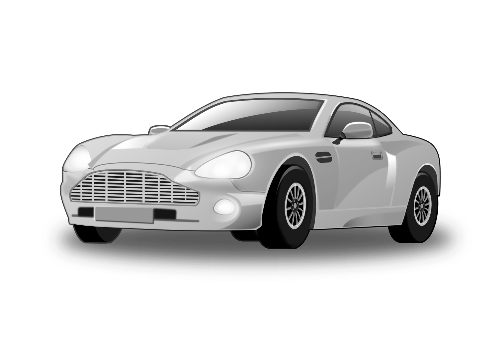

# Introduction à UML

## Activité d'introduction

On souhaite faire la liste de célèbres acteurs. On désire connaître différentes caractéristiques **nom**, **prénom** et **nationalité** des	 acteurs. Pour pouvoir mettre à jour (ex : ajouter ou supprimer un acteur) et manipuler facilement cette liste (ex : trier la liste par ordre alphabétique, par nationalité), on a créé une table. 

:newspaper: Table ACTEUR 

|NuméroActeur |	NomActeur |	PrénomActeur |	NationalitéActeur |
|-----:  |-----:  |-----:  |-----:  |
|01 |	DEPARDIEU |	Gérard 	|Française |
|02 |	ADJANI |	Isabelle |	Française |
|03 |	HANKS |	Tom |	Américaine |
|04 |	PITT |	Brad |	Américaine |
|05 |	PARADIS |	Vanessa |	Française |
|06 |	RENO |	Jean |	Française |
|07 |	CONNERY |	Sean |	Américaine |
|08 |	GRANT |	Hugh |	Anglaise |
|09 |	REDFORD |	Robert |	Américaine |
|10 |	DENEUVE |	Catherine |	Française |
 
**Question 1 :** Modéliser ces informations. 
 
On souhaiterait également savoir dans quels films ont joué ces acteurs. On ajoute une autre table FILM comme ci-dessous.

:newspaper:  Table FILM 

NuméroFilm |	TitreFilm 	|DuréeFilm |
|-----:  |-----:  |-----:  |
|10 |	Cyrano de Bergerac |	120 |
|20 |	4 mariages, 1 enterrement |	120 
|30 |	Rock |	130 
|40 |	Forrest Gump |	135 
|50 |	Seven |	130 
|60 |	The Mask |	98 
|70 |	Proposition Indécente |	90 
|80 |	Les visiteurs |	120 
|90 |	Léon 	|120 
 
**Question 2 :** Ajouter cette table à votre modélisation. 

**Question 3 :** Lorsque l’élève essaye d’utiliser ces deux tables dans un SGBD pour savoir dans quels films jouent les acteurs, il rencontre un problème. Lequel ?  
 
**Question 4 :** Proposer un diagramme de classe cohérent pour ce besoin 

 Le contenu de la table JOUER est le suivant : 

??? abstract "table JOUER"
    Table JOUER

    | NuméroActeur |	NuméroFilm |
    |-----:  |-----:  |
    | 01 |	10 |
    | 03 |	40 |
    | 04 |	50 |
    | 06 |	80 |
    | 06 |	90 |
    | 07 |	30 |
    | 08 |	20 |
    | 09 |	70 |

## 1. Notion de modélisation

### 1.1 Pourquoi modéliser ?
:arrow_forward: Trouver un langage commun d’un point de vue fonctionnel 
:arrow_forward: Avoir un plan, une feuille de route avant de commencer à coder 
:arrow_forward: Augmenter la qualité du code et la maintenabilité 

!!! warning "Définition d'un modèle"
    Un modèle peut être défini comme étant une image de la réalité. Toute réalité complexe3 a besoin d’être représentée pour être comprise et maîtrisée.Un modèle peut être défini comme étant une image de la réalité. Toute réalité complexe3 a besoin d’être représentée pour être comprise et maîtrisée.

### 1.2 Qui modélise ?
La **MOA** (Maîtrise d'ouvrage, le coté métier, fonctionnel du domaine d'activité) exprime la système d’information à l’aide du cahier des charges. 
La **MOE** (Maîtrise d'oeuvre, le côté projet, technique) modélise et transcrit le langage écrit en un langage pseudo-informatique facilement appréhendable par tous. 

On est dans la première phase du cycle en V, ou dans la phase de définition du backlog en agile. 

**UML** intervient à ce niveau et propose un langage unifié pour exprimer les systèmes d’information. 

:triangular_flag_on_post: Attention : UML est un _langage_ et non une méthode au contraire de Merise.

<em> Merise est une méthode projet, française. Très utilisée dans le monde de l'industrie et des projets informatiques. En perte de vitesse par rapport à UML plus international.</em>

???+ note "Historique"
    UML, ou *Unified Modeling Language*, a été développé au début des années 1990 par trois leaders de l'ingénierie logicielle : **Grady Booch, Ivar Jacobson, et James Rumbaugh**. À l'origine, ces experts utilisaient des méthodes de modélisation différentes, Booch travaillant sur la conception d'objets, Jacobson sur l'ingénierie des systèmes, et Rumbaugh sur la modélisation basée sur les objets.

    En 1994, ils ont uni leurs forces pour créer un langage de modélisation unifié qui pourrait combiner leurs approches respectives. Le résultat de cette collaboration a été baptisé Unified Modeling Language, et il a été officiellement présenté en 1997 avec la version UML 1.0. Depuis lors, UML est devenu un standard de facto dans l'industrie du développement logiciel, soutenu par l'Object Management Group (OMG).

    À travers les années, UML a évolué avec des versions successives, intégrant de nouveaux concepts et diagrammes pour mieux répondre aux besoins croissants de l'ingénierie logicielle. Aujourd'hui, UML demeure essentiel pour la conception, la visualisation, et la documentation des systèmes logiciels complexes.

    _historique généré par openAI_

### 1.3 Pourquoi utiliser UML dans le développement logiciel

L'utilisation d'UML dans le développement logiciel offre plusieurs avantages.

:one: **Communication universelle**: UML fournit un langage visuel standardisé compréhensible par tous. Cela facilite la communication et la compréhension des concepts entre les membres d'une équipe de développement et au-delà.
 
:two: **Visualisation des concepts** : UML permet de représenter visuellement la structure, le comportement, et les interactions d'un système logiciel. Les diagrammes UML fournissent une vue graphique intuitive des concepts abstraits, facilitant ainsi la compréhension et la prise de décision.
 
:three: **Conception préliminaire** : Avant de commencer la programmation, UML permet de concevoir et de modéliser l'architecture d'un système. Cela aide à identifier les besoins, à définir les structures et à planifier les étapes du développement avant de commencer l'implémentation.
 
:four: **Documentation** : UML sert de _documentation visuelle_ pour le code source. Les diagrammes UML peuvent être utilisés pour expliquer l'architecture et la logique du code, ce qui facilite la maintenance, la compréhension et le débogage pour les développeurs actuels et futurs.
 
En résumé, l'utilisation d'UML dans le développement logiciel améliore la communication, facilite la conception, offre une documentation visuelle, et contribue globalement à des processus de développement plus efficaces et compréhensibles.

### 1.4 Les diagrammes UML

UML nous fournit donc des diagrammes pour représenter le logiciel à développer : son fonctionnement, sa mise en route, les actions susceptibles d’être effectuées par le logiciel, etc. 
Il y a 14 types de diagrammes UML ayant une notation commune existant réparti en 2 familles :  
:arrow_forward: Les aspects fonctionnels 
:arrow_forward: Les aspects liés à l’architecture 

## 2. Rappel sur les concepts Objets

{: .center width=30%}

En UML (Unified Modeling Language), le concept d'objet est _fondamental_ et repose sur la programmation orientée objet (POO). Un objet est une **instance** concrète d'une classe, qui est une **entité abstraite** représentant un concept ou une idée. Les objets sont les composants de base de la modélisation UML et sont caractérisés par des **propriétés** et des **comportements**.
 
:arrow_upper_right: **Propriétés (Attributs)** : Les objets ont des propriétés qui décrivent leurs caractéristiques. Ces propriétés, également appelées **attributs**, représentent l'état interne de l'objet. Par exemple, dans une classe "Voiture", les propriétés pourraient inclure la marque, le modèle, et la couleur.
 
:arrow_upper_right: **Comportements (Méthodes)** : Les objets ont des comportements qui définissent les actions qu'ils peuvent effectuer. Ces comportements sont définis par des méthodes, qui représentent les actions ou les opérations que l'objet peut exécuter. Dans notre exemple de classe "Voiture", des méthodes pourraient inclure "démarrer" et "arrêter".
 
:arrow_upper_right: **Encapsulation**: Les objets appliquent le _principe d'encapsulation_, ce qui signifie que les détails internes de l'objet ne sont pas directement accessibles depuis l'extérieur. Les attributs et les méthodes sont encapsulés à l'intérieur de la classe, et l'accès à ces éléments se fait généralement par des méthodes publiques.
 
:arrow_upper_right: **Abstraction** : L'abstraction est un autre concept clé lié aux objets. Elle consiste à représenter les caractéristiques essentielles d'un objet tout en ignorant les détails non essentiels. Les classes servent de modèles abstraits pour créer des objets concrets.
 

!!! info "résumé"
    En résumé, en UML, un ==objet est une instance spécifique d'une classe qui combine des propriétés et des comportements==. La programmation orientée objet, à la base de ce concept, favorise la modélisation réaliste et la réutilisation du code, améliorant ainsi la clarté, la maintenance, et la flexibilité des systèmes logiciels.

