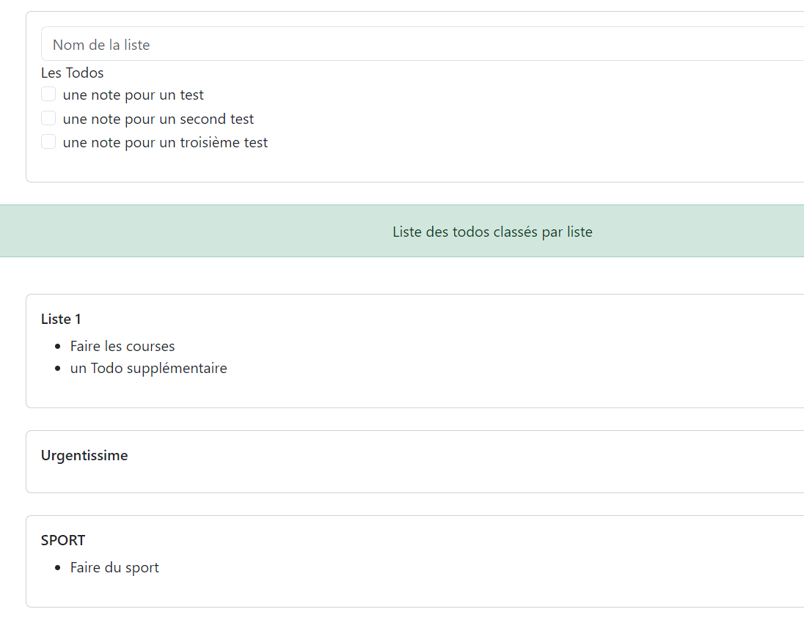

# 4. Gestion des listes

:arrow_forward: User Story :

:closed_book:Pour faciliter l’organisation des toDo il vous est demandé de gérer une fonctionnalité de regroupement de Todos que l’on appellera **Liste de Todos**. Une Liste pourra contenir plusieurs Todos et un todo pourra être affecté à une et une seule liste (mais pourra également ne pas appartenir à une liste). 
Il vous est demander de créer un nouvel écran de gestion de Liste, permettant de créer une nouvelle liste et d’affecter des Todos non déjà affectés à cette liste. 
Sous ce formulaire, on pourra également avoir la liste des « listes » avec leurs Todos. 

{: width=70% .center}

:green_book: Lors de la création de la création d’un Todo, on pourra affecter un todo à une liste par une liste déroulante. On devra également gérer le cas de ne pas affecter à une liste. 

{: width=50% .center}

:blue_book: Dans un dernier temps, vous pourrez afficher le nom de la liste d’appartenance à chaque Todo. 

{: width=30% .center}

??? question "modélisation UML de la fonctionnalité"

??? question "Etude d'impact de la fonctionnalité"

