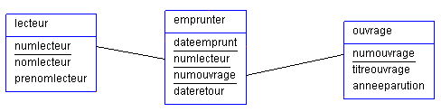

**Exemples d’attribution de privilèges**

{: width=50% .center}

[Télécharger fichier Création de la base BIBLI :arrow_down:](./data/script_creation_bibli.sql){ .md-button .md-button--primary }

Donner les instructions SQL pour réaliser les traitements qui suivent.

:arrow_forward: Actions réalisées par l’administrateur (compte ``root``) :

**R1 :** L’utilisateur ``bibliAdm`` peut consulter toutes les tables des bases de données présentes sur le serveur.

??? question "Solution"

    ```SQL
    CREATE USER 'bibliAdm'@'localhost' IDENTIFIED BY 'password';
    GRANT SELECT ON * . * TO 'bibliAdm'@'localhost';
    FLUSH PRIVILEGES ;
    ```

**R2 :** ``bibliAdm``  peut  créer  des  utilisateurs et  leur attribuer ses droits.

??? question "Solution"

    ```SQL
    GRANT CREATE USER, GRANT OPTION ON *.* TO 'bibliAdm'@'localhost'; 
    ```

**R3 :** ``bibliAdm`` possède tous les droits sur la base « bibli ».

??? question "Solution"

    ```SQL
    GRANT ALL PRIVILEGES ON * . * TO 'bibliAdm'@'localhost';
    ```

:arrow_forward: Actions réalisées par l’administrateur de la base « bibli » (compte ``bibliAdm``) :

**R4 :** Création d’un utilisateur ``bibliCli`` avec pour mot de passe « cli974 ».

??? question "Solution"

    ```SQL
    CREATE USER 'bibliCli'@'localhost' IDENTIFIED BY 'cli974'; 
    ```

**R5 :** ``bibliCli`` peut consulter toutes les tables de la base « bibli ».

??? question "Solution"

    ```SQL
    GRANT SELECT ON bibli.* TO 'bibliCli'@'localhost';
    ```

**R6 :** ``bibliCli`` peut ajouter et modifier les enregistrements dans la table « emprunter ».

??? question "Solution"

    ```SQL
    GRANT INSERT, UPDATE ON bibli.emprunter TO 'bibliCli'@'localhost';
    ```

**R7 :** ``bibliCli`` peut modifier le prénom des lecteurs dans la table « lecteur ».

??? question "Solution"

    ```SQL
    GRANT UPDATE (prenomlecteur) ON bibli.lecteur TO 'bibliCli'@'localhost';
    ```

:arrow_forward: Actions réalisées par l’administrateur de la base « bibli » (compte ``bibliAdm``) :

**R8 :** L’utilisateur ``bibliCli`` n’a plus le droit de modifier la table ``emprunter``.

??? question "Solution"

    ```SQL
    REVOKE INSERT, UPDATE ON bibli.emprunter FROM 'bibliCli'@'localhost';
    ```

**R9 :** L’utilisateur ``bibliCli`` n’a plus le droit de modifier la colonne ``prenomlecteur`` de la table ``lecteur``.

??? question "Solution"

    ```SQL
    REVOKE UPDATE (prenomlecteur) ON bibli.lecteur FROM 'bibliCli'@'localhost';
    ```
    

:arrow_forward: Actions réalisées par l’administrateur (compte ``root``) :

**R10 :** L’utilisateur ``bibliAdm`` ne peut plus consulter les autres bases que « bibli ».

??? question "Solution"

    ```SQL
    REVOKE SELECT ON *.* FROM 'bibliAdm'@'localhost';
    ```
    Il garde uniquement ses droits sur « bibli » (accordés en R3).

**R11 :** L’utilisateur ``bibliAdm`` n’a plus le droit d’attribuer des privilèges aux utilisateurs.

??? question "Solution"

    ```SQL
    REVOKE GRANT OPTION ON *.* FROM 'bibliAdm'@'localhost';
    REVOKE CREATE USER ON *.* FROM 'bibliAdm'@'localhost';
    ```