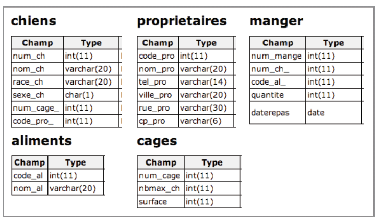

# TD Chenil

{: width=30% .center}

!!! note "Objectif du TP"

	- Mettre en oeuvre les jointures internes et externes

{: width=50% .center}

^^schéma relationnel :^^

**CHIEN** (^^num_ch^^, nom_ch, race, sexe, #num_cage, #code_pro)<br />
**PROPRIETAIRE**(^^code_pro^^, nom_pro, tel_pro, ville_pro, rue_pro, cp_pro) <br />
**MANGER**(^^#num_ch, #code_al^^, quantite, date_repas)<br />
**ALIMENT**(^^code_al^^, nom_al)<br />
**CAGE**(^^num_cage^^, nbmax, surface)<br />

??? info "Script création de la base"

    ```sql
    -- ============================================================
    --  CHENIL - Script de création de la base de données
    -- ============================================================

    CREATE DATABASE IF NOT EXISTS chenil CHARACTER SET utf8mb4 COLLATE utf8mb4_unicode_ci;
    USE chenil;

    -- ------------------------------------------------------------
    --  Tables
    -- ------------------------------------------------------------

    CREATE TABLE CAGE (
        num_cage    INT,
        nbmax       INT          NOT NULL,
        surface     DECIMAL(5,2) NOT NULL,  -- en m²
        CONSTRAINT pk_cage PRIMARY KEY (num_cage)
    );

    CREATE TABLE PROPRIETAIRE (
        code_pro    INT          PRIMARY KEY AUTO_INCREMENT,
        nom_pro     VARCHAR(100) NOT NULL,
        tel_pro     VARCHAR(15),
        ville_pro   VARCHAR(100),
        rue_pro     VARCHAR(150),
        cp_pro      VARCHAR(5)
    );

    CREATE TABLE ALIMENT (
        code_al     INT          PRIMARY KEY AUTO_INCREMENT,
        nom_al      VARCHAR(100) NOT NULL
    );

    CREATE TABLE CHIEN (
        num_ch      INT          PRIMARY KEY AUTO_INCREMENT,
        nom_ch      VARCHAR(100) NOT NULL,
        race        VARCHAR(100),
        sexe        CHAR(1)      CHECK (sexe IN ('M', 'F')),
        num_cage    INT,
        code_pro    INT,
        CONSTRAINT fk_chien_cage FOREIGN KEY (num_cage)  REFERENCES CAGE(num_cage),
        CONSTRAINT fk_chien_pro FOREIGN KEY (code_pro)  REFERENCES PROPRIETAIRE(code_pro)
    );

    CREATE TABLE MANGER (
        num_ch      INT            NOT NULL,
        code_al     INT            NOT NULL,
        quantite    DECIMAL(5,2)   NOT NULL,  -- en kg
        date_repas  DATE           NOT NULL,
        PRIMARY KEY (num_ch, code_al, date_repas),
        CONSTRAINT fk_manger_chien FOREIGN KEY (num_ch)   REFERENCES CHIEN(num_ch),
        CONSTRAINT fk_manger_al FOREIGN KEY (code_al)  REFERENCES ALIMENT(code_al)
    );
    ```
??? info "Script de création du jeu de données"

    ```sql
    -- ============================================================
    --  CHENIL - Jeu de données de test
    -- ============================================================
    USE chenil;

    -- ------------------------------------------------------------
    --  CAGE  (8 cages dont 2 vides → testent les LEFT/RIGHT JOIN)
    -- ------------------------------------------------------------
    INSERT INTO CAGE (num_cage, nbmax, surface) VALUES
    (1, 2, 12.00),
    (2, 3, 18.50),
    (3, 1,  8.00),
    (4, 4, 25.00),
    (5, 2, 10.00),
    (6, 2, 14.00),
    (7, 1,  6.00),  -- cage vide
    (8, 3, 20.00);  -- cage vide

    -- ------------------------------------------------------------
    --  PROPRIETAIRE  (6 propriétaires dont 1 sans chien)
    -- ------------------------------------------------------------
    INSERT INTO PROPRIETAIRE (code_pro, nom_pro, tel_pro, ville_pro, rue_pro, cp_pro) VALUES
    (1, 'Dupont Marie',   '0612345678', 'Paris',       '12 rue de la Paix',       '75001'),
    (2, 'Martin Jules',  '0623456789', 'Lyon',        '5 avenue Bellecour',      '69002'),
    (3, 'Bernard Sophie','0634567890', 'Marseille',   '8 boulevard Longchamp',   '13001'),
    (4, 'Leroy Pierre',  '0645678901', 'Bordeaux',    '22 cours Victor Hugo',    '33000'),
    (5, 'Moreau Claire', '0656789012', 'Nantes',      '3 rue Crébillon',         '44000'),
    (6, 'Simon Paul',    '0667890123', 'Strasbourg',  '1 place Kléber',          '67000'); -- sans chien

    -- ------------------------------------------------------------
    --  ALIMENT  (5 aliments dont 1 jamais consommé)
    -- ------------------------------------------------------------
    INSERT INTO ALIMENT (code_al, nom_al) VALUES
    (1, 'Croquettes adulte'),
    (2, 'Pâtée bœuf'),
    (3, 'Croquettes junior'),
    (4, 'Pâtée poulet'),
    (5, 'Biscuits récompense'); -- jamais consommé

    -- ------------------------------------------------------------
    --  CHIEN  (10 chiens)
    --    - Rex  (num_ch=7) : pas de repas enregistré
    --    - Luna (num_ch=8) : pas de repas enregistré
    --    - Milou (num_ch=9) : > 5 kg en une journée
    --    - Propriétaires 1 et 2 ont plusieurs chiens
    -- ------------------------------------------------------------
    INSERT INTO CHIEN (num_ch, nom_ch, race, sexe, num_cage, code_pro) VALUES
    ( 1, 'Max',    'Labrador',         'M', 1, 1),
    ( 2, 'Bella',  'Golden Retriever', 'F', 2, 1),
    ( 3, 'Buddy',  'Berger Allemand',  'M', 2, 2),
    ( 4, 'Luna',   'Husky',            'F', 3, 2),
    ( 5, 'Rocky',  'Boxer',            'M', 4, 3),
    ( 6, 'Molly',  'Beagle',           'F', 4, 4),
    ( 7, 'Rex',    'Rottweiler',       'M', 5, 4),  -- sans repas
    ( 8, 'Daisy',  'Caniche',          'F', 6, 5),  -- sans repas
    ( 9, 'Milou',  'Jack Russell',     'M', 1, 1),  -- mange > 5 kg / jour
    (10, 'Lola',   'Chihuahua',        'F', 2, 3);

    -- ------------------------------------------------------------
    --  MANGER
    --    Couvre : repas normaux, aliment 5 jamais mangé,
    --             Rex et Daisy sans repas,
    --             Milou > 5 kg en une journée
    -- ------------------------------------------------------------
    INSERT INTO MANGER (num_ch, code_al, quantite, date_repas) VALUES
    -- Max
    (1, 1, 0.40, '2024-05-01'),
    (1, 2, 0.35, '2024-05-02'),
    (1, 1, 0.40, '2024-05-03'),
    -- Bella
    (2, 1, 0.38, '2024-05-01'),
    (2, 4, 0.30, '2024-05-02'),
    -- Buddy
    (3, 1, 0.50, '2024-05-01'),
    (3, 2, 0.45, '2024-05-02'),
    (3, 3, 0.50, '2024-05-03'),
    -- Luna
    (4, 3, 0.30, '2024-05-01'),
    (4, 4, 0.25, '2024-05-02'),
    -- Rocky
    (5, 2, 0.60, '2024-05-01'),
    (5, 1, 0.55, '2024-05-02'),
    -- Molly
    (6, 1, 0.20, '2024-05-01'),
    (6, 4, 0.18, '2024-05-03'),
    -- Milou : 3.20 + 2.50 = 5.70 kg le même jour → déclenche HAVING > 5
    (9, 1, 3.20, '2024-05-01'),
    (9, 2, 2.50, '2024-05-01'),
    -- Lola
    (10, 3, 0.12, '2024-05-01'),
    (10, 4, 0.10, '2024-05-02');

    -- Rex (num_ch=7) et Daisy (num_ch=8) : aucune ligne dans MANGER
    -- Aliment 5 (Biscuits récompense) : aucune ligne dans MANGER

    ```

:question: 1. **Décompter le nombre de chien par cage. Affichez aussi les numéros de cage vide.**
??? question "correction"
    ```SQL
    SELECT cage.NumCage, COUNT(Num_Ch)
    FROM Cage
    LEFT OUTER JOIN Chien
    ON Cage.NumCage = Chien.NumCage
    GROUP BY Cage.NumCage
    ```

    Attention: ``COUNT(*)`` donnerai 1, même pour une cage vide, car il y a une ligne qui lui correspond.


:question: 2. **Lister les chiens avec les détails de leurs propriétaires**
??? question "correction"
    ```sql
    SELECT ch.nom_ch, ch.race, ch.sexe, p.nom_pro, p.tel_pro
    FROM CHIEN ch
    INNER JOIN PROPRIETAIRE p ON ch.code_pro = p.code_pro;
    ```

:question: 3. **Lister tous les chiens et leurs repas, même ceux qui n'ont pas encore mangé**
??? question "correction"
    ```sql
    SELECT ch.nom_ch, ch.race, m.quantite, m.date_repas
    FROM CHIEN ch
    LEFT JOIN MANGER m ON ch.num_ch = m.num_ch;
    ```

:question: 4. **Lister tous les aliments et les chiens qui les ont mangés, même si certains aliments n'ont pas été consommés**
??? question "correction"
    ```sql
    SELECT a.nom_al, m.num_ch, m.quantite, m.date_repas
    FROM ALIMENT a
    RIGHT JOIN MANGER m ON a.code_al = m.code_al;
    ```

:question: 5. **Lister tous les chiens et les cages où ils sont logés, même si certaines cages sont vides**
??? question "correction"
    ```sql
    SELECT ch.nom_ch, ch.race, c.num_cage, c.nbmax, c.surface
    FROM CHIEN ch
    LEFT JOIN CAGE c ON ch.num_cage = c.num_cage;
    ```

:question: 6. **Lister toutes les cages et les chiens qui y sont logés, même si certaines cages sont vides (RIGHT JOIN) :**
??? question "correction"
    ```sql
    SELECT c.num_cage, c.nbmax, c.surface, ch.nom_ch, ch.race
    FROM CAGE c
    RIGHT JOIN CHIEN ch ON c.num_cage = ch.num_cage;
    ```

:question: 7. **Quels chiens n'ont pas encore mangé ?**
??? question "correction"
    ```sql
    SELECT ch.nom_ch, ch.race
    FROM CHIEN ch
    LEFT JOIN MANGER m ON ch.num_ch = m.num_ch
    WHERE m.num_ch IS NULL;
    ```

:question: 8. **Quels aliments n'ont jamais été consommés ?**
??? question "correction"
    ```sql
    SELECT a.nom_al
    FROM ALIMENT a
    LEFT JOIN MANGER m ON a.code_al = m.code_al
    WHERE m.code_al IS NULL;
    ```

:question: 9. **Combien de repas chaque chien a-t-il pris ?**
??? question "correction"
    ```sql
    SELECT ch.nom_ch, ch.race, COUNT(m.num_ch) AS nombre_repas
    FROM CHIEN ch
    LEFT JOIN MANGER m ON ch.num_ch = m.num_ch
    GROUP BY ch.nom_ch, ch.race;
    ```

:question: 10. **Quels propriétaires ont le plus de chiens ?**
??? question "correction"
    ```sql
    SELECT p.nom_pro, p.tel_pro, COUNT(ch.num_ch) AS nombre_chiens
    FROM PROPRIETAIRE p
    LEFT JOIN CHIEN ch ON p.code_pro = ch.code_pro
    GROUP BY p.nom_pro, p.tel_pro
    ORDER BY nombre_chiens DESC;
    ```

:question: 11. **Quels chiens ont consommé plus de 5 kg de nourriture en une journée ?**
??? question "correction"
    ```sql
    SELECT ch.nom_ch, ch.race, SUM(m.quantite) AS total_quantite
    FROM CHIEN ch
    JOIN MANGER m ON ch.num_ch = m.num_ch
    GROUP BY ch.nom_ch, ch.race, m.date_repas
    HAVING SUM(m.quantite) > 5;
    ```