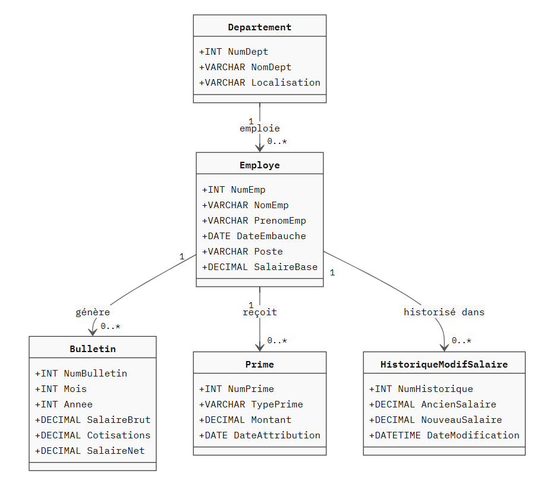

# TP Gestion de Paie 💶

## Contexte

Une entreprise souhaite informatiser la gestion de sa paie. La base de données `GestionPaie` est composée des tables suivantes :

```sql
-- Département auquel appartient un employé
Departement (NumDept, NomDept, Localisation)

-- Employés de l'entreprise
Employe (NumEmp, NomEmp, PrenomEmp, DateEmbauche, Poste, NumDept, SalaireBase)

-- Bulletins de paie mensuels
Bulletin (NumBulletin, NumEmp, Mois, Annee, SalaireBrut, Cotisations, SalaireNet)

-- Primes attribuées aux employés
Prime (NumPrime, NumEmp, TypePrime, Montant, DateAttribution)
```

{: .center width=50%}

??? info "Script de création et jeu de données"

    ```sql
    CREATE DATABASE IF NOT EXISTS GestionPaie;
    USE GestionPaie;

    CREATE TABLE Departement (
        NumDept     INT PRIMARY KEY,
        NomDept     VARCHAR(50),
        Localisation VARCHAR(50)
    );

    CREATE TABLE Employe (
        NumEmp      INT PRIMARY KEY,
        NomEmp      VARCHAR(50),
        PrenomEmp   VARCHAR(50),
        DateEmbauche DATE,
        Poste       VARCHAR(50),
        NumDept     INT,
        SalaireBase DECIMAL(10,2),
        FOREIGN KEY (NumDept) REFERENCES Departement(NumDept)
    );

    CREATE TABLE Bulletin (
        NumBulletin INT PRIMARY KEY AUTO_INCREMENT,
        NumEmp      INT,
        Mois        INT,
        Annee       INT,
        SalaireBrut DECIMAL(10,2),
        Cotisations DECIMAL(10,2),
        SalaireNet  DECIMAL(10,2),
        FOREIGN KEY (NumEmp) REFERENCES Employe(NumEmp)
    );

    CREATE TABLE Prime (
        NumPrime        INT PRIMARY KEY AUTO_INCREMENT,
        NumEmp          INT,
        TypePrime       VARCHAR(50),
        Montant         DECIMAL(10,2),
        DateAttribution DATE,
        FOREIGN KEY (NumEmp) REFERENCES Employe(NumEmp)
    );

    -- Jeu de données
    INSERT INTO Departement VALUES
    (1, 'Informatique', 'Paris'),
    (2, 'Comptabilité', 'Lyon'),
    (3, 'Ressources Humaines', 'Marseille');

    INSERT INTO Employe VALUES
    (1,  'Martin',   'Alice',   '2018-03-15', 'Développeur',       1, 3200.00),
    (2,  'Dupont',   'Bruno',   '2020-06-01', 'Analyste',          1, 2800.00),
    (3,  'Bernard',  'Claire',  '2017-09-10', 'Comptable',         2, 2600.00),
    (4,  'Leroy',    'David',   '2021-01-20', 'Comptable',         2, 2500.00),
    (5,  'Moreau',   'Emilie',  '2015-11-05', 'RH Manager',        3, 3500.00),
    (6,  'Simon',    'Franck',  '2022-04-18', 'Développeur',       1, 3000.00),
    (7,  'Laurent',  'Gaëlle',  '2019-07-22', 'Chef de projet',    1, 4000.00),
    (8,  'Michel',   'Hugo',    '2023-02-01', 'Stagiaire',         2,  900.00);

    INSERT INTO Prime VALUES
    (1, 1, 'Ancienneté',   500.00, '2024-01-01'),
    (2, 2, 'Performance',  300.00, '2024-01-01'),
    (3, 5, 'Ancienneté',   800.00, '2024-01-01'),
    (4, 7, 'Performance', 1000.00, '2024-01-01');
    ```

## Exercice 1 — Procédures stockées : calcul et génération de bulletin

**Q1 :** Créer une procédure stockée `calculer_salaire_brut` qui reçoit en paramètre un numéro d'employé et un mois/année, et retourne le salaire brut correspondant (salaire de base + total des primes attribuées ce mois-là).

??? question "Correction"

    ```sql
    DELIMITER |
    CREATE PROCEDURE calculer_salaire_brut (
        IN p_numEmp INT,
        IN p_mois   INT,
        IN p_annee  INT,
        OUT p_brut  DECIMAL(10,2)
    )
    BEGIN
        DECLARE v_base      DECIMAL(10,2);
        DECLARE v_primes    DECIMAL(10,2) DEFAULT 0;

        -- Récupération du salaire de base
        SELECT SalaireBase INTO v_base
        FROM Employe
        WHERE NumEmp = p_numEmp;

        -- Récupération des primes du mois concerné
        SELECT COALESCE(SUM(Montant), 0) INTO v_primes
        FROM Prime
        WHERE NumEmp = p_numEmp
        AND MONTH(DateAttribution) = p_mois
        AND YEAR(DateAttribution)  = p_annee;

        SET p_brut = v_base + v_primes;
    END |
    DELIMITER ;

    -- Test :
    CALL calculer_salaire_brut(1, 1, 2024, @brut);
    SELECT @brut AS salaire_brut;
    ```

**Q2 :**Créer une procédure stockée `generer_bulletin` qui reçoit un numéro d'employé, un mois et une année. Elle doit :

- Appeler `calculer_salaire_brut` pour obtenir le salaire brut
- Calculer les cotisations à **22%** du salaire brut
- Calculer le salaire net (brut - cotisations)
- Insérer le bulletin dans la table `Bulletin`
- Afficher un message de confirmation : *Bulletin généré pour [Prénom Nom] — Net : [montant] €*

??? question "Correction"

    ```sql
    DELIMITER |
    CREATE PROCEDURE generer_bulletin (
        IN p_numEmp INT,
        IN p_mois   INT,
        IN p_annee  INT
    )
    BEGIN
        DECLARE v_brut      DECIMAL(10,2);
        DECLARE v_cotis     DECIMAL(10,2);
        DECLARE v_net       DECIMAL(10,2);
        DECLARE v_nom       VARCHAR(100);

        -- Calcul du salaire brut via la procédure précédente
        CALL calculer_salaire_brut(p_numEmp, p_mois, p_annee, v_brut);

        -- Calcul des cotisations (22%) et du net
        SET v_cotis = ROUND(v_brut * 0.22, 2);
        SET v_net   = v_brut - v_cotis;

        -- Récupération du nom complet
        SELECT CONCAT(PrenomEmp, ' ', NomEmp) INTO v_nom
        FROM Employe
        WHERE NumEmp = p_numEmp;

        -- Insertion du bulletin
        INSERT INTO Bulletin (NumEmp, Mois, Annee, SalaireBrut, Cotisations, SalaireNet)
        VALUES (p_numEmp, p_mois, p_annee, v_brut, v_cotis, v_net);

        -- Message de confirmation
        SELECT CONCAT(
            'Bulletin généré pour ', v_nom,
            ' — Net : ', v_net, ' €'
        ) AS confirmation;
    END |
    DELIMITER ;

    -- Test :
    CALL generer_bulletin(1, 1, 2024);
    CALL generer_bulletin(5, 1, 2024);
    ```

**Q3 :** Créer une procédure stockée `generer_bulletins_departement` qui reçoit un numéro de département et génère automatiquement les bulletins de tous les employés de ce département pour un mois et une année donnés, en appelant `generer_bulletin` pour chacun d'eux.

??? question "Correction"

    ```sql
    DELIMITER |
    CREATE PROCEDURE generer_bulletins_departement (
        IN p_numDept INT,
        IN p_mois    INT,
        IN p_annee   INT
    )
    BEGIN
        DECLARE v_numEmp    INT;
        DECLARE fin         INT DEFAULT 0;

        DECLARE cur_employes CURSOR FOR
            SELECT NumEmp FROM Employe
            WHERE NumDept = p_numDept;

        DECLARE CONTINUE HANDLER FOR NOT FOUND SET fin = 1;

        OPEN cur_employes;

        boucle: LOOP
            FETCH cur_employes INTO v_numEmp;
            IF fin = 1 THEN
                LEAVE boucle;
            END IF;
            CALL generer_bulletin(v_numEmp, p_mois, p_annee);
        END LOOP;

        CLOSE cur_employes;

        SELECT CONCAT('Bulletins générés pour le département ', p_numDept) AS bilan;
    END |
    DELIMITER ;

    -- Test :
    CALL generer_bulletins_departement(1, 1, 2024);
    SELECT * FROM Bulletin;
    ```


## Exercice 2 — Transactions : versement de prime

**Q1 :** Créer une procédure stockée `verser_prime` qui reçoit un numéro d'employé, un type de prime et un montant. Elle doit, **dans une transaction** :

- Vérifier que l'employé existe. Si ce n'est pas le cas, afficher *Employé introuvable* et annuler
- Vérifier que le montant est strictement positif. Sinon, afficher *Montant invalide* et annuler
- Insérer la prime dans la table `Prime`
- Mettre à jour le `SalaireBase` de l'employé en lui ajoutant **5%** du montant de la prime
- Valider la transaction et afficher un message de confirmation

??? question "Correction"

    ```sql
    DELIMITER |
    CREATE PROCEDURE verser_prime (
        IN p_numEmp     INT,
        IN p_typePrime  VARCHAR(50),
        IN p_montant    DECIMAL(10,2)
    )
    BEGIN
        DECLARE v_existe INT;

        -- Vérification de l'existence de l'employé
        SELECT COUNT(*) INTO v_existe
        FROM Employe WHERE NumEmp = p_numEmp;

        IF v_existe = 0 THEN
            SELECT 'Employé introuvable.' AS erreur;
        ELSEIF p_montant <= 0 THEN
            SELECT 'Montant invalide : il doit être strictement positif.' AS erreur;
        ELSE
            START TRANSACTION;

            -- Insertion de la prime
            INSERT INTO Prime (NumEmp, TypePrime, Montant, DateAttribution)
            VALUES (p_numEmp, p_typePrime, p_montant, CURDATE());

            -- Mise à jour du salaire de base (+5% du montant de la prime)
            UPDATE Employe
            SET SalaireBase = SalaireBase + (p_montant * 0.05)
            WHERE NumEmp = p_numEmp;

            COMMIT;

            SELECT CONCAT(
                'Prime de ', p_montant, ' € versée avec succès.',
                ' Salaire de base mis à jour.'
            ) AS confirmation;
        END IF;
    END |
    DELIMITER ;

    -- Tests :
    CALL verser_prime(2, 'Ancienneté', 400.00);   -- Cas normal
    CALL verser_prime(99, 'Performance', 300.00); -- Employé inexistant
    CALL verser_prime(3, 'Ancienneté', -100.00);  -- Montant invalide
    ```

## Exercice 3 — Triggers : historisation et contrôle

**Q1 :** Créer une table `HistoriqueModifSalaire` et un trigger `after_update_salaire` qui s'exécute **après chaque modification** du salaire de base d'un employé et enregistre dans cette table : le numéro de l'employé, l'ancien salaire, le nouveau salaire, et la date de modification.

??? question "Correction"

    ```sql
    CREATE TABLE HistoriqueModifSalaire (
        NumHistorique   INT PRIMARY KEY AUTO_INCREMENT,
        NumEmp          INT,
        AncienSalaire   DECIMAL(10,2),
        NouveauSalaire  DECIMAL(10,2),
        DateModification DATETIME
    );

    DELIMITER |
    CREATE TRIGGER after_update_salaire
    AFTER UPDATE ON Employe
    FOR EACH ROW
    BEGIN
        IF OLD.SalaireBase <> NEW.SalaireBase THEN
            INSERT INTO HistoriqueModifSalaire
                (NumEmp, AncienSalaire, NouveauSalaire, DateModification)
            VALUES
                (OLD.NumEmp, OLD.SalaireBase, NEW.SalaireBase, NOW());
        END IF;
    END |
    DELIMITER ;

    -- Test :
    UPDATE Employe SET SalaireBase = 3400.00 WHERE NumEmp = 1;
    SELECT * FROM HistoriqueModifSalaire;
    ```

**Q2 :** Créer un trigger `before_insert_bulletin` qui s'exécute **avant l'insertion** d'un bulletin et vérifie que le bulletin n'existe pas déjà pour ce même employé, ce même mois et cette même année. Si c'est le cas, lever une erreur avec `SIGNAL`.

??? question "Correction"

    ```sql
    DELIMITER |
    CREATE TRIGGER before_insert_bulletin
    BEFORE INSERT ON Bulletin
    FOR EACH ROW
    BEGIN
        DECLARE v_existe INT;

        SELECT COUNT(*) INTO v_existe
        FROM Bulletin
        WHERE NumEmp = NEW.NumEmp
        AND   Mois   = NEW.Mois
        AND   Annee  = NEW.Annee;

        IF v_existe > 0 THEN
            SIGNAL SQLSTATE '45000'
                SET MESSAGE_TEXT = 'Un bulletin existe déjà pour cet employé ce mois-ci.';
        END IF;
    END |
    DELIMITER ;

    -- Test (doit déclencher une erreur si le bulletin du mois 1/2024 existe déjà) :
    INSERT INTO Bulletin (NumEmp, Mois, Annee, SalaireBrut, Cotisations, SalaireNet)
    VALUES (1, 1, 2024, 3700.00, 814.00, 2886.00);
    ```

**Q3 :** Créer un trigger `before_delete_employe` qui **empêche la suppression** d'un employé s'il possède des bulletins de paie enregistrés dans la table `Bulletin`.

??? question "Correction"

    ```sql
    DELIMITER |
    CREATE TRIGGER before_delete_employe
    BEFORE DELETE ON Employe
    FOR EACH ROW
    BEGIN
        DECLARE v_nbBulletins INT;

        SELECT COUNT(*) INTO v_nbBulletins
        FROM Bulletin
        WHERE NumEmp = OLD.NumEmp;

        IF v_nbBulletins > 0 THEN
            SIGNAL SQLSTATE '45000'
                SET MESSAGE_TEXT = 'Suppression impossible : cet employé possède des bulletins de paie.';
        END IF;
    END |
    DELIMITER ;

    -- Test (doit échouer si l'employé 1 a des bulletins) :
    DELETE FROM Employe WHERE NumEmp = 1;

    -- Test (doit réussir si l'employé 8 n'a pas de bulletins) :
    DELETE FROM Employe WHERE NumEmp = 8;
    ```

## Exercice 4 — Sécurité de la base de données

La base `GestionPaie` contient des données sensibles : salaires, primes, bulletins. Cet exercice aborde les bonnes pratiques de sécurité à mettre en place directement au niveau de la base de données.

**Q1 :** Chiffrement des données sensibles

Les salaires et les montants des primes sont des données particulièrement sensibles. On souhaite les stocker chiffrés dans la base de données.

**1.** Créer une procédure `inserer_employe_securise` qui insère un nouvel employé en chiffrant son salaire de base avec la fonction `AES_ENCRYPT` et une clé secrète.

**2.** Créer une procédure `lire_salaire_securise` qui retourne le salaire déchiffré d'un employé donné.

!!! info "Remarque"
    Pour cet exercice, on crée une table `EmployeSecurise` qui stocke le salaire sous forme chiffrée (`VARBINARY`), en parallèle de la table `Employe` existante.

??? question "Correction"

    ```sql
    -- Table avec salaire chiffré
    CREATE TABLE EmployeSecurise (
        NumEmp         INT PRIMARY KEY,
        NomEmp         VARCHAR(50),
        PrenomEmp      VARCHAR(50),
        SalaireChiffre VARBINARY(256)
    );

    -- Clé de chiffrement (en pratique, stockée hors de la BDD, ex : variable d'environnement)
    SET @cle_secrete = 'MaCleSecrete2024!';

    DELIMITER |

    -- Procédure d'insertion avec chiffrement AES
    CREATE PROCEDURE inserer_employe_securise (
        IN p_numEmp  INT,
        IN p_nom     VARCHAR(50),
        IN p_prenom  VARCHAR(50),
        IN p_salaire DECIMAL(10,2)
    )
    BEGIN
        INSERT INTO EmployeSecurise (NumEmp, NomEmp, PrenomEmp, SalaireChiffre)
        VALUES (
            p_numEmp,
            p_nom,
            p_prenom,
            AES_ENCRYPT(p_salaire, @cle_secrete)
        );
        SELECT CONCAT('Employé ', p_prenom, ' ', p_nom, ' inséré avec salaire chiffré.') AS confirmation;
    END |

    -- Procédure de lecture avec déchiffrement AES
    CREATE PROCEDURE lire_salaire_securise (IN p_numEmp INT)
    BEGIN
        SELECT
            NumEmp,
            NomEmp,
            PrenomEmp,
            CAST(AES_DECRYPT(SalaireChiffre, @cle_secrete) AS DECIMAL(10,2)) AS SalaireDechiffre
        FROM EmployeSecurise
        WHERE NumEmp = p_numEmp;
    END |

    DELIMITER ;

    -- Tests :
    CALL inserer_employe_securise(1, 'Martin', 'Alice', 3200.00);
    CALL inserer_employe_securise(2, 'Dupont', 'Bruno', 2800.00);

    -- Lecture chiffrée brute (illisible)
    SELECT * FROM EmployeSecurise;

    -- Lecture déchiffrée via la procédure
    CALL lire_salaire_securise(1);
    ```

    !!! warning "Bonne pratique"
        Ne jamais stocker la clé de chiffrement dans la base de données elle-même. En production, utiliser un gestionnaire de secrets (HashiCorp Vault, AWS Secrets Manager, variables d'environnement serveur).

**Q2 :** Audit et traçabilité des accès

On souhaite enregistrer automatiquement toute tentative de **consultation des bulletins de paie**, afin de détecter des accès suspects.

**1.** Créer une table `AuditAccesBulletin` qui enregistre : l'utilisateur MySQL connecté, la date et l'heure de l'accès, et le numéro de bulletin consulté.

**2.** Créer une procédure `consulter_bulletin` qui, avant de retourner un bulletin, insère une entrée dans la table d'audit.

**3.** Créer un trigger `after_delete_bulletin` qui journalise toute suppression de bulletin dans la table d'audit avec le message `SUPPRESSION`.

??? question "Correction"

    ```sql
    -- Table d'audit
    CREATE TABLE AuditAccesBulletin (
        NumAudit      INT PRIMARY KEY AUTO_INCREMENT,
        UtilisateurDB VARCHAR(100),
        DateAcces     DATETIME,
        NumBulletin   INT,
        TypeAcces     VARCHAR(20)  -- 'CONSULTATION' ou 'SUPPRESSION'
    );

    DELIMITER |

    -- Procédure de consultation avec audit
    CREATE PROCEDURE consulter_bulletin (IN p_numBulletin INT)
    BEGIN
        -- Enregistrement de l'accès dans la table d'audit
        INSERT INTO AuditAccesBulletin (UtilisateurDB, DateAcces, NumBulletin, TypeAcces)
        VALUES (CURRENT_USER(), NOW(), p_numBulletin, 'CONSULTATION');

        -- Retour du bulletin demandé
        SELECT B.NumBulletin, E.NomEmp, E.PrenomEmp,
               B.Mois, B.Annee, B.SalaireBrut, B.Cotisations, B.SalaireNet
        FROM Bulletin B
        JOIN Employe E ON B.NumEmp = E.NumEmp
        WHERE B.NumBulletin = p_numBulletin;
    END |

    -- Trigger d'audit sur suppression
    CREATE TRIGGER after_delete_bulletin
    AFTER DELETE ON Bulletin
    FOR EACH ROW
    BEGIN
        INSERT INTO AuditAccesBulletin (UtilisateurDB, DateAcces, NumBulletin, TypeAcces)
        VALUES (CURRENT_USER(), NOW(), OLD.NumBulletin, 'SUPPRESSION');
    END |

    DELIMITER ;

    -- Tests :
    CALL consulter_bulletin(1);

    -- Suppression d'un bulletin (déclenchera le trigger d'audit)
    DELETE FROM Bulletin WHERE NumBulletin = 1;

    -- Consultation de la table d'audit
    SELECT * FROM AuditAccesBulletin ORDER BY DateAcces DESC;
    ```

    !!! warning "Bonne pratique"
        La table d'audit ne doit **jamais être modifiable** par les utilisateurs applicatifs. Seul un compte d'administration dédié doit pouvoir la lire. On peut renforcer cela avec :
        ```sql
        REVOKE INSERT, UPDATE, DELETE ON GestionPaie.AuditAccesBulletin FROM 'rh_user'@'localhost';
        REVOKE INSERT, UPDATE, DELETE ON GestionPaie.AuditAccesBulletin FROM 'compta_user'@'localhost';
        ```
