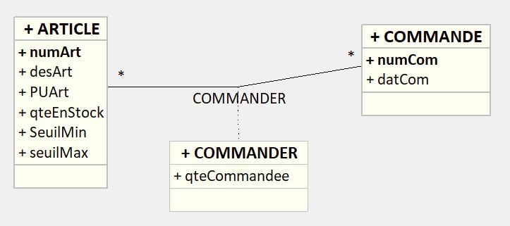
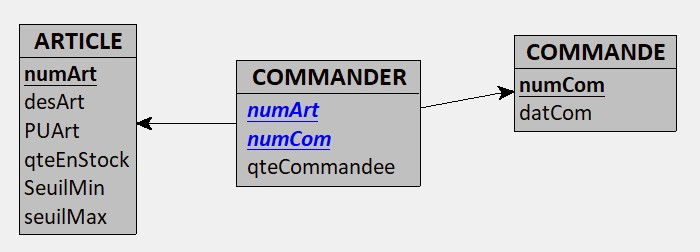

!!! abstract "Compétences"
    B2.3 SLAM Gérer les données
    Développer des fonctionnalités applicatives au sein d’un système de gestion de base de données (relationnel ou non)
    > Répondre aux incidents et aux demandes d'assistance et d'évolution

!!! abstract "Bibliographie"
    - Cours de Transat SQL : Pr H.LAARAJ
    - Aide Transact-SQL à partir de SQL Server
    - Cours de SGBD Pr. Naoual ABDALLAH
    - [Gestion des procédures stockées en MySQL](https://www.delftstack.com/fr/howto/mysql/mysql-declare-variable/=)
    - [OPenclassRoom](https://openclassrooms.com/fr/courses/1959476-administrez-vos-bases-de-donnees-avec-mysql/1972254-structurez-vos-instructions)

## Contexte

La base de données GestionCom  sera utilisée en appplication de ce cours est comme suivante :

 {: .center width=50%}

 {: .center width=50%}


!!! question "Script de création de la base GESCOM"
    === "A faire"
        Créer le script de création de la base de données (Attention à intégrer les contraintes d’intégrité).<br />
        Attention pour les besoins de ce TP, nous aurons besoin que les tables soient <mark>TRANSACTIONNELLES</mark>.<br /> 
        MyISAM ne supportant pas les contraintes de clés étrangères, les tables doivent être créées avec le moteur InnoDB. En effet :<br />
        - 	📌les tables MyISAM sont non transactionnelles, donc ne supportent pas les transactions.<br />
        - 	📌les tables InnoDB sont transactionnelles, donc supportent les transactions.<br />

    === "Correction"
       
        ```sql
        USE gescom;
        CREATE TABLE COMMANDE (
        Numcom int PRIMARY KEY,
        Datcom DATETIME)ENGINE=InnoDB;

        CREATE TABLE ARTICLE (
        Numart int PRIMARY KEY,
        Desart varchar(50),
        PUart decimal(10,2),
        QteEnStock int,
        SeuilMin int,
        SeuilMax int)ENGINE=InnoDB;

        CREATE TABLE LIGNECOMMANDE (
        Numcom int,
        Numart int,
        QteCommandee int,
        CONSTRAINT pk_lc PRIMARY KEY (numcom, numart),
        CONSTRAINT fk_lc_com FOREIGN KEY (Numcom) REFERENCES COMMANDE(Numcom),
        CONSTRAINT fk_lc_art FOREIGN KEY (Numart) REFERENCES ARTICLE(Numart)
        )ENGINE=InnoDB;
        ```

        N'oubliez pas de créer votre jeu de données au fur et à mesure pour tester les applications de cours

1. [Procédures stockées](./5.1_Procedures_stockees/cours.md) 
2. [Le transactionnel](./5.2_Transactions/cours.md) 
3. [Les curseurs](./5.3_curseurs/cours.md) 
4. [Triggers et déclencheurs](./5.4_Triggers_déclencheurs/cours.md) 

