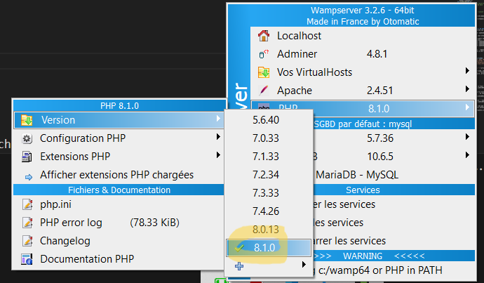
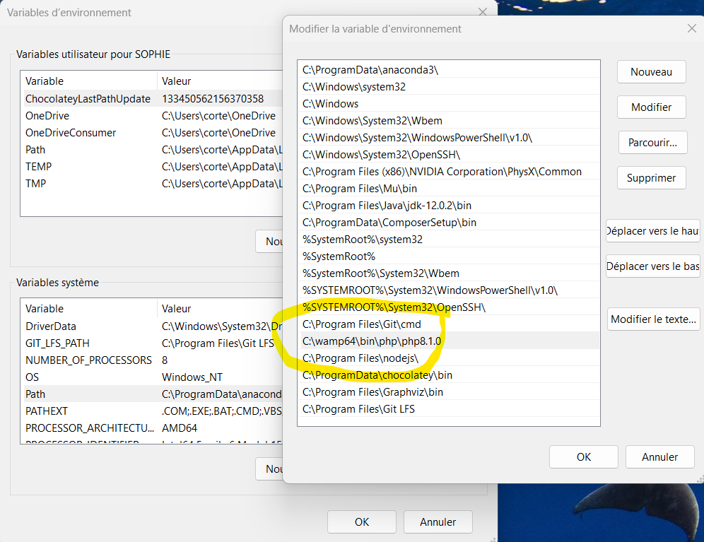
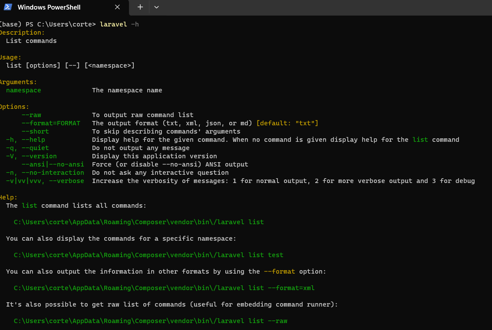
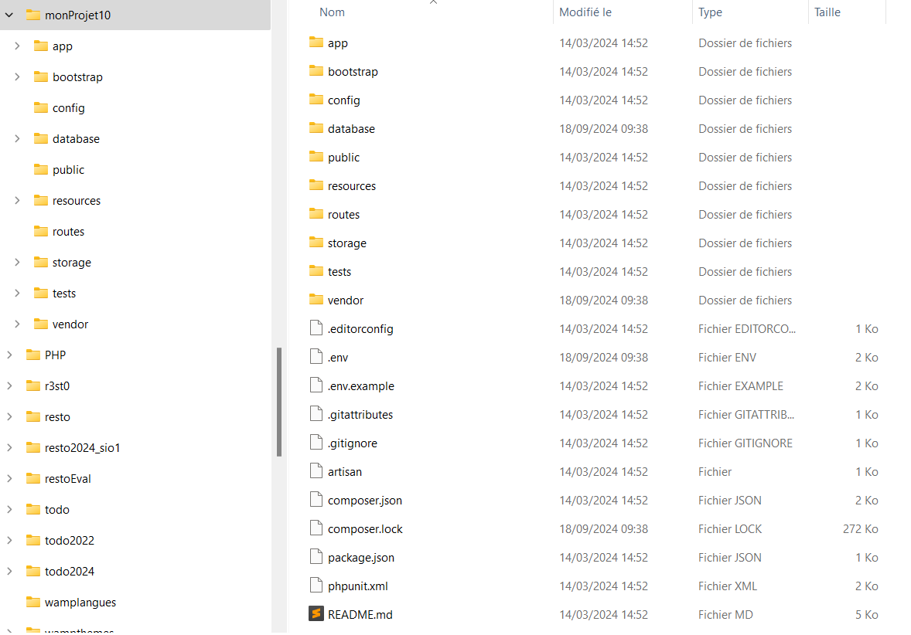

!!! note "Crédit"
    TP découverte D’après un travail de Valentin Brousseau

!!! note "Ressources"
    - [Cours Valentin Brosseau](tps://laravel.com/)
    - [Sillo](https://laravel.sillo.org/)
    - [OpenclassRoom](https://openclassrooms.com/fr/courses/3613341-decouvrez-le-framework-php-laravel/)
    - [c4software](https://github.com/c4software/bts-sio/)
    - [phptherightway](https://phptherightway.com/)
    - Livre : Laravel par Raphaël Huchet aux éditions ENI

!!! note "Compétences"

    **B2.1. Conception et développement d’une solution applicative**

    * Participation à la conception de l’architecture d’une solution applicative
    * Exploitation des ressources du cadre applicatif (framework)
    * Exploitation des technologies Web et mobile pour mettre en oeuvre les échanges entre applications
    * Utilisation de composants d’accès aux données

!!! warning "Préalable"

    - :warning: Vérifier la version de PHP de votre WAMP
    {: width=30% .center}

    - :warning: vérifier la présence d'une variable d'environnement vers votre dossier PHP
    {: width=30% .center}

# Installation Composer

Récupérer l’exécutable de [composer](https://getcomposer.org/) et l’exécuter. 
L’installateur vous demandera où se trouve php.exe (en général : `C:\wamp64\bin\php\phpX.X.X`). Cela installe Composer et met à jour le PATH de façon à ce que l'on puisse taper la commande composer en ligne de commande depuis n'importe quel répertoire.

??? warning "erreur opensssl"
    Si erreur "The openssl extension is missing which means that secure https transfer are impossible"
    activer la ligne extension=php_openssl.dll  en visualisant les extensions PHP de votre WAMP.

Composer a besoin d'un fichier `composer.json` associé. Ce fichier contient les instructions pour Composer : les dépendances, les classes à charger automatiquement... Voici un extrait de ce fichier pour Laravel :

```php
{
    "name": "laravel/laravel",
    "description": "The Laravel Framework.",
    "keywords": ["framework", "laravel"],
    "license": "MIT",
    "type": "project",
    "require": {
        "php": ">=5.5.9",
        "laravel/framework": "5.2.*"
    },
    ...
}
```
Composer fonctionne en ligne de commande.<br />
:arrow_forward: Pour vérifier la bonne installation de votre composer, vous pouvez taper dans votre invite de commande `Composer`
 
 
# Installation de LARAVEL

Lancer la commande suivante :

```prompt
composer global require "laravel/installer"
```
:arrow_forward: Vérifier que la commande `laravel -h` fonctionne. 



# Création du projet LARAVEL

Votre poste est maintenant configuré pour Laravel, vous pouvez donc créer un nouveau projet grâce à la commande ci- dessous:<br />

:boom: Attention, le projet sera créé dans le dossier courant. Déplacer votre invite de commande dans le bon répertoire avant de lancer votre commande de création de projet: 

```prompt
CD C:\\wamp64\www\
composer create-project --prefer-dist laravel/laravel monProjet "10.*"
```

Après quelques minutes, on obtient l’arborescence suivante :
 


## Description arborescence Laravel

Dans le répertoire `\app`, on trouve les dossiers suivants.

-   **Console/Commands** : toutes les commandes en mode console, il y a au départ une commande Inspire qui sert d'exemple,

-   **Http**: tout ce qui concerne la communication : contrôleurs, routes, middlewares (il y a quater middlewares de base) et requêtes,
-   **Providers** : tous les fournisseurs de services (providers), il y en a déjà 4 au départ. Les providers servent à initialiser les composants.
-   **Policies** : permet de gérer facilement les droits d'accès.
-   **Model** : Modèle par défaut dans l'application
<br />
Les autres dossiers suivants :

-   **bootstrap** : scripts d'initialisation de Laravel pour le chargement automatique des classes, la fixation de l'environnement et des chemins, et pour le démarrage de l'application,
-   **public** : tout ce qui doit apparaître dans le dossier public du site : images, CSS, scripts...
-   **vendor** : tous les composants de Laravel et de ses dépendances,
-   **config** : toutes les configurations : application, authentification, cache, base de données, espaces de noms, emails, systèmes de fichier, session...
-   **database** : migrations et les populations,
-   **resources** : vues, fichiers de langage et assets (par exemple les fichiers LESS ou Sass),
-   **storage** : données temporaires de l'application : vues compilées, caches, clés de session...
-   **tests** : fichiers de tests unitaires.

Et à la racine :

-	**artisan** : outil en ligne de Laravel pour des tâches de gestion,
-	**composer.json** : fichier de référence de Composer,
-	**phpunit.xml** : fichier de configuration de phpunit (pour les tests unitaires),
-	**.env** : fichier pour spécifier l'environnement d'exécution.

Pour vérifier que tout est fonctionnel, vous pouvez aller visualiser la partie public. <br />
:globe_with_meridians: [http://localhost/monProjet/public/](http://localhost/monProjet/public/)


## Artisan :

Artisan est l’interface en ligne de commande de Laravel. Cet outil permet de lancer des commandes à destination de Laravel pour créer un _contrôleur_, _une migration_, vider un cache, traiter des files d’attentes, etc. Il permet de gagner du temps.<br />


### Initialisation

Votre nouveau projet contient un fichier `.env` ouvrez le, et ajouter en début de fichier `APP_NAME=monProjet`

!!! question 
    === "Question"
        Où se trouve le fichier des variables d’environnement de l’application ?
    === "Réponse"
        A la racine du projet.
        Laravel propose un système de variables liées à l’environnement (prod ou dev…). Ces variables sont stockèes dans un fichier .env qui ne doit en aucun cas être partagé. Une application Laravel aura donc un fichier différent sur chaque poste. Il ne devra en aucun cas être remonté sur git (voir règles .gitignore)

!!! question 
    === "Question"
        A quoi sert la variable APP_DEBUG ?
    === "Réponse"
        La variable `APP_DEBUG` a la valeur `true`. On va la conserver ainsi puisqu'on veut être en mode "debug". Vous êtes ainsi en mode débogage avec affichage de messages d'erreur détaillés. Si vous la mettez à `false` (ou si vous la supprimez), avec une URL non prévue vous obtenez maintenant juste : "Un message d'erreur en mode "production"
        <br />
        Il ne faudra évidemment pas laisser la valeur true lors d'une mise en production ! On reparlera de ça lorsqu'on verra la gestion de l'environnement. Vous ne risquerez ainsi plus d'oublier de changer cette valeur parce que Laravel saura si vous êtes sur votre serveur de développement ou sur celui de production.

!!! question 
    === "Question"
        A quoi sert la variable APP_KEY ?
    === "Réponse"
        La valeur de APP_KEY qui sécurise les informations est automatiquement générée lors de l'installation avec `create-project`.

!!! question 
    === "Question"
        A quoi sert le fichier .htacess du projet ?
    === "Réponse"
        Si vous avez un serveur Apache lorsque la requête du client arrive sur le serveur où se trouve notre application Laravel elle passe en premier par le fichier `.htaccess`, s'il existe, qui fixe des règles pour le serveur. Il y a justement un fichier `.htaccess` dans le dossier public de Laravel avec une règle de réécriture de telle sorte qu'on peut avoir une url simplifié : (http://monsite.fr/mapage)
        :unlock: La réécriture des URLS : Pour que ça fonctionne il faut que le serveur Apache ait le module `mod_rewrite` activé.

# Lancer le projet d’exemple

Laravel intègre un serveur de test permettant de valider son développement avec rien d’autre que PHP sur sa machine. 

```prompt
CD c:\\wamp64\www\monProjet
php artisan serve
```

Rendez-vous maintenant dans votre navigateur pour voir le site de démonstration fourni par Laravel. 
:globe_with_meridians: [http://localhost:8000/](http://localhost:8000/)

!!! tip  "Commandes utiles pour déboguer"

    - **dd()** : affiche la variable passée en paramètres et arrête le programme.
    - **dump()** :idem dd() mais n’arrête pas le programme
    - **log()** : Utilisation du journal local : Chaque élément est affiché dans le journal et est daté.
        (emergency, alert, critical, error, warning, notice, info, debug)
        - Log ::emergency(‘Urgence’) ;
        - Log :: error(‘erreur’) ;     

# Modifier le template par défaut

Ouvrez le fichier `resources/views/welcome.blade.php`, ajouter la variable `$titre`.<br /> 
La syntaxe **«blade»** est la suivante `{{ $titre }}`. Ajouter cette variable après le mot Laravel par exemple (ligne 38)
<br />
Vous avez défini votre première variable c'est bien. Mais pour l'instant rien n'est modifié… 
<br />
Pour que quelque chose s’affiche :<br />

:arrow_forward: Éditer le fichier routes/web.php, la ligne Route en :

```php 
Route::get('/welcome', function () {
    return view('welcome', ['titre' => 'mon premier exemple.']);
})-> name('welcome');
ou
Route::view('/welcome', 'welcome', ['titre' => 'mon premier exemple.']);
```

💡 Vous pouvez également appeler des fonctions dans les templates, exemple `{{ time() }}`. Tester cette fonction en ajoutant :

```php
<p>Le Timestamp est {{ time() }}</p>
```

!!! question 
    === "Question"
        À votre avis est-il possible d'appeler d'autre fonctions ?
    === "Réponse"
        Oui, on peut utiliser toutes les fonctions natives de PHP, notamment celle qui retournent en valeur ainsi que nos propres fonctions. De ce point de vue, Laravel est très permissif et un projet Laravel peut vite être ingérable si des règles strictes d’organisation du code n’est pas respectés.

## Le moteur de gabarit(template) BLADE

Utiliser un moteur de gabarit permet d’assurer directement la sécurité, la lisibilité, et l’organisation du code.a

!!! warning 
    Toutes les fonctions utiliser à travers BLADE sont envoyés à travers la fonctions htmlspecialchars() pour se prémunir des attaques XSS.

!!! note 
    Les éléments entre doubles accolades : pour afficher des données.<br />
    Les éléments précédés d’un @ pour structurer et contrôler l’affichage.

## Créer des routes

Laravel permet que des adresses du type `/index.php?page=articles&id=123` soit remplacées par des adresses plus expressives comme `/articles/monArticle`

Laravel utilise un système de routes simple. Déclarer une route permet de lier une **URI** (identifiant de ressource uniforme, autrement dit la partie de l’adresse qui suit le nom de domaine) à un code à exécuter.<br />
La liste des routes se trouve dans le fichier `routes/web.php` d’un projet Laravel. Il faut alimenter ce fichier au fur et à mesure de l’ajout de nouvelles pages sur le site.

## Les méthodes HTTP :

Il existe plusieurs méthodes [http](https://fr.wikipedia.org/wiki/Hypertext_Transfer_Protocol#Méthodes) auxquelles le serveur peut répondre.<br />
!!! note 

    ```php
    Route :: get($URI, function()) ;
    Route :: post($URI, function()) ;
    Route :: put($URI, function()) ;
    Route :: delete($URI, function()) ;
    ```

Pour tester le fonctionnement nous allons ajouter une nouvelle Route dans le projet de démonstration. Nous allons donc ajouter dans le fichier `routes/web.php` :

```php
Route::get('/ping', function () {
    return "pong";
});
```

!!! question 
    === "question"
        Quelle URL avez-vous utilisé pour afficher "pong" ?
    === "réponse"
        http://localhost:8000/ping


## Groupe de Route

On pourra vouloir regrouper toutes les routes ayant les mêmes fonctionnalités sous un même chemin. On utilisera alors la notion de [groupe de routes](https://laravel.com/docs/10.x/routing#route-groups)

!!! note 

    ```php
    Route::middleware(['first', 'second'])->group(function () {
        Route::get('/', function () {
            // Uses first & second middleware...
        });
    
        Route::get('/user/profile', function () {
            // Uses first & second middleware...
        });
    });
    ```

## Paramètres des routes

Il est parfois intéressant de capturer certaines parties de l’URI d’une route pour la traiter ensuite. <br />

Par exemple, dans le cas d’une boutique en ligne, on veut afficher la page de l’article 1, ou la page de l’article 2 …. Il peut être intéressant de capturer l’identifiant de l’article dans l’URI pour rechercher et afficher le descriptif correspondant.

```php 
Route::get('article/{n}', function($n) {
	//$article= get_article($id)
	//return ‘descriptif de l article :’.$article->text
     return view('article')->with('numero', $n);
})->where('n', '[0-9]+');
```

Pour traiter la variable capturée, il faut la passer en paramètres de la fonction de rappel de la route en lui donnant le **même** nom. Dans l’exemple, on peut imaginer un fonction `$get_article` qui prend en paramètre un identifiant d’article et retourne un objet dont la propriété text contient le descriptif de l’article. Ici je me suis contenté de renvoyer une page statique affichant le numéro de l’article.

!!! note 
    il est possible d’utiliser plusieurs paramètres séparés par des / et d’afficher des routes avec plusieurs paramètres.

## Ordre des routes :

Les routes sont analysée dans leur ordre dans le fichier des routes.<br />
```php
Route::get('{n}', function($n) {
return 'Je suis la page ' . $n . ' !';
});

Route::get('contact', function() {
return "C'est moi le contact.";
});
```

## Ajouter une nouvelle vue

Maintenant que nous avons déclaré une nouvelle route, nous allons revoir légèrement les templates pour :<br />
-	Déclarer un template principal (aussi appelé : layout).<br />
-	Modifier le welcome.blade.php pour y faire référence.<br />
-	Utiliser le layout pour répondre pong.

!!! question
    === "Question"
        Pourquoi un tel découpage ?
    === "Réponse"
        Permet de créer des page modèle ayant la même structure. Non redondance de code.

### Créer le layout

Créer un nouveau fichier `resources/views/layouts/base.blade.php` avec le contenu suivant. C’est tout simplement un découpage en « layout » du template de base de démonstration.

??? abstract "Code a copier"

    ```html
    <!doctype html>
    <html lang="{{ app()->getLocale() }}">
        <head>
            <meta charset="utf-8">
            <meta http-equiv="X-UA-Compatible" content="IE=edge">
            <meta name="viewport" content="width=device-width, initial-scale=1">

            <title>Laravel - @yield('title')</title>

            <!-- Fonts -->
            <link href="https://fonts.googleapis.com/css?family=Raleway:100,600" rel="stylesheet" type="text/css">

            <!-- Styles -->
            <style>
                html, body {
                    background-color: #fff;
                    color: #636b6f;
                    font-family: 'Raleway', sans-serif;
                    font-weight: 100;
                    height: 100vh;
                    margin: 0;
                }
                .full-height {
                    height: 100vh;
                }
                .flex-center {
                    align-items: center;
                    display: flex;
                    justify-content: center;
                }
                .position-ref {
                    position: relative;
                }
                .top-right {
                    position: absolute;
                    right: 10px;
                    top: 18px;
                }
                .content {
                    text-align: center;
                }
                .title {
                    font-size: 84px;
                }
                .links > a {
                    color: #636b6f;
                    padding: 0 25px;
                    font-size: 12px;
                    font-weight: 600;
                    letter-spacing: .1rem;
                    text-decoration: none;
                    text-transform: uppercase;
                }
                .m-b-md {
                    margin-bottom: 30px;
                }
            </style>
        </head>
        <body>
            <div class="flex-center position-ref full-height">
                @if (Route::has('login'))
                    <div class="top-right links">
                        @auth
                            <a href="{{ url('/home') }}">Home</a>
                        @else
                            <a href="{{ route('login') }}">Login</a>
                            <a href="{{ route('register') }}">Register</a>
                        @endauth
                    </div>
                @endif

                <div class="content">
                    @yield('content')
                </div>
            </div>
        </body>
    </html>
    ```


!!! question
    === "Question"
        A quoi sert le mot clef `@yield` ?
    === "Réponse"
        Il désigne l’emplacement spécialisé de chaque layout. Il est associcé à un mot clé permettant d’y envoyé les données qui ne sont pas communes à chaque page.

### Utiliser le layout dans welcome.blade.php

Documentation sur les templates [https://laravel.com/docs/10.x/blade](https://laravel.com/docs/10.x/blade)

Maintenant que nous avons notre template de base nous allons l’utiliser dans le template « Welcome ». Remplacer le contenu de `resources/views/welcome.blade.php` par :

```php
@extends('layouts.base')

@section('title', 'Bienvenue')

@section('content')
   <div class="title m-b-md">
        Laravel
    </div>

    <div class="links">
        <a href="https://laravel.com/docs">Documentation</a>
        <a href="https://laracasts.com">Laracasts</a>
        <a href="https://laravel-news.com">News</a>
        <a href="https://forge.laravel.com">Forge</a>
        <a href="https://github.com/laravel/laravel">GitHub</a>
    </div>
@endsection
```

## Utiliser le layout dans la route Pong

Bon, maintenant que nous avons déclaré un layout utilisons-le dans la 2nd route (`/ping`) que nous avons créé. Pour cette dernière action je ne vous donne pas de code, mais uniquement les étapes :

!!! success "A faire"

    -	Créez une Vue par exemple `ping.blade.php` (Dans le dossiers views)<br />
    -	Utilisez `@extends('base')` pour « hériter » de votre layout principal.<br />
    -	Modifiez `web.php` pour répondre avec la fonction view comme dans l’autre route.


??? tip "tips"
    === "aide"
        Dans un premier temps on dit qu'on veut utiliser le template avec @extends et le nom du template "template". Ensuite on remplit les zones prévues dans le template grâce à la syntaxe `@section` en précisant le nom de l'emplacement et en fermant avec `@endsection` . 

    === "aide ++"

        ```php
        @extends('layouts/base')
        @section('title', 'Bienvenue')

        @section('content')
        <h1>PONG</h1>
        @endsection
        ```