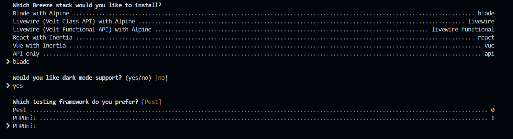
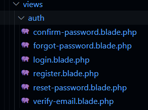

# 3. Middelware d'authentification

!!! note "Compétences"
    B3.5. Cybersécurisation d’une solution applicative et de son développement

    * Prise en compte de la sécurité dans un projet de développement d’une solution applicative

!!! tips "Définition Middelware"
    Dans le contexte d'un framework PHP, un middleware est une composante logicielle qui agit comme une couche intermédiaire entre la requête entrante et la réponse sortante dans le processus de traitement d'une application web. Les middlewares sont couramment utilisés pour effectuer des tâches spécifiques telles que l'authentification, l'autorisation, la gestion des cookies, la mise en cache, la journalisation, la compression des réponses, et d'autres opérations liées au traitement de la requête.

    Un middleware peut être conçu pour intervenir à différents moments du cycle de vie d'une requête HTTP. Dans de nombreux frameworks PHP, notamment Laravel et Symfony, les middlewares sont souvent utilisés dans le processus de gestion des requêtes HTTP.

## 3.1 l'authentification

[source du cours : laravel.sillo.org](https://laravel.sillo.org/posts/cours-laravel-12-lauthentification)

Laravel a beaucoup évolué sur la prise en compte du middelware d'authentification. Pour la version Laravel 12 dans laquelle nous sommes aujourd'hui, le framework met à disposition des starters Kit, qui vont déployer models, vues et contrôleur liés aux différentes étapes de l'authentification. On va utiliser le package `Laravel\breeze`, pour le middelware d'authentification en choisissant le starter kit [Blade](https://github.com/LaravelDaily/starter-kit). Celui ci est un kit de démonstration créé par LaravelDaily pour s'affranchir de la lourdeur des starters kits vue/React/LiveWrire. 

**Fonctionnalité du kit** : fournit des fonctionnalités telles que l'authentification, la connexion, l'enregistrement, une page de tableau de bord et les paramètres de profil.

!!! warning "Point d'attention"
    
    - Vous veillerez à taguer une version stable de votre projet todo, avant de commencer la mise en place du middelware.
    - Mettez de côté le fichier ``web.php`` et ``app.js`` (Ils seront écrasé lors des installations)


▶️ Installer le paquetage laravel/breeze via composer :<br />

``composer require laravel/breeze --dev``

Après cela, exécutez la commande suivante : <br />

``php artisan breeze:install``

❗ Choisir Blade

{: width=80% .center}

😰 Si une erreur > Créer un fichier ``welcome.blade.php`` dans les vues

Puis compléter l'installation par :

```prompt
npm install
npm run dev
```

▶️ Occupons nous de la partie **base de données**.

création du **seeder** ``Users``

```PHP
// Ajouter les namespaces nécessaires ! 
public function run()
    {
        // Exemple d'insertion d'un utilisateur
        DB::table('users')->insert([
            'name' => 'John Doe',
            'email' => 'john.doe@example.com',
            'email_verified_at' => now(),
            'password' => Hash::make('mdp'), // Assurez-vous de hasher le mot de passe
            'remember_token' => Str::random(10),
            'created_at' => now(),
            'updated_at' => now(),
        ]);

        // Ajoutez d'autres utilisateurs au besoin
```
Ajouter le seeder ``UserSeeder`` dans le ``DatabaseSeeder`` 

```php
        $this->call([
            UsersSeeder::class,
            TodosSeeder::class,
            CategoriesSeeder::class,
        ]);
```
Puis relancer la migration avec les tables concernant l'authentification (Users, password_reset_tokens, sessions).

```prompt 
php artisan migrate:fresh --seed
```

▶️ Il faut à présent activer le middelware d'authentication sur nos routes todo. Reprendre le ``web.php`` et ajouter les lignes dans le nouveau web.php qui contient en plus des liens vers la gestion de l'autentification.

```php
// Groupe de routes avec middleware d'authentification
Route::get('/dashboard', function () {
    return view('dashboard');
})->middleware(['auth', 'verified'])->name('dashboard');

Route::middleware('auth')->group(function () {
    Route::get('/profile', [ProfileController::class, 'edit'])->name('profile.edit');
    Route::patch('/profile', [ProfileController::class, 'update'])->name('profile.update');
    Route::delete('/profile', [ProfileController::class, 'destroy'])->name('profile.destroy');
});
```

```php
// Activation du middleware d'authentification pour toutes les routes Todos. Création d'un groupe de routes.
Route::middleware('auth')->group(function () {
    // Action correspondant au form de la vue (donc POST) et appel de la fonction saveTodo du controller
    // Route concernant les todos
    Route::get('/', [TodosController::class, 'liste'])->name('todo.liste');
    [...]
});
```

??? tip "Fixer l'erreur sur @Vite"

    ```prompt
    rm -rf public/build // Supprimer le contenu du répertoire public/build
    npm install
    npm run dev
    php artisan view:clear
    ```

    L'installation de breeze/blade a également casser le fichier ``app.js``. Remettre les lignes suivantes :

    ```php
    import 'bootstrap/dist/css/bootstrap.min.css';
    import 'bootstrap-icons/font/bootstrap-icons.css';
    import '@popperjs/core';
    ```

▶️ Observer dans l'arborescence ce que vous a apporté l'installation de Breeze (dans ``views``, dans ``js/Pages/auth``)

{: width=50% .center}

!!! question "A faire"

    - Explorer le module d'authentification. 
    - Créer dans le menu l'accès au "Profil de l'utilisateur"
    - Tester toutes les mires mises à votre disposition : changer un mot de passe, se souvenir ...
    - Dans le menu, encadrer l'acces aux fonctionnalités soumises à authentification avec ``@auth ... @endauth``


## 3.2 Mot de passe oublié / mail sans SMTP

Pour éviter un vrai envoi d’email, mais conserver la fonctionnalité d'envoi de mail.

▶️ On commence par créer un fichier de log dédié. Dans ``config\logging.php`` ajouter l'entrée suivante :

Dans "**channels**", ajouter : 

```
// canal dédié aux mails
        'mail' => [
            'driver' => 'single',
            'path' => storage_path('logs/mails.log'),
            'level' => 'debug',
        ],
```
▶️ puis dans le ``.env``
```
MAIL_MAILER=custom_log
MAIL_FROM_ADDRESS="noreply@exemple.local"
MAIL_FROM_NAME="Laravel Todo 2026"
```
▶️ puis dans le mailer ``config\mail.php``, ajouter l'entrée suivante :
```
// mailer personnalisé pointant vers notre canal
    'custom_log' => [
        'transport' => 'log',
        'channel' => 'mail', // nom du canal défini plus haut
    ],
```
→ Les mails seront écrits dans storage/logs/mails.log.

??? tip "tester 👀"

    - aller sur /forgot-password
    - Saisir ton email utilisateur
    - Ouvre storage/logs/mails.log
    - Copier l'adresse de Reset du mot de passe : http://localhost:8000/reset-password/eyJhbGciOiJI...
    - Copier-colle cette URL dans ton navigateur
    - Saisir le nouveau mot de passe
    - Se reconnecter avec le nouveau mot de passe
