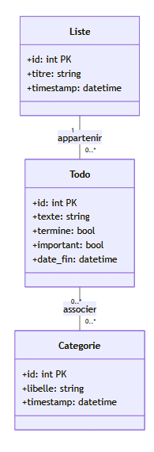
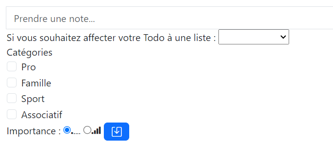
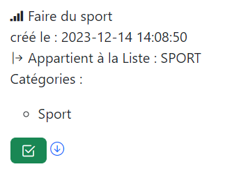

# 4. Gestion des listes

:closed_book: **User Story** : Pour faciliter l’organisation des toDo il vous est demandé de gérer une fonctionnalité de **regroupement de Todos** que l’on appellera **Liste de Todos**. Une Liste pourra contenir plusieurs Todos et un todo pourra être affecté à une et une seule liste (mais pourra également ne pas appartenir à une liste). 

## 4.1 Analyse d'impact Base de données

En résumé des règles métier, on a : 

* Un Todo appartient à 0 ou 1 Liste.
* Une Liste contient 0..* Todos.
* En cas de Suppression de Liste, pas de suppression des Todos en cascade. Les Todos restent, avec ``list_id = NULL``.

On peut visualiser le diagramme de classe associer à notre application.

{: .center width=25%}

!!! question "A faire"
    === "MPD"
        Calculer le modèle physique de données

    === "Modèle Physique de données"
        **liste**(id, titre) 
        clé primaire : id 

        **todo**(id, texte, termine, important, liste_id, timestamp) 
        Clé primaire : id 
        clé étrangère : liste_id en référence à Liste(id) 

        **catégorie**(id, libelle) 
        clé primaire : id 

        **catégorie_todo**(categories_id, todo_id, timestamp) 
        clé primaire : categories_id, todo_id 
        clé étrangère : categories_id en référence à catégorie(id) 
        clé étrangère : todo_id en référece à todo(id) 

        ⚠️ Pour rappel, on commence toujours par les tables sans clés étrangères ...

▶️A vous de jouer pour les migrations et les seeders

## 4.2 User story : Gestion des listes
Il vous est demander de créer un nouvel écran de gestion de Liste, permettant de créer une nouvelle liste et d’affecter des Todos non déjà affectés à cette liste. 

Bonus : Sous ce formulaire, on pourra également avoir la liste des « listes » avec leurs Todos. 

??? tip "Analyse d'impact"

    * Nouveau model avec ajout de la relation todos(): HasMany + impact sur le model Todo (ajout de la relation listes(): BelongsTo)
    * Nouvelle Vue
    * Nouveau controller
    * Nouvelle Route

{: width=70% .center}

## 4.3 User story : Affectation d'un todo à une liste
:green_book: Lors de la création de la création d’un Todo, on pourra affecter un todo à une liste par une liste déroulante. On devra également gérer le cas de ne pas affecter à une liste. 

??? tip "Analyse d'impact"

{: width=50% .center}

## 4.4 User story : Affichage de la liste des todos
:blue_book: Dans un dernier temps, vous pourrez afficher le nom de la liste d’appartenance à chaque Todo. 

{: width=30% .center}

??? tip "Analyse d'impact"

