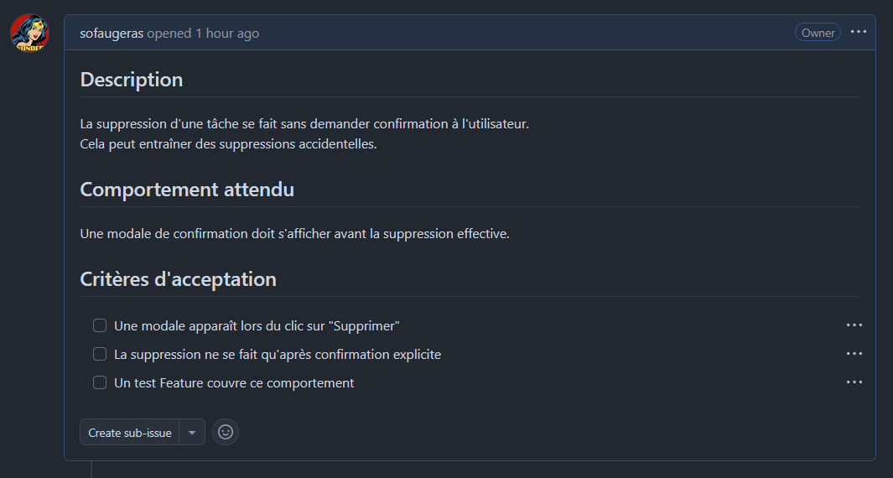
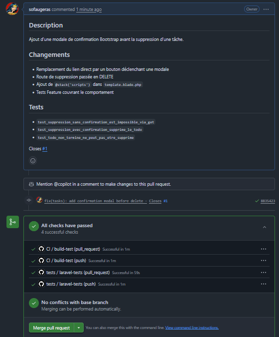
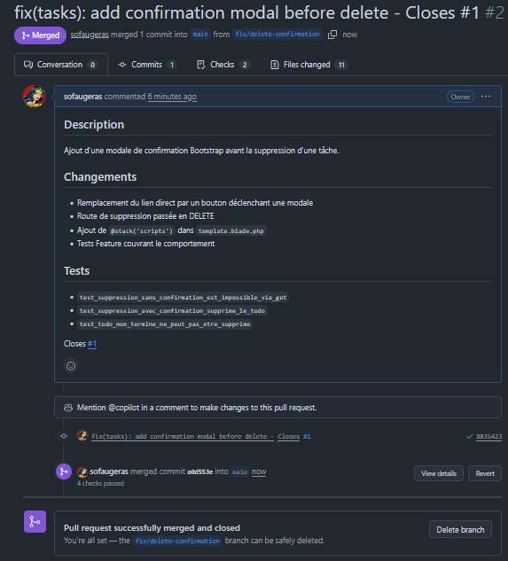
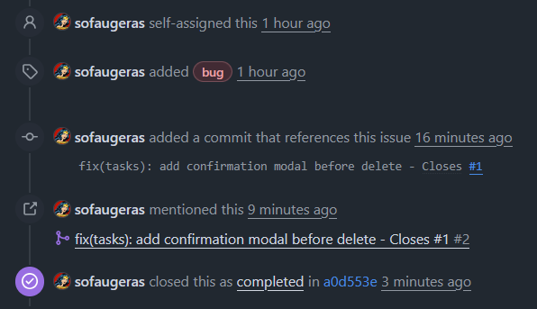
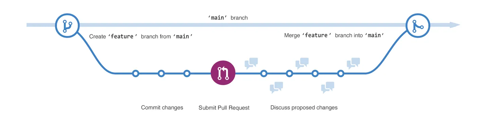

# CI - Issues & Pull Requests GitHub

!!! info  "🎯 Objectifs pédagogiques"
       Maîtriser le flux professionnel Issue → Branch → Pull Request → Review → Merge

## 1. Présentation

### 1.1 Pourquoi les Issues et les Pull Requests ?

Dans une équipe (ou même seul), on ne travaille jamais directement sur `main`. Le flux professionnel s'articule autour de trois piliers :

- **Signaler** le travail à faire → Issues
- **Proposer** une modification → Pull Requests
- **Valider** avant d'intégrer → Review + Merge

C'est ce qu'on appelle le **GitHub Flow**. Il garantit que chaque modification du code est tracée, testée et validée avant d'atterrir sur la branche principale.

{: .center width=70%}

### 1.2 Les Issues — tracker son travail

Une **Issue** est une unité de travail : bug à corriger, feature à implémenter, question à traiter. Elle sert de référence tout au long du cycle de développement.

#### Labels courants à créer dans un projet

| Label | Couleur suggérée | Usage |
|---|---|---|
| `bug` | Rouge | Comportement incorrect |
| `feature` | Bleu | Nouvelle fonctionnalité |
| `enhancement` | Vert | Amélioration d'une fonctionnalité existante |
| `help wanted` | Jaune | Contribution ouverte |
| `wip` | Orange | En cours de développement |
| `good first issue` | Vert clair | Idéal pour les débutants |

#### Anatomie d'une bonne Issue

```markdown
Titre : [Bug] La suppression d'une tâche ne rafraîchit pas la liste

## Comportement attendu
La liste des tâches se met à jour immédiatement après suppression.

## Comportement observé
La tâche reste visible jusqu'au rechargement complet de la page.

## Étapes de reproduction
1. Aller sur /tasks
2. Cliquer "Supprimer" sur une tâche
3. Constater que la tâche reste affichée

## Environnement
- Laravel 12, Inertia/React
- Branch : main, commit abc1234
```

#### Mots-clés de fermeture automatique

Ces mots-clés, utilisés dans un commit ou dans la description d'une PR, ferment automatiquement l'Issue liée au moment du merge :

```text
Closes #12
Fixes #12
Resolves #12
```

### 1.3 Les Pull Requests — proposer une modification

Une **Pull Request (PR)** est une demande de fusion d'une branche vers une autre (généralement `main` ou `develop`). Elle centralise quatre éléments essentiels :

- le **diff** du code (ce qui change exactement)
- la **conversation** (commentaires, suggestions en ligne)
- le **statut CI** (résultat des pipelines GitHub Actions)
- la **review** (approbation formelle des pairs)

#### Les trois stratégies de merge

| Stratégie | Effet sur l'historique | Recommandée quand |
|:---:|:---|:---|
| **Merge commit** | Conserve tous les commits + commit de merge | Transparence totale, travail en équipe |
| **Squash and merge** | Tous les commits → 1 seul commit propre | Historique lisible sur `main` |
| **Rebase and merge** | Commits linéarisés, sans commit de merge | Projets solo ou équipe très disciplinée |

> **Recommandation** : utiliser **Squash and merge** sur `main` pour un historique clair, avec des messages de commit conventionnels (voir section 5).

### 1.4 Protéger `main` avec les Branch Protection Rules

Dans `Settings > Branches` du dépôt GitHub, on peut exiger des conditions avant tout merge :

- ✅ **Require a pull request before merging** — interdit le push direct sur `main`
- ✅ **Require status checks to pass** — bloque le merge si la CI échoue
- ✅ **Require approvals** — impose une review (1 approbation minimum)
- ✅ **Dismiss stale reviews when new commits are pushed** — invalide les approbations après modification
- ✅ **Restrict who can push to matching branches** — contrôle d'accès strict

Ces règles forcent le flux complet : Issue → Branch → PR → Review → Merge. Sans elles, un développeur peut contourner le processus.

### 1.5 Commits conventionnels — nommer son travail

Un message de commit conventionnel suit ce format :

```text
type(scope): description courte - Closes #N
```

Les types courants :

| Type | Usage |
|---|---|
| `feat` | Nouvelle fonctionnalité |
| `fix` | Correction de bug |
| `refactor` | Refactoring sans changement de comportement |
| `test` | Ajout ou modification de tests |
| `docs` | Documentation uniquement |
| `ci` | Modification du pipeline CI |
| `chore` | Tâche de maintenance (dépendances, config) |

Exemples pour le projet `laravel-todo` :

```bash
git commit -m "feat(tasks): add status filter component - Closes #2"
git commit -m "fix(tasks): add confirmation modal before delete - Closes #1"
git commit -m "ci: publish coverage report as PR comment - Closes #3"
```

### 1.6 Lier Issues et Pull Requests — traçabilité complète

Les références croisées GitHub permettent de naviguer du commit jusqu'à l'Issue d'origine.

```markdown
# Dans le body d'une PR :
Closes #5      → ferme l'issue 5 automatiquement au merge
Refs #5        → crée un lien sans fermer l'issue
See #5         → référence informelle

# Dans un message de commit :
git commit -m "feat(tasks): add filter - Closes #5"
```

GitHub affiche ces références dans le fil de chaque Issue. On peut ainsi retracer : **pourquoi** ce code a été écrit (Issue), **comment** il a été proposé (PR), et **quand** il a été intégré (commit sur `main`).

## 2. Application sur `laravel-todo`

On simule un flux professionnel complet avec 3 Issues et 3 Pull Requests sur le projet `laravel-todo`. Chaque Issue correspond à un travail réel sur l'application.

### 2.1 Issue #1 — Bug : pas de confirmation avant suppression

**Issue À créer sur GitHub :**

```text
Titre  : [Bug] Suppression d'une tâche sans confirmation
Labels : bug
Assignée à : vous-meme
```

```markdown
## Description
La suppression d'une tâche se fait sans demander confirmation à l'utilisateur.
Cela peut entraîner des suppressions accidentelles.

## Comportement attendu
Une modale de confirmation doit s'afficher avant la suppression effective.

## Critères d'acceptation
- [ ] Une modale apparaît lors du clic sur "Supprimer"
- [ ] La suppression ne se fait qu'après confirmation explicite
- [ ] Un test Feature couvre ce comportement
```

{: .center width=50%}

Avant de commencer le développement, on ramène en local l'issue et on passe automatiquement sur la branche
```bash
##### avant le code ###########
git checkout main 
>>Already on 'main'
  Your branch is up to date with 'origin/main'.
git pull
>> Already up to date.
git checkout -b fix/delete-confirmation
>> Switched to a new branch 'fix/delete-confirmation'
```

??? tip "Eléments de correction"

       **Récapitulatif des changements**

       |Fichier | Modification|
       |:--|:--|
       |home.blade.php |Bouton data-bs-toggle="modal" + modale Bootstrap + JS|
       |routes/web.php |Route::get → Route::delete|
       |TodosController.php |Aucun changement fonctionnel (optionnel : Delete() → delete())|
       |tests/Feature/TodosSuppressionTest.php|Nouveau fichier avec 3 tests|

**Workflow Git :**

```bash
# ... développement de la modification ...

# Ne pas oublier le lint pour ne pas provoquer d'erreur sur la CI
vendor/bin/pint
php artisan test

git add -A
git commit -m "fix(tasks): add confirmation modal before delete - Closes #1"
>> [fix/delete-confirmation 8835423] fix(tasks): add confirmation modal before delete - Closes #1
  11 files changed, 290 insertions(+), 143 deletions(-)
  rewrite resources/views/auth/login.blade.php (88%)
  rewrite resources/views/auth/register.blade.php (91%)
  rewrite resources/views/layouts/guest.blade.php (90%)
  create mode 100644 tests/Feature/TodosSuppressionTest.php
git push origin fix/delete-confirmation
>> Enumerating objects: 44, done.
  Counting objects: 100% (44/44), done.
  Delta compression using up to 8 threads
  Compressing objects: 100% (23/23), done.
  Writing objects: 100% (23/23), 4.92 KiB | 559.00 KiB/s, done.
  Total 23 (delta 16), reused 0 (delta 0), pack-reused 0
  remote: Resolving deltas: 100% (16/16), completed with 15 local objects.
  remote: 
  remote: Create a pull request for 'fix/delete-confirmation' on GitHub by visiting:
  remote:      https://github.com/sofaugeras/laravel-todo/pull/new/fix/delete-confirmation
  remote:
  To https://github.com/sofaugeras/laravel-todo.git
  * [new branch]      fix/delete-confirmation -> fix/delete-confirmation
```

Ouvrir la Pull Request sur GitHub, Une bannière jaune apparaît automatiquement proposant de créer une PR depuis ta branche. Clique sur ``Compare & pull request``. Puis remplir la PR : 

```text
Titre  : fix(tasks): add confirmation modal before delete - Closes #1
```

```markdown
## Description
Ajout d'une modale de confirmation Bootstrap avant la suppression d'une tâche.

## Changements
- Remplacement du lien direct par un bouton déclenchant une modale
- Route de suppression passée en DELETE
- Ajout de `@stack('scripts')` dans `template.blade.php`
- Tests Feature couvrant le comportement

## Tests
- `test_suppression_sans_confirmation_est_impossible_via_get`
- `test_suppression_avec_confirmation_supprime_le_todo`
- `test_todo_non_termine_ne_peut_pas_etre_supprime`

Closes #1
```

!!! danger "magique"
       Le mot clé `Closes #1` est **magique** : GitHub fermera automatiquement l'issue #1 quand la PR sera mergée.

{: .center width=50%}

A cette étape, on peut solliciter une review par un dev senior dans le panneau de droite. Le reviewer recevra une notification, pourra commenter ligne par ligne, approuver ou demander des modifications.

Puis il faut merger la PR :

- Clique sur **"Merge pull request"** → **"Squash and merge"** (recommandé pour garder un historique propre)
- GitHub ferme automatiquement l'issue #1
- Supprime la branche si elle n'est plus nécessaire

{: .center width=50%}

!!! info "fermeture automatique"
       Vous pouvez constater que l'issue#1 a été fermée automatiquement dans l'onglet issues.

       {: .center width=50%}

??? question "Issue #2 — Feature : filtrer les tâches par statut"
    === "User Story"
        À créer sur GitHub :

        ```
        Titre     : [Feature] Filtrer les tâches par statut
        Labels    : feature
        Milestone : v1.1
        ```

        ```markdown
        ## User story
        En tant qu'utilisateur, je veux filtrer mes tâches par statut
        afin de me concentrer sur ce qui est en cours.
 
        ## Critères d'acceptation

        - [ ] 3 boutons de filtre : Toutes / En cours / Terminées
        - [ ] Le filtre est réactif (sans rechargement de page)
        - [ ] L'état du filtre actif est visuellement indiqué
        - [ ] Tests Feature ajoutés
        ```

    === "Workflow Git"

        ```bash
        git checkout main && git pull
        git checkout -b feature/task-filter
 
        # ... développement du composant filtre ...
 
        git add -A
        git commit -m "feat(tasks): add status filter - Closes #2"
        git push origin feature/task-filter
        ```

### 2.2 Template de Pull Request

Créer le fichier `.github/pull_request_template.md` à la racine du dépôt. Il s'affichera automatiquement à chaque ouverture de PR.

```markdown
## Description
<!-- Décris les changements apportés et leur motivation -->

## Issue liée
Closes #

## Type de changement
- [ ] Bug fix
- [ ] Nouvelle feature
- [ ] Refactoring
- [ ] Modification CI/CD
- [ ] Documentation

## Checklist
- [ ] Mon code respecte le style du projet (`vendor/bin/pint --test`)
- [ ] J'ai ajouté des tests couvrant mes changements
- [ ] Tous les tests passent en local (`php artisan test`)
- [ ] La documentation a été mise à jour si nécessaire
- [ ] Le message de commit suit la convention `type(scope): description`

## Captures d'écran (si changement d'interface)
<!-- Ajouter des captures avant/après si pertinent -->
```

### 2.3 Résumé du flux complet

{: .center width=100%}

!!! info  "Vers le CD"

       Une fois ce flux maîtrisé, la prochaine étape naturelle est d'ajouter un **environnement de staging** avec déploiement automatique à chaque merge sur `main`. Cela boucle la boucle CI/CD complète :

       ```
       Code → Test (CI) → Review (PR) → Merge → Deploy (CD)
       ```