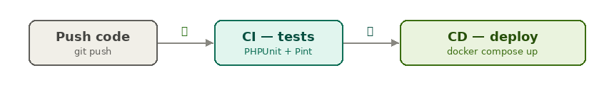
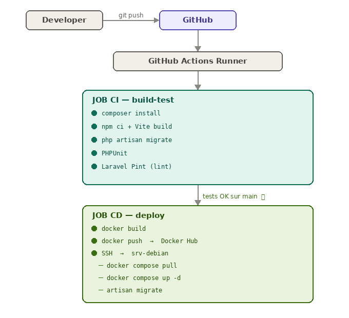
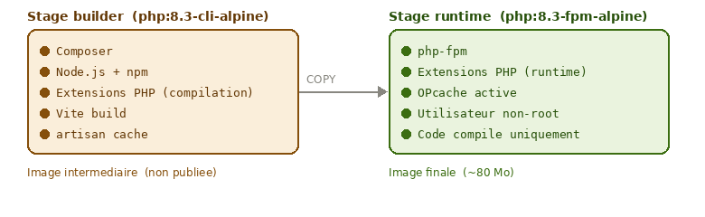
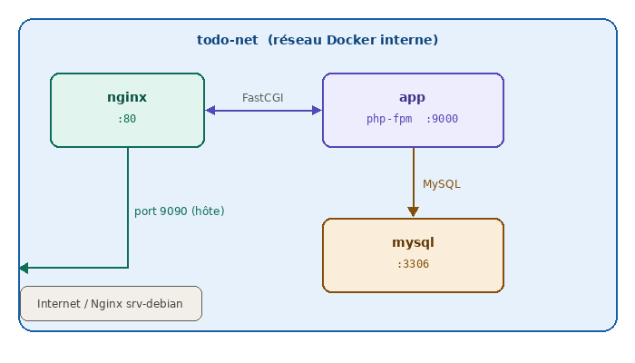
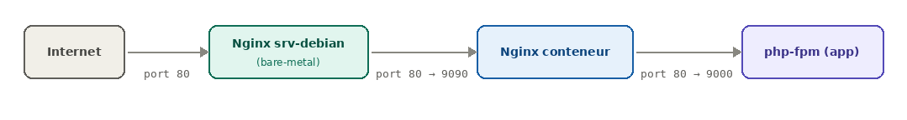
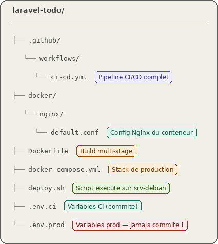
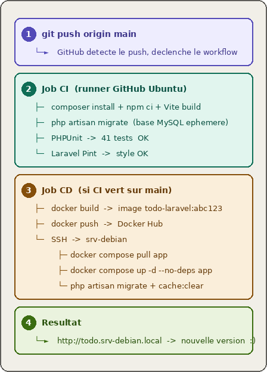

# CI - Déploiement 

!!! info " Objectifs 🎯 CI/CD d'une application Laravel avec Docker 🚀"

    - Comprendre le principe d'une chaîne CI/CD
    - Écrire un `Dockerfile` multi-stage pour une application Laravel
    - Décrire le rôle de chaque service dans un `docker-compose.yml` de production
    - Configurer un pipeline GitHub Actions de bout en bout
    - Déployer automatiquement une application sur un serveur Debian via un self-hosted runner

    **Compétence :** Mettre à disposition des utilisateurs un service informatique > Déployer un service

## 1. Rappels — Qu'est-ce que la CI/CD ? 🔄

### 1.1 Le problème sans CI/CD

Sans automatisation, le cycle de vie d'une modification de code ressemble à ceci :

1. Le développeur pousse son code
2. Quelqu'un (peut-être personne) lance les tests manuellement
3. Quelqu'un d'autre construit l'application et la dépose sur le serveur "à la main"
4. En cas d'erreur en production, personne ne sait exactement quelle version tourne

Ce processus est **lent, risqué et non reproductible**.

### 1.2 CI — Intégration Continue

L'**Intégration Continue** (CI — *Continuous Integration*) automatise la vérification du code à chaque modification :

- Compilation / installation des dépendances
- Linting (vérification du style de code)
- Tests unitaires et fonctionnels
- Analyse statique

??? question "Pourquoi appelle-t-on ça *intégration* continue ?"
    Parce que le code de chaque développeur est **intégré** (fusionné) fréquemment dans la branche principale, et à chaque intégration, la chaîne vérifie que rien n'est cassé. Sans CI, on intègre rarement et les conflits s'accumulent.

### 1.3 CD — Déploiement Continu

Le **Déploiement Continu** (CD — *Continuous Deployment*) prolonge la CI : si tous les tests passent sur la branche principale, l'application est **automatiquement déployée** en production.

{: .center width=100%}

??? question "Quelle est la différence entre CI et CD ?"
    La CI s'arrête à la **vérification** (les tests passent-ils ?).
    La CD va plus loin : elle **déploie** automatiquement si la CI est verte. Les deux ensemble forment la chaîne CI/CD.

### 1.4 Le *quality gate*

Un **quality gate** (portillon qualité) est une condition bloquante dans le pipeline : si les tests échouent, le déploiement **ne se déclenche pas**. C'est la garantie que ce qui part en production a été validé.

Dans notre pipeline, c'est le mécanisme `needs: build-test` dans GitHub Actions :

```yaml
deploy:
  needs: build-test   # ← le CD attend que le CI soit vert
  if: github.ref == 'refs/heads/main'
```

??? question "Que se passe-t-il si un développeur pousse du code qui casse un test ?"
    Le job `build-test` échoue, GitHub envoie une notification par e-mail, et le job `deploy` **ne démarre jamais**. La production reste sur la version précédente, stable.

## 2. Architecture de notre chaîne CI/CD 🏗️

{: .center width=80%}

### Les acteurs

| Acteur | Rôle |
|---|---|
| **GitHub** | Forge Git, héberge le code source et les secrets |
| **GitHub Actions** | Moteur CI/CD, exécute les jobs dans des conteneurs Ubuntu |
| **Docker Hub** | Registry d'images Docker, stocke l'image de l'application |
| **srv-debian** | Serveur de production, exécute les conteneurs via `docker compose` |

??? question "Pourquoi passer par Docker Hub plutôt que de builder l'image directement sur le serveur ?"
    Construire l'image sur le serveur de production serait risqué et lent. En passant par Docker Hub, on **sépare la construction du déploiement** : le runner CI construit l'image dans un environnement propre et contrôlé, la pousse sur Docker Hub, et le serveur n'a plus qu'à la télécharger. Si la construction échoue, le serveur n'est jamais touché.

## 3. Le Dockerfile — Conteneuriser Laravel 🐳

### 3.1 Pourquoi pas `php artisan serve` en production ?

`artisan serve` est le serveur de développement de Laravel. Il est :

- **Mono-thread** : il ne peut traiter qu'une requête à la fois
- **Non sécurisé** : pas conçu pour être exposé à internet

En production, on utilise **php-fpm** (*FastCGI Process Manager*), qui gère un pool de processus PHP en parallèle, associé à **Nginx** qui sert les fichiers statiques directement.

??? question "Qu'est-ce que FastCGI ?"
    FastCGI est un protocole de communication entre un serveur web (Nginx) et un interpréteur de langage (php-fpm). Nginx reçoit la requête HTTP, la transmet à php-fpm via le socket FastCGI, php-fpm exécute le script PHP et renvoie la réponse à Nginx, qui la retourne au client.

### 3.2 Le build multi-stage

Un Dockerfile **multi-stage** utilise plusieurs images successives dans le même fichier. L'intérêt est de séparer l'environnement de **construction** (qui a besoin de compilateurs, de Node.js, de Composer…) de l'environnement d'**exécution** (qui n'a besoin que du runtime PHP).

{: .center width=100%}

??? question "Pourquoi l'image finale est-elle plus légère ?"
    Parce que le stage `runtime` ne copie que le résultat du build (le code + `vendor/` + `public/build/`), pas les outils qui ont servi à le construire. Node.js, Composer, les headers de compilation (`*-dev`) ne sont pas inclus. Une image de production légère est plus rapide à télécharger, à démarrer, et présente une surface d'attaque réduite.

### 3.3 Analyse du Dockerfile

```dockerfile
# ── Stage 1 : builder ──────────────────────────────────────────
FROM php:8.3-cli-alpine AS builder

# Installation des dépendances système nécessaires à la compilation
RUN apk add --no-cache \
    libpng-dev libjpeg-turbo-dev libwebp-dev \
    libxml2-dev oniguruma-dev icu-dev \
    && docker-php-ext-install pdo_mysql mbstring xml gd fileinfo intl

# Composer installé depuis son image officielle (propre)
COPY --from=composer:2 /usr/bin/composer /usr/bin/composer

# Node.js pour Vite
RUN apk add --no-cache nodejs npm

WORKDIR /app

# On copie TOUT le code source (artisan doit être présent pour
# les scripts post-install de Composer)
COPY . .

# Installation des dépendances PHP sans les packages de dev
RUN composer install --no-dev --no-interaction \
    --optimize-autoloader --prefer-dist

# Build des assets front (Vite génère public/build/manifest.json)
RUN npm ci && npm run build

# ── Stage 2 : runtime ──────────────────────────────────────────
FROM php:8.3-fpm-alpine AS runtime

# Extensions compilées : installation des headers, compilation, suppression des headers,
# réinstallation des libs runtime nécessaires à l'exécution de gd
RUN apk add --no-cache \
    libpng-dev libjpeg-turbo-dev libwebp-dev \
    libxml2-dev oniguruma-dev \
    && docker-php-ext-install pdo_mysql mbstring xml gd fileinfo opcache \
    && apk del libpng-dev libjpeg-turbo-dev libwebp-dev \
              libxml2-dev oniguruma-dev \
    && apk add --no-cache libpng libjpeg-turbo libwebp \
    && rm -rf /var/cache/apk/*

# OPcache : accélère PHP en gardant le bytecode en mémoire
RUN { \
    echo 'opcache.enable=1'; \
    echo 'opcache.memory_consumption=256'; \
    echo 'opcache.validate_timestamps=0'; \
} > /usr/local/etc/php/conf.d/opcache.ini

# Sécurité : l'application tourne sous un utilisateur non-root
RUN addgroup -g 1000 -S www && adduser -u 1000 -S www -G www

WORKDIR /var/www/html

# Copie du code compilé depuis le stage builder
COPY --from=builder --chown=www:www /app .

# Création des dossiers d'écriture Laravel
RUN mkdir -p storage/framework/{sessions,views,cache} storage/logs \
             bootstrap/cache \
    && chown -R www:www storage bootstrap/cache \
    && chmod -R 775 storage bootstrap/cache

USER www
EXPOSE 9000
CMD ["php-fpm"]
```

??? question "Pourquoi supprimer les packages `-dev` dans la même couche Docker (`RUN`) qu'on les installe ?"
    Chaque instruction `RUN` crée une **couche** (layer) dans l'image. Si on installe les `-dev` dans une couche et qu'on les supprime dans une autre, les fichiers supprimés existent toujours dans la couche précédente — ils sont juste masqués. L'image finale est donc aussi lourde. En regroupant installation + suppression dans un seul `RUN`, les fichiers n'apparaissent jamais dans l'image finale.

??? question "Pourquoi réinstaller libpng, libjpeg-turbo et libwebp après apk del ?"
    Il faut distinguer deux types de packages : les **headers de compilation** (`-dev`) nécessaires pour compiler l'extension `gd`, et les **bibliothèques runtime** nécessaires pour l'exécuter. On supprime les `-dev` pour alléger l'image, mais on conserve les libs runtime (`libpng`, `libjpeg-turbo`, `libwebp`) sans leurs headers — juste les `.so` dont php-fpm a besoin au démarrage.

??? question "Pourquoi créer un utilisateur `www` et ne pas utiliser `root` ?"
    Par principe de moindre privilège. Si un attaquant parvient à exécuter du code dans le conteneur, il se retrouve avec les droits de l'utilisateur `www`, non de `root`. Il ne peut pas modifier les fichiers système du conteneur ni, en cas de fuite, accéder à l'hôte avec des droits élevés.

## 4. Le docker-compose.yml — Stack de production 🧩

### 4.1 Les trois services

Notre application de production nécessite trois conteneurs qui collaborent :

{: .center width=100%}

| Service | Image | Rôle |
|---|---|---|
| `app` | Notre image Laravel | Exécute php-fpm, traite les requêtes PHP |
| `nginx` | `nginx:1.27-alpine` | Sert les fichiers statiques, passe le PHP à `app` |
| `mysql` | `mysql:8.0` | Base de données, données persistées dans un volume |

### 4.2 Points clés du docker-compose.yml

**Les variables d'environnement** sont injectées depuis le fichier `.env.prod` qui reste sur le serveur et n'est jamais commité :

```yaml
app:
  environment:
    APP_KEY: ${APP_KEY}
    DB_PASSWORD: ${DB_PASSWORD}
```

**Le healthcheck** sur MySQL garantit que la base est prête avant que l'application démarre :

```yaml
mysql:
  healthcheck:
    test: ["CMD", "mysqladmin", "ping", "-h", "127.0.0.1"]
    interval: 10s
    retries: 10
```

**Les volumes nommés** assurent la persistance des données entre les redéploiements et partagent les fichiers entre conteneurs :

```yaml
volumes:
  todo_mysql:    # données MySQL
  todo_storage:  # fichiers uploadés, sessions, logs Laravel
  app_public:    # assets Vite partagés entre app et nginx
```

!!! info "Le volume `app_public`"
    Nginx a besoin d'accéder aux assets compilés par Vite (`public/build/`) pour les servir directement sans passer par php-fpm. Ce volume est monté en lecture/écriture dans `app` et en lecture seule dans `nginx`.

**Le fichier `.env.prod`** est monté directement depuis le serveur dans le conteneur `app` :

```yaml
app:
  volumes:
    - todo_storage:/var/www/html/storage
    - app_public:/var/www/html/public
    - /opt/todo-prenom/.env:/var/www/html/.env:ro   # ← fichier de config prod
```

Le `.env.prod` reste sur le serveur, n'est jamais dans l'image Docker, et n'est jamais commité.

??? question "Que se passerait-il si on n'utilisait pas de volumes nommés pour MySQL ?"
    À chaque `docker compose up`, MySQL démarrerait avec une base vide. Toutes les données des utilisateurs seraient perdues. Les volumes nommés sont **indépendants du cycle de vie des conteneurs** : on peut recréer le conteneur MySQL sans perdre les données.

??? question "Pourquoi nginx et app sont-ils deux conteneurs séparés plutôt qu'un seul ?"
    Séparation des responsabilités. Nginx est optimisé pour servir des fichiers statiques (CSS, JS, images) très rapidement, sans jamais invoquer PHP. Seules les requêtes `.php` sont transmises à php-fpm. Cela soulage considérablement l'application et respecte le principe de **séparation des préoccupations** (*Separation of Concerns*).

## 5. Le pipeline GitHub Actions 🤖

### 5.1 Structure du fichier `ci-cd.yml`

Un fichier GitHub Actions est un **workflow** au format YAML, placé dans `.github/workflows/`. Il décrit :

- Les **déclencheurs** (`on:`) — quand le pipeline s'exécute
- Les **jobs** — les groupes d'étapes
- Les **steps** — les actions individuelles

```yaml
on:
  push:
    branches: [main]   # déclenché uniquement sur main
  pull_request:
    branches: [main]   # et sur les PR vers main
```

### 5.2 Le job CI — `build-test`

Ce job s'exécute sur un **runner** Ubuntu hébergé par GitHub. Il :

1. Clone le repo (`actions/checkout@v4`)
2. Installe PHP 8.3 avec les extensions nécessaires
3. Installe les dépendances Composer et npm
4. Build les assets Vite
5. Lance les migrations sur une base MySQL éphémère
6. Exécute PHPUnit
7. Vérifie le style de code avec Laravel Pint

```yaml
services:
  mysql:
    image: mysql:8.0
    env:
      MYSQL_DATABASE: todo_test
      MYSQL_USER: laravel_test
      MYSQL_PASSWORD: secret
```

??? question "Où tourne cette base MySQL pendant le CI ?"
    Elle tourne dans un **conteneur de service** Docker, lancé automatiquement par GitHub Actions le temps du job. Elle est complètement éphémère : créée au début du job, détruite à la fin. Chaque exécution du pipeline repart d'une base propre.

### 5.3 Le job CD — `deploy`

Ce job ne se déclenche que si le job CI est vert **ET** qu'on est sur la branche `main` :

```yaml
deploy:
  needs: build-test                             # quality gate
  if: github.ref == 'refs/heads/main'
      && github.event_name == 'push'
```

!!! info "Self-hosted runner"
    Le job CD s'exécute sur `runs-on: self-hosted` — un runner GitHub Actions installé **directement sur `srv-debian`** et enregistré au niveau de l'**organisation `lyceesaintsauveur`**. Il se connecte à GitHub, attend les jobs, et les exécute localement sur le serveur. Pas besoin de SSH ni d'IP publique : le runner est déjà sur la machine cible.

    ```
    GitHub ←── runner srv-debian (connexion sortante)
    ```

    C'est la solution retenue pour notre infrastructure car `srv-debian` est sur un réseau local privé non accessible depuis internet.

Il réalise trois opérations :

**1. Build et push de l'image Docker**

```yaml
- name: Build and push Docker image
  uses: docker/build-push-action@v5
  with:
    push: true
    tags: |
      ${{ secrets.DOCKERHUB_USERNAME }}/todo-laravel:latest
      ${{ secrets.DOCKERHUB_USERNAME }}/todo-laravel:${{ github.sha }}
```

L'image est taguée avec `latest` (pour le déploiement) ET avec le SHA du commit (pour la traçabilité — on peut toujours savoir quelle version exacte tourne).

**2. Déploiement direct sur le serveur**

Puisque le runner tourne sur `srv-debian`, le déploiement s'exécute directement sans SSH. Le secret `DEPLOY_PATH` pointe vers le répertoire de chaque étudiant sur le serveur (`/opt/todo-prenom`) :

```yaml
- name: Deploy
  run: |
    cp ${{ secrets.DEPLOY_PATH }}/.env.prod ${{ secrets.DEPLOY_PATH }}/.env
    docker compose --project-directory ${{ secrets.DEPLOY_PATH }} down --remove-orphans || true
    docker compose --project-directory ${{ secrets.DEPLOY_PATH }} pull app
    docker compose --project-directory ${{ secrets.DEPLOY_PATH }} up -d --force-recreate
    sleep 5
    docker compose --project-directory ${{ secrets.DEPLOY_PATH }} exec -T app php artisan config:cache
    docker compose --project-directory ${{ secrets.DEPLOY_PATH }} exec -T app php artisan route:cache
    docker compose --project-directory ${{ secrets.DEPLOY_PATH }} exec -T app php artisan view:cache
    docker compose --project-directory ${{ secrets.DEPLOY_PATH }} exec -T app php artisan migrate:fresh --seed --force
    docker compose --project-directory ${{ secrets.DEPLOY_PATH }} exec -T app php artisan cache:clear
```

!!! info "Pourquoi `--project-directory` ?"
    Le runner travaille depuis son dossier `_work`. Docker Compose identifie les conteneurs par le nom du projet, dérivé du dossier courant. En spécifiant `--project-directory /opt/todo-prenom`, on force Docker Compose à utiliser le `docker-compose.yml` du bon étudiant, avec les bons noms de conteneurs et volumes.

!!! info "Pourquoi `migrate:fresh --seed` ?"
    `migrate:fresh` recrée toutes les tables depuis zéro puis lance les seeders en une seule commande. La base est toujours dans un état cohérent avec la dernière version du code, et les données de démo sont présentes dès le premier accès.

!!! info "Pourquoi régénérer les caches après démarrage ?"
    Le `Dockerfile` ne génère pas les caches Laravel pendant le build : les caches contiendraient des chemins absolus du stage builder (`/app`) au lieu du runtime (`/var/www/html`). Les caches sont générés à chaud après le démarrage du conteneur, avec les bons chemins.

??? question "Qu'est-ce qu'un secret GitHub et comment fonctionne-t-il ?"
    Un secret est une valeur chiffrée stockée dans les paramètres du repo GitHub (Settings → Secrets). Elle est injectée comme variable d'environnement dans les runners pendant l'exécution du pipeline, mais **n'apparaît jamais dans les logs** (GitHub la masque automatiquement). C'est le mécanisme sécurisé pour stocker des informations sensibles comme les tokens Docker Hub.

??? question "Pourquoi le runner est-il enregistré sur l'organisation et pas sur un repo ?"
    Un runner d'**organisation** (`lyceesaintsauveur`) est accessible par tous les repos de l'organisation. Chaque étudiant peut ainsi utiliser le même runner `srv-debian13` depuis son propre repo, sans qu'on ait besoin de l'enregistrer manuellement sur chaque projet.

## 6. Les secrets GitHub 🔐

Notre pipeline nécessite **4 secrets** à configurer dans **Settings → Secrets and variables → Actions** de votre repo :

| Secret | Valeur | Pourquoi |
|---|---|---|
| `DOCKERHUB_USERNAME` | Votre identifiant [Docker Hub](https://hub.docker.com) | S'authentifier pour pousser l'image |
| `DOCKERHUB_TOKEN` | Token Docker Hub (pas le mdp) | Authentification sécurisée |
| `DOCKERHUB_IMAGE` | `votre-user/todo-laravel` | Nom de l'image à builder et pousser, votre user est celui de hub.docker.com |
| `DEPLOY_PATH` | `/opt/todo-prenom` | Chemin du répertoire de déploiement sur le serveur |

<!--
!!! info "Plus besoin de secrets SSH"
    Avec le self-hosted runner, le job CD s'exécute directement sur `srv-debian`. Les secrets `SSH_HOST`, `SSH_USER`, `SSH_PRIVATE_KEY` et `SSH_PORT` ne sont plus nécessaires — le runner est déjà sur le serveur.
-->
!!! warning "Générer votre APP_KEY"
    Avant le premier déploiement, vous devez renseigner votre `APP_KEY` dans le fichier `/opt/todo-prenom/.env.prod` sur le serveur. Générez-la en local dans votre projet Laravel :

    ```bash
    php artisan key:generate --show
    ```

    Puis connectez-vous au serveur et éditez votre `.env.prod` :

    ```bash
    ssh prenom@192.168.0.119 -p 2222
    nano /opt/todo-prenom/.env.prod
    # Renseignez APP_KEY=base64:...
    ```

??? question "Pourquoi utiliser un token Docker Hub plutôt que le mot de passe du compte ?"
    Si le token est compromis, on peut le révoquer sur Docker Hub sans changer le mot de passe du compte. C'est le principe des **credentials à portée limitée** : le token n'a accès qu'aux opérations nécessaires (push d'images), pas à la gestion du compte.

## 7. Mise en place de votre environnement 🛠️

!!! tip "Fichiers à télécharger 📥"

    [⬇️ docker-compose.yml](./data/docker-compose.yml){ .md-button }
    [⬇️ ci-cd.yml](./data/ci-cd.yml){ .md-button }

### 7.1 Fork du repo sous l'organisation

Le runner GitHub Actions est enregistré sur l'organisation `lyceesaintsauveur`. Pour que votre pipeline puisse l'utiliser, votre repo doit appartenir à cette organisation.

Créez un fork du repo de référence sous l'organisation :

`github.com/sofaugeras/laravel-todo` → **Fork** → Owner : `lyceesaintsauveur` → Repository name : `laravel-todo-prenom`

!!! warning "Activer GitHub Actions sur le fork"
    Après le fork, GitHub désactive les workflows par sécurité. Rendez-vous dans l'onglet **Actions** de votre repo et cliquez **"I understand my workflows, go ahead and enable them"**.

### 7.2 Configurer les secrets

Dans votre repo `lyceesaintsauveur/laravel-todo-prenom` :

`Settings → Secrets and variables → Actions → New repository secret`

Ajoutez les 4 secrets décrits en section 6.

### 7.3 Compléter le `.env.prod` sur le serveur

Votre `.env.prod` a été pré-créé sur `srv-debian` par le professeur dans `/opt/todo-prenom/.env.prod`. Il manque uniquement l'`APP_KEY`.

Générez-la en local :
```bash
php artisan key:generate --show
```

Puis sur le serveur :
```bash
ssh prenom@192.168.0.119 -p 2222
nano /opt/todo-prenom/.env.prod
# APP_KEY=base64:votre-cle-generee
```

### 7.4 Déclencher le premier déploiement

Faites un push sur la branche `main` de votre fork pour déclencher le pipeline :

```bash
git commit --allow-empty -m "premier déploiement"
git push origin main
```

Suivez l'exécution dans l'onglet **Actions** de votre repo. Votre application sera accessible à l'URL `http://todo-prenom.srv-debian.local`.

## 8. Nginx comme reverse proxy 🔀

**Nginx** (prononcé *"engine-x"*) est un logiciel open source qui joue plusieurs rôles selon la configuration :

- **Serveur web** — sert directement les fichiers statiques (HTML, CSS, JS, images) sans passer par PHP
- **Reverse proxy** — reçoit les requêtes HTTP et les transmet à une application backend (PHP-FPM, Node.js, Flask…)
- **Load balancer** — répartit le trafic entre plusieurs instances d'une même application
- **Cache** — mémorise les réponses pour accélérer les requêtes répétées

### 8.1 L'analogie du switch Layer 7 🔌

Imaginez Nginx comme un **switch réseau intelligent qui opère au niveau applicatif (couche 7 du modèle OSI)** — il ne se contente pas de router des paquets IP, il lit le contenu HTTP (URL, en-têtes, nom de domaine) pour décider où envoyer la requête.

| Concept Nginx | Analogie réseau | Exemple concret |
|---|---|---|
| `server {}` | Un port d'écoute du switch | `listen 80; server_name api.example.com;` |
| `location {}` | Une règle de routage sur ce port | `location /api { }` → backend API |
| `proxy_pass` | La règle de forwarding | Requête transmise vers `http://app:9000` |
| `root` | Servir depuis le cache local | Sert directement les fichiers HTML/CSS |

Nginx **reçoit** les requêtes, les **route** selon les règles, et les **forward** vers le bon backend ou les sert directement depuis le disque.

### 8.2 Deux niveaux de Nginx dans notre architecture 🏗️

{: .center width=100%}

!!! info "Nginx à deux endroits"
    Dans notre architecture, Nginx intervient à **deux niveaux distincts** :

    **1. Nginx bare-metal sur `srv-debian`** — installé directement sur le serveur, hors Docker.
    Il écoute sur le port 80 et fait du reverse proxy vers les conteneurs selon le sous-domaine
    (`todo-prenom.srv-debian.local` → port dédié à l'étudiant). Un seul Nginx gère **tous les projets** du serveur.

    **2. Nginx dans le conteneur** — à l'intérieur de la stack Docker Todo, un conteneur Nginx
    dédié reçoit les requêtes forwardées par Nginx bare-metal et les distribue : il sert les assets
    Vite directement (sans PHP), et transmet les requêtes `.php` à php-fpm via FastCGI.

### 8.3 Nginx dans le conteneur

À l'intérieur de la stack Docker, le conteneur Nginx a une configuration différente : il sert les fichiers statiques directement et passe les requêtes PHP à php-fpm via FastCGI :

```nginx
location / {
    try_files $uri $uri/ /index.php?$query_string;
}

location ~ \.php$ {
    fastcgi_pass app:9000;        # "app" = nom du service Docker
    fastcgi_param SCRIPT_FILENAME $realpath_root$fastcgi_script_name;
    include fastcgi_params;
}
```

??? question "Comment Nginx sait-il joindre le conteneur `app` par son nom ?"
    Docker crée un **réseau interne** (`todo-net`). Dans ce réseau, chaque conteneur est accessible par son nom de service. `app:9000` est résolu par le DNS interne de Docker vers l'adresse IP du conteneur `app`, port 9000.

??? question "Pourquoi deux Nginx et pas un seul ?"
    Le Nginx bare-metal est le **point d'entrée unique** du serveur — il sait vers quel projet router selon le nom de domaine. Le Nginx conteneur est **interne à la stack Todo** — il optimise la livraison des assets sans toucher à php-fpm. Ce sont deux responsabilités différentes : routage inter-projets d'un côté, optimisation intra-application de l'autre.

## 9. Récapitulatif des fichiers du projet 📁

{: .center width=70%}

!!! warning "Règle absolue"
    Le fichier `.env.prod` contient des mots de passe et des clés secrètes. Il ne doit **jamais** être commité sur GitHub. Il est créé par le professeur sur le serveur avant le TP, et complété par l'étudiant avec son `APP_KEY`.

## 10. Schéma de synthèse — Le cycle complet 🔁

{: .center width=70%}

??? question "Combien de temps faut-il entre un `git push` et la mise en ligne ?"
    Sur notre configuration, environ 4 à 6 minutes : 2 à 3 minutes pour le CI (install + tests), 2 à 3 minutes pour le CD (build Docker + push + déploiement via self-hosted runner). Le cache GitHub Actions pour les layers Docker et le cache Composer permettent de réduire ce temps.

??? question "Que se passe-t-il si le déploiement plante en cours de route ?"
    Le conteneur `app` qui tournait avant n'est remplacé que lorsque le nouveau démarre correctement. Si `docker compose up -d app` échoue (image corrompue, erreur de migration…), l'ancien conteneur continue de tourner. C'est une forme basique de **déploiement sans interruption** (*zero-downtime deployment*).
