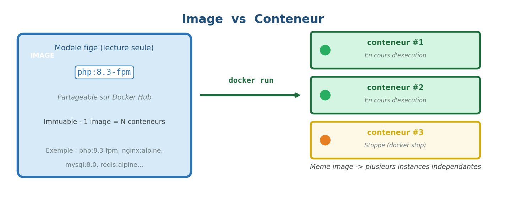
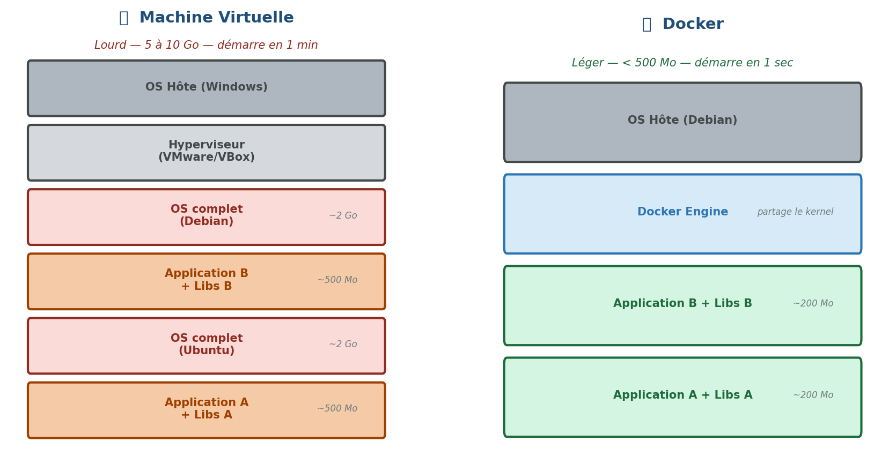
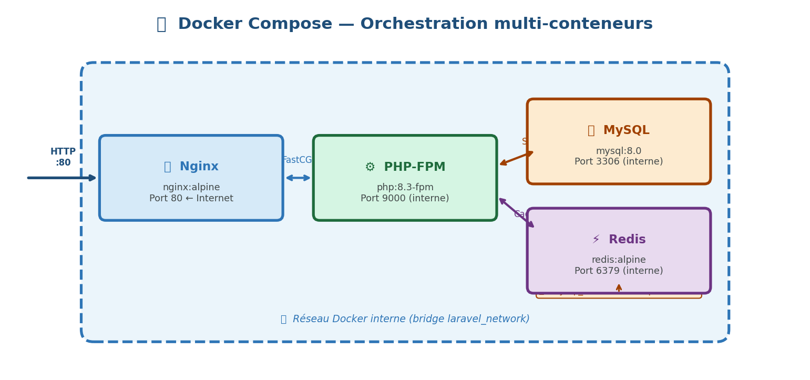
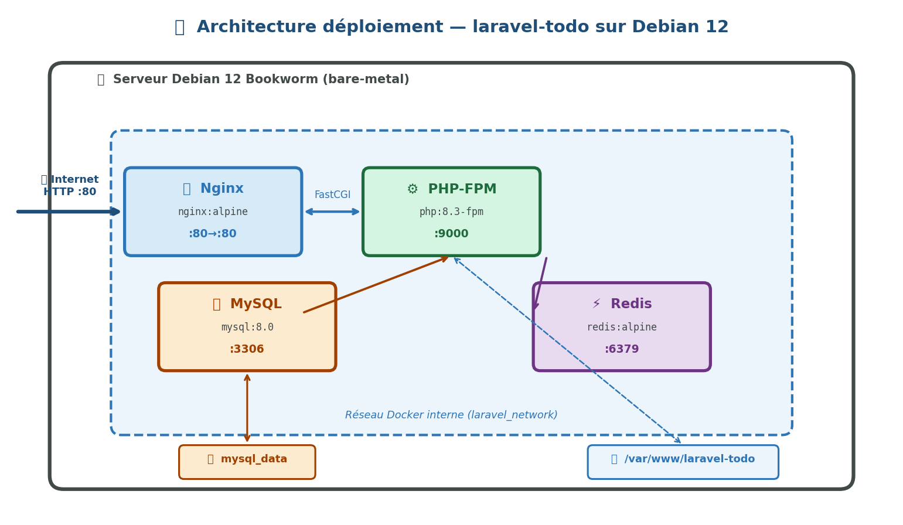
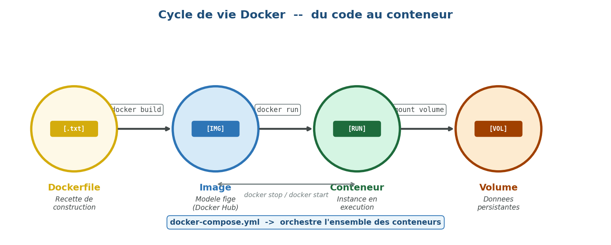

# CI - Déploiement avec 🐳 Docker


!!! success "🎯 Objectifs du TP"
    Déployer une application Laravel en production

    - 🗣️ Expliquer ce qu'est Docker et pourquoi on l'utilise
    - 🔍 Comprendre l'architecture conteneur vs machine virtuelle
    - 📝 Lire et écrire un `Dockerfile` pour une application PHP/Laravel
    - 🎼 Orchestrer plusieurs services avec `docker-compose`
    - 🚀 Déployer l'application `laravel-todo` sur un serveur Debian


## 1. 🤔 Pourquoi Docker ? Le problème du "ça marche chez moi"

### 1.1 Le problème classique

Vous avez développé votre application Laravel sur votre PC Windows. Tout fonctionne. Vous la transmettez à votre collègue sous Ubuntu : **❌ erreur**. Vous la déployez sur le serveur de production : **❌ encore une erreur**.

Les causes sont toujours les mêmes :

| 💻 Environnement | 🐘 PHP | 🐬 MySQL | 🟢 Node |
|---|---|---|---|
| Votre PC | 8.3 | 8.0 | 20 |
| PC collègue | 8.1 | 5.7 | 18 |
| Serveur prod | 8.2 | 8.4 | 22 |

> 💡 **Docker résout ce problème** en embarquant l'application ET son environnement dans une unité portable appelée **conteneur**.

### 1.2 🚢 La métaphore du conteneur maritime

Avant les conteneurs maritimes (années 1950), chaque marchandise nécessitait un conditionnement spécifique. Charger/décharger un bateau prenait des semaines. Avec le conteneur standardisé : n'importe quelle marchandise, n'importe quel port, n'importe quel navire.

Docker applique exactement cette idée au logiciel : **votre app + son environnement = un conteneur portable**.

---

## 2. 🧱 Les concepts fondamentaux

### 2.1 📦 Image vs Conteneur



- Une **image** est un modèle figé, en lecture seule. Elle décrit l'OS, les dépendances, le code.
- Un **conteneur** est une instance en cours d'exécution d'une image. On peut en lancer plusieurs à partir de la même image.
- 🔑 **Analogie** : l'image est la *recette de cuisine*, le conteneur est *le plat préparé*.

### 2.2 🖥️ Docker vs Machine Virtuelle



**Points clés :**
- ❌ La VM virtualise le **matériel** → chaque VM a son propre OS complet (~2 Go chacun)
- ✅ Docker virtualise l'**OS** → les conteneurs partagent le kernel de l'hôte
- ⚡ Un conteneur démarre en **< 1 seconde** ; une VM en **30-60 secondes**
- 💾 Une VM pèse **5-10 Go** ; un conteneur **quelques dizaines de Mo**

### 2.3 📝 Le Dockerfile

Le `Dockerfile` est le fichier texte qui décrit comment construire une image. C'est la **recette** de construction.

```dockerfile
# Instruction de base : on part d'une image existante
FROM php:8.3-fpm

# On exécute des commandes dans l'image
RUN apt-get update && apt-get install -y libpng-dev

# On copie des fichiers de notre machine vers l'image
COPY . /var/www/html

# On expose un port réseau
EXPOSE 9000

# La commande lancée au démarrage du conteneur
CMD ["php-fpm"]
```

**Instructions essentielles :**

| 🔧 Instruction | Rôle |
|---|---|
| `FROM` | 🏗️ Image de base (obligatoire, toujours en premier) |
| `RUN` | ⚙️ Exécute une commande pendant la construction |
| `COPY` | 📋 Copie des fichiers locaux dans l'image |
| `WORKDIR` | 📁 Définit le dossier de travail courant |
| `ENV` | 🌍 Définit une variable d'environnement |
| `EXPOSE` | 🔌 Documente le port écouté |
| `CMD` | ▶️ Commande par défaut au démarrage |
| `ENTRYPOINT` | 🎯 Point d'entrée (non surchargeable facilement) |

### 2.4 🎼 Docker Compose — Orchestrer plusieurs conteneurs

Une application Laravel complète nécessite plusieurs services qui doivent communiquer entre eux :



Docker Compose orchestre tout ça avec un seul fichier `docker-compose.yml`. **Une seule commande pour démarrer toute la stack.**

---

## 3. 🏗️ Architecture de notre déploiement

### 3.1 Vue d'ensemble

Pour déployer `laravel-todo`, nous allons utiliser **4 conteneurs** :



> 🔒 **Sécurité** : seul le port **80** de Nginx est exposé à l'extérieur. MySQL (:3306) et Redis (:6379) restent isolés dans le réseau Docker interne — **inaccessibles depuis Internet**.

### 3.2 🗂️ Rôle de chaque service

| 🐳 Service | 📦 Image de base | 🎯 Rôle |
|---|---|---|
| `app` | `php:8.3-fpm` | ⚙️ Exécute le code PHP Laravel |
| `nginx` | `nginx:alpine` | 🌐 Serveur web, reverse proxy vers PHP |
| `mysql` | `mysql:8.0` | 🗄️ Base de données |
| `redis` | `redis:alpine` | ⚡ Cache sessions/queues |

---

## 4. 🔨 Construction de l'environnement Docker

### 4.1 📁 Structure des fichiers

```
laravel-todo/
├── 🐳 docker/
│   ├── nginx/
│   │   └── default.conf       # Config Nginx
│   └── php/
│       └── local.ini          # Config PHP
├── 📝 Dockerfile                 # Image PHP personnalisée
├── 🎼 docker-compose.yml         # Orchestration des services
├── 🏭 docker-compose.prod.yml    # Surcharges pour la production
├── 🔐 .env                       # Variables d'environnement
└── 🚫 .dockerignore              # Fichiers à exclure de l'image
```

### 4.2 🐘 Le Dockerfile PHP

```dockerfile
# docker/Dockerfile
FROM php:8.3-fpm

# ── Dépendances système ──────────────────────────────────
RUN apt-get update && apt-get install -y \
    git \
    curl \
    libpng-dev \
    libonig-dev \
    libxml2-dev \
    libzip-dev \
    zip \
    unzip \
    && docker-php-ext-install \
        pdo_mysql \
        mbstring \
        exif \
        pcntl \
        bcmath \
        gd \
        zip \
    && pecl install redis \
    && docker-php-ext-enable redis \
    && apt-get clean \
    && rm -rf /var/lib/apt/lists/*

# ── Composer ────────────────────────────────────────────
COPY --from=composer:latest /usr/bin/composer /usr/bin/composer

# ── Node.js (pour Vite/assets) ───────────────────────────
RUN curl -fsSL https://deb.nodesource.com/setup_20.x | bash - \
    && apt-get install -y nodejs

# ── Répertoire de travail ────────────────────────────────
WORKDIR /var/www/html

# ── Droits ──────────────────────────────────────────────
RUN chown -R www-data:www-data /var/www/html

USER www-data

EXPOSE 9000

CMD ["php-fpm"]
```

> ⚠️ **Point important :** On regroupe les `RUN` en une seule commande avec `&&` pour minimiser le nombre de **layers** (couches) dans l'image. Chaque instruction `RUN` crée une couche — moins il y en a, plus l'image est légère.

### 4.3 🌐 Configuration Nginx

```nginx
# docker/nginx/default.conf
server {
    listen 80;
    server_name _;
    root /var/www/html/public;

    add_header X-Frame-Options "SAMEORIGIN";
    add_header X-Content-Type-Options "nosniff";

    index index.php;

    charset utf-8;

    # Toutes les requêtes → index.php (routing Laravel)
    location / {
        try_files $uri $uri/ /index.php?$query_string;
    }

    # Traitement des fichiers PHP → PHP-FPM
    location ~ \.php$ {
        fastcgi_pass app:9000;          # "app" = nom du service Docker
        fastcgi_param SCRIPT_FILENAME $realpath_root$fastcgi_script_name;
        include fastcgi_params;
    }

    # Blocage des fichiers .htaccess
    location ~ /\.ht {
        deny all;
    }
}
```

### 4.4 🎼 Le fichier docker-compose.yml

```yaml
# docker-compose.yml
version: '3.8'

services:

  # ── Application PHP-FPM ──────────────────────────────
  app:
    build:
      context: .
      dockerfile: docker/Dockerfile
    container_name: laravel_app
    restart: unless-stopped
    volumes:
      - .:/var/www/html          # Code source monté en volume
      - ./docker/php/local.ini:/usr/local/etc/php/conf.d/local.ini
    networks:
      - laravel_network
    depends_on:
      - mysql
      - redis

  # ── Serveur Web Nginx ────────────────────────────────
  nginx:
    image: nginx:alpine
    container_name: laravel_nginx
    restart: unless-stopped
    ports:
      - "80:80"                  # Port hôte:port conteneur
    volumes:
      - .:/var/www/html
      - ./docker/nginx/default.conf:/etc/nginx/conf.d/default.conf
    networks:
      - laravel_network
    depends_on:
      - app

  # ── Base de données MySQL ────────────────────────────
  mysql:
    image: mysql:8.0
    container_name: laravel_mysql
    restart: unless-stopped
    environment:
      MYSQL_DATABASE: ${DB_DATABASE}
      MYSQL_ROOT_PASSWORD: ${DB_PASSWORD}
      MYSQL_PASSWORD: ${DB_PASSWORD}
      MYSQL_USER: ${DB_USERNAME}
    volumes:
      - mysql_data:/var/lib/mysql  # Volume nommé pour la persistance
    networks:
      - laravel_network

  # ── Cache Redis ──────────────────────────────────────
  redis:
    image: redis:alpine
    container_name: laravel_redis
    restart: unless-stopped
    networks:
      - laravel_network

# ── Volumes nommés (persistants) ─────────────────────
volumes:
  mysql_data:
    driver: local

# ── Réseau interne ────────────────────────────────────
networks:
  laravel_network:
    driver: bridge
```

### 4.5 🚫 Le .dockerignore

```
# .dockerignore
node_modules
vendor
.git
.env
*.log
storage/logs/*
storage/framework/cache/*
storage/framework/sessions/*
```

> 🔑 **Pourquoi c'est important ?** Sans `.dockerignore`, `vendor/` (200+ Mo) et `node_modules/` seraient copiés dans l'image à chaque build — le build prendrait plusieurs minutes inutilement.

---

## 5. 🔐 Variables d'environnement et sécurité

### 5.1 Le fichier .env pour Docker

```ini
# .env (à NE JAMAIS committer sur Git)
APP_NAME=LaravelTodo
APP_ENV=production
APP_KEY=              # Généré par php artisan key:generate
APP_DEBUG=false
APP_URL=http://votre-ip-serveur

DB_CONNECTION=mysql
DB_HOST=mysql          # ← Nom du service Docker, pas "localhost"
DB_PORT=3306
DB_DATABASE=laravel_todo
DB_USERNAME=laravel_user
DB_PASSWORD=motdepasse_solide_ici

CACHE_DRIVER=redis
SESSION_DRIVER=redis
QUEUE_CONNECTION=redis
REDIS_HOST=redis       # ← Nom du service Docker
REDIS_PORT=6379
```

> 🔒 **Sécurité DevOps :** `DB_HOST=mysql` et `REDIS_HOST=redis` : ce sont les **noms des services** définis dans `docker-compose.yml`. Docker crée un DNS interne qui résout ces noms. Les conteneurs communiquent entre eux **sans exposer les ports à l'extérieur**.

### 5.2 ❌ Jamais de secrets dans le Dockerfile ou docker-compose.yml

```yaml
# ❌ MAUVAIS — secret en clair dans le code versionné
environment:
  MYSQL_ROOT_PASSWORD: monmotdepasse123

# ✅ BON — lecture depuis .env (non versionné)
environment:
  MYSQL_ROOT_PASSWORD: ${DB_PASSWORD}
```

| 🚦 Pratique | Risque |
|---|---|
| Secret en clair dans `docker-compose.yml` | ❌ Exposé sur GitHub à tous |
| Secret dans le `Dockerfile` | ❌ Gravé dans les layers de l'image |
| Secret dans `.env` (gitignore) | ✅ Sûr — jamais versionné |
| Secret dans un gestionnaire (Vault, Secrets) | ✅✅ Idéal en production réelle |

---

## 6. ⌨️ Commandes Docker essentielles

### 6.1 🔄 Cycle de vie des conteneurs

```bash
# 🚀 Construire les images et démarrer tous les services
docker compose up -d --build

# 👀 Voir les conteneurs en cours d'exécution
docker compose ps

# 📋 Voir les logs (temps réel)
docker compose logs -f

# 🔍 Logs d'un service spécifique
docker compose logs -f app

# ⏸️ Arrêter les conteneurs (sans supprimer)
docker compose stop

# 🛑 Arrêter ET supprimer les conteneurs
docker compose down

# ⚠️ Supprimer aussi les volumes (PERD LES DONNÉES BDD)
docker compose down -v
```

### 6.2 💻 Exécuter des commandes dans un conteneur

```bash
# 🐚 Ouvrir un shell dans le conteneur PHP
docker compose exec app bash

# 🎨 Exécuter une commande artisan
docker compose exec app php artisan migrate

# 📦 Exécuter composer
docker compose exec app composer install --no-dev

# 🖼️ Exécuter npm (build assets Vite)
docker compose exec app npm run build
```

### 6.3 🗃️ Gestion des images

```bash
# 📋 Lister les images locales
docker images

# 🗑️ Supprimer une image
docker rmi nom_image

# 🧹 Supprimer toutes les images inutilisées
docker image prune -a

# 💽 Voir l'espace disque utilisé par Docker
docker system df
```

---

## 7. 🚀 Déploiement sur le serveur Debian

### 7.1 ✅ Prérequis sur le serveur

Docker Engine et Docker Compose Plugin doivent être installés (voir le HowTo joint). Vérifiez :

```bash
docker --version          # Docker version 27.x.x
docker compose version    # Docker Compose version v2.x.x
```

### 7.2 📋 Procédure de déploiement complète

```bash
# 1️⃣ Cloner le projet depuis GitHub
git clone https://github.com/votre-user/laravel-todo.git
cd laravel-todo

# 2️⃣ Créer le fichier .env de production
cp .env.example .env
nano .env          # Remplir les variables (DB, APP_KEY, etc.)

# 3️⃣ Construire et démarrer les conteneurs
docker compose up -d --build

# 4️⃣ Initialiser l'application Laravel
docker compose exec app composer install --no-dev --optimize-autoloader
docker compose exec app php artisan key:generate
docker compose exec app php artisan migrate --force
docker compose exec app php artisan storage:link
docker compose exec app npm ci && docker compose exec app npm run build
docker compose exec app php artisan config:cache
docker compose exec app php artisan route:cache
docker compose exec app php artisan view:cache

# 5️⃣ Vérifier que tout tourne
docker compose ps
```

### 7.3 🔁 Mise à jour de l'application (workflow CI/CD simplifié)

```bash
# Sur le serveur, dans le dossier du projet
git pull origin main
docker compose up -d --build
docker compose exec app composer install --no-dev --optimize-autoloader
docker compose exec app php artisan migrate --force
docker compose exec app php artisan config:cache
```

---

## 8. 🧠 Concepts avancés — Pour aller plus loin

### 8.1 🧅 Les layers et le cache de build

Docker construit les images en **couches** (*layers*). Chaque instruction du Dockerfile est une couche. Si une couche n'a pas changé, Docker réutilise le **cache** → le build est rapide.

```dockerfile
# ✅ Optimisé : on copie d'abord les fichiers de dépendances
# Ces fichiers changent rarement → les couches sont cachées

COPY composer.json composer.lock ./
RUN composer install --no-scripts

COPY package.json package-lock.json ./
RUN npm ci

# On copie le code source EN DERNIER (change souvent)
COPY . .
```

> 💡 **Conseil pro** : mettez toujours le `COPY . .` en dernier dans votre Dockerfile. Le code source change à chaque commit — si vous le copiez tôt, toutes les couches suivantes (composer install, npm ci...) sont invalidées et rebuiltées entièrement.

### 8.2 🏗️ Multi-stage build (image de production allégée)

```dockerfile
# ── Stage 1 : Build des assets ──────────────────────────
FROM node:20-alpine AS node_builder
WORKDIR /app
COPY package*.json ./
RUN npm ci
COPY . .
RUN npm run build

# ── Stage 2 : Image PHP finale ──────────────────────────
FROM php:8.3-fpm AS production
WORKDIR /var/www/html

# On copie UNIQUEMENT les assets compilés du stage précédent
COPY --from=node_builder /app/public/build ./public/build

# Le reste de l'installation...
```

> ✅ **Avantage :** L'image finale ne contient pas Node.js (300+ Mo économisés). Node n'est présent que pendant la construction, pas dans l'image de production.

### 8.3 💓 Healthchecks

```yaml
mysql:
  image: mysql:8.0
  healthcheck:
    test: ["CMD", "mysqladmin", "ping", "-h", "localhost"]
    interval: 10s
    timeout: 5s
    retries: 5

app:
  depends_on:
    mysql:
      condition: service_healthy   # Attend que MySQL soit prêt
```

> ⚠️ Sans healthcheck, `app` peut démarrer avant que MySQL soit prêt → erreur de connexion au démarrage.

---

## 9. 📋 Résumé — Ce que vous devez retenir



### 📖 Vocabulaire à maîtriser

| 📚 Terme | 📝 Définition |
|---|---|
| **Image** | 📦 Modèle immuable d'un conteneur |
| **Conteneur** | 🟢 Instance en cours d'exécution d'une image |
| **Dockerfile** | 📝 Fichier de construction d'une image |
| **Docker Hub** | ☁️ Registre public d'images |
| **Layer / Couche** | 🧅 Chaque instruction RUN/COPY crée une couche |
| **Volume** | 💾 Persistance de données hors du conteneur |
| **Network** | 🔌 Réseau virtuel entre conteneurs |
| **docker-compose** | 🎼 Outil d'orchestration multi-conteneurs |
| **Registry** | 🗄️ Dépôt d'images (public ou privé) |

### ⌨️ Commandes clés à retenir

| Commande | Action |
|---|---|
| `docker compose up -d --build` | 🚀 Construire et démarrer |
| `docker compose exec app bash` | 💻 Entrer dans le conteneur |
| `docker compose logs -f` | 📋 Surveiller les logs |
| `docker compose down` | 🛑 Arrêter et supprimer |
| `docker compose ps` | 👀 État des conteneurs |
| `docker system df` | 💽 Espace disque Docker |

---

## 🔗 Ressources complémentaires

- 📖 Documentation officielle Docker : https://docs.docker.com
- 📦 Docker Hub : https://hub.docker.com
- 🧪 Play with Docker (bac à sable en ligne) : https://labs.play-with-docker.com
- ⛵ Laravel Sail (alternative officielle) : https://laravel.com/docs/sail
- 🎓 Bret Fisher Udemy Course : Docker Mastery

---

*📅 Cours réalisé pour le BTS SIO 2ème année — Module DevOps*
*🏗️ Projet support : laravel-todo — Déploiement sur serveur Debian 12*
