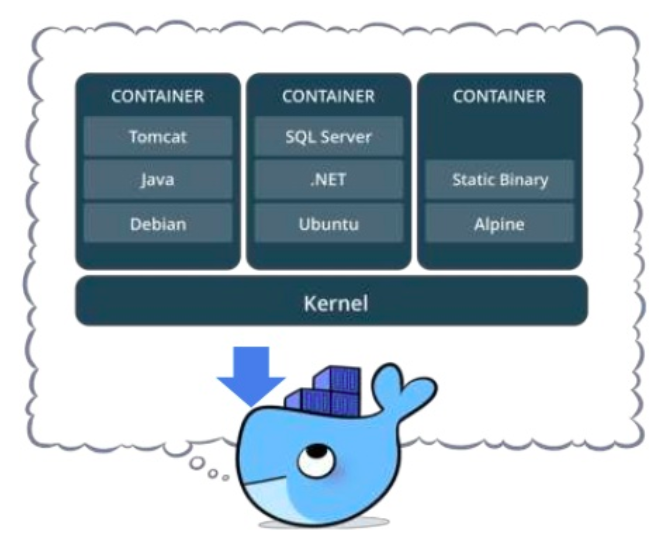
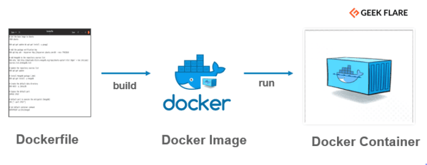

# 1. Docker – Introduction à la conteneurisation 🐳

!!! info "source du cours"

    - cours créé par valentin Brosseau sous MIT License, Lycée Chevrollier Angers
    - Formation devops 2021 par Arthur POIGNONNEC
    

!!! info "🎯 Objectifs pédagogiques"

    - Comprendre le principe de **conteneurisation**
    - Distinguer **image**, **conteneur** et **Dockerfile**
    - Manipuler les **commandes Docker de base**
    - Déployer une application simple avec **Docker Compose**
    - Identifier les usages concrets en environnement professionnel

## 1. Problématique : “ça marche sur ma machine” 📌

Dans un projet classique, une application dépend de :

- versions de langages (PHP, Python…)
- bibliothèques
- serveur web
- base de données
- configuration système

👉 Cela entraîne des écarts entre :

- poste développeur
- environnement de test
- production

<iframe width="560" height="315" src="https://www.youtube.com/embed/mspEJzb8LC4?si=1bOfGHGU45GiQgo7" title="YouTube video player" frameborder="0" allow="accelerometer; autoplay; clipboard-write; encrypted-media; gyroscope; picture-in-picture; web-share" referrerpolicy="strict-origin-when-cross-origin" allowfullscreen></iframe>

## 2. Principe de Docker 💡

Docker permet d’exécuter une application dans un environnement **isolé et reproductible**.

#### 🧱 Illustration du concept

{: .center width=50%}
👉 Chaque conteneur est indépendant, mais partage le noyau du système.

## 3. Définitions essentielles 📖 

|Vocabulaire|Description|
|:--|:--|
|**Docker** 🧾|Plateforme permettant de créer et exécuter des conteneurs|
|**Image** 📦|Modèle en lecture seule contenant : le code, les dépendances, la configuration|
|**Conteneur** ▶️|Instance d’une image en cours d’exécution|
|**Dockerfile** 🧪|Fichier décrivant les étapes de construction d’une image|
|**Engine**| Ce qui fait fonctionner votre « container ». Les volumes et le réseau font partie de « l’engine »|
|**Registry**| Entrepôt d’image à télécharger (fourni par d’autres, ou construite par vous). https://hub.docker.com|
|**Volume**| les « montages » / ressources, emplacement (réseau ou non) disponible dans votre Container|

## 4. Docker vs Machine virtuelle ⚖️

| Critère            | Machine virtuelle        | Conteneur Docker        |
|--------------------|--------------------------|--------------------------|
| OS complet         | Oui                      | Non                      |
| Démarrage          | Lent                     | Rapide                   |
| Consommation       | Élevée                   | Faible                   |
| Isolation          | Forte                    | Processus                |

Les limitations des machines virtuelles :

- Des ressources allouées pour chaque machine (CPU, Disque, Ram)
- Un OS complet sur chaque machine (virtuelle)
- Plus il y a de machines plus il faut de puissance (ressources perdues)
- Ressources perdues par… des parties de l’OS virtualisées pour rien

Un conteneur c’est…

- Un moyen standardiser de packager l’application
- Un moyen d’isoler les applications entres elles
- Un partage du noyau avec la machine physique

{: .center width=80%}

!!! info "Docker c’est "
    Pour résumer Docker c’est :

    - Un projet open source qui a pour but d’automatiser le déploiement d’applications dans un « container »
    - Le container une sorte « d’archive » qui contient tout ce qu’il faut pour faire fonctionner un logiciel : Code, Librairies pour l’exécution, outils système, et librairies système. (autonome)
    - Ça garantit que le code fonctionnera toujours de la même façon, quel que soit l’environnement.

## 5. Image VS conteneur

{: .center width=80%}

Il est très important de bien saisir la nuance entre une image et un conteneur, car ce sont les deux notions clés dans l’utilisation de Docker. On dit qu’un conteneur est lancé en exécutant une image. Mais alors qu’est-ce qu’une **image** ?

Une image est un package qui contient toutes les définitions nécessaires à l’exécution d’une application, à savoir :

- Le code
- L’exécution
- Les variables d’environnements
- Les bibliothèques
- Les fichiers de configuration

Une image est un **modèle** composé de plusieurs couches, contenant notamment notre application ainsi que les fichiers binaires et les bibliothèques requises. Une fois qu’elle est instanciée, une image devient un conteneur.

## 6. Dockerfile

{: .center width=80%}

La création d’image avec Docker est réalisée par le biais de la rédaction d’un fichier nommé DockerFile qui a pour objet de définir les propriétés des conteneurs qui seront créés grâce à lui. Ces propriétés sont définies par le biais d’instructions dans le fichier qui vont définir les propriétés du futur conteneur.

??? info "les plus utilisées"
    - FROM : Définit l’image de base du conteneur. Cela permet par exemple d’hériter de configuration déjà réalisées dans une image. Souvent on part d’une simple image basée sur un système d’exploitation.
    - LABEL : Permet d’associer des métadonnées à l’image, fonctionnant avec un système de clés-valeurs
    - ARG : Définition de variables temporaires qui seront utilisées au sein du DockerFile
    - ENV : Variables d’environnement utilisées dans le DockerFile et dans le conteneur.
    - RUN : Permet d’exécuter des commandes Linux ou Windows lors de la création de l’image.
    - COPY : Permet de copier des fichiers depuis la machine hôte vers le conteneur docker
    - ENTRYPOINT : Permet de définir la ou les commandes qui serviront de point d’entrée au conteneur, autrement dit qui seront exécuté à son démarrage.
    - EXPOSE : Permet d’exposer un port du conteneur
    - VOLUMES : Permet de créer un point de montage qui donnera la possibilité de persister les données hors du conteneur (Notion détaillée en partie 8)

Une fois toutes les instructions consignées au sein du fichier **DockerFile**, il ne reste plus qu’à construite l’image puis à l’exécuter pour ainsi créer un nouveau conteneur. 

Exemple de Dockerfile :

```bash
FROM python:3.13
WORKDIR /app
COPY requirements.txt .
RUN pip install -r requirements.txt
COPY . .
CMD ["python", "app.py"]
```

🔍 Explication

* `FROM` : image de base
* `WORKDIR` : dossier de travail
* `COPY` : copie des fichiers
* `RUN` : exécution à la construction
* `CMD` : commande au démarrage

## 7. Persistance des données : volumes 🗄️

L’une des choses à retenir est que les données d’un conteneur sont éphémères et sans action de votre part elle n’existe que tant que le conteneur n’est pas supprimé. Or il est très souvent nécessaire de sauvegarder nos données, pour cela on utilise les volumes.

Sans volume :

```
[ Conteneur supprimé ] → ❌ Données perdues
```

Avec volume :

```
[ Conteneur ] → [ Volume Docker ] → 💾 Données conservées
```

## 8. Réseaux Docker 🌐

Pour que les conteneurs Docker puissent communiquer entre eux mais également avec l’extérieur via la machine hôte, il est nécessaire d’utiliser une couche réseau. Cela a pour objectif de permettre l’isolation des conteneurs entre eux, et ce dans l’optique d’accroitre la sécurité des applications hébergées par Docker.

Les conteneurs peuvent communiquer entre eux :

```
[ web ]  ←→  [ db ]
```

👉 Utilisation fréquente dans les architectures web.

---

## 9. Docker Compose ⚙️

Docker Compose est un outil qui permet de définir le paramétrage d’un ensemble de conteneurs, pour par exemple exécuter des applications à conteneurs multiples. C’est grâce à un fichier au format YAML et à une seule commande que l’on va pouvoir figer une configuration et l’exécuter.

Ce fichier va nous permettre de définir un ensemble de conteneurs, nommés services par Docker Compose, ainsi que tout le nécessaire pour leur fonctionnement à savoir les volumes et les réseaux. Voici un exemple de fichier Docker Compose permettant de gérer plusieurs conteneurs avec un seul fichier. :

#### 📄 Exemple

```yaml
services:
  web:
    build: .
    ports:
      - "8000:8000"

  db:
    image: mysql:8
    environment:
      MYSQL_ROOT_PASSWORD: root
    volumes:
      - db_data:/var/lib/mysql

volumes:
  db_data:
```

#### ▶️ Commandes associées

```bash
docker compose up
docker compose down
docker compose ps
```

## 10. Cas d’usage concrets 🧠

* Application **Laravel + MySQL**
* API **Python + PostgreSQL**
* Environnement de test reproductible
* CI/CD

## 11 Bonnes pratiques ⚠️
 
* Utiliser des images officielles (docker Hub)
* Limiter la taille des images
* Ne pas stocker de données en dur dans le conteneur
* Utiliser des volumes
* Séparer les services (web / db)

## 12. Limites 🚨

* Pas une solution de sécurité en soi
* Complexité croissante avec le nombre de conteneurs
* Nécessite une bonne organisation

## 🧾 13. Synthèse

| Élément    | Rôle          |
| ---------- | ------------- |
| Docker     | Plateforme    |
| Image      | Modèle        |
| Conteneur  | Exécution     |
| Dockerfile | Recette       |
| Volume     | Persistance   |
| Compose    | Orchestration |

!!! question "📝 QCM rapide"

    🔎 **Question 1** : Une image Docker est :
    
    * A. un conteneur en cours d'exécution
    * B. un modèle figé en lecture seule
    * C. une machine virtuelle

    ??? question "Solution Question n°1"
        B. un modèle figé en lecture seule

    🔎 **Question 2** : Un conteneur permet :
    
    * A. d’isoler une application
    * B. de virtualiser un OS complet
    * C. de remplacer Linux

    ??? question "Solution Question n°2"
        A. d’isoler une application

    🔎 **Question 3** : Docker Compose sert à :
    
    * A. créer une image
    * B. gérer plusieurs conteneurs
    * C. compiler du code

    ??? question "Solution Question n°3"
        B. gérer plusieurs conteneurs
