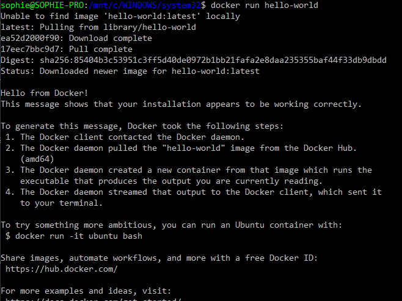
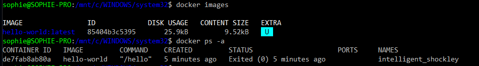
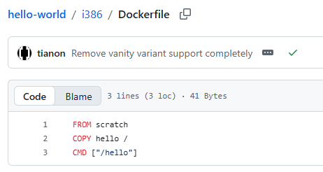
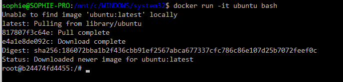

# 2. TP Docker Windows 🔧

!!! info "Crédit du TP"
    TP créé par Valentin Brosseau sous MIT License, Lycée Chevrollier Angers. Modifié et complété.

Dans ce TP nous allons voir l'installation de Docker et les premiers exemples d'utilisations de votre nouvel environnement.

??? danger "Prérequis — WSL2 🧱"

    Docker Desktop sous Windows repose sur **WSL2** (Windows Subsystem for Linux 2).
    WSL2 est obligatoire sur **Windows 11 Famille** (pas de Hyper-V disponible) et recommandé sur toutes les éditions.

    ### Vérifier votre édition Windows 🔍

    ```powershell
    (Get-WmiObject Win32_OperatingSystem).Caption
    ```

    | Édition | Backend disponible |
    |---|---|
    | Windows 11 Famille | WSL2 uniquement |
    | Windows 11 Pro / Education / Enterprise | WSL2 (recommandé) ou Hyper-V |

    ### Installer WSL2 ⚙️

    Si WSL2 n'est pas encore installé, lancez **PowerShell en administrateur** :

    ```powershell
    wsl --install
    ```

    Cette commande installe automatiquement WSL2 et Ubuntu. Un **redémarrage** est nécessaire ensuite.

    Une fois redémarré, vérifiez que WSL2 est bien actif :

    ```powershell
    wsl --status
    ```

    Vous devez voir `Version par défaut : 2`. Si ce n'est pas le cas :

    ```powershell
    wsl --set-default-version 2
    ```

    !!! tip "WSL2 déjà installé ? ✅"
        Si vous aviez déjà WSL, vérifiez simplement que vous êtes bien en version 2 avec `wsl --status` avant de continuer.

## 1. Installation de Docker sous Windows 💿

Pour installer Docker rien de plus simple, il suffit d'utiliser l'installeur officiel en le téléchargeant sur [le site de Docker.](https://www.docker.com/docker-windows)

### 1.1 Lancer Docker 🚀

Lancer Docker en tant qu'administrateur (et autoriser Hyper-V si celui-ci vous le demande).

!!! warning "Quel terminal utiliser ? 🖥️"
    Dans ce TP, les commandes sont à saisir dans un terminal. Sous Windows, plusieurs options existent :

    - **PowerShell** (recommandé) — intégré à Windows, supporte la plupart des commandes Unix-like
    - **CMD (Invite de commandes)** — l'ancien terminal Windows, certaines commandes diffèrent (ex : `%cd%` au lieu de `$(pwd)`)
    - **Git Bash / WSL2** — si installé, se comporte comme un terminal Linux
 
    💡 Les commandes de ce TP sont écrites pour **PowerShell** sauf mention contraire. Si vous utilisez CMD, les variantes sont précisées.

### 1.2 Quota et utilisation 🔑

Dans nos différents tests, nous allons utiliser le registry Docker officiel (Docker Hub). Depuis 2023, Docker Hub applique des **quotas stricts** pour les utilisateurs non authentifiés (100 pulls/6h par IP) et limite également les utilisateurs gratuits authentifiés. En établissement scolaire, où de nombreux postes partagent la même adresse IP publique, ces limites sont vite atteintes.

Il est donc **obligatoire** de créer un compte Docker et de vous authentifier avant de commencer les exercices. Pour cela, créez un compte sur [hub.docker.com](https://hub.docker.com) puis lancez :

```bash
docker login
```

Il vous sera demandé de saisir votre identifiant et votre mot de passe Docker Hub. Une fois authentifié, vous bénéficiez d'une limite bien plus élevée. Noter au passage le Username de docker.

### 1.3 Premier test 🧑‍💻

Maintenant qu'il est installé sur votre poste, rien de plus simple. Dans une console, entrez la commande suivante :

```bash
docker version
```

Vous devez voir la version de Docker, avec deux sections : **Client** et **Server** (le daemon Docker).

- Que constatez-vous ? Pourquoi y a-t-il deux sections ?
- Pourquoi est-ce important d'utiliser une version récente ?

??? success "Éléments de correction 🎓"
    **Que constatez-vous ? Pourquoi y a-t-il deux sections ?**

    Docker fonctionne en architecture **client/serveur** :

    - La section **Client** correspond à l'outil en ligne de commande (`docker`) qui envoie les instructions.
    - La section **Server** correspond au **daemon Docker** (`dockerd`) qui tourne en arrière-plan et exécute réellement les conteneurs.

    Les deux peuvent avoir des versions différentes et tourner sur des machines différentes (ex : client local, serveur distant). C'est ce qui permet par exemple de piloter un serveur Docker distant depuis son poste.

    ---

    **Pourquoi est-ce important d'utiliser une version récente ?**

    - **Sécurité** — les versions anciennes peuvent contenir des failles connues et exploitables (notamment des failles d'isolation conteneur/hôte).
    - **Compatibilité** — les images récentes du Docker Hub peuvent nécessiter des fonctionnalités absentes des vieilles versions.
    - **Stabilité** — les bugs sont corrigés au fil des versions.
    - **Nouvelles fonctionnalités** — Docker évolue vite (Docker Compose intégré, BuildKit, etc.).

#### Explorer l'état de Docker 🔍

Avant d'aller plus loin, prenez l'habitude d'utiliser ces deux commandes essentielles :

```bash
docker images      # Liste toutes les images téléchargées localement
docker ps -a       # Liste tous les conteneurs (actifs ET arrêtés)
```

Pour l'instant tout est vide, mais revenez-y après chaque exercice pour observer ce qui change !

### 1.4 Second test 🌍

Maintenant que nous savons que Docker est correctement installé, testons avec une « machine » fournie par Docker. L'image se nomme `hello-world`, celle-ci ne fait qu'afficher un message de bienvenue. De nouveau, dans la console, entrez la commande suivante :

```bash
docker run hello-world
```

▶️ Que constatez-vous ?

{: .center width=80%}

▶️ Comment être certain que l'image n'a rien fait d'anormal sur notre machine ?

??? success "Éléments de correction 🎓"
    **Comment être certain que l'image n'a rien fait d'anormal sur notre machine ?**

    Plusieurs approches complémentaires :

    - **Vérifier les sources** — l'image `hello-world` est une image **officielle Docker** publiée directement par Docker Inc. sur le Docker Hub. Les images officielles sont auditées et maintenues.
    - **Consulter le Dockerfile** — le code source de l'image est public sur Github. On peut vérifier qu'elle ne fait qu'exécuter un simple binaire qui affiche un message.
    - **Observer le réseau** — un conteneur aussi simple n'a aucune raison d'ouvrir des connexions réseau. On peut le vérifier avec `docker inspect hello-world`.
    - **Isolation** — par défaut, un conteneur Docker est **isolé** du système hôte. Il n'a accès ni aux fichiers, ni aux processus, ni au réseau de la machine hôte sauf si on le lui autorise explicitement (volumes, ports, etc.).

    💡 En entreprise, on ne fait **jamais** confiance à une image inconnue sans avoir vérifié son Dockerfile et son éditeur.

Après ce test, relancez `docker images` et `docker ps -a`. Que voyez-vous de nouveau ?

{: .center width=80%}

### 1.5 Les sources de l'image hello-world 📦

Maintenant que nous avons lancé notre première « vraie » machine, intéressons-nous à son fonctionnement. Vous avez dû constater le terme « Pulling From » : c'est l'image (ou les morceaux d'image) utiles au fonctionnement de votre service. Celle-ci est téléchargée directement depuis le « Docker Hub » (il est également possible d'avoir un Hub privé). Vous pouvez voir « les sources » de l'image en question : [ici](https://github.com/docker-library/hello-world), comme beaucoup de projets libres l'image est disponible sur Github.

Surprise ! On retrouve des plateformes (amd64, i686, armXX). Et c'est normal, Docker est multiplateforme et dans le cas de notre exemple l'exécutable « hello » est codé en C, il est donc logique de retrouver l'exécutable pour les différentes plateformes où l'image doit fonctionner.

Maintenant que nous avons vu le projet, entrons plus en détail, allons voir la définition de notre image : le [fichier Dockerfile.](https://github.com/docker-library/hello-world/blob/master/i386/Dockerfile)

{: .center width=80%}

Peu d'informations, 3 lignes :

- `FROM scratch` (Image de base vide, la plus minimale possible).
- `COPY hello /` (ajoute le fichier hello à la racine de votre « machine »).
- `CMD ["/hello"]` (Commande lancée au démarrage de votre image).

note :  On créera un DockerFile dans le TP suivant.

## 2. Pour aller plus loin ▶️

### 2.1 Ubuntu 🐧

Bon, un texte à l'écran c'est bien… Mais si on lançait un système entier ? Ubuntu par exemple. Pour ça rien de plus simple, dans la console lancer :

```bash
docker run -it ubuntu bash
```

{: .center width=80%}

Et voilà, vous avez un Linux complètement opérationnel en quelques minutes sur votre poste Windows. Pratique ! Même si ce n'est pas vraiment le but premier de Docker, c'est cool.

Utilisez un peu le shell de votre « nouveau Linux », exemples de commandes :

- `uname -a` : Affiche la version du noyau.
- `whoami` : Qui suis-je ? (normalement root, d'ailleurs est-ce normal ?)
- `top` : Affiche les processus en cours.
- `ls /`

Questions :

- Pourquoi `top` ne retourne-t-il que deux processus ?
- Aucune trace des fichiers de votre machine… Normal, de base rien n'est accessible.

??? success "Éléments de correction 🎓"
    **Pourquoi `top` ne retourne-t-il que deux processus ?**

    Car le conteneur est **isolé** du système hôte grâce aux **namespaces Linux**. Il ne voit que ses propres processus :

    - `bash` — le shell lancé au démarrage du conteneur
    - `top` — la commande elle-même

    Sur la machine hôte, des dizaines de processus tournent en parallèle, mais le conteneur n'y a pas accès. C'est l'un des principes fondamentaux de Docker : **chaque conteneur a sa propre vision isolée du système**.

    ---

    **Aucune trace des fichiers de votre machine… pourquoi ?**

    Car le conteneur possède son **propre système de fichiers**, complètement séparé de celui de la machine hôte. Il est construit à partir de l'image Ubuntu et ne contient que ce que cette image embarque.

    Pour qu'un conteneur puisse accéder aux fichiers de la machine hôte, il faut **explicitement** lui monter un volume avec l'option `-v` — ce que nous verrons juste après.

    💡 C'est une fonctionnalité de sécurité importante : un conteneur compromis ne peut pas accéder aux fichiers de l'hôte par défaut.

### 2.2 Créer un fichier dans la machine 📝

Créer un fichier vide avec la commande :

```bash
touch fichier_test
```

Vérifier avec un `ls` que le fichier est bien présent. Vous pouvez quitter l'image en saisissant `exit` dans le terminal. Relancer de nouveau l'image avec la commande :

```bash
docker run -it ubuntu bash
```

Faites à nouveau un `ls`, que constatez-vous ? Et bien oui, le fichier n'est plus présent… C'est normal, tous les fichiers créés dans le conteneur sont **non persistants** (c'est-à-dire qu'ils sont supprimés à chaque fois que le conteneur s'arrête).

!!! info "Image vs Conteneur 🗂️"
    Faites bien la distinction :

    - Une **image** est un modèle figé, en lecture seule (comme un template).
    - Un **conteneur** est une instance en cours d'exécution de cette image. Chaque `docker run` crée un **nouveau** conteneur qui repart de l'image de base.
 
    Vérifiez-le : `docker ps -a` vous montrera que chaque `docker run` a créé un conteneur distinct, tous arrêtés.

### 2.3 Avoir accès aux fichiers de votre machine 💾

Bon, c'est bien, mais si l'on donnait accès à un stockage persistant à notre image. Sur votre machine le stockage persistant c'est votre disque dur (HDD, SSD, etc.). Avec Docker (comme sous Linux d'ailleurs) on parle de **monter « un volume »** — une fois monté, ce volume sera accessible comme un dossier (ou un fichier, on y reviendra).

#### 2.3.1 Monter un dossier 📁

Pour monter un volume il suffit d'ajouter un `-v` à la commande de lancement, exemple pour avoir le dossier courant :

⚠️⚠️ **Attention !** L'accès est en lecture ET en écriture sur **VOTRE MACHINE** donc attention.

Sous Windows (PowerShell) :

```powershell
docker run -v ${PWD}:/mnt/ -it ubuntu bash
```

Lancez la commande, puis `ls /mnt` — vous devriez voir les fichiers de votre dossier courant.

#### 2.3.2 Monter un fichier 📄

Avec Docker il est possible de rendre accessible non seulement un dossier, mais également un fichier précis. Pour les fichiers la commande est la même sauf qu'au lieu de spécifier un dossier on spécifie le chemin d'un fichier. Exemple :

Windows (PowerShell) :

```powershell
docker run -v ${PWD}/mon_fichier:/mnt/mon_fichier -it ubuntu bash
```

Le fichier est maintenant accessible dans votre conteneur Docker. Il est également possible de limiter l'accès à votre fichier en le montant en **lecture seule** (`:ro`) :

```bash
docker run -v $(pwd)/mon_fichier:/mnt/mon_fichier:ro -it ubuntu bash
```

Et c'est là que l'on voit la puissance : il sera possible par la suite de créer de vraies « stacks » applicatives qui définiront l'ensemble des paramètres de notre environnement (cloisonné) et géreront finement les droits d'accès à la configuration. Un régal !

### 2.4 Exercice — Volume partagé bidirectionnel 🧪

Cet exercice vous permet d'observer concrètement comment un volume partagé crée un **lien en temps réel** entre votre machine hôte et le conteneur.

**Étape 1 — Préparer un dossier de travail** 🗂️

Créez un dossier `tp_volume` sur votre machine à la racine de votre ``C:``, puis placez-vous dedans (Vous n'avez pas les droits en écriture dans ``C:\Windows\System32``):

```powershell
mkdir tp_volume
cd tp_volume
```

**Étape 2 — Lancer un conteneur Ubuntu avec ce dossier monté** 🐳

```powershell
docker run -v ${PWD}:/mnt/partage -it ubuntu bash
```

**Étape 3 — Créer un fichier depuis le conteneur** ✍️

Dans le shell Ubuntu du conteneur :

```bash
echo "Cree depuis le conteneur Docker" > /mnt/partage/depuis_docker.txt
ls /mnt/partage
```

**Étape 4 — Vérifier depuis votre machine hôte** 👀

Ouvrez un autre terminal (sans quitter le conteneur) et vérifiez que le fichier est bien présent dans `tp_volume/` :

```powershell
ls
cat depuis_docker.txt
```

✅ Le fichier créé **dans** le conteneur est visible **sur votre machine**.

**Étape 5 — Modifier le fichier depuis la machine hôte** 🖊️

Depuis votre machine, ajoutez une ligne au fichier :

```powershell
Add-Content depuis_docker.txt "Modifie depuis Windows !"
```

**Étape 6 — Vérifier la modification depuis le conteneur** 🔄

Retournez dans le terminal du conteneur et lisez le fichier :

```bash
cat /mnt/partage/depuis_docker.txt
```

✅ La modification faite sur la machine hôte est **immédiatement visible** dans le conteneur.

**Questions :** 🤔

- Que se passe-t-il si vous quittez le conteneur (`exit`) et le relancez avec le même `-v` ? Le fichier est-il toujours là ?
- Quelle est la différence avec le `touch fichier_test` réalisé précédemment (sans volume) ?
- Dans quel cas concret d'un projet web ce mécanisme serait-il utile ?

??? success "Éléments de correction 🎓"
    **Que se passe-t-il si vous quittez le conteneur et le relancez avec le même `-v` ? Le fichier est-il toujours là ?**

    Oui, le fichier est **toujours présent** ! Car il est stocké physiquement sur la **machine hôte** dans le dossier `tp_volume/`, pas dans le conteneur. Le conteneur peut être arrêté, supprimé, recréé — le fichier persiste tant qu'il n'est pas supprimé de la machine hôte.

    ---

    **Quelle est la différence avec le `touch fichier_test` réalisé précédemment (sans volume) ?**

    | | Sans volume | Avec volume `-v` |
    |---|---|---|
    | Stockage | Dans le conteneur | Sur la machine hôte |
    | Persistance | ❌ Perdu à l'arrêt | ✅ Permanent |
    | Accessible depuis l'hôte | ❌ Non | ✅ Oui |
    | Partageable entre conteneurs | ❌ Non | ✅ Oui |

    ---

    **Dans quel cas concret d'un projet web ce mécanisme serait-il utile ?**

    De nombreux cas d'usage concrets :

    - **Développement PHP/Laravel** — monter son code source local dans le conteneur Apache/Nginx pour voir les modifications en temps réel sans reconstruire l'image.
    - **Base de données** — monter un dossier pour persister les données MySQL/PostgreSQL entre les redémarrages du conteneur.
    - **Fichiers de configuration** — monter un fichier `nginx.conf` ou `php.ini` pour personnaliser le comportement du serveur sans modifier l'image.
    - **Logs** — monter un dossier de logs pour les consulter facilement depuis la machine hôte.

    💡 En développement web, c'est le mécanisme qui permet de **coder sur sa machine** tout en **exécutant dans Docker** — le meilleur des deux mondes !

## 3. Utiliser Docker pour développer 🛠️

Docker est un outil intéressant pour développer, il permet de créer des environnements de développement isolés et facilement reproductibles. Vous pouvez avec Docker packager une application avec toutes ses dépendances pour la faire fonctionner sur n'importe quel système d'exploitation. Pour vous donner envie d'utiliser Docker, nous allons tester des exemples concrets.

### 3.1 Youtube-dl 🎵

`yt-dlp` est un outil en ligne de commande permettant de télécharger des vidéos sur Youtube et d'autres sites de streaming. Il est disponible sous forme de conteneur Docker, ce qui vous permet de l'utiliser sans avoir à l'installer sur votre système.

```bash
alias ytdl='docker run --rm -v "$(pwd):/downloads" -it jauderho/yt-dlp:latest -x --audio-format mp3 --audio-quality 0 --embed-metadata'
```

Qu'avons-nous ici ?

- `alias ytdl=` : Crée un alias pour la commande, ce qui vous permet de l'utiliser plus facilement. (C'est une commande shell, pas une commande Docker).
- `docker run` : Lance un conteneur Docker.
- `--rm` : Supprime le conteneur après son utilisation.
- `-v "$(pwd):/downloads"` : Monte le répertoire courant dans le conteneur à l'emplacement `/downloads`. Cela vous permet de télécharger des fichiers directement dans votre répertoire de travail.
- `-it` : Lance le conteneur en mode interactif.
- `jauderho/yt-dlp:latest` : Spécifie l'image Docker à utiliser.
- `-x --audio-format mp3 --audio-quality 0 --embed-metadata` : Options passées à `yt-dlp` pour télécharger la piste audio en MP3 avec la meilleure qualité et les métadonnées intégrées.

Si vous souhaitez télécharger une vidéo au format MP3, il vous suffit de lancer :

```bash
ytdl https://www.youtube.com/watch?v=dQw4w9WgXcQ
```

!!! note "Légalité et usage ⚖️"
    `yt-dlp` peut être utilisé pour télécharger des contenus libres de droits ou dont vous êtes l'auteur. En environnement scolaire, limitez l'usage à des vidéos Creative Commons ou de démonstration technique. Télécharger des contenus protégés sans autorisation de l'ayant droit peut constituer une infraction au droit d'auteur.

### 3.2 Autres exemples 🎶

!!! warning "Exemple à vocation pédagogique uniquement ⚠️"
    L'exemple suivant (SpotDL) illustre la puissance de Docker pour packager des outils complexes. Il est présenté **à titre de démonstration technique**. Le téléchargement de musique protégée par le droit d'auteur sans autorisation est illégal. En établissement scolaire, vérifiez la politique de votre réseau avant de l'utiliser.

Spotdl est un outil permettant de rechercher et télécharger des chansons à partir de leurs métadonnées Spotify. Il est disponible sous forme de conteneur Docker.

```bash
alias spotdl='docker run --rm -v "$(pwd):/music" spotdl/spotify-downloader --audio {youtube,youtube-music,soundcloud,piped} --output "{artist}/{album}/{track-number} - {title}.{output-ext}" download'
```

Qu'avons-nous ici ?

- `alias spotdl=` : Crée un alias pour la commande.
- `docker run` : Lance un conteneur Docker.
- `--rm` : Supprime le conteneur après son utilisation.
- `-v "$(pwd):/music"` : Monte le répertoire courant dans `/music` dans le conteneur.
- `spotdl/spotify-downloader` : L'image Docker utilisée.
- `--audio {youtube,youtube-music,soundcloud,piped}` : Sources audio à interroger.
- `--output "..."` : Format de nommage des fichiers téléchargés.
- `download` : Indique l'action à effectuer.

Ce qui est intéressant ici d'un point de vue Docker, c'est que l'outil SpotDL et toutes ses dépendances Python sont encapsulées dans l'image — **rien n'est installé sur votre machine hôte**.

<!--Appel : spotdl https://open.spotify.com/intl-fr/track/4PTG3Z6ehGkBFwjybzWkR8-->

!!! info "Allons plus loin 🏁"

    Nous avons ici des petites machines pour jouer… C'est rigolo… Mais Docker est bien plus puissant que ça. [La suite c'est par ici](./3_TP_wordpress.md)