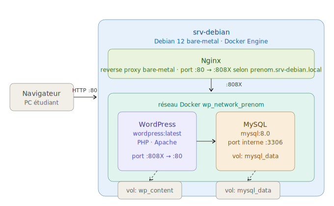
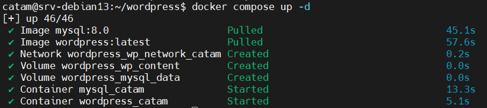
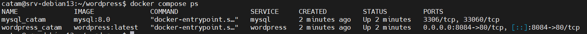

# 3. TP Docker WordPress 🐳

Projet : déploiement WordPress avec Docker sur `srv-debian`

!!! success "🎯 Objectifs du TP"

    - Se connecter à un serveur Linux distant via **SSH**
    - Comprendre la structure d'un **docker-compose.yml** fourni
    - Démarrer une stack **WordPress + MySQL** avec Docker Compose 
    - Accéder à son WordPress via un **vhost** personnalisé
    - Manipuler les **commandes Docker de base** sur un vrai serveur

!!! info "Vue d'ensemble 🗺️"

    Chaque étudiant dispose d'un compte sur le serveur `srv-debian`.  
    Son espace de travail est **isolé** : ses conteneurs, son réseau Docker, son port, son URL.

    | 👤 Étudiant  | 🌐 URL d'accès                        |
    |:    -|:  --|
    | elouan        | http://elouan.srv-debian.local        |
    | alexandre     | http://alexandre.srv-debian.local     |
    | mael          | http://mael.srv-debian.local          |

    On peut illustrer la stack déployée dans ce TP à l'aide du schéma ci dessous :
    
    {: .center width=80%}

!!! warning "Avant de commencer"
    Votre poste doit connaître l'adresse de `srv-debian.local` (`192.168.0.119`).  
    Il faudra l'ajouter dans votre fichier `hosts` (étape 0 ci-dessous).

## Nginx 🔀

**Nginx** (prononcé *"engine-x"*) est un logiciel open source qui joue plusieurs rôles selon la configuration :

- **Serveur web** — sert directement les fichiers statiques (HTML, CSS, JS, images) sans passer par PHP
- **Reverse proxy** — reçoit les requêtes HTTP et les transmet à une application backend (PHP-FPM, Node.js, Flask…)
- **Load balancer** — répartit le trafic entre plusieurs instances d'une même application
- **Cache** — mémorise les réponses pour accélérer les requêtes répétées

### L'analogie du switch Layer 7 🔌

Imaginez Nginx comme un **switch réseau intelligent qui opère au niveau applicatif (couche 7 du modèle OSI)** — il ne se contente pas de router des paquets IP, il lit le contenu HTTP (URL, en-têtes, nom de domaine) pour décider où envoyer la requête.

| Concept Nginx | Analogie réseau | Exemple concret |
|---|---|---|
| `server {}` | Un port d'écoute du switch | `listen 80; server_name api.example.com;` |
| `location {}` | Une règle de routage sur ce port | `location /api { }` → backend API |
| `proxy_pass` | La règle de forwarding | Requête transmise vers `http://app:9000` |
| `root` | Servir depuis le cache local | Sert directement les fichiers HTML/CSS |

Nginx **reçoit** les requêtes, les **route** selon les règles, et les **forward** vers le bon backend ou les sert directement depuis le disque.

### Dans ce cours — deux niveaux de Nginx 🏗️

!!! info "Nginx à deux endroits"
    Dans notre architecture, Nginx intervient à **deux niveaux distincts** :

    **1. Nginx bare-metal sur `srv-debian`** — installé directement sur le serveur, hors Docker.
    Il écoute sur le port 80 et fait du reverse proxy vers les conteneurs selon le sous-domaine
    (`elouan.srv-debian.local` → port 8081). Un seul Nginx gère **tous les projets** du serveur.

    **2. Nginx dans le conteneur** — à l'intérieur de la stack Docker Todo, un conteneur Nginx
    dédié reçoit les requêtes forwardées par Nginx bare-metal et les distribue : il sert les assets
    Vite directement (sans PHP), et transmet les requêtes `.php` à php-fpm via FastCGI.

    {: .center width=80%}

??? question "Pourquoi deux Nginx et pas un seul ?"
    Le Nginx bare-metal est le **point d'entrée unique** du serveur — il sait vers quel projet
    router selon le nom de domaine. Le Nginx conteneur est **interne à la stack Todo** — il
    optimise la livraison des assets sans toucher à php-fpm. Ce sont deux responsabilités
    différentes : routage inter-projets d'un côté, optimisation intra-application de l'autre.

## 0. Configurer le DNS local sur votre PC Windows 🖥️

Pour que votre navigateur comprenne ` prenom.srv-debian.local`, il faut déclarer
l'adresse IP du serveur dans le fichier `hosts` de Windows.

**Ouvrir le fichier hosts en administrateur :**

1. Tapez `Notepad` dans le menu Démarrer
2. Clic droit → **"Exécuter en tant qu'administrateur"**
3. Ouvrir le fichier : `C:\Windows\System32\drivers\etc\hosts`
4. Ajouter la ligne suivante **tout en bas** `192.168.0.119    prenom.srv-debian.local`
5. Sauvegarder (`Ctrl+S`)

??? question "Comment tester que ça fonctionne ?"
    Ouvrez un **PowerShell** et tapez :
    ```powershell
    ping  prenom.srv-debian.local
    ```
    Vous devez voir l'IP du serveur répondre.  
    Si ce n'est pas le cas, vérifiez que vous avez bien sauvegardé en **administrateur**.

## 1. Se connecter au serveur en SSH 🔐

!!! info "C'est quoi SSH ?"
    **SSH** (Secure Shell) permet de contrôler un serveur Linux **à distance**,
    via un terminal chiffré. C'est l'outil quotidien de tout administrateur système.

Ouvrez **PowerShell** (ou Windows Terminal) sur votre PC et tapez :

```powershell
ssh -p 2222 prenom@192.168.0.119
```
Il vous sera demandé un mot de passe. **Le mot de passe initial est votre prénom.**

??? question "C'est normal d'avoir ce message ?"
    ```
    The authenticity of host 'srv-debian.local' can't be established.
    Are you sure you want to continue connecting (yes/no)?
    ```
    **Oui, c'est normal** la première fois. Tapez `yes` et appuyez sur Entrée.  
    SSH mémorise l'empreinte du serveur pour les connexions suivantes.

### 🔑 Changer son mot de passe (obligatoire)

Une fois connecté, changez immédiatement votre mot de passe :

```bash
passwd
```

Suivez les instructions : ancien mot de passe (votre prénom), puis nouveau mot de passe x2.

## 2. Découvrir son espace de travail 📁

Une fois connecté, vous êtes dans votre dossier personnel (`/home/VOTRE_PRENOM`).  
Le professeur a pré-créé votre dossier projet. Explorons-le :

```bash
# Savoir où on est
pwd
```

```bash
# Lister les fichiers de son dossier home
ls -la
```

```bash
# Entrer dans le dossier wordpress
cd wordpress
```

```bash
# Voir son contenu
ls -la
```

Vous devriez voir deux fichiers :

```
docker-compose.yml   ← la configuration de votre stack
README.md            ← vos infos personnalisées
```

Affichez le contenu de votre `docker-compose.yml` :

```bash
cat docker-compose.yml
```

!!! question "📝 Questions de compréhension"
    Lisez attentivement le fichier `docker-compose.yml` et répondez :
    
    1. Combien de **services** (conteneurs) sont définis ?
    2. Quel **port** de votre machine est associé au port 80 de WordPress ?
    3. Comment s'appelle le **réseau** Docker de votre stack ?
    4. Combien de **volumes** sont définis ? À quoi servent-ils ?

??? question "Correction"
    1. **2 services** : `wordpress` et `mysql`
    2. Le port **808X** selon votre prénom
    3. Le réseau s'appelle `wp_network_VOTRE_PRENOM`
    4. **2 volumes** : `wp_content` (fichiers WordPress) et `mysql_data` (données de la BDD)

## 3. Démarrer la stack WordPress 🚀

Assurez-vous d'être dans le bon dossier :

```bash
cd ~/wordpress
```

Démarrez tous les conteneurs **en arrière-plan** (`-d` = detached) :

```bash
docker compose up -d
```

Docker va télécharger les images `wordpress:latest` et `mysql:8.0` si elles ne sont
pas encore présentes. **La première fois, cela peut prendre 2 à 3 minutes.**

Vous verrez défiler des lignes du type :
```
✔ Container mysql_prenom      Started
✔ Container wordpress_prenom  Started
```

{: .center width=50%}

C'est bon quand vous voyez les deux lignes 'Started' ! ✨✨

## 4. Vérifier que les conteneurs tournent 👀

```bash
docker compose ps
```

Résultat attendu :

```text
NAME                  STATUS          PORTS
mysql_prenom          running         3306/tcp
wordpress_prenom      running         0.0.0.0:8081->80/tcp
```

{: .center width=50%}

!!! info "Comprendre les colonnes"
    - **NAME** : nom du conteneur (défini dans `docker-compose.yml`)
    - **STATUS** : `running` = en cours d'exécution ✅
    - **PORTS** : `0.0.0.0:8081->80/tcp` signifie que le port 8081 du serveur  
      est redirigé vers le port 80 du conteneur WordPress

??? warning "Un conteneur est en status 'Exiting' ou 'Restarting' ?"
    Regardez les logs pour comprendre l'erreur :
    ```bash
    docker compose logs mysql
    docker compose logs wordpress
    ```
    Le problème est souvent que MySQL n'a pas encore fini de démarrer.
    Attendez 30 secondes et relancez `docker compose ps`.

## 5. Installer WordPress depuis le navigateur 🌐

Sur votre PC Windows, ouvrez votre navigateur et accédez à **votre** URL [http://prenom.srv-debian.local]  

Vous arrivez sur l'**assistant d'installation WordPress** :

**1. Choisir la langue** → Français → Continuer

**2. Renseigner les informations du site :**

| Champ                | Valeur suggérée              |
|:       |:         --|
| Titre du site        | `Mon WordPress - VOTRE_PRENOM` |
| Identifiant          | `admin`                      |
| Mot de passe         | Choisissez-en un solide      |
| Adresse e-mail       | votre email (fictif ok)      |

**3. Cliquer sur "Installer WordPress"**

!!! success "🎉 WordPress est installé !"
    Vous pouvez maintenant vous connecter à l'administration :  
    `http://VOTRE_PRENOM.srv-debian.local:PORT/wp-admin`

## 6. Explorer les commandes Docker 🔍

Maintenant que votre stack tourne, explorons les commandes essentielles.

### Voir les logs en temps réel

```bash
# Logs de tous les services (Ctrl+C pour quitter)
docker compose logs -f

# Logs uniquement de WordPress
docker compose logs -f wordpress

# Logs uniquement de MySQL
docker compose logs -f mysql
```

### Entrer dans un conteneur

```bash
# Ouvrir un shell dans le conteneur WordPress
docker compose exec wordpress bash
```

Une fois à l'intérieur, vous êtes dans `/var/www/html` — le dossier WordPress.

```bash
# Lister les fichiers WordPress
ls

# Voir la version PHP
php --version

# Quitter le conteneur
exit
```

!!! tip " Inspecter la base de données"
    Vous pouvez entrer dans le conteneur MySQL et explorer la BDD :
    ```bash
    docker compose exec mysql bash
    mysql -u wp_VOTRE_PRENOM -p
    # mot de passe : wp_pass_VOTRE_PRENOM
    SHOW DATABASES;
    USE wp_VOTRE_PRENOM;
    SHOW TABLES;
    EXIT;
    ```

### Inspecter les ressources Docker

```bash
# Voir toutes les images téléchargées sur le serveur
docker images

# Voir l'espace disque utilisé par Docker
docker system df

# Voir tous les conteneurs (y compris arrêtés)
docker ps -a
```

!!! question "📝 Questions"
    1. Quelle version de PHP est utilisée dans le conteneur WordPress ?
    2. Quelle taille fait l'image `wordpress:latest` ?
    3. Quels fichiers reconnaissez-vous dans `/var/www/html` ?

## 7. Tester la persistance des données 💾

!!! info "Rappel"
    Sans volume, les données d'un conteneur disparaissent à sa suppression.  
    Votre `docker-compose.yml` définit des **volumes** pour éviter ça.

**Test pratique :**

1. Créez un article dans votre WordPress (`wp-admin` → Articles → Ajouter)
2. Revenez dans le terminal et **redémarrez** la stack :

```bash
docker compose down
docker compose up -d
```

3. Retournez sur votre WordPress dans le navigateur
4. Votre article est toujours là ? ✅ C'est la magie des volumes !

??? question "Que se passe-t-il si on supprime aussi les volumes ?"
    ```bash
    # ⚠️ ATTENTION : ceci supprime TOUTES vos données
    docker compose down -v
    ```
    Avec le flag `-v`, Docker supprime également les volumes.  
    La prochaine fois que vous faites `docker compose up -d`,  
    WordPress recommence depuis zéro (assistant d'installation).

## 8. Arrêter proprement sa stack 🛑

En fin de TP, arrêtez vos conteneurs pour libérer les ressources du serveur :

```bash
cd ~/wordpress
docker compose down
```

Vérifiez que les conteneurs sont bien arrêtés :

```bash
docker compose ps
```

La liste doit être **vide**.

!!! tip "Bonus — Modifier le docker-compose.yml"
    Ajoutez la variable d'environnement suivante dans le service `wordpress` :
    ```yaml
    WORDPRESS_DEBUG: "1"
    ```
    Puis relancez avec `docker compose up -d`.  
    Qu'est-ce qui change dans le comportement de WordPress ?

!!! info "🧾 Synthèse — Ce que vous avez fait"

    | ✅ Action | Commande utilisée |
    |:   -|:     --|
    | Se connecter au serveur | `ssh -p 2222 VOTRE_PRENOM@srv-debian.local` |
    | Démarrer la stack | `docker compose up -d` |
    | Vérifier les conteneurs | `docker compose ps` |
    | Lire les logs | `docker compose logs -f` |
    | Entrer dans un conteneur | `docker compose exec SERVICE bash` |
    | Arrêter la stack | `docker compose down` |

## 9. Migrer son WordPress local vers le serveur 🚚

!!! info "Contexte"
    Vous avez créé un site WordPress en local sous **WAMP**.
    L'objectif est de le déployer sur `srv-debian` pour le rendre accessible
    à toute la classe via votre URL personnalisée.

    Une migration WordPress repose sur deux éléments :
    
    - **La base de données** — contient vos articles, pages, réglages, utilisateurs
    - **Le dossier `wp-content`** — contient vos thèmes, extensions et médias

!!! warning "Avant de commencer"
    Votre stack Docker doit être **arrêtée** sur le serveur avant la migration :
    ```bash
    cd ~/wordpress
    docker compose down
    ```

### 9.1 Exporter la base de données depuis WAMP 🗄️

Ouvrez **phpMyAdmin** depuis WAMP (`http://localhost/phpmyadmin`).

1. Dans le panneau de gauche, cliquez sur votre base de données WordPress  
   (souvent nommée `wordpress` ou `wp_votre_prenom`)
2. Cliquez sur l'onglet **Exporter**
3. Choisissez le format **SQL**
4. Cliquez sur **Exporter**

Vous obtenez un fichier `nom_base.sql` — gardez-le, on va l'envoyer sur le serveur.

??? question "Comment retrouver le nom de ma base de données ?"
    Regardez dans votre fichier `wp-config.php` local :
    ```
    C:\wamp64\www\VOTRE_SITE\wp-config.php
    ```
    Cherchez la ligne :
    ```php
    define( 'DB_NAME', 'nom_de_votre_base' );
    ```

### 9.2 Copier les fichiers wp-content 📁

Le dossier `wp-content` se trouve dans votre installation WAMP locale :
```
C:\wamp64\www\VOTRE_SITE\wp-content\
```

Il contient :

- `themes/` — vos thèmes
- `plugins/` — vos extensions
- `uploads/` — vos médias (images, PDF...)

**Compressez-le** en ZIP depuis l'explorateur Windows :
clic droit sur `wp-content` → **Envoyer vers** → **Dossier compressé**

Vous avez maintenant deux fichiers à transférer :

```text
nom_base.sql
wp-content.zip
```

### 9.3 Envoyer les fichiers sur le serveur 📤

Depuis **PowerShell**, utilisez `scp` pour transférer les fichiers :

```powershell
# Envoyer le fichier SQL
scp -P 2222 nom_base.sql VOTRE_PRENOM@192.168.0.119:~/wordpress/

# Envoyer le zip wp-content
scp -P 2222 wp-content.zip VOTRE_PRENOM@192.168.0.119:~/wordpress/
```

Vérifiez que les fichiers sont bien arrivés :

```bash
ls ~/wordpress/
```

Vous devez voir :
```
docker-compose.yml   nom_base.sql   wp-content.zip   README.md
```

### 9.4 Démarrer la stack et importer la base de données 🗄️

**Démarrez la stack** pour que les conteneurs soient prêts :

```bash
cd ~/wordpress
docker compose up -d
```

Attendez 30 secondes que MySQL soit bien initialisé, puis **importez le fichier SQL** :

```bash
docker compose exec -T mysql mysql \
  -u wp_VOTRE_PRENOM \
  -pwp_pass_VOTRE_PRENOM \
  wp_VOTRE_PRENOM < nom_base.sql
```

!!! danger "Adaptez les valeurs"
    Remplacez `VOTRE_PRENOM` par votre prénom partout.
    Ces identifiants sont définis dans votre `docker-compose.yml`.

??? warning "Erreur 'Access denied' ?"
    Vérifiez que vous utilisez bien les identifiants de votre `docker-compose.yml` :
    ```bash
    cat ~/wordpress/docker-compose.yml | grep -A3 "WORDPRESS_DB"
    ```

### 9.5 Remplacer le dossier wp-content 📂

**Copiez le zip dans le conteneur** puis décompressez-le :

```bash
# Copier le zip dans le conteneur
docker compose cp wp-content.zip wordpress:/var/www/html/

# Entrer dans le conteneur
docker compose exec wordpress bash

# Installer unzip et décompresser
apt-get install -y unzip -qq
cd /var/www/html
unzip -o wp-content.zip
chown -R www-data:www-data wp-content/

# Quitter le conteneur
exit
```

### 9.6 Mettre à jour l'URL du site 🔗

Votre WordPress local était configuré sur `http://localhost` — il faut le faire
pointer vers votre nouvelle URL sur le serveur.

WordPress stocke ses URLs dans deux lignes de la table `wp_options`.
On les met à jour directement en SQL :

```bash
docker compose exec mysql mysql \
  -u wp_VOTRE_PRENOM \
  -pwp_pass_VOTRE_PRENOM \
  wp_VOTRE_PRENOM \
  -e "UPDATE wp_options
      SET option_value = 'http://VOTRE_PRENOM.srv-debian.local'
      WHERE option_name IN ('siteurl', 'home');"
```

Vérifiez que la mise à jour a bien été appliquée :

```bash
docker compose exec mysql mysql \
  -u wp_VOTRE_PRENOM \
  -pwp_pass_VOTRE_PRENOM \
  wp_VOTRE_PRENOM \
  -e "SELECT option_name, option_value
      FROM wp_options
      WHERE option_name IN ('siteurl', 'home');"
```

Vous devez voir :

```
+-+-+
| option_name | option_value                        |
+-+-+
| siteurl     | http://VOTRE_PRENOM.srv-debian.local |
| home        | http://VOTRE_PRENOM.srv-debian.local |
+-+-+
```

### 9.7 Corriger les URLs dans le contenu 🔍

WordPress stocke également l'URL locale (`http://localhost/...`) dans le contenu
des articles, les métadonnées des médias, et les réglages des extensions.
Il faut remplacer toutes ces occurrences en SQL.

```bash
docker compose exec mysql mysql \
  -u wp_VOTRE_PRENOM \
  -pwp_pass_VOTRE_PRENOM \
  wp_VOTRE_PRENOM << 'SQL'
-- Contenu des articles et pages
UPDATE wp_posts
SET post_content = REPLACE(post_content,
  'http://localhost/VOTRE_SITE',
  'http://VOTRE_PRENOM.srv-debian.local');

-- URLs des médias (guid)
UPDATE wp_posts
SET guid = REPLACE(guid,
  'http://localhost/VOTRE_SITE',
  'http://VOTRE_PRENOM.srv-debian.local');

-- Métadonnées (chemin des images)
UPDATE wp_postmeta
SET meta_value = REPLACE(meta_value,
  'http://localhost/VOTRE_SITE',
  'http://VOTRE_PRENOM.srv-debian.local');
SQL
```

!!! tip "Adaptez le chemin local"
    Remplacez `VOTRE_SITE` par le nom du dossier de votre site dans WAMP.
    Exemple : si votre site est dans `C:\wamp64\www\monsitewp\`, utilisez `monsitewp`.

### 9.8 Tester le résultat 🌐

Ouvrez votre navigateur `http://VOTRE_PRENOM.srv-debian.local`

!!! success "✅ Migration réussie si..."
    - Votre thème s'affiche correctement
    - Vos articles et pages sont présents
    - Vos images s'affichent
    - Vous pouvez vous connecter à `/wp-admin` avec vos identifiants locaux

??? warning "Certaines images ne s'affichent toujours pas ?"
    Certaines extensions stockent des URLs dans des formats sérialisés PHP
    (données compressées dans la BDD). Dans ce cas, videz le cache WordPress
    depuis l'administration :
    **Réglages → Extensions de cache → Vider le cache**
    
    Ou redémarrez simplement la stack :

    ```bash
    docker compose down
    docker compose up -d
    ```

!!! info "🧾 Synthèse — Commandes de migration"

    | Étape | Commande |
    |-|-|
    | Exporter la BDD (WAMP) | phpMyAdmin → Exporter → SQL |
    | Transférer les fichiers | `scp -P 2222 fichier PRENOM@IP:~/wordpress/` |
    | Importer la BDD | `docker compose exec -T mysql mysql ... < fichier.sql` |
    | Copier wp-content | `docker compose cp wp-content.zip wordpress:/var/www/html/` |
    | Mettre à jour l'URL | `UPDATE wp_options SET option_value=...` |
    | Corriger les URLs | `UPDATE wp_posts SET post_content = REPLACE(...)` |
