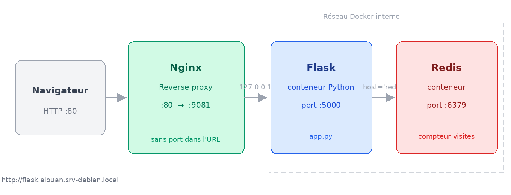
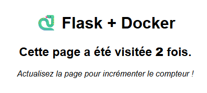

# 4. TP Docker — Python 🐍

Projet : application Flask + Redis sur `srv-debian`

!!! success "🎯 Objectifs du TP"

    - Comprendre le rôle d'un **Dockerfile**
    - Écrire un **Dockerfile** pour une application Python
    - Écrire un **docker-compose.yml** de zéro
    - Faire communiquer **2 conteneurs** via un réseau Docker
    - Accéder à l'application **via Nginx** (sans port dans l'URL)
    - Corriger ses erreurs en lisant les **logs**

!!! warning "Prérequis"
    - Avoir réalisé le TP précédent (WordPress avec Docker Compose)
    - Être connecté à `srv-debian` en SSH
    - Nginx est déjà configuré sur `srv-debian` (géré par le professeur)

## 🗺️ Ce que l'on va construire

Une application web Python qui **compte le nombre de visites** du site.  
À chaque fois qu'un visiteur charge la page, le compteur s'incrémente.  
Le compteur est stocké dans **Redis** (une base de données ultra-rapide en mémoire).

{: .center width=80%}

!!! info "🔧 Rôle de Nginx ici"
    Nginx joue le rôle de **reverse proxy** : il reçoit les requêtes sur le port 80
    et les redirige vers votre conteneur Flask. C'est exactement ce qu'il fait
    déjà pour vos sites WordPress.  
    **Avantage :** l'URL finale ne contient pas de numéro de port.

**Ce qui est fourni :** le code Python (`app.py` + `requirements.txt`) + la config Nginx  
**Ce que vous écrivez :** le `Dockerfile` et le `docker-compose.yml`

## 1. Préparer son espace de travail 📁

Connectez-vous à `srv-debian` et créez un dossier pour ce TP :

```bash
ssh VOTRE_PRENOM@srv-debian.local
```

```bash
mkdir ~/flask-counter
cd ~/flask-counter
```

## 2. Découvrir le code fourni 🐍

### Le fichier `app.py`

Créez le fichier `app.py` avec le contenu suivant :

```bash
nano app.py
```

```python
from flask import Flask
from redis import Redis

app = Flask(__name__)
redis = Redis(host='redis', port=6379)  # 'redis' = nom du service Docker

@app.route('/')
def index():
    count = redis.incr('visits')
    return f'''
    <html>
      <body style="font-family: Arial; text-align: center; margin-top: 100px;">
        <h1>🐍 Flask + Docker</h1>
        <h2>Cette page a été visitée <strong>{count}</strong> fois.</h2>
        <p><em>Actualisez la page pour incrémenter le compteur !</em></p>
      </body>
    </html>
    '''

if __name__ == '__main__':
    app.run(host='0.0.0.0', port=5000, debug=True)
```

Sauvegardez : `Ctrl+O` → Entrée → `Ctrl+X`

!!! info "🔍 Lecture du code — pas de panique !"
    Vous n'avez pas besoin de connaître Python pour ce TP.  
    Retenez juste deux lignes importantes :

    - `Redis(host='redis', ...)` → Flask contacte Redis en utilisant le **nom du service Docker** `redis`
    - `app.run(host='0.0.0.0', port=5000)` → l'application écoute sur le **port 5000**

    Ce sont exactement les informations dont vous aurez besoin pour écrire le `Dockerfile` et le `docker-compose.yml`.

### Le fichier `requirements.txt`

Ce fichier liste les **dépendances Python** à installer (l'équivalent du `composer.json` de Laravel).

```bash
nano requirements.txt
```

```
flask
redis
```

Sauvegardez et quittez.

### Vérifier la structure

```bash
ls -la
```

Vous devez avoir :

```
-rw-r--r--  app.py
-rw-r--r--  requirements.txt
```

## 3. Écrire le Dockerfile 📝

!!! abstract "Rappel — À quoi sert le Dockerfile ?"
    Le Dockerfile décrit comment **construire l'image** de votre application.  
    C'est la recette : quel OS de base, quelles dépendances installer, quel code copier, quelle commande lancer.

Créez le fichier `Dockerfile` :

```bash
nano Dockerfile
```

### 🧩 Construction guidée

Complétez le Dockerfile **instruction par instruction** en vous aidant des indices ci-dessous.

**Instruction 1 — Image de base**

On part d'une image Python officielle. La version utilisée est `3.11-slim`  
(`slim` = version allégée, sans les outils de développement inutiles en production).

```dockerfile
FROM ______:______
```

??? help "Indice"
    ```dockerfile
    FROM python:3.11-slim
    ```

**Instruction 2 — Dossier de travail**

Définissez `/app` comme dossier de travail dans le conteneur.  
Toutes les commandes suivantes s'exécuteront depuis ce dossier.

```dockerfile
WORKDIR ______
```

??? help "Indice"
    ```dockerfile
    WORKDIR /app
    ```

**Instruction 3 — Copier les dépendances EN PREMIER**

!!! tip "Bonne pratique — optimisation du cache Docker"
    On copie `requirements.txt` **avant** le reste du code.  
    Pourquoi ? Si on copie tout d'abord (`COPY . .`), Docker recalcule
    l'installation des dépendances à chaque modification du code — même si
    `requirements.txt` n'a pas changé. En le copiant seul en premier,
    Docker met en **cache** la couche d'installation tant que le fichier ne change pas.

```dockerfile
COPY ______ .
```

??? help "Indice"
    ```dockerfile
    COPY requirements.txt .
    ```

**Instruction 4 — Installer les dépendances Python**

`pip` est le gestionnaire de paquets Python (l'équivalent de `composer` en PHP).  
`--no-cache-dir` évite de stocker le cache pip dans l'image (inutile, fait grossir l'image).

```dockerfile
RUN pip install --no-cache-dir -r ______
```

??? help "Indice"
    ```dockerfile
    RUN pip install --no-cache-dir -r requirements.txt
    ```

**Instruction 5 — Copier le reste du code**

Maintenant qu'on a installé les dépendances, on copie le code source.

```dockerfile
COPY ______ ______
```

??? help "Indice"
    ```dockerfile
    COPY . .
    ```

**Instruction 6 — Exposer le port**

L'application Flask écoute sur quel port ? (regardez `app.py`)

```dockerfile
EXPOSE ______
```

??? help "Indice"
    ```dockerfile
    EXPOSE 5000
    ```

**Instruction 7 — Commande de démarrage**

La commande pour lancer l'application Python est `python app.py`.

```dockerfile
CMD ["______", "______"]
```

??? help "Indice"
    ```dockerfile
    CMD ["python", "app.py"]
    ```

### ✅ Dockerfile complet attendu

Une fois toutes les instructions complétées, votre Dockerfile doit ressembler à ceci.  
**Ne regardez qu'après avoir essayé !**

??? done "Solution complète"
    ```dockerfile
    FROM python:3.11-slim

    WORKDIR /app

    COPY requirements.txt .
    RUN pip install --no-cache-dir -r requirements.txt

    COPY . .

    EXPOSE 5000

    CMD ["python", "app.py"]
    ```

## Étape 4 — Écrire le docker-compose.yml ⚙️

!!! abstract "Rappel — À quoi sert docker-compose.yml ?"
    Il orchestre **plusieurs conteneurs** ensemble : il définit les services,
    les ports, les réseaux et les volumes. C'est lui qui fait que Flask
    peut parler à Redis en utilisant simplement le nom `redis`.

Créez le fichier :

```bash
nano docker-compose.yml
```

### 🧩 Construction guidée

**Structure de base**

```yaml
services:

  web:
    # ... service Flask

  redis:
    # ... service Redis

networks:
  # ... réseau interne
```

**Service `web` — l'application Flask**

Flask n'utilise pas une image toute faite — elle se **construit** à partir de votre Dockerfile.  
Le mot-clé pour ça est `build: .` (construire depuis le dossier courant).

!!! info "Port interne uniquement"
    Contrairement au TP WordPress, vous n'exposez **pas** de port vers l'extérieur ici.
    Nginx se charge de faire le lien entre l'URL publique et votre conteneur Flask.
    Le port 5000 reste **interne au serveur**.

```yaml
  web:
    build: ______
    container_name: flask_VOTRE_PRENOM
    restart: unless-stopped
    ports:
      - "127.0.0.1:______:5000"    # Accessible uniquement depuis localhost (pour Nginx)
    networks:
      - ______
    depends_on:
      - ______
```

!!! question "Quel port local choisir ?"
    Choisissez un port dans la plage **9081-9083** selon votre prénom.  
    Ce port n'est **pas accessible depuis votre navigateur** directement —  
    c'est Nginx qui va l'utiliser en interne.

    | Étudiant  | Port Flask (local) |
    |   --|     |
    | elouan    | 9081              |
    | alexandre | 9082              |
    | mael      | 9083              |

??? help "Indice service web"
    ```yaml
      web:
        build: .
        container_name: flask_prenom
        restart: unless-stopped
        ports:
          - "127.0.0.1:VOTRE_PORT:5000"
        networks:
          - flask_network
        depends_on:
          - redis
    ```

**Service `redis` — la base de données**

Redis est une image officielle disponible sur Docker Hub.  
Elle n'a pas besoin de configuration particulière.

```yaml
  redis:
    image: ______:______
    container_name: redis_VOTRE_PRENOM
    restart: unless-stopped
    networks:
      - ______
```

!!! tip "Quelle image Redis utiliser ?"
    `redis:alpine` — la version légère (alpine = distribution Linux minimaliste).  
    C'est l'image officielle recommandée pour la production.

??? help "Indice service redis"
    ```yaml
      redis:
        image: redis:alpine
        container_name: redis_prenom
        restart: unless-stopped
        networks:
          - flask_network
    ```

**Le réseau interne**

Déclarez le réseau qui permet à Flask et Redis de communiquer.

```yaml
networks:
  flask_network:
    driver: ______
```

??? help "Indice réseau"
    ```yaml
    networks:
      flask_network:
        driver: bridge
    ```

### ✅ docker-compose.yml complet attendu

??? done "Solution complète"
    ```yaml
    services:

      # ── Application Flask ──────────────────────────────────────────────
      web:
        build: .                          # Construit l'image depuis le Dockerfile local
        container_name: flask_PRENOM
        restart: unless-stopped
        ports:
          - "127.0.0.1:VOTRE_PORT:5000"                   # PORT_HOTE:PORT_CONTENEUR
        networks:
          - flask_network
        depends_on:
          - redis                         # Redis démarre avant Flask

      # ── Base de données Redis ──────────────────────────────────────────
      redis:
        image: redis:alpine               # Image officielle, version légère
        container_name: redis_PRENOM
        restart: unless-stopped
        networks:
          - flask_network

    # ── Réseau interne ─────────────────────────────────────────────────
    networks:
      flask_network:
        driver: bridge

    ```

## Étape 5 — Construire et tester 🚀

### Vérifier la structure des fichiers

```bash
ls -la ~/flask-counter/
```

Vous devez avoir **4 fichiers** :

```
app.py
requirements.txt
Dockerfile
docker-compose.yml
```

### Lancer le build et démarrer

```bash
docker compose up -d --build
```

!!! info "Que se passe-t-il ?"
    - `--build` : Docker **construit l'image** à partir de votre Dockerfile  
    - `-d` : démarre les conteneurs en **arrière-plan**  
    
    La première fois, Docker télécharge `python:3.11-slim` et `redis:alpine`.  
    C'est normal que ça prenne 1 à 2 minutes.

### Vérifier l'état

```bash
docker compose ps
```

Résultat attendu :

```bash
catam@srv-debian13:~/flask-counter$ docker compose ps
NAME          IMAGE               COMMAND                  SERVICE   CREATED          STATUS          PORTS
flask_catam   flask-counter-web   "python app.py"          web       20 seconds ago   Up 17 seconds   127.0.0.1:8084->5000/tcp
redis_catam   redis:alpine        "docker-entrypoint.s…"   redis     21 seconds ago   Up 18 seconds   6379/tcp
```

## 6. Tester dans le navigateur 🌐

!!! success "URL sans numéro de port"
    Grâce à Nginx, vous accédez à votre application **directement par son nom**,
    sans avoir à taper un numéro de port dans l'URL.

| Étudiant  | URL à ouvrir                        |
|   --|           |
| elouan    | http://flask.elouan.srv-debian.local    |
| alexandre | http://flask.alexandre.srv-debian.local |
| mael      | http://flask.mael.srv-debian.local      |

Actualisez la page plusieurs fois — le compteur doit s'incrémenter à chaque fois.

??? bug "fix Ce site est inaccessible"
  et votre vhosts dans `C:\Windows\System32\drivers\etc` ...
  Ajouter la ligne `192.168.0.119 flask.prenom.srv-debian.local`
  
!!! success "🎉 Ça fonctionne !"
    {: .center width=50%}

    Votre application Flask communique avec Redis via le réseau Docker interne.  
    Flask utilise le nom `redis` pour joindre le conteneur Redis — c'est le **DNS interne Docker**.  
    Et Nginx rend l'application accessible sans numéro de port dans l'URL.

## 7. Corriger ses erreurs 🔧

C'est la compétence la plus importante en DevOps : **savoir diagnostiquer**.

### Les erreurs les plus fréquentes

**La page ne s'affiche pas → vérifier les logs**

```bash
docker compose logs web
docker compose logs redis
```

**Erreur dans le Dockerfile → reconstruire**

```bash
# Après correction du Dockerfile
docker compose up -d --build
```

**Un conteneur redémarre en boucle**

```bash
docker compose ps
# STATUS = "restarting" → problème de configuration
docker compose logs web --tail=20
```

**Tester la connexion entre Flask et Redis**

```bash
# Entrer dans le conteneur Flask
docker compose exec web bash

# Tester la connexion réseau vers Redis
python3 -c "import redis; r=redis.Redis(host='redis'); print(r.ping())"
# Résultat attendu : True

exit
```

## 8. Questions de réflexion 🧠

!!! question "📝 À répondre dans votre compte-rendu"

    **Question 1**  
    Dans `app.py`, la connexion Redis utilise `host='redis'`.  
    Pourquoi ce nom fonctionne-t-il ? Quel mécanisme Docker est derrière ?

    **Question 2**  
    Dans votre `docker-compose.yml`, vous avez défini `depends_on: redis`.  
    Que se passerait-il si vous supprimiez cette ligne et que Redis mettait
    10 secondes à démarrer ?

    **Question 3**  
    Comparez les deux `docker-compose.yml` : celui du TP WordPress et celui que
    vous venez d'écrire. Quelle est la différence entre `image:` et `build:` ?
    Dans quel cas utilise-t-on chacun ?

    **Question 4**  
    Le compteur de visites est stocké dans Redis, pas sur disque.  
    Que se passe-t-il si vous faites `docker compose down` puis `docker compose up -d` ?  
    Testez et expliquez. Comment corriger ça ?

    **Question 5**  
    Dans le `docker-compose.yml`, le port est déclaré `127.0.0.1:8081:5000`
    et non simplement `8081:5000`.  
    Quelle est la différence ? Pourquoi est-ce important du point de vue sécurité ?

??? done "Éléments de correction"

    **Q1** — Docker crée un **DNS interne** dans chaque réseau. Le nom du service
    (`redis`) est automatiquement résolu vers l'IP du conteneur Redis.
    C'est pour ça que dans le `.env` Laravel on met `DB_HOST=mysql` au lieu de `localhost`.

    **Q2** — Flask démarrerait avant Redis et tenterait de s'y connecter → erreur de
    connexion → le conteneur Flask crasherait. `depends_on` garantit l'ordre de démarrage.
    *(Note avancée : `depends_on` attend que le conteneur soit `started`, pas que Redis
    soit réellement prêt à accepter des connexions → pour ça il faudrait un `healthcheck`.)*

    **Q3** — `image:` utilise une image **déjà construite** (depuis Docker Hub ou en local).
    `build:` **construit** une nouvelle image depuis un Dockerfile. On utilise `build:`
    quand on a du code applicatif à embarquer dans l'image.

    **Q4** — Le compteur repart à zéro car Redis stocke les données **en mémoire**,
    dans le conteneur. Sans volume, tout disparaît à `docker compose down`.
    Pour corriger, ajouter un volume au service Redis :
    ```yaml
    redis:
      image: redis:alpine
      volumes:
        - redis_data:/data
      command: redis-server --appendonly yes
    
    volumes:
      redis_data:
    ```

    **Q5** — `127.0.0.1:8081:5000` lie le port **uniquement sur l'interface locale** du serveur.
    Le port 8081 n'est donc **pas joignable depuis l'extérieur** — seulement depuis Nginx qui tourne
    sur la même machine. Sans le `127.0.0.1:`, le port serait ouvert sur toutes les interfaces réseau
    et n'importe qui sur le réseau pourrait contourner Nginx et accéder directement à Flask.

## 🧾 Synthèse — Ce que vous avez écrit

| Fichier            | Votre rôle                                      |
|      --|                -|
| `app.py`           | Fourni — code de l'application Flask            |
| `requirements.txt` | Fourni — dépendances Python                     |
| `Dockerfile`       | ✍️ **Écrit par vous** — recette de l'image       |
| `docker-compose.yml` | ✍️ **Écrit par vous** — orchestration 2 services |

 

## 🚀 Bonus — Aller plus loin

!!! tip "Bonus 1 — Ajouter la persistance Redis"
    Modifiez votre `docker-compose.yml` pour que le compteur **survive** à un
    `docker compose down`. Indice : volumes + `redis-server --appendonly yes`.

!!! tip "Bonus 2 — Modifier l'application"
    Éditez `app.py` pour afficher en plus :

    - La date et heure de la dernière visite
    - Un bouton **Reset** qui remet le compteur à zéro

    Après modification, reconstruisez l'image :
    ```bash
    docker compose up -d --build
    ```

!!! tip "Bonus 3 — Explorer Redis en ligne de commande"
    ```bash
    docker compose exec redis redis-cli
    ```
    ```
    127.0.0.1:6379> GET visits
    127.0.0.1:6379> SET visits 0
    127.0.0.1:6379> KEYS *
    127.0.0.1:6379> EXIT
    ```
    Actualisez votre page après avoir remis `visits` à 0 — que constatez-vous ?
