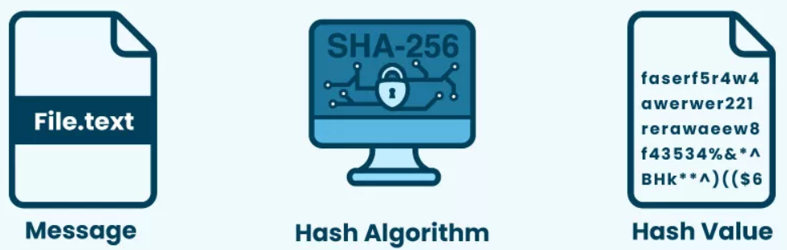
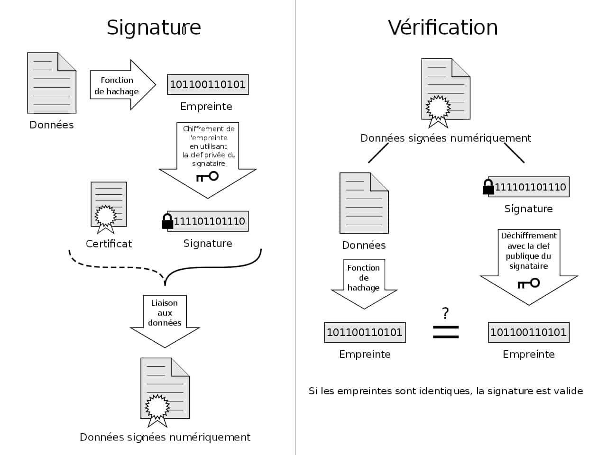
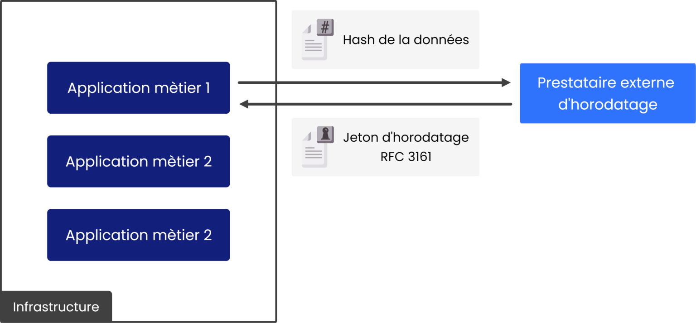
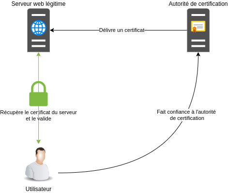
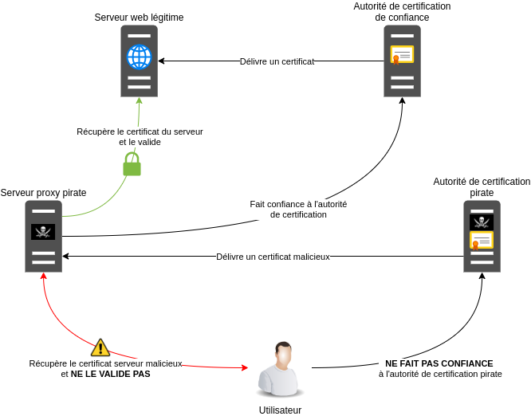

# 3. La preuve numérique 🔎

!!! note "Compétences"

    **B3.2 Préserver l'identité numérique de l’organisation**<br />
    Déployer les moyens appropriés de preuve électronique

    **Activité 3.4. Garantie de la disponibilité, de l’intégrité et de la confidentialité des services
    informatiques et des données de l’organisation face à des cyberattaques**

    - Caractérisation des risques liés à l’utilisation malveillante d’un service informatique
    - Recensement des conséquences d’une perte de disponibilité, d’intégrité ou de
    confidentialité
    - Identification des obligations légales qui s’imposent en matière d’archivage et de protection
    des données de l’organisation
    - Organisation de la collecte et de la conservation de la preuve électronique
    - Application des procédures garantissant le respect des obligations légales


**Déployer les moyens appropriés de preuve électronique :** <br />
Cette compétence implique de traiter les bases de **l‟authentification**, de la **confidentialité** et de la **preuve** afin d‟en comprendre les principes et mettre en œuvre des outils simples. Des éléments incontournables, comme ceux qui suivent, permettent d'appuyer les compétences :

● principes du chiffrement symétrique et asymétrique  (AR)<br />
● principes de l'authentification : hachage, signature (AR) <br />
● principes de la preuve numérique : horodatage, certificats, chaîne de blocs (Blockchain) <br />
● conservation de la preuve numérique <br />
● l'identité numérique sécurisée : authentification numérique, principes et outils prouvant une identité numérique, schéma d'authentification numérique, OpenId, identité institutionnelle

??? note "Ressources"

    - https://www.cnil.fr/fr/maitriser-mes-donnees
    - https://eduscol.education.fr/internet-responsable/communication-et-vie-privee/maitriser-son-identite-numerique.html
    - https://www.confiance-numerique.fr/wp-content/uploads/2014/05/feuille_de_route_nationale_identite_numerique_acn_v1.0.pdf

    **Autres ressources**
    
    - https://blogrecherche.wp.imt.fr/files/2016/03/Cahier-Identites-numeriques_web.pdf
    - https://www.akaoma.com/conseil-expertise-securite-informatique/ereputation-reputation-numerique
    - http://www.lerti.fr/
    - https://books.openedition.org/pupvd/3972
    - https://www.docusign.fr/sites/default/files/Protect-and-Sign_Personal-Signature_PSGP-v-1-4s.pdf
    - https://www.cegid.com/fr/blog/archivage-a-valeur-probante/
    - https://www.solutions-numeriques.com/dossiers/larchivage-a-vocation-probatoire/
    - https://www.legalis.net/legaltech/dematerialisation-raphael-dassignies/
    - https://www.ssi.gouv.fr/uploads/2017/01/guide_hygiene_informatique_anssi.pdf (par exemple fiche n° 24, pages 32 et 33 à propos de la messagerie     professionnelle), autre lien vers la ressource : https://www.ssi.ens.fr/guide_hygiene_informatique_anssi.pdf

## 1. Qu’est-ce qu’une preuve numérique ? 🔎

Une preuve numérique est **toute information issue d’un système informatique susceptible de démontrer un fait**. Elle peut prendre différentes formes : un fichier présent sur un disque dur, une entrée dans un journal d’événements (log), une capture de la mémoire vive, une image disque complète, ou encore un certificat électronique utilisé dans les communications sécurisées.

La preuve numérique est aujourd’hui incontournable car une grande partie des activités humaines, professionnelles comme personnelles, laisse des **traces** numériques : navigation web, messagerie, transactions bancaires, connexions à des applications, accès à un réseau, etc. Toutes ces traces peuvent, sous certaines conditions, **servir de preuve** lors d’un audit, d’une enquête interne ou même devant un tribunal.

👉 **Par exemple :**

💠 Dans un contexte technique, un administrateur système peut analyser les **logs** pour comprendre pourquoi un serveur est tombé en panne.

💠 Dans un contexte organisationnel, un responsable informatique peut s’appuyer sur les **journaux d’accès** pour vérifier que seules les personnes autorisées ont consulté une base de données.

💠 Dans un contexte juridique, un enquêteur peut exploiter des **fichiers** ou des échanges d’e-mails pour démontrer une fraude ou une intrusion informatique.

Pour être recevable et exploitable, une preuve numérique doit répondre à trois exigences fondamentales :

✅ **Authenticité** : elle doit provenir réellement de la source à laquelle elle est attribuée. Si un fichier est censé provenir d’un serveur précis, il doit être possible de le prouver.

✅ **Intégrité** : elle ne doit pas avoir été modifiée depuis sa collecte. La moindre altération rendrait la preuve contestable.

✅ **Légalité** : elle doit avoir été obtenue et exploitée dans le respect du droit. Par exemple, accéder sans autorisation à la boîte mail d’un collègue pour en extraire des messages serait illégal, et les informations obtenues ne pourraient pas être utilisées comme preuve.

💡 Exemple concret : un fichier de log montrant une connexion suspecte depuis une adresse IP externe peut servir à prouver une tentative d’intrusion. Si ce fichier a été correctement collecté, horodaté et conservé, il pourra être utilisé comme preuve valide pour démontrer qu’une attaque a bien eu lieu à une date et une heure précises.

!!! example "🔎 Analyse"
    === "💡 Exemple de fichier de log Apache (fictif)"

        ```shell
        192.168.1.25 - - [24/Sep/2025:14:32:11 +0200] "GET /index.php?id=1 HTTP/1.1" 200 1024
        192.168.1.25 - - [24/Sep/2025:14:32:15 +0200] "GET /index.php?id=1 OR 1=1 HTTP/1.1" 200 2048
        203.0.113.45 - - [24/Sep/2025:14:35:02 +0200] "GET /admin/login.php HTTP/1.1" 401 512
        203.0.113.45 - - [24/Sep/2025:14:35:05 +0200] "POST /admin/login.php HTTP/1.1" 403 128
        203.0.113.45 - - [24/Sep/2025:14:35:07 +0200] "POST /admin/login.php HTTP/1.1" 403 128
        203.0.113.45 - - [24/Sep/2025:14:35:10 +0200] "POST /admin/login.php HTTP/1.1" 403 128
        ```
        Qu'en pensez vous ?

    === "Analyse du log"     

        **192.168.1.25 (machine interne)**

        Première requête classique : `GET /index.php?id=1`.

        Puis une requête suspecte : ``GET /index.php?id=1 OR 1=1``.

        👉 Cela ressemble à une tentative d’injection SQL, car l’expression OR 1=1 est typique pour contourner une requête SQL de connexion.

        **203.0.113.45 (IP externe)**

        Plusieurs accès à `/admin/login.php`.

        Plusieurs requêtes POST avec codes 403 (Forbidden).
        👉 Cela ressemble à une tentative de brute force (essais répétés de mot de passe sur la page d’administration).

        🚨 **Ce qui pourrait être en cause**

        * Une faille de sécurité applicative (vulnérabilité SQL Injection).
        * Une tentative d’attaque par brute force sur l’interface d’administration.
        * Éventuellement une mauvaise configuration si le site n’a pas de protections (WAF, verrouillage après x échecs).

!!! question "📋 QCM"
    === "QCM"

        **Question 1 :** Laquelle de ces affirmations définit le mieux une preuve numérique ?<br />
        a) Une copie de sauvegarde d’un système.<br />
        b) Une information issue d’un système informatique pouvant démontrer un fait.<br />
        c) Un fichier contenant des données confidentielles.<br />
        d) Un rapport écrit par un administrateur réseau.

        **Question 2 :** Pour être recevable, une preuve numérique doit être :<br />
        a) Authentique, intègre et légale.<br />
        b) Authentique, confidentielle et rapide à obtenir.<br />
        c) Légale, volumineuse et sauvegardée.<br />
        d) Certifiée, gratuite et vérifiable par tout le monde.

        **Question 3 :** Quel exemple correspond à une preuve numérique ?<br />
        a) Le témoignage oral d’un collègue.<br />
        b) Une capture d’écran sans horodatage ni vérification d’intégrité.<br />
        c) Un fichier de log montrant une connexion suspecte depuis une adresse IP externe.<br />
        d) Le mot de passe écrit sur un post-it retrouvé sur le bureau.

    === "Correction"
        **Question 1 :** ✅ Réponse attendue : **b**<br />
        **Question 2 :** ✅ Réponse attendue : **a**<br />
        **Question 3 :** ✅ Réponse attendue : **c**

## 2. Types de preuves numériques 🗂️

### 2.2 Types de preuves numériques

Les preuves numériques ne sont pas toutes identiques : certaines disparaissent rapidement si elles ne sont pas collectées à temps, d’autres peuvent être conservées pendant des années. On distingue donc deux grandes catégories : **les preuves volatiles** et **les preuves non volatiles**.

### 2.1 Les preuves volatiles ⚡

Une preuve volatile est une donnée **temporaire** qui disparaît dès que le système est éteint, redémarré ou même après un certain délai d’inactivité. Elles sont souvent **cruciales**, car elles contiennent des informations sensibles directement liées à l’état du système au moment de l’incident.

🔹 **Exemples de preuves volatiles :**

* Le contenu de la mémoire vive (**RAM**) → peut contenir des mots de passe, des clés de chiffrement ou du code malveillant en cours d’exécution.
* Les **processus en cours** → permettent d’identifier quel programme tourne à l’instant T (ex. un malware actif).
* Les **connexions réseau établies** → indiquent quelles machines communiquent entre elles.
* Les **sessions utilisateurs ouvertes** → montrent qui est connecté au moment de l’analyse.

💡 **Exemple concret – RAM :**
Un attaquant chiffre un disque avec un ransomware. Si on capture la RAM immédiatement, on peut parfois retrouver la **clé de chiffrement** utilisée par le logiciel malveillant. Si on attend que la machine soit redémarrée, cette information disparaît à jamais.

### 2.2 Les preuves non volatiles 💾

Une preuve non volatile est une donnée **persistante**, stockée sur un support de manière durable. Contrairement aux preuves volatiles, elles survivent à un redémarrage ou à un arrêt du système.

🔹 **Exemples de preuves non volatiles :**

* Les **fichiers stockés sur un disque dur** ou une clé USB.
* Les **journaux d’événements (logs)** : système, applicatif, réseau.
* Les **sauvegardes** : permettent de retrouver l’état d’un système avant ou après une attaque.
* Les **métadonnées** (auteur d’un document, date de création, géolocalisation d’une photo).

💡 **Exemple concret – logs :**
Un serveur web Apache garde une trace de toutes les connexions. On peut y retrouver une tentative d’attaque par injection SQL (`id=1 OR 1=1`). Ces logs, même conservés plusieurs mois plus tard, peuvent servir à démontrer qu’une attaque a bien eu lieu.

### 2.3 Comparaison entre preuves volatiles et non volatiles

| Caractéristique  | Preuves volatiles ⚡                               | Preuves non volatiles 💾                        |
| ---------------- | ------------------------------------------------- | ----------------------------------------------- |
| **Durée de vie**     | Très courte (disparaît après arrêt/redémarrage)   | Longue (persiste sur disque ou support externe) |
| **Exemple typique**  | RAM, connexions réseau, processus actifs          | Logs, fichiers, sauvegardes                     |
| **Risque principal**| Perte définitive si non collectée immédiatement   | Corruption ou suppression volontaire            |
| **Mode de collecte** | Outils spécialisés (dump mémoire, capture réseau) | Outils d’imagerie disque, export de logs        |

💡 **Conseil pratique :**
Lors d’un incident, il faut **toujours commencer par collecter les preuves volatiles**, car elles disparaissent rapidement. Ensuite, on s’occupe des preuves non volatiles.

!!! question "Application 🎓"
    === "questions"
        💭 Imagine, un pirate utilise un accès SSH sur un serveur. <br />
        Quelle(s) preuve(s) volatile(s) et non volatile(s) pourrais-tu collecter pour prouver son intrusion ?

    === "Correction"
        ✅ Preuves **volatiles** :

        * Les **connexions réseau actives** (`netstat -an` → montre l’IP de l’attaquant connectée en SSH).
        * Les **processus en cours** (`ps aux` → peut montrer une session SSH ouverte).
        * La **RAM** (peut contenir les commandes tapées par l’attaquant ou des clés de chiffrement).

        ✅ Preuves **non volatiles** :

        * Les **logs SSH** (`/var/log/auth.log`) → conservent les tentatives de connexion échouées et réussies.
        * Les **fichiers système modifiés** (ex. ajout d’un nouvel utilisateur par l’attaquant).
        * Les **sauvegardes** → permettent de comparer l’état du système avant/après l’intrusion.

### 2.4 Exemple de Preuve volatile

👉 [Télécharger les fichiers à analyser](./data/tp_preuve_volatile.zip)

**Ce que contient l’archive**

* `ss.txt` — sortie simulée de `ss -tnp` (connexion SSH établie).
* `psaux.txt` — sortie simulée de `ps aux` (processus `sshd` + `bash`).
* `lsof.txt` — sortie simulée montrant le FD lié à la connexion SSH.
* `auth.log` — extrait simulé des logs SSH (tentatives échouées + connexion réussie).
* `notice_template.txt` — modèle à remplir pour la chaîne de conservation.
* `README.txt` — consignes simplifiées et commandes utiles.

!!! question "A faire"

    * Télécharger et extraire l’archive.
    * Lire les fichiers `ss.txt`, `psaux.txt`, `lsof.txt` et `auth.log`.
    
    **Répondre aux questions :**

    1. Quelle est l’adresse IP attaquante ?
    2. À quelle heure la connexion SSH a-t-elle été établie ?
    3. Quel compte semble compromis ?
    4. Calculer les SHA256 des fichiers (exemple : ``sha256sum /root/evidence/ss_*.txt > /root/evidence/hashes.txt``)
    5. Rédiger à l'aide de `notice_template.txt` la notice pour `ss.txt`

??? question "Correction"

    * **Quelle est l’adresse IP attaquante :** `203.0.113.45` (visible dans `ss.txt`, `lsof.txt` et `auth.log`).
    * **À quelle heure la connexion SSH a-t-elle été établie ? :** `Sep 25 10:14:33` → on voit dans `auth.log` la ligne `Accepted password for user1 from 203.0.113.45 port 44528 ssh2` (la capture `ss.txt` contient une connexion ESTAB à la même période).
    * **Quel compte semble compromis ? :** `user1` (connexion acceptée dans `auth.log` et `psaux.txt` montre un `-bash` pour `user1`).

    **Valeurs SHA256 des fichiers fournis :**

    * `ss.txt` : `96b2767089a094f0d6cb21a420af0bda48a587d3468ca4589296e40ac25b74ca`
    * `psaux.txt` : `eba68e3f48f01c16e4a4e9c5fad2fdee6ed15e25595c3e59fff81d85874a4955`
    * `lsof.txt` : `f348a4948777ed941e22c4bf52d6ba4d2e6daf62ed016e8d6ad86e90eae78a19`
    * `auth.log` : `3f13cfb51560d9190bb063ce7f1ccb617e28a453841dfedb8823fafe4c36a8b1`
    * `notice_template.txt` : `832dda7c28561fbb52f187015073fd72591ce4931b899bfc1a981b7cd93b3889`

    **Exemple de notice de consignation sur ``ss.txt``**

    ```text
    Preuve: ss.txt 
    Collecté par: Enseignant
    Date/heure: 2025-09-25T10:14:30+02:00
    Outil: ss (simulation)
    Localisation: /root/evidence/ss.txt (fichier fourni dans l'archive)
    Hash SHA256: 96b2767089a094f0d6cb21a420af0bda48a587d3468ca4589296e40ac25b74ca
    Commentaires: Fichier simulé montrant une connexion SSH établie depuis l'IP 203.0.113.45 vers 192.0.2.10:22. Voir corrélation avec auth.log.
    ```
    👉 Propositions de mesures :

    * isolation du serveur du réseau,
    * changement des mots de passe,
    * vérification des fichiers système,
    * mise en place de protections (fail2ban, MFA),
    * capture mémoire si possible pour recherches complémentaires.
    * Vérifier la **présence du fichier `hashes`** et la complétude de la notice de consignation.

## 3. 🛡️ Collecte et conservation des preuves numériques 

Lorsqu’un incident est détecté et que des preuves numériques doivent être collectées, il est indispensable de suivre une démarche rigoureuse afin de préserver leur **valeur juridique et technique**.

### 3.1 ✅ Étapes clés à respecter

| **Action**                                    | **Pourquoi ?**                                                          | **Outils / Méthodes**                                                |
| --------------------------------------------- | ----------------------------------------------------------------------- | -------------------------------------------------------------------- |
| **1. Identifier la preuve** 🔎                | Déterminer ce qui est pertinent (éviter de tout collecter inutilement). | RAM (preuves volatiles), logs, fichiers, disques, connexions réseau. |
| **2. Prioriser les preuves volatiles** ⚡      | Elles disparaissent rapidement si la machine est éteinte/redémarrée.    | Dump mémoire (`avml`, `LiME`), `netstat`/`ss`, `ps aux`.             |
| **3. Acquérir une copie** 📥                  | Préserver l’original intact pour garder la valeur probante.             | Image disque (`dd`, FTK Imager), export de logs, copie de fichiers.  |
| **4. Préserver la preuve** 🔒                 | Éviter toute modification accidentelle ou volontaire.                   | Stockage sécurisé (support externe chiffré, coffre-fort numérique).  |
| **5. Calculer un hash (SHA-256)** ✔️          | Garantir l’intégrité : toute modification sera détectée.                | `sha256sum`, HashCalc, logiciels forensics.                          |
| **6. Documenter la collecte** 📝              | Assurer la traçabilité pour la chaîne de conservation.                  | Rapport : qui, quoi, quand, comment, où, avec quel outil.            |
| **7. Maintenir la chaîne de conservation** 🔐 | Prouver que la preuve n’a pas été altérée jusqu’à l’exploitation.       | Registre de suivi, notice de consignation, signature électronique.   |

### 3.2 🔒 La chaîne de conservation (*chain of custody*)

La **chaîne de conservation** est un document ou registre qui accompagne chaque preuve tout au long de son cycle de vie.
Elle garantit que la preuve n’a pas été altérée ni manipulée de manière illégitime. --> voir les **notices de consignation** commencées dans l'exercice d'application

Elle doit contenir :

* L’identité du collecteur,
* La date et l’heure de la collecte,
* L’outil utilisé,
* L’empreinte numérique (hash),
* Les transferts éventuels (qui a eu accès à la preuve, quand, pourquoi).

!!! warning "📌 Règles d’or à retenir"

    * Toujours **collecter avant d’éteindre** (priorité aux preuves volatiles).
    * Toujours **travailler sur une copie**.
    * Toujours **calculer et noter un hash**.
    * Toujours **documenter chaque étape**.

## 4. Authentification, intégrité et mécanismes avancés de preuve numérique ⚙️

### 4.1 Le hachage 🧮

*(déjà vu avec AR)*

Un **hachage** est une **empreinte numérique unique** générée à partir d’un fichier ou d’un message, grâce à une fonction mathématique.

👉 Propriétés essentielles :

* Le hachage est **déterministe** : le même fichier donnera toujours le même hash.
* Le hachage est **non réversible** : on ne peut pas retrouver le fichier original à partir du hash.
* Une petite modification du fichier entraîne un **changement complet** de l’empreinte.

💡 **Exemple** :

```
SHA256("document") = 9d5ed678fe57bcca...
```

Si on modifie juste une lettre dans “document”, le hash sera totalement différent.

{: .center width=50%}

🎯 **Utilité en cybersécurité** :

* Vérifier que la preuve n’a pas été modifiée (*intégrité*). *Voir point 3 du cours.*
* Comparer des fichiers (ex. pour détecter des malwares connus grâce à leur empreinte).

🌈  dans un autre cours, on verra que le hachage d'un mot de passe est loin d'être suffisant. Pour contrer les attaques par force brut réalisées à l'aide de rainbow table, il est nécessaire d'introduire la notion de salage.

### 4.2 La signature numérique ✍️

La **signature numérique** repose sur la cryptographie asymétrique (un couple de clés : **clé privée** et **clé publique**).

👉 Fonctionnement :

1. On calcule le **hachage** du fichier.
2. Ce hachage est **chiffré avec la clé privée** de l’auteur → c’est la **signature**.
3. Toute personne peut vérifier la signature en déchiffrant avec la **clé publique** de l’auteur.

✔️ Cela garantit :

* **Intégrité** : le fichier n’a pas été modifié.
* **Authenticité** : l’auteur est bien celui qui possède la clé privée.

💡 **Exemple** :
Un logiciel téléchargé sur Internet est souvent accompagné d’une signature numérique. L’utilisateur peut vérifier avec la clé publique de l’éditeur que le fichier provient bien de lui et qu’il n’a pas été altéré.

{: .center width=80%}
*source : https://fr.wikipedia.org/wiki/Signature_num%C3%A9rique#/media/File:Digital_Signature_diagram_fr.svg*

### 4.3 L’horodatage électronique ⏰

L’**horodatage électronique** associe une **date et une heure fiables** à une preuve.
Il est généralement fourni par une **Autorité d’Horodatage** (TSA).

🎯 **Intérêt** :

* Empêcher qu’un fichier ou une signature soit **antidaté** ou modifié après coup.
* Ajouter une valeur juridique supplémentaire à une preuve.

💡 **Exemple** :
Un contrat signé électroniquement et horodaté → sa date ne peut pas être contestée devant un tribunal.

{: .center width=50%}

### 4. Les certificats numériques 📜

Un **certificat numérique** est un fichier électronique, souvent au format X.509, délivré par une **Autorité de Certification (CA)**.

👉 consulter la liste en france : [site de la commission européenne](https://eidas.ec.europa.eu/efda/trust-services/browse/eidas/tls/tl/FR)

🎯 **Rôle principal** :

* Attester du lien entre une **clé publique** et une **identité** (personne, organisation ou serveur).
* Permettre de sécuriser les communications (chiffrement, authentification).

💡 **Exemple concret** :
Quand vous visitez un site en **HTTPS**, votre navigateur vérifie le certificat du site.
Le cadenas 🔒 dans la barre d’adresse signifie que le certificat est valide et qu’il a été émis par une Autorité de Certification reconnue.

{: .center width=50%}

??? info "🔱 Man in the middle"

    Lorsqu’une personne malveillante souhaite se placer entre l’utilisateur et le site web légitime, il peut mettre en place un proxy HTTP qui intercepte les requêtes entre les 2 protagonistes légitimes.

    Comme évoqué au début de l’article, le TLS apporte une garantie sur l’authentification du serveur web, la confidentialité et l’intégrité des échanges. Un proxy HTTP au milieu d’un tel échange ne verrait qu’un flux chiffré d’informations sans avoir la possibilité de les déchiffrer ou de les modifier.

    Pour rendre ces échanges lisibles et modifiables, le pirate doit établir une connexion entre l’utilisateur et son serveur proxy puis entre son serveur proxy et le site web légitime.

    Avec le site web légitime, il n’y a pas de problème puisque le serveur proxy agit comme un client classique, le schéma expliqué ci-dessus dans le cas normal s’applique.

    Pour que la connexion entre l’utilisateur légitime et le proxy se fasse, le pirate va devoir présenter un faux certificat (émis par une autorité de certification non reconnue) tentant de se faire passer pour un certificat de confiance du serveur web légitime.

    {: .center width=80%}

    Lorsque le navigateur de l’utilisateur va récupérer le certificat envoyé par le serveur proxy pirate, il va effectuer les étapes de validation décrites précédemment.

    Le certificat du proxy pirate n’ayant pas été émis pas une autorité de certification de confiance, cette étape va échouer et un avertissement sera remonté à l’utilisateur.

    *source : https://aymericlagier.com/2021/04/07/les-certificats-tls/*

!!! warning "✅ Points clés à retenir"

    * Le **hachage** permet de vérifier l’**intégrité**.
    * La **signature numérique** garantit **intégrité + authenticité**.
    * L’**horodatage** prouve la **date et l’heure** d’une preuve.
    * Les **certificats** assurent l’**identité numérique** et la sécurité des communications.

!!! question "📋 QCM"
    === "QCM"

        **Question 1** : Le hachage d’un fichier permet principalement de :<br />
        a) Chiffrer le contenu du fichier.<br />
        b) Vérifier l’intégrité du fichier. <br />
        c) Rendre le fichier illisible.<br />
        d) Identifier l’auteur du fichier.

        **Question 2** : Quelle affirmation est correcte concernant une fonction de hachage ?<br />
        a) On peut retrouver le fichier original à partir du hash.<br />
        b) Un petit changement dans le fichier modifie complètement le hash. <br />
        c) Deux fichiers différents auront toujours des hash différents.<br />
        d) Le hash est identique quelle que soit la fonction utilisée.

        **Question 3** : La signature numérique utilise :<br />
        a) Une clé unique partagée par tout le monde.<br />
        b) Un couple de clés publique/privée. <br />
        c) Un mot de passe fort.<br />
        d) Un certificat SSL obligatoire.

        **Question 4** : Quel est le rôle de l’horodatage électronique ?<br />
        a) Rendre un fichier confidentiel.<br />
        b) Ajouter une date et une heure fiables à une preuve. <br />
        c) Signer automatiquement les fichiers.<br />
        d) Chiffrer une preuve avec une clé privée.


        **Question 5** : Un certificat numérique délivré par une Autorité de Certification permet de :<br />
        a) Garantir l’intégrité des logs système.<br />
        b) Attester du lien entre une clé publique et une identité. <br />
        c) Empêcher un fichier d’être supprimé.<br />
        d) Horodater une transaction financière.

    === "Correction"

        **Question 1** : Le hachage d’un fichier permet principalement de :

        * a) ❌ Chiffrer le contenu du fichier → non, le hachage n’est pas un chiffrement. Il est irréversible.<br />
        * b) ✅ Vérifier l’intégrité du fichier → oui, si le fichier change, son empreinte (hash) change immédiatement.<br />
        * c) ❌ Rendre le fichier illisible → non, le hash ne remplace pas le fichier, il en donne seulement une empreinte.<br />
        * d) ❌ Identifier l’auteur du fichier → ce rôle est assuré par la **signature numérique**, pas le simple hachage.

        **Question 2** : Quelle affirmation est correcte concernant une fonction de hachage ?

        * a) ❌ On peut retrouver le fichier original à partir du hash → faux, car le hachage est **non réversible**.<br />
        * b) ✅ Un petit changement dans le fichier modifie complètement le hash → exact, c’est la **propriété d’avalanche**.<br />
        * c) ❌ Deux fichiers différents auront toujours des hash différents → en théorie oui, mais en pratique des **collisions** sont possibles (rare, mais existent).<br />
        * d) ❌ Le hash est identique quelle que soit la fonction utilisée → faux, MD5, SHA-1, SHA-256 produisent des valeurs différentes.

        **Question 3** : La signature numérique utilise :

        * a) ❌ Une clé unique partagée par tout le monde → c’est du chiffrement symétrique, pas une signature.<br />
        * b) ✅ Un couple de clés publique/privée → exact, la signature se fait avec la clé privée et se vérifie avec la clé publique.<br />
        * c) ❌ Un mot de passe fort → utile pour la sécurité, mais ne crée pas de signature numérique.<br />
        * d) ❌ Un certificat SSL obligatoire → le certificat peut contenir la clé publique, mais il n’est pas nécessaire pour le mécanisme de signature en lui-même.

        **Question 4** : Quel est le rôle de l’horodatage électronique ? 

        * a) ❌ Rendre un fichier confidentiel → non, ce rôle appartient au chiffrement.<br />
        * b) ✅ Ajouter une date et une heure fiables à une preuve → exact, fourni par une **Autorité d’Horodatage (TSA)**.<br />
        * c) ❌ Signer automatiquement les fichiers → non, c’est une opération distincte.<br />
        * d) ❌ Chiffrer une preuve avec une clé privée → non, cela correspond à une signature numérique, pas à un horodatage.

        **Question 5** : Un certificat numérique délivré par une Autorité de Certification permet de :

        * a) ❌ Garantir l’intégrité des logs système → non, ce n’est pas le rôle d’un certificat.<br />
        * b) ✅ Attester du lien entre une clé publique et une identité → exact, c’est la fonction d’un certificat X.509 (exemple : HTTPS).<br />
        * c) ❌ Empêcher un fichier d’être supprimé → impossible, un certificat ne protège pas un fichier physique.<br />
        * d) ❌ Horodater une transaction financière → ce rôle est assuré par un service d’horodatage, pas par un certificat.

