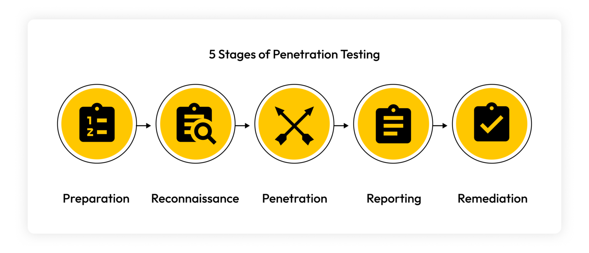

# 8. Notion de Pentest 🎩

!!! info "Compétences Cyber SLAM"

    **Activité B3.5**. Cybersécurisation d’une solution applicative et de son développement
    
    !!! warning "Compétences visées"

        - Participer à la vérification des éléments contribuant à la sûreté d’un développement informatique
        - Prendre en compte la sécurité dans un projet de développement d’une solution applicative
        - Mettre en œuvre et vérifier la conformité d’une solution applicative et de son développement à un référentiel, une - norme ou un standard de sécurité
        - Prévenir les attaques
        - Analyser les connexions (logs)
        - Analyser les incidents de sécurité, proposer et mettre en œuvre des contre-mesures

    <video controls style="max-width:20%; height:auto;">
        <source src="./data/Video_Hacker_Ethique.mp4" type="video/mp4">
    </video> 
<em>Source :</em> <a href="https://campuscyber.fr/">Campus Cyber</a> et <a href="https://demainspecialiste.cyber.gouv.fr/metiers/1#temoignage">Demain Specialiste Cyber</a>

## 1. Introduction 🛡️

Le **pentest**, ou test d’intrusion, occupe aujourd’hui une place essentielle dans toute démarche de cybersécurité. Il permet d’évaluer la résistance d’un système face à des attaques réelles en adoptant la posture d’un attaquant contrôlé. L’objectif principal n’est pas de causer des dommages, mais au contraire d’identifier les faiblesses techniques ou organisationnelles afin de proposer des mesures correctives. En ce sens, le pentest est un outil d’amélioration continue, indispensable pour toute organisation souhaitant sécuriser ses infrastructures.

Un test d’intrusion ne peut jamais être conduit de manière improvisée : il s’inscrit dans un cadre légal strict. L’autorisation formelle du propriétaire du système est une condition impérative. Sans cela, la démarche deviendrait illégale et assimilée à une tentative réelle d’intrusion. Le pentest repose donc sur une relation de confiance et sur une méthodologie rigoureuse.

??? info "Métier de pentesteur"
    
    - Fiche métier sur OPIIEC : [pentesteur](https://www.opiiec.fr/metiers/83066-pentesteur)
    - Demain Tous Cyber : [pentesteur](https://demainspecialiste.cyber.gouv.fr/metiers/1)

    Le Pentesteur évalue le système de prévention d'intrusion de sécurité d'une entreprise dans l'objectif de limiter les pertes, consultations, vols et corruptions des données du produit/système 

## 2. Nature et rôle du test d’intrusion 🔍

Le pentest se définit comme une simulation offensive visant à reproduire les comportements d’un attaquant potentiel. Cette simulation permet de tester la résistance des contrôles de sécurité, mais également la capacité des équipes internes à détecter et réagir face à une intrusion. Dans une perspective pédagogique, il s’agit d’un excellent moyen de comprendre la logique des attaquants et de mieux appréhender les vulnérabilités exploitées dans le monde réel.

En outre, le pentest répond à un impératif stratégique : anticiper l’attaque plutôt que la subir. En évaluant régulièrement les systèmes, l’organisation identifie ses points de faiblesse à un moment choisi, dans un environnement contrôlé, sans subir les conséquences économiques ou réputationnelles d’une véritable compromission.

## 3. Les différents types de Pentest 🧭

Le pentest peut prendre plusieurs formes selon la quantité d’informations fournies à l’auditeur. En **boîte noire**, le testeur découvre le système comme le ferait un attaquant externe. Cette approche permet d’évaluer la surface d’exposition publique. Le mode **boîte grise** adopte un point de vue intermédiaire, celui d’un utilisateur disposant d’un accès partiel, ce qui reflète souvent des scénarios internes ou des comptes compromis. Enfin, en **boîte blanche**, l’auditeur dispose d’informations complètes : architecture, code source, documentation. Ce mode vise une analyse exhaustive et profonde, souvent similaire à un audit de code renforcé.

Chaque mode apporte une vision complémentaire de la sécurité. En pédagogie ou en contexte professionnel, le choix dépend du périmètre testé, des objectifs, et du niveau de maturité de l’organisation.

!!! info "Les types de Pentest 🧭"

    ⬛ **Boîte noire** (Black Box)

    L’auditeur ne connaît rien du système. 
    ➜ Simule l’attaquant externe.

    🔳 **Boîte grise** (Grey Box)

    L’auditeur dispose d’un accès ou d’informations partielles. 
    ➜ Représente un utilisateur avec des privilèges limités.

    ⬜ **Boîte blanche** (White Box)

    Connaissance complète du système : code source, architecture… 
    ➜ Permet une analyse exhaustive et profonde.
 

## 4. Phases méthodologiques d’un pentest 🧱

Un test d’intrusion se déroule selon une méthodologie progressive. 

1️⃣ La première étape, la **reconnaissance**, consiste à collecter des informations sur l’environnement cible, que ce soit par des sources publiques (OSINT) ou par l’analyse de son exposition réseau. Cette phase peut paraître passive, mais elle fournit les indices essentiels qui orienteront les étapes suivantes.

2️⃣ Vient ensuite le **scan et l’énumération**, durant lesquels les services exposés, leurs versions et leurs configurations sont identifiés. C’est à partir de ces éléments que le testeur évalue les vulnérabilités potentielles. 

3️⃣Lorsque l’exploitation est rendue possible, l’auditeur entre dans la phase la plus sensible : **l’exploitation**. Celle-ci consiste à tenter de tirer parti des failles pour obtenir un accès, contourner un contrôle ou manipuler des données.

4️⃣ La **post-exploitation** s’intéresse à la profondeur de la compromission : élévation de privilèges, persistance, analyse interne du réseau. Cette étape reproduit le comportement d’un attaquant une fois à l’intérieur du système. 

5️⃣ Enfin, le **rapport** constitue une étape clé : il synthétise les failles trouvées, les preuves d’exploitation et les recommandations pour corriger les vulnérabilités. La qualité du rapport conditionne la valeur pédagogique et opérationnelle du pentest.

{: .center width=70%}

## 5. Panorama des outils du pentester 🧰

Le métier de pentester mobilise un ensemble d’outils spécialisés. Kali Linux constitue aujourd’hui la distribution de référence, intégrant plusieurs centaines d’outils couvrant toutes les phases d’un test d’intrusion. Parmi les outils fondamentaux, **Nmap** permet d’identifier les services exposés, tandis que [Metasploit](https://www.metasploit.com/) offre une plate-forme structurée pour exploiter automatiquement ou manuellement des vulnérabilités connues.

Pour les tests d’intrusion Web, **Burp Suite** est largement utilisé : il permet d’intercepter les requêtes HTTP, d’en analyser la structure et de tester différentes attaques (injections, manipulations de paramètres, CSRF…). Pour les attaques par mot de passe, **John the Ripper** ou **Hashcat** sont des références en matière de cracking basé sur dictionnaires ou calcul GPU. Enfin, l’analyse réseau repose souvent sur **Wireshark**, indispensable pour visualiser les communications et détecter des comportements suspects.

## 6. Méthodologies officielles 🧭

Les tests d’intrusion ne s’improvisent pas : ils s’appuient sur des standards internationaux. Le **PTES** (Penetration Testing Execution Standard) offre une démarche complète, allant de la préparation de mission à la remédiation. Pour le Web, le **OWASP Testing Guide** constitue la référence absolue : il fournit des scénarios d’attaque typiques et des méthodes pour valider la sécurité des applications Web. Enfin, le **NIST SP 800-115** propose une approche institutionnelle structurée, souvent utilisée dans les environnements administratifs ou sensibles.

Ces méthodologies assurent une cohérence, un niveau d’exigence et une reproductibilité indispensables, tant dans le milieu professionnel que pour un usage pédagogique en BTS SIO.

## 7. Cadre légal, responsabilités et éthique ⚖️

Réaliser un pentest impose un strict respect de la loi. Toute intervention doit être encadrée par une **lettre de mission** définissant précisément le périmètre, les systèmes autorisés, les techniques permises, les conditions d’exécution et les dates précises d'intervention. Le pentester doit veiller à ne jamais dépasser ce périmètre, même si des vulnérabilités très visibles semblent exploitables au-delà.

La dimension éthique est également centrale. Le pentester traite des informations parfois sensibles, observe des configurations internes et peut potentiellement accéder à des données confidentielles. Il est tenu à une obligation de confidentialité absolue. La mission repose sur une discipline professionnelle forte, visant toujours à renforcer la sécurité des systèmes évalués.

!!! info "Synthèse Cadre légal et éthique"
    📝 **Autorisations nécessaires**. Un pentest nécessite :

    - Un cadre contractuel (lettre de mission).
    - La portée précise (périmètre technique).
    - Les dates et horaires.
    - Les techniques autorisées / interdites.

    🧭 **Éthique du pentester**

    - Confidentialité absolue.
    - Pas d’action dépassant le périmètre autorisé.
    - Priorité à la non-perturbation des services.
    - Obligation de signaler les failles découvertes.

!!! warning "Conclusion🎓"

    Le pentest constitue une démarche essentielle pour comprendre les mécanismes d’attaque et renforcer la sécurité des systèmes. Il fait appel à des compétences techniques variées, mais également à une méthodologie solide et à un sens aigu de l’éthique. 

!!! question "📝 QCM – Pentest & Analyse de situations"

    🔎 **Question 1** : Le pentest vise principalement à :
    
    * A. Identifier les vulnérabilités d’un système avant qu’un attaquant ne les exploite.
    * B. Dégrader volontairement un système pour en tester la résilience.
    * C. Mettre en place des mécanismes de chiffrement.
    * D. Reproduire à l’identique l’architecture d’un cybercriminel.

    ??? question "Solution Question n°1"
        Réponse : **A.** Le pentest n’a jamais vocation à dégrader ou perturber un système, mais à en évaluer les vulnérabilités afin d’améliorer la sécurité.

    🔎 **Question 2** : Dans un pentest en boîte noire, le pentester :

    * A. A accès au code source.
    * B. Ne connaît aucune information sur la cible.
    * C. Dispose d’un compte utilisateur standard.
    * D. Reçoit une documentation technique de l’infrastructure.

    ??? question "Solution Question n°2"

        Réponse : **B.** Le testeur découvre la cible comme un attaquant externe sans connaissance préalable.

    🔎 **Question 3** : Quel outil est principalement utilisé pour identifier les ports ouverts et les services actifs ?

    * A. Burp Suite
    * B. Metasploit
    * C. Nmap
    * D. Wireshark

    ??? question "Solution Question n°3"
        Réponse : **C.** ``Nmap`` est l’outil de référence pour le scan réseau et la découverte de services.

    🔎 **Question 4** – Analyse de situation

    Une entreprise souhaite réaliser un pentest interne. Le testeur obtient un compte utilisateur classique avec accès au réseau interne. Ce scénario correspond :

    * A. À un test en boîte noire
    * B. À un test en boîte grise
    * C. À un test en boîte blanche
    * D. À un test hors cadre légal

    ??? question "Solution Question n°4"
        Réponse : **B.** Le pentester dispose d’un niveau d’information intermédiaire : il a un compte mais pas une connaissance complète de l’infrastructure.

    🔎 Question 5 : La phase de post-exploitation consiste à :

    * A. Collecter des informations publiques sur la cible.
    * B. Maintenir un accès, analyser le système et élever les privilèges.
    * C. Rédiger le rapport final.
    * D. Réaliser un scan automatisé de vulnérabilités.

    ??? question "Solution Question n°5"
        Réponse : **B.** La post-exploitation vise à comprendre l’impact réel d’une compromission.

    🔎 **Question 6 – Analyse de situation**

    Lors d’un test, un pentester constate que son scan réseau provoque un ralentissement anormal du serveur. Quelle doit être sa réaction ?

    * A. Continuer : l’objectif est de tester la robustesse du système.
    * B. Arrêter immédiatement et prévenir le client.
    * C. Exploiter davantage la faiblesse pour produire des preuves.
    * D. Effacer les traces du ralentissement.

    ??? question "Solution Question n°6"
        Réponse : **B.** Le pentester ne doit jamais mettre en péril la disponibilité du service. 
        Il interrompt l’action, informe le client et adapte la méthodologie.

    🔎 **Question 7** : Lequel des outils suivants est spécifiquement destiné aux tests d’intrusion Web ?

    * A. Burp Suite
    * B. John the Ripper
    * C. Wireshark
    * D. Hydra

    ??? question "Solution Question n°7"
        Réponse : **A.** Burp Suite offre une analyse complète des requêtes HTTP et permet de tester les vulnérabilités applicatives.

    🔎 **Question 8 – Analyse de situation**

    Une application Web renvoie une erreur SQL visible après la saisie d’un apostrophe `'` dans un formulaire. Cela indique :

    * A. Que le formulaire est protégé contre les injections.
    * B. Que le serveur ne fonctionne plus.
    * C. Une vulnérabilité potentielle de type injection SQL.
    * D. Que le JavaScript côté client est incorrect.

    ??? question "Solution Question n°8"
        Réponse : **C.** L’apparition d’erreurs SQL est un indicateur classique d’une absence de filtrage et donc d’une vulnérabilité potentielle.

    🔎 **Question 9** : Quelle méthodologie est principalement utilisée pour les tests d’intrusion sur des applications Web ?

    * A. NIST 800-115
    * B. PTES
    * C. ISO 27001
    * D. OWASP Testing Guide

    ??? question "Solution Question n°9"
        Réponse : **D.** Le guide OWASP fournit un ensemble complet de scénarios adaptés au pentest Web.

    🔎 **Question 10 – Analyse de situation**

    Un pentester découvre une faille critique permettant un accès administrateur complet. Quelle est l’attitude appropriée ?

    * A. L’exploiter au maximum pour tester les limites.
    * B. La signaler immédiatement au client, preuves à l’appui.
    * C. Installer un outil de persistance pour poursuivre les tests plus tard.
    * D. Modifier les configurations pour corriger rapidement le problème.

    ??? question "Solution Question n°10"
        Réponse : **B.** Le pentester ne modifie jamais les systèmes et n’étend pas l’exploitation sans nécessité pédagogique ou contractuelle. La communication immédiate permet d’éviter tout risque réel.

    🔎 **Question 11 :** Quelle étape du pentest produit le document clé qui sera utilisé par l’entreprise pour corriger les vulnérabilités ?

    * A. Reconnaissance
    * B. Exploitation
    * C. Rapport
    * D. Post-exploitation

    ??? question "Solution Question n°11"
        Réponse : **C.** Le rapport est l’élément final et indispensable pour la remédiation.

    🔎 **Question 12 – Analyse de situation**

    Vous réalisez un pentest pour un établissement scolaire. La lettre de mission précise que les tests ne doivent pas toucher le système de gestion des notes. Pourtant, durant l’analyse réseau, vous repérez une vulnérabilité évidente sur ce système. Vous devez :

    * A. L’exploiter, car c’est une faille grave.
    * B. La documenter sans l’exploiter et informer l’établissement.
    * C. Étendre le périmètre sans prévenir.
    * D. Corriger la faille vous-même pour les aider.

    ??? question "Solution Question n°12"
        Réponse : **B.** Le pentester respecte strictement le périmètre défini. 
        Il peut toutefois signaler l’existence de la faille hors périmètre, sans action intrusive.