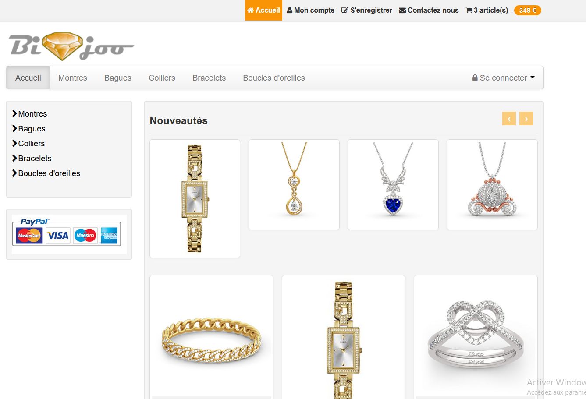
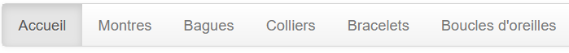

# TP Sécurité


## 1.  🚧 

## 2. 🧪 Accès et découverte de DVWA

Damn Vulnerable Web Application (DVWA) est une application web PHP/MariaDB volontairement très vulnérable.
Son objectif principal est :

- d’aider les professionnels de la sécurité à tester leurs compétences et leurs outils dans un environnement légal
- d’aider les développeurs web à mieux comprendre les mécanismes de sécurisation des applications web,
- de servir de support aux étudiants et aux enseignants pour apprendre la sécurité des applications web dans un cadre pédagogique contrôlé.

[Lien vers le dépot GitHub 🔽 ](https://github.com/digininja/DVWA)

??? note "How To install"

    - Place le dossier DVWA dans le répertoire `C:\wamp64\www\`
    - Dans le dossier DVWA/config/, copie le fichier : config.inc.php.dist  →  config.inc.php
    - Ouvre ``config.inc.php`` et ajuste la config :

        ```php
        $_DVWA[ 'db_user' ] = 'root';
        $_DVWA[ 'db_password' ] = '';   // par défaut root n’a PAS de mot de passe sous WAMP
        $_DVWA[ 'db_database' ] = 'dvwa';
        ```
    - Activer ``allow_url_include`` et ``gd`` dans `php.ini` :   Active/supprime le ``;`` si présent

        ```php
        allow_url_include = On
        allow_url_fopen = On
        extension=gd
        ```
    - Crée une nouvelle base appelée **dvwa**
    - Lancer http://localhost/DVWA/setup.php > Create / Reset Database
    - Connecte-toi avec : **Login** : admin et **Password** : password

    Pour finir : Régler le niveau de sécurité<br />
    Dans le menu DVWA → DVWA Security → choisis **Low** pour débuter.<br />


## 3. 💍 Site bijoo

### 3.1	Installation du site web Bijoo

Vous allez prendre en main le site web Bijoo qui est la version 1 d'un site web de vente de bijoux.

{: width=40% .center}
 
•	Pour cela, récupérez l'archive TP-breizhsecu.zip et dé-zippez-là. Placez le répertoire "breizhsecu" à la racine de votre serveur web à l'emplacement localhost, l'url d'appel du site sera donc la suivante : http://localhost/breizhsecu
•	Récupérez dans le répertoire "data" à la racine, le fichier bzh.sql pour l'importer dans la base de données de votre choix.
•	Modifier le fichier admin/config/bdd_config.inc pour connecter votre base de données MySQL

### 3.2	Découverte de l'application

Le site Bijoo comporte plusieurs catégories de produits :

-	Montres
-	Bagues
-	Colliers
-	Bracelets
-	Boucles d'oreilles

Il est possible de consulter les produits de chaque catégorie depuis les pages du même nom.

{: width=40% .center}
 
Un visiteur du site peut déposer un avis sur un ou plusieurs produits, il peut également les placer dans son panier et les commander. 
Pour vous familiariser avec ce site, nous vous proposons le parcours suivant - prenez bien soin de regarder les URL d'appel de chaque page sur lesquelles vous vous retrouverez :

-	Allez dans la catégorie Montres et laissez un avis sur la montre HighWay sans être connecté.
-	Continuez ensuite votre visite et placez dans votre panier la bague Dragon (facilement reconnaissable grâce à son design rappelant facilement le dessin d'animation), ainsi que les boucles d'oreille Améthia.
-	Visualisez ensuite votre panier.
Vous pouvez constater qu'à ce stade, vous ne pouvez pas finaliser votre commande.
-	Créez alors un compte avec les login et mot de passe suivant :  test / test, puis connectez-vous et enfin validez votre panier pour "payer". La version de ce site ne prévoit pas le système de paiement mais cette version est suffisante pour explorer les points indispensables à étudier pour appréhender les enjeux de la sécurité des sites web.
-	Familiarisez-vous ensuite avec l'onglet "Mon compte" en visualisant vos informations personnelles, vos commandes et vos avis si vous en avez postés en étant identifié.
