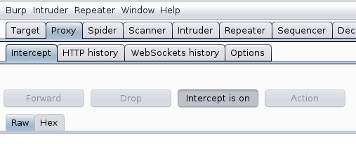
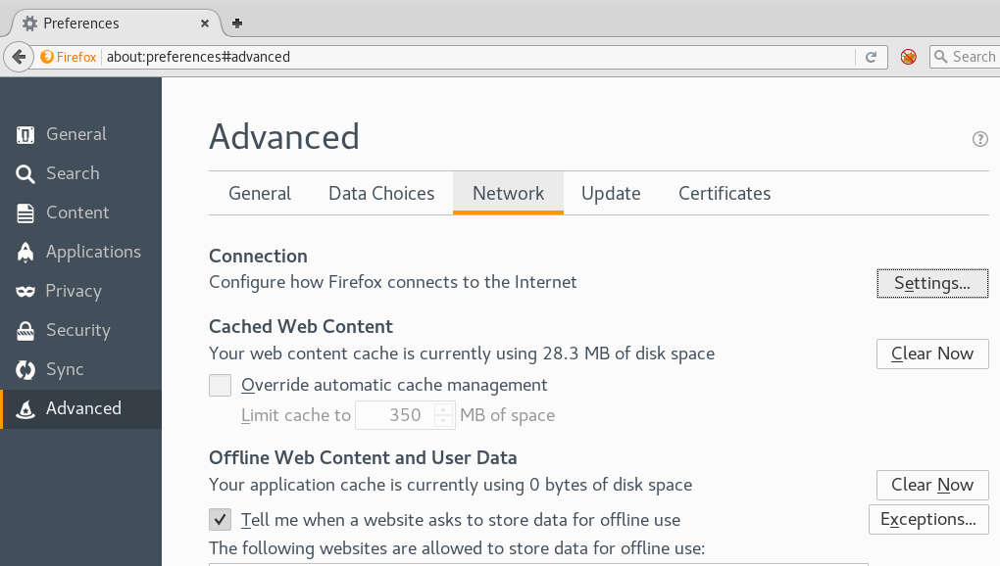
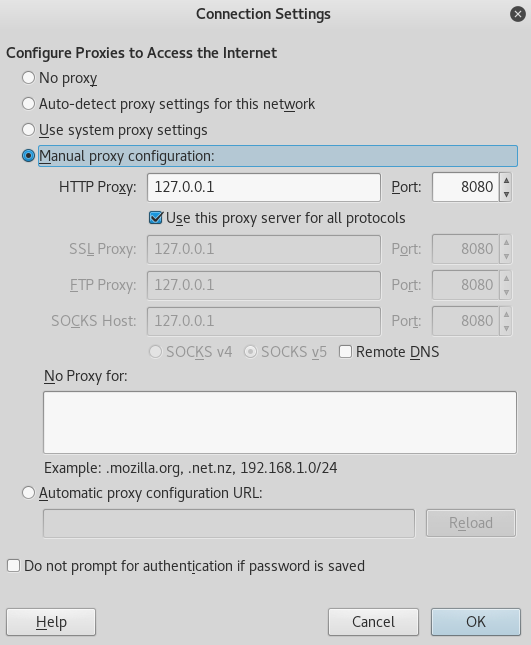

# TP Violation de Gestion d'authentification et de session 🔐

!!! info "Définition (OWASP Top 10 – A07 :2021)"
    A07:2021 – Identification and Authentication Failures désigne l’ensemble des failles liées à l’identification et à la gestion de l’authentification, permettant à un attaquant de contourner ou de compromettre les mécanismes de connexion d’une application.

!!! info "🎯 Objectifs pédagogiques"

    * Identifier les vulnérabilités liées à l’authentification et à la gestion de session.
    * Réaliser une attaque par force brute avec Burp Suite Intruder.
    * Mettre en évidence une injection SQL sur formulaire d’authentification.
    * Évaluer la robustesse des mécanismes de session.
    * Proposer des contre-mesures alignées sur les bonnes pratiques OWASP/ANSSI.

## 1. Rappels théoriques 🧠

### 1.1 Attaques liées à l’authentification 🔓

**Risques :**

* force brute automatisée  
* comptes par défaut
* mots de passe faibles
* stockage non sécurisé

**Protections :**

* limitation d’essais
* délais progressifs
* journalisation
* non-divulgation des erreurs d’authentification
* élimination des comptes par défaut

### 1.2 Authentification brisée (OWASP A07) 🛑

Un site est vulnérable si :

* il autorise la force brute
* il stocke les mots de passe en clair
* il expose les ID de session
* il n’invalide pas les jetons
* il n’utilise pas (ou mal) le MFA

**Conséquences :**

- 👉 prise de contrôle d’un compte
- 👉 usurpation d’identité
- 👉 exfiltration de données sensibles

## 2. Comportement du formulaire d’authentification 🔍 

1. Ouvrir :
   `http://localhost/breizhsecu/admin/`
2. Réaliser volontairement **5 tentatives erronées**.

❓ Q1. Y a-t-il une limitation du nombre d’essais ?

??? question "Solution Question n°1"
    Aucune limitation n’est appliquée : l’utilisateur peut essayer un nombre illimité de mots de passe.
    C’est une faiblesse majeure facilitant la force brute.

❓ Q2. Le message d’erreur précise-t-il si le login ou le mot de passe est incorrect ?

??? question "Solution Question n°2"
    Oui, le message distingue parfois login/mot de passe incorrect.
    Cela informe l’attaquant sur la validité du login et viole les bonnes pratiques OWASP.

## 3. Interception des requêtes avec Burp Suite 🛰️

### 3.1. Installation BurpSuite

🔽 Installer depuis la page [Burp Suite](https://portswigger.net/burp/releases/professional-community-2021-12-1?requestededition=community){targer="_blank"}

**Burp** est conçu pour être utilisé avec votre navigateur. Il fonctionne comme un **serveur proxy HTTP** et tout le trafic HTTP/S de votre navigateur passe par Burp. Pour vous assurer que l'écouteur proxy de Burp fonctionne, accédez à l'onglet Proxy et assurez-vous que Intercept est activé, comme indiqué ci-dessous.

??? tip "HowTo"
    { .center width=50%}
    Maintenant, vous devez configurer votre navigateur pour utiliser l'écouteur Burp Proxy comme serveur proxy HTTP. Pour ce faire, vous devez modifier les paramètres de proxy de votre navigateur pour utiliser l'adresse de l'hôte proxy (127.0.0.1) et le port 8080 pour les protocoles HTTP et HTTPS. Dans Firefox, allez dans Préférences. Cliquez sur Avancé, sélectionnez l'onglet Réseau et cliquez sur Paramètres, comme indiqué ci-dessous.
    
    Sélectionnez le bouton radio Configuration manuelle du proxy. Entrez 127.0.0.1 dans le champ Proxy HTTP et entrez 8080 dans le champ Port. Assurez-vous que la case Utiliser ce serveur proxy pour tous les protocoles est cochée. Supprimez tout ce qui se trouve dans le champ Aucun proxy pour le champ. Enregistrez les paramètres.
    
    Maintenant, si tout est configuré correctement, tout votre trafic HTTP/S devrait passer par Burp. Chaque fois que vous visitez un site Web, l'onglet Proxy de Burp changera sa couleur en orange et Burp conservera la demande jusqu'à ce que vous décidiez quoi en faire. À ce stade, vous pouvez désactiver l'interception et ne l'activer que lorsque vous en avez besoin.

1. Configurer Firefox → Proxy manuel → **127.0.0.1:8080**
2. Activer **Intercept On**.
3. Intercepter une tentative de connexion.

❓ Q3. Quels champs sont transmis dans la requête ?

??? question "Solution Question n°3"
    Le POST contient typiquement :

    - `username=...`
    - `password=...`
    - parfois un `token` CSRF (selon version)

❓ Q4. Le mot de passe circule-t-il en clair dans la requête ?

??? question "Solution Question n°4"
    Oui, le mot de passe apparaît en clair dans le champ POST (non chiffré si HTTP).

### 3.2. Attaque par force brute (Burp Intruder) 🚀

1. Envoyer la requête vers Intruder.
2. Définir les positions (`username`, `password`).
3. Type d’attaque : **Cluster Bomb**.
4. Charger des listes de logins et mots de passe.
5. Lancer l’attaque.

❓ Q5. Quel couple login/mot de passe permet l’accès ?

??? question "Solution Question n°5"

    Selon la configuration fournie dans le TP, le couple trouvé est souvent :
    **login : admin**
    **password : admin**
    ou encore un mot de passe trivial contenu dans `rockyou.txt`.

❓ Q6. Pourquoi cette attaque est-elle possible ?

??? question "Solution Question n°6"

    - absence de limitation d’essais
    - absence de délai progressif
    - mots de passe faibles ou par défaut
    - absence de filtrage d’IP
    - messages d’erreur explicites

## 4.  Analyse de la gestion de session 🕒

Si vous étiez un pirate qui tentait d'accéder à la partie back-end de l'application, c’est-à-dire la partie ou l'administrateur du site va se connecter, quelles url tenteriez-vous rapidement pour retrouver la page permettant à un administrateur de s'authentifier ?

- http://localhost/breizhsecu/backend
- http://localhost/breizhsecu/administrateur
- http://localhost/breizhsecu/manager
- http://localhost/breizhsecu/admin
- http://localhost/breizhsecu/secure

Tentez chacune de ces URL, laquelle vous mène vers quelque chose d'exploitable ? Notez bien cette URL.  
Connectez-vous ensuite à un compte utilisateur, puis retournez sur cette url. Que se passe-t-il ? Potentiellement rien, mais si vous appliquez la même logique de programmation pour la partie dédiée aux utilisateurs que celle dédiée aux administrateurs, quelle url serait-il judicieux de tester ?

**Actions :**

* se connecter
* récupérer le cookie de session
* vérifier présence d’un ID dans l’URL
* tester la déconnexion

❓ Q9. Le cookie de session contient-il un identifiant simple ?

??? question "Solution Question n°9"
    Sur de nombreuses versions du TP, l’ID de session est simple (ex : valeur séquentielle).
    Cela facilite l’usurpation de session.

❓ Q10. L’ID de session apparaît-il dans l’URL ?

??? question "Solution Question n°10"
    Dans certains cas oui : `?PHPSESSID=...`
    C’est une mauvaise pratique sévèrement interdite par l’OWASP.

❓ Q11. Que se passe-t-il en cas de fermeture d’onglet / retour / déconnexion ?

??? question "Solution Question n°11"

    - fermeture d’onglet : session encore active
    - retour sur l’accueil : utilisateur toujours connecté
    - déconnexion : parfois le cookie n’est pas invalidé → session réutilisable

## 5. 🛡️ Recommandations de sécurité

* mise en place MFA
* limitation d’essais
* délais progressifs
* hashing robuste (bcrypt/argon2)
* suppression des comptes par défaut
* invalidation stricte des sessions
* non-exposition des IDs de session
* utilisation de requêtes préparées (SQL)
* journalisation et alertes sur échecs répétés

