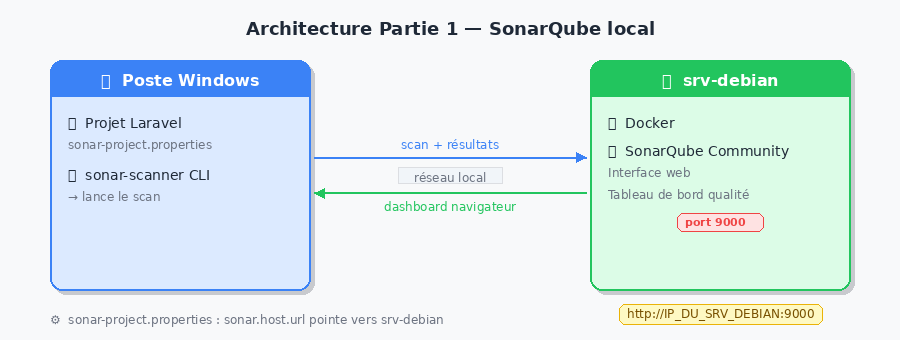
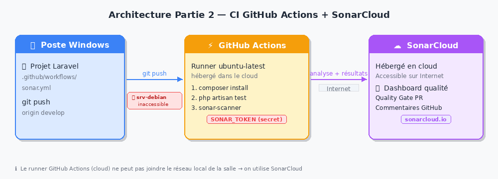

# TP — Audit de code avec SonarQube 👮‍♀️

!!! info "Compétences visées (B3.5)"

    - Analyser et corriger les vulnérabilités détectées à l'issue d'un audit de sécurité d'une application web
    - Utiliser des outils d'analyse statique intégrés dans une chaîne CI/CD
    - Vérifier la conformité d'une solution applicative à un référentiel de sécurité

!!! abstract "Architecture du TP"

    Ce TP implique **deux machines distinctes** :

    | Machine | Rôle | 
    |---------|------|
    | **srv-debian** (serveur commun) | Héberge SonarQube via Docker | 
    | **Poste Windows** (poste étudiant) | Héberge le projet Laravel + lance le scan | 

    {: .center width=80%}

    !!! warning "Prérequis"
        - Votre projet Laravel est installé sur votre **poste Windows**
        - Vous avez accès au **srv-debian** via le réseau local de la salle (IP `192.168.0.119`)

## PARTIE 1 — SonarQube sur srv-debian + scan depuis Windows

### Étape 0 — Lancement de SonarQube (fait par l'enseignant)

> ℹ️ Cette étape a déjà été réalisée sur le srv-debian. Elle est documentée ici pour votre culture DevOps.

Sur le **srv-debian**, en SSH :

```bash
docker network create sonar-net

docker run -d \
  --name sonarqube \
  --network sonar-net \
  -p 9000:9000 \
  -e SONAR_ES_BOOTSTRAP_CHECKS_DISABLE=true \
  sonarqube:community
```

SonarQube est alors accessible depuis tous les postes de la salle à l'adresse :

```
http://IP_DU_SRV_DEBIAN:9000
```

### Étape 1 — Créer votre projet dans SonarQube

Depuis votre **navigateur Windows**, accédez à :

```
http://IP_DU_SRV_DEBIAN:9000
```

Identifiants : `votre_prenom` / `vzfC8eDN*ym7` 

1. Cliquez sur *Create a local project**
2. **Display name** : `laravel-nomProjet-prenom`  et  **Project key** duplique ce nom
3. **Main branch name** : main
4. Cliquez sur **Next**
5. Choisissez **Follows the instance's default**
6. Générez un **token** → notez-le, il ne sera plus affiché

---

### Étape 2 — Installer Sonar Scanner sur Windows

Téléchargez le scanner CLI pour Windows :

👉 [https://binaries.sonarsource.com/Distribution/sonar-scanner-cli/sonar-scanner-cli-5.0.1.3006-windows.zip](https://binaries.sonarsource.com/Distribution/sonar-scanner-cli/sonar-scanner-cli-5.0.1.3006-windows.zip)

Décompressez l'archive dans `C:\sonar-scanner`.

Ajoutez `C:\sonar-scanner\bin` au **PATH Windows** :

1. Rechercher "Variables d'environnement" dans le menu Démarrer
2. **Variables système → Path → Modifier → Nouveau**
3. Ajouter : `C:\sonar-scanner\bin`
4. Valider et **redémarrer le terminal**

Vérification dans un nouveau terminal PowerShell :

```powershell
sonar-scanner --version
```

### Étape 3 — Configurer votre projet Laravel

À la **racine de votre projet Laravel** (sur Windows), créez le fichier `sonar-project.properties` :

```properties
# Identifiant unique — doit correspondre à celui créé sur SonarQube
sonar.projectKey=laravel-prenom
sonar.projectName=Mon Projet Laravel

# Dossiers à analyser
sonar.sources=app,routes,database,resources
sonar.exclusions=vendor/**,node_modules/**,storage/**,bootstrap/cache/**,public/**

# Langue et encodage
sonar.language=php
sonar.sourceEncoding=UTF-8

# Adresse du serveur SonarQube (sur srv-debian)
sonar.host.url=http://IP_DU_SRV_DEBIAN:9000

# Token généré à l'étape 1
sonar.login=VOTRE_TOKEN_ICI
```

!!! warning "Attention"
    - Remplacez `IP_DU_SRV_DEBIAN` par l'IP réelle communiquée par l'enseignant
    - Remplacez `VOTRE_TOKEN_ICI` par votre token
    - N'ajoutez **jamais** ce fichier dans Git avec le token (ajoutez-le au `.gitignore`)

### Étape 4 — Lancer le scan depuis Windows

Ouvrez un terminal **PowerShell** dans le dossier de votre projet :

```powershell
cd C:\chemin\vers\mon-projet-laravel
sonar-scanner
```

Résultat attendu en fin d'exécution :

```
INFO: ANALYSIS SUCCESSFUL, you can find the results at:
http://IP_DU_SRV_DEBIAN:9000/dashboard?id=laravel-prenom
```

Retournez dans votre navigateur sur le dashboard SonarQube pour consulter les résultats.

### ❓ Questions — Partie 1

#### Question 1.1

> Décrivez ce que vous observez sur le **dashboard principal** de SonarQube après l'analyse.  
> Notez : la note de fiabilité, de sécurité, de maintenabilité et la dette technique estimée.

??? question "Éléments de correction"

    L'étudiant doit identifier et noter les 4 axes principaux :

    - **Reliability** (fiabilité) : note A à E selon le nombre de bugs détectés
    - **Security** (sécurité) : note A à E selon les vulnérabilités
    - **Maintainability** (maintenabilité) : note A à E selon les code smells
    - **Technical Debt** : estimé en minutes/heures/jours de travail correctif

    Un projet Laravel bien structuré affiche généralement des notes A ou B.  
    Un projet avec du code legacy peut afficher C, D ou E avec plusieurs heures de dette.

    *Exemple de réponse attendue :*
    > "Mon projet affiche Reliability B, Security A, Maintainability C avec 2h30 de dette technique.
    > 12 code smells ont été détectés, principalement sur des méthodes trop longues."

    **Point de vigilance enseignant :** chaque étudiant a son propre project key (`laravel-prenom`).  
    Les résultats sont visibles séparément sur le srv-debian. Vérifiez que chaque étudiant  
    a bien accédé à **son propre projet** et non celui d'un camarade.

#### Question 1.2

> Rendez-vous dans l'onglet **Issues**. Identifiez 3 problèmes détectés et classez-les selon leur sévérité.  
> Pour chacun, indiquez : le fichier concerné, la ligne, le type (Bug / Vulnerability / Code Smell) et la sévérité.

??? question "Éléments de correction"

    L'étudiant doit renseigner un tableau de ce type :

    | # | Fichier | Ligne | Type | Sévérité | Description |
    |---|---------|-------|------|----------|-------------|
    | 1 | `app/Http/Controllers/UserController.php` | 42 | Code Smell | Major | Méthode trop longue (> 30 lignes) |
    | 2 | `routes/web.php` | 15 | Vulnerability | Critical | Absence de middleware auth |
    | 3 | `app/Models/Post.php` | 8 | Code Smell | Minor | Variable non utilisée |

    **Sévérités à retenir :**

    | Sévérité | Signification |
    |----------|---------------|
    | `Blocker` | À corriger immédiatement, bloque la production |
    | `Critical` | Risque de sécurité ou comportement incorrect majeur |
    | `Major` | Impact fort sur la maintenabilité |
    | `Minor` | Problème de style ou de lisibilité |
    | `Info` | Suggestion, pas de risque immédiat |

#### Question 1.3

> Repérez un **Security Hotspot** dans l'onglet dédié. Expliquez pourquoi SonarQube le signale  
> et si, après analyse, vous considérez qu'il s'agit d'un vrai risque ou d'un faux positif.

??? question "Éléments de correction"

    Les Security Hotspots les plus courants dans un projet Laravel :

    - **`rand()` ou `mt_rand()`** au lieu de `random_int()` → PRNG non cryptographiquement sûr
    - **Requête SQL non paramétrée** → risque d'injection SQL
    - **Désactivation du middleware CSRF** sur une route
    - **Données sensibles** stockées en clair dans les logs

    SonarQube signale ces zones car il ne peut pas déterminer seul si le contexte est dangereux.  
    C'est à l'auditeur humain de trancher.

    *Distinction faux positif / vrai risque :*

    - `rand()` pour générer un slug d'article → **faux positif** (pas d'enjeu sécurité)
    - `rand()` pour générer un token de réinitialisation → **vrai risque critique**

#### Question 1.4

> Dans l'onglet **Measures**, relevez la **complexité cyclomatique** et le **taux de duplication**.  
> Expliquez ce que mesure la complexité cyclomatique et ce qu'implique un taux de duplication élevé.

??? question "Éléments de correction"

    **Complexité cyclomatique** : nombre de chemins d'exécution indépendants dans une fonction.  
    Se calcule en comptant les branchements : `if`, `else`, `for`, `while`, `case`, `&&`, `||`…

    | Valeur | Interprétation |
    |--------|----------------|
    | 1 – 5 | Simple, facile à tester |
    | 6 – 10 | Modérément complexe |
    | 11 – 20 | Difficile à tester, à refactoriser |
    | > 20 | Très complexe, risque élevé de bugs |

    **Taux de duplication :**  
    Un taux > 3 % est un signal d'alarme. Il indique du code copié-collé :  
    une correction faite à un endroit risque d'être oubliée à l'autre.  
    Solution : extraire le code commun dans une méthode ou un composant réutilisable.

#### Question 1.5

> Choisissez **un bug ou une vulnérabilité** détectée. Proposez une correction PHP/Laravel  
> et expliquez en quoi cette correction améliore la sécurité ou la qualité du projet.

??? question "Éléments de correction"

    **Exemple 1 — Injection SQL**

    ```php
    // ❌ Code vulnérable
    $users = DB::select("SELECT * FROM users WHERE email = '" . $email . "'");

    // ✅ Requête paramétrée
    $users = DB::select("SELECT * FROM users WHERE email = ?", [$email]);

    // ✅ Ou avec Eloquent (recommandé Laravel)
    $users = User::where('email', $email)->get();
    ```

    **Exemple 2 — PRNG non sécurisé pour token**

    ```php
    // ❌ Non sécurisé
    $token = md5(rand());

    // ✅ Cryptographiquement sûr
    $token = bin2hex(random_bytes(32));
    ```

    **Exemple 3 — Méthode trop complexe (refactoring)**

    Découper une méthode de 60 lignes avec 8 `if` en plusieurs méthodes privées  
    de 10 à 15 lignes chacune, chacune avec une seule responsabilité (principe SRP).

    L'étudiant doit justifier sa correction en lien avec les critères du cours :  
    sécurité, lisibilité, maintenabilité ou testabilité.

## PARTIE 2 — Intégration dans la CI avec GitHub Actions + SonarCloud

!!! info "Pourquoi SonarCloud et pas SonarQube ici ?"

    La CI GitHub Actions s'exécute sur des **runners cloud** hébergés par GitHub.  
    Ces runners n'ont **aucun accès au réseau local** de la salle, donc ils ne peuvent  
    pas joindre le srv-debian (`192.168.x.x:9000`).  
    On utilise donc **SonarCloud**, la version hébergée de SonarQube, accessible depuis Internet.

    {: .center width=80%}

### Étape 1 — Créer un compte SonarCloud

1. Rendez-vous sur [https://sonarcloud.io](https://sonarcloud.io)
2. Connectez-vous avec votre compte **GitHub**
3. Importez votre dépôt Laravel
4. Notez votre `SONAR_ORGANIZATION` et le `SONAR_PROJECT_KEY`

### Étape 2 — Ajouter le token en secret GitHub

1. Sur votre dépôt GitHub → **Settings → Secrets and variables → Actions**
2. **New repository secret**
3. Nom : `SONAR_TOKEN` — Valeur : le token généré sur SonarCloud

---

### Étape 3 — Créer le workflow GitHub Actions

Depuis votre poste Windows, créez `.github/workflows/sonar.yml` à la racine du projet :

```yaml
name: SonarCloud Analysis

on:
  push:
    branches: [ main, develop ]
  pull_request:
    branches: [ main ]

jobs:
  sonarcloud:
    name: Analyse SonarCloud
    runs-on: ubuntu-latest

    steps:
      - name: Checkout du code
        uses: actions/checkout@v4
        with:
          fetch-depth: 0   # Historique complet requis par SonarCloud

      - name: Setup PHP
        uses: shivammathur/setup-php@v2
        with:
          php-version: '8.2'
          extensions: mbstring, xml, pdo_sqlite
          coverage: xdebug

      - name: Installation des dépendances
        run: composer install --no-interaction --prefer-dist --optimize-autoloader

      - name: Configuration de l'environnement
        run: cp .env.example .env && php artisan key:generate

      - name: Exécution des tests avec couverture
        run: php artisan test --coverage-clover=coverage.xml

      - name: Analyse SonarCloud
        uses: SonarSource/sonarcloud-github-action@master
        env:
          GITHUB_TOKEN: ${{ secrets.GITHUB_TOKEN }}
          SONAR_TOKEN: ${{ secrets.SONAR_TOKEN }}
        with:
          args: >
            -Dsonar.organization=VOTRE_ORGANISATION
            -Dsonar.projectKey=laravel-prenom
            -Dsonar.sources=app,routes,database
            -Dsonar.exclusions=vendor/**,node_modules/**
            -Dsonar.php.coverage.reportPaths=coverage.xml
```

---

### Étape 4 — Déclencher et observer la CI

Commitez et poussez depuis votre poste Windows :

```bash
git add .github/workflows/sonar.yml .gitignore
git commit -m "feat: ajout analyse SonarCloud en CI"
git push origin develop
```

!!! warning "Ne pas versionner les secrets"
    Vérifiez que `sonar-project.properties` est bien dans votre `.gitignore` :
    ```
    # .gitignore
    sonar-project.properties
    .env
    ```

---

### ❓ Questions — Partie 2

#### Question 2.1

> Expliquez pourquoi on utilise **SonarCloud** dans la CI et non le **SonarQube du srv-debian**.  
> Quel problème réseau cela pose-t-il et comment pourrait-on le contourner en entreprise ?

??? question "Éléments de correction"

    **Raison principale :** les runners GitHub Actions sont des machines cloud.  
    Ils n'ont aucun accès au réseau local de la salle → **impossible de joindre `192.168.x.x:9000`**.

    **Contournements possibles en entreprise :**

    | Solution | Description | Contexte |
    |----------|-------------|----------|
    | **SonarCloud** | Version SaaS hébergée | Projets pouvant aller en cloud |
    | **Self-hosted runner** | Runner GitHub installé sur le srv-debian | Réseau interne, projets confidentiels |
    | **VPN** | Tunnel entre runner cloud et réseau interne | Infrastructure hybride |
    | **SonarQube exposé** | srv-debian accessible via reverse proxy HTTPS | Si la politique sécurité le permet |

    **La solution self-hosted runner** est la plus pertinente dans notre contexte :  
    on installe le runner directement sur le srv-debian, qui peut alors communiquer  
    avec SonarQube en local (`http://localhost:9000`).

---

#### Question 2.2

> Expliquez à quoi sert le paramètre `fetch-depth: 0`.  
> Que se passerait-il si on le supprimait ?

??? question "Éléments de correction"

    Par défaut, `actions/checkout` fait un **shallow clone** : il ne récupère que le dernier commit.

    SonarCloud a besoin de l'**historique complet** pour :

    - Calculer les métriques d'évolution dans le temps
    - Distinguer le **new code** de l'**overall code** (base du Quality Gate)
    - Comparer correctement les branches sur les Pull Requests

    Sans `fetch-depth: 0`, SonarCloud peut échouer ou produire des résultats incomplets,  
    notamment sur les analyses de Pull Requests.

---

#### Question 2.3

> Quel est le rôle du `.env.example` dans la CI ?  
> Pourquoi le `.env` ne doit-il **jamais** être versionné ?

??? question "Éléments de correction"

    **Rôle du `.env.example` :**  
    Fichier modèle versionné listant toutes les variables d'environnement **sans leurs valeurs sensibles**.  
    Dans la CI, il sert à créer un `.env` fonctionnel pour exécuter les tests.

    **Pourquoi ne pas versionner `.env` :**  
    Il contient des secrets : `DB_PASSWORD`, `APP_KEY`, clés d'API tierces…

    Risques si versionné :
    - Toute personne ayant accès au dépôt voit les secrets
    - Des bots scannent GitHub en permanence (GitGuardian, truffleHog)
    - L'historique Git conserve les fichiers même après suppression (`git log`)

    **Bonne pratique :** utiliser les **Secrets GitHub** et les injecter en variables d'environnement CI.

---

#### Question 2.4

> Comparez les deux approches utilisées dans ce TP.  
> Quels sont les avantages et inconvénients de chaque configuration ?

??? question "Éléments de correction"

    | Critère | SonarQube sur srv-debian (Partie 1) | SonarCloud en CI (Partie 2) |
    |---------|--------------------------------------|------------------------------|
    | **Déclenchement** | Manuel depuis Windows | Automatique à chaque push/PR |
    | **Localisation données** | Réseau local, données internes | Cloud, données chez SonarSource |
    | **Accessibilité** | Réseau local uniquement | Accessible depuis Internet |
    | **Intégration PR** | Non native | Oui, commentaires automatiques |
    | **Infrastructure** | À maintenir (srv-debian) | Infogérée |
    | **Confidentialité** | Totale (code ne quitte pas le réseau) | Code envoyé vers le cloud |
    | **Coût** | Gratuit (Community Edition) | Gratuit pour projets open-source |

    **Conclusion :**  
    L'approche srv-debian est idéale pour des projets confidentiels ou des audits ponctuels.  
    L'approche SonarCloud en CI garantit une qualité continue et automatisée,  
    adaptée aux projets hébergés publiquement sur GitHub.

---

#### Question 2.5 — Question ouverte

> En vous appuyant sur les résultats des deux parties, rédigez un **rapport de qualité synthétique**  
> d'une vingtaine de lignes à destination d'un chef de projet.  
> Ce rapport doit mentionner : les métriques clés, les points critiques, et 3 recommandations priorisées.

??? question "Éléments de correction"

    *Critères d'évaluation du rapport :*

    - **Métriques clés présentes** : note globale, dette technique, couverture, duplication, nombre d'issues
    - **Hiérarchisation** : l'étudiant distingue le critique de l'accessoire
    - **Recommandations concrètes et priorisées** : pas de généralités, des actions précises
    - **Ton adapté** : destiné à un chef de projet, pas à un développeur

    *Exemple de structure attendue :*

    > **Rapport d'audit qualité — Projet bijoo — [Date]**
    >
    > L'analyse réalisée via SonarQube révèle une note B en fiabilité, A en sécurité  
    > et C en maintenabilité, avec une dette technique estimée à 3h45.
    >
    > **Points critiques :**
    > - 2 vulnérabilités Critical dans le module d'authentification
    > - Complexité cyclomatique élevée (14) sur `CommandeController::store()`
    > - Taux de duplication de 7 % sur les vues Blade
    >
    > **Recommandations priorisées :**
    > 1. *(Avant mise en production)* Corriger les 2 vulnérabilités de sécurité
    > 2. *(Sprint suivant)* Refactoriser `CommandeController::store()` en sous-méthodes
    > 3. *(Backlog)* Extraire les composants Blade dupliqués en partials réutilisables

    **Points perdus si :**
    - Rapport trop technique sans synthèse managériale
    - Aucune donnée chiffrée issue de l'outil
    - Recommandations vagues ("améliorer le code", "faire des tests")

---

## 📋 Livrables attendus

!!! warning "À remettre à la fin du TP"

    1. **Capture d'écran** du dashboard SonarQube (srv-debian) après le scan — Partie 1
    2. **Fichier `sonar-project.properties`** avec le token masqué (`***`)
    3. **Fichier `.github/workflows/sonar.yml`** fonctionnel
    4. **Capture d'écran** du workflow GitHub Actions (vert ou rouge avec explication)
    5. **Capture d'écran** du dashboard SonarCloud après la CI
    6. **Réponses rédigées** aux questions 1.1 à 2.5

---

## 🏁 Bilan du TP

!!! success "Ce que vous avez mis en pratique"

    - Utilisation d'un outil d'analyse statique déployé sur un serveur partagé (srv-debian + Docker)
    - Configuration du scanner sur un poste Windows pour analyser un projet PHP/Laravel
    - Lecture et interprétation d'un rapport SonarQube
    - Intégration d'un Quality Gate dans une pipeline GitHub Actions via SonarCloud
    - Compréhension des contraintes réseau entre environnement local et cloud
    - Rédaction d'un rapport de qualité à destination d'une équipe projet
