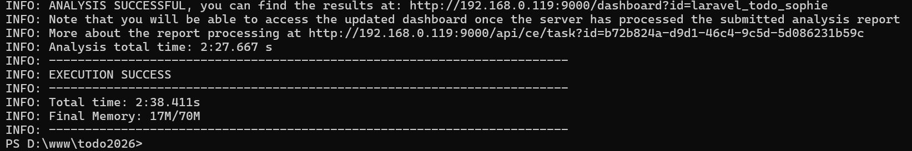
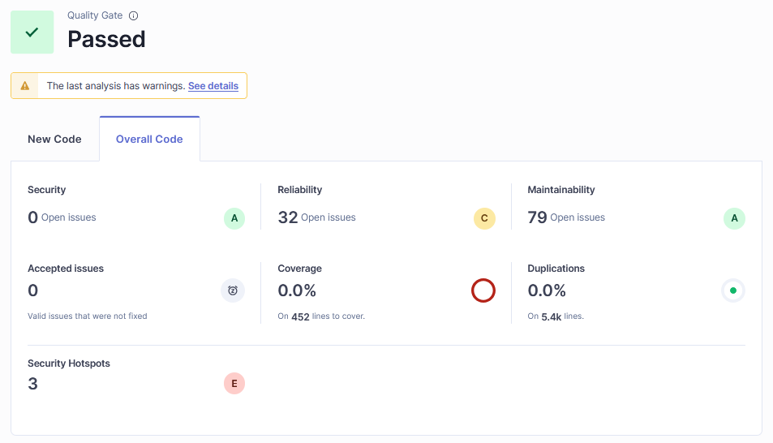
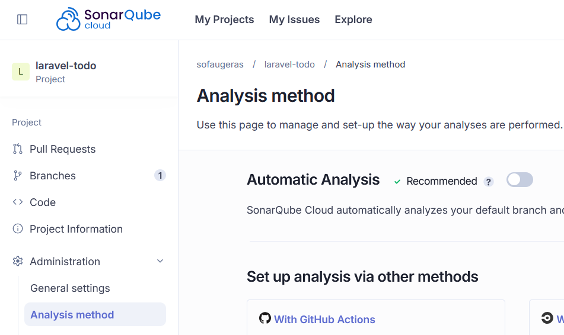
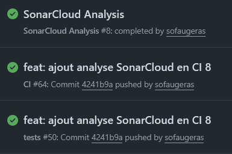
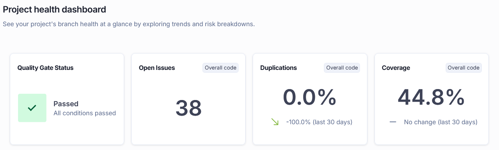

# TP — Audit de code avec SonarQube 👮‍♀️

!!! info "Compétences visées (B3.5)"

    - Analyser et corriger les vulnérabilités détectées à l'issue d'un audit de sécurité d'une application web
    - Utiliser des outils d'analyse statique intégrés dans une chaîne CI/CD
    - Vérifier la conformité d'une solution applicative à un référentiel de sécurité

!!! abstract "Architecture du TP"

    Ce TP implique **deux machines distinctes** :

    | Machine | Rôle | 
    |---------|------|
    | **srv-debian** (serveur commun) | Héberge SonarQube via Docker | 
    | **Poste Windows** (poste étudiant) | Héberge le projet Laravel + lance le scan | 

    {: .center width=80%}

    !!! warning "Prérequis"
        - Votre projet Laravel est installé sur votre **poste Windows**
        - Vous avez accès au **srv-debian** via le réseau local de la salle (IP `192.168.0.119`)

!!! tip "Construction du Compte-Rendu Audit de code - SonarQube"

    1. **Capture d'écran** du dashboard SonarQube (srv-debian) après le scan — Partie 1
    2. **Fichier `sonar-project.properties`** avec le token masqué (`***`)
    3. **Fichier `.github/workflows/sonar.yml`** fonctionnel
    4. **Capture d'écran** du workflow GitHub Actions (vert ou rouge avec explication)
    5. **Capture d'écran** du dashboard SonarCloud après la CI
    6. **Réponses rédigées** aux questions 1.1 à 2.5

## 1. SonarQube sur srv-debian + scan depuis Windows 🔍

### 1.0 Lancement de SonarQube (fait par l'enseignant) 🧑‍🏫

> ℹ️ Cette étape a déjà été réalisée sur le srv-debian. Elle est documentée ici pour votre culture DevOps.

Sur le **srv-debian**, en SSH :

```bash
docker network create sonar-net

docker run -d \
  --name sonarqube \
  --network sonar-net \
  -p 9000:9000 \
  -e SONAR_ES_BOOTSTRAP_CHECKS_DISABLE=true \
  sonarqube:community
```

SonarQube est accessible depuis tous les postes de la salle à l'adresse `http://192.168.0.119:9000`

### 1.1 Se connecter et créer votre projet 🔑

Depuis votre **navigateur Windows**, accédez à `http://192.168.0.119:9000`

Identifiants : `votre_prenom` / `vzfC8eDN*ym7` 

!!! info "Découverte de l'interface 🆕"

    Vous disposez désormais d'une **barre latérale verticale** à gauche avec les sections suivantes :

    | Icône | Section | Contenu |
    |-|||
    | 🏠 | **Projects** | Liste de tous les projets analysés |
    | ⚠️ | **Issues** | Tous les problèmes détectés, filtrables par projet |
    | 📋 | **Rules** | Catalogue complet des règles d'analyse |
    | 🔒 | **Quality Policies** | Quality Gates et Quality Profiles |
    |🔒|**Qulaity Gates**||
    | ⚙️ | **Administration** | Paramètres globaux de l'instance |

    Une fois dans un projet, une **sidebar de projet** apparaît avec :

    | Section | Contenu |
    |||
    | **Overview** | Tableau de bord résumé + Quality Gate |
    | **Issues** | Problèmes filtrés sur ce projet |
    | **Security Hotspots** | Points de sécurité à revoir manuellement |
    | **Measures** | Toutes les métriques détaillées |
    | **Code** | Navigation dans les fichiers sources |
    | **Activity** | Historique des analyses |

#### Création du projet

1. Cliquez sur **Projects** dans la sidebar gauche
2. Cliquez sur **Create a local project** (bouton en haut à droite)
3. Choisissez **Manually**
2. **Display name** : `laravel-nomProjet-prenom`  et  **Project key** duplique ce nom
3. **Main branch name** : main
6. Cliquez sur **Next**, choisir **Follows the Instance's Default** puis **Create project**
7. **How do you want to analyze your repository?** Choisissez **Locally**
8. Cliquez sur **Generate a token** → donnez-lui un nom "Analyze "laravel_todo_prenom" et une date d'expiration "30 days"→ **Generate**
9. **Copiez et notez le token** — il ne sera plus affiché

### 1.2 Installer Sonar Scanner sur Windows 💻

Téléchargez le scanner CLI pour Windows :

👉 [https://binaries.sonarsource.com/Distribution/sonar-scanner-cli/sonar-scanner-cli-5.0.1.3006-windows.zip](https://binaries.sonarsource.com/Distribution/sonar-scanner-cli/sonar-scanner-cli-5.0.1.3006-windows.zip)

Décompressez dans `C:\sonar-scanner`.

Ajoutez `C:\sonar-scanner\bin` au **PATH Windows** :

1. Rechercher "Variables d'environnement" dans le menu Démarrer
2. **Variables système → Path → Modifier → Nouveau**
3. Ajouter : `C:\sonar-scanner\sonar-scanner-5.0.1.3006-windows\bin` (vérifier avant que vous avez bien ces niveaux de dossier)
4. Lancer un terminal

Vérification dans un nouveau PowerShell :

```powershell
sonar-scanner --version
```

### 1.3 Configurer le projet Laravel 📝

À la **racine de votre projet Laravel**, créez `sonar-project.properties` :

```properties
sonar.projectKey=laravel-prenom
sonar.projectName=Laravel-Todo_prenom

sonar.sources=app,routes,database,resources
sonar.exclusions=vendor/**,node_modules/**,storage/**,bootstrap/cache/**,public/**

sonar.language=php
sonar.sourceEncoding=UTF-8

sonar.host.url=http://192.168.0.119:9000
sonar.login=VOTRE_TOKEN_ICI
```

!!! warning "Ne pas versionner ce fichier ⚠️"
    Ajoutez `sonar-project.properties` à votre `.gitignore` — il contient votre token.

### 1.4 Lancer le scan ▶️

Ouvrez un **PowerShell** à la racine de votre projet :

```powershell
cd C:\chemin\vers\mon-projet-laravel
sonar-scanner
```

Résultat attendu :

{: .center width=80%}

### 1.5 Lire les résultats dans l'interface 👀

Retournez dans le navigateur. Naviguez vers votre projet via **Projects** dans la sidebar.

#### Vue Overview

La page d'accueil du projet affiche le **Quality Gate** (Passed / Failed) et une synthèse des métriques réparties en deux colonnes :

- **New Code** : métriques sur le code récemment modifié
- **Overall Code** : métriques sur la totalité du code

C'est cette dernière métrique qui va nous intéresser puisque nouos avons que du nouveau code.

Les notes de qualité s'affichent sous forme de lettres **A à E** pour :

| Catégorie | Contenu |
|--||
| **Reliability** | Bugs détectés |
| **Security** | Vulnérabilités |
| **Maintainability** | Code smells + dette technique |
| **Security Review** | Taux de hotspots revus |
| **Coverage** | Couverture de tests (si configurée) |
| **Duplications** | Taux de duplication |

{: .center width=80%}

### 1.6 ❓ Questions

!!! question "Question 1.1 📊"
    === "Enoncé"
        Dans la vue **Overview** de votre projet, relevez les métriques affichées.  <br />
        Notez la note de chaque catégorie (A à E) et la dette technique estimée.  <br />
        Faites une capture d'écran de cette vue et commencez votre compte-rendu de TP

    === "Éléments de correction"

        Vous devez doit relever les 4 à 6 indicateurs visibles sur l'Overview :

        - **Reliability** : note A à E selon le nombre de bugs
        - **Security** : note A à E selon les vulnérabilités
        - **Maintainability** : note A à E selon les code smells, accompagnée de la dette technique en minutes/heures/jours
        - **Security Review** : note basée sur le % de Security Hotspots revus (A = ≥ 80% revus)

        Un projet Laravel bien structuré affiche généralement A ou B.  <br />
        Un projet legacy peut afficher C, D ou E avec plusieurs heures de dette.

!!! question "Question 1.2 🐛"
    === "Enoncé"
        Cliquez sur **Issues** dans la sidebar de projet.  <br />
        Identifiez 3 problèmes détectés. Pour chacun, relevez : le fichier concerné, la ligne, le type et la sévérité.

    === "Éléments de correction"

        Vous devez renseigner un tableau de ce type :

        | # | Fichier | Ligne | Type | Sévérité | Description |
        |||-||-|-|
        | 1 | `app/Http/Controllers/UserController.php` | 42 | Code Smell | Major | Méthode trop longue |
        | 2 | `routes/web.php` | 15 | Vulnerability | Critical | Absence de middleware auth |
        | 3 | `app/Models/Post.php` | 8 | Code Smell | Minor | Variable non utilisée |

        **Types d'issues en v26 (mode Standard Experience) :**

        | Type | Signification |
        |||
        | `Bug` | Comportement incorrect, risque d'erreur à l'exécution |
        | `Vulnerability` | Faille de sécurité exploitable |
        | `Code Smell` | Problème de maintenabilité, lisibilité ou structure |
        | `Security Hotspot` | Zone sensible à revoir manuellement |

        **Sévérités :**

        | Sévérité | Signification |
        |-||
        | `Blocker` | À corriger immédiatement, bloque la production |
        | `Critical` | Risque de sécurité ou comportement incorrect majeur |
        | `Major` | Impact fort sur la maintenabilité |
        | `Minor` | Problème de style ou de lisibilité |
        | `Info` | Suggestion, pas de risque immédiat |

        **Astuce navigation :** dans la vue Issues du projet, la sidebar gauche permet de filtrer par Type, Sévérité, Langage, Règle, ou Fichier. Les issues sont regroupées par fichier.

!!! question "Question 1.3 🔐"
    === "Enoncé"
        Cliquez sur **Security Hotspots** dans la sidebar de projet. <br />
        Repérez un hotspot. Expliquez pourquoi SonarQube le signale et déterminez s'il s'agit d'un vrai risque ou d'un faux positif.

    === "Éléments de correction"

        **Rappel de la différence Vulnerability / Security Hotspot en v26 :**

        - **Vulnerability** (dans Issues) : faille confirmée, à corriger immédiatement
        - **Security Hotspot** : code sensible qui *pourrait* être dangereux selon le contexte — c'est à l'auditeur humain de trancher

        **Hotspots les plus fréquents dans un projet Laravel :**

        | Règle | Exemple | Risque réel ? |
        |-|||
        | PRNG non sécurisé | `rand()` ou `mt_rand()` pour token | Oui si token sécurité, non si slug |
        | Requête potentiellement non paramétrée | Concaténation dans `DB::select()` | Oui si variable utilisateur |
        | Désactivation CSRF | Route sans middleware | Oui si formulaire public |
        | Log de données sensibles | `Log::info($password)` | Oui |

        **Cycle de vie d'un Hotspot :**  
        Un hotspot peut être marqué :
        - **To review** (défaut) — en attente d'analyse
        - **Acknowledged** — risque identifié, correction en cours
        - **Fixed** — corrigé
        - **Safe** — analysé, pas de risque dans ce contexte (faux positif)

!!! question "Question 1.4 📐"
    === "Enoncé"
        Cliquez sur **Measures** dans la sidebar de projet.  <br />
        Relevez la **complexité cyclomatique** et le **taux de duplication**.  <br />
        Expliquez ce que mesure la complexité cyclomatique et ce qu'implique un taux de duplication élevé.

    === "Éléments de correction"

        **Navigation pour les Measures :**  <br />
        Dans la sidebar du projet → **Measures** → les métriques sont regroupées par catégorie :<br />

        - *Reliability* → bugs
        - *Security* → vulnérabilités
        - *Maintainability* → code smells, dette, complexité
        - *Coverage* → couverture de tests
        - *Duplications* → duplication

        **Complexité cyclomatique** : nombre de chemins d'exécution indépendants dans une fonction. Se calcule en comptant les branchements : `if`, `else`, `for`, `while`, `case`, `&&`, `||`…

        | Valeur | Interprétation |
        |--|-|
        | 1 – 5 | Simple, facile à tester |
        | 6 – 10 | Modérément complexe |
        | 11 – 20 | Difficile à tester, à refactoriser |
        | > 20 | Très complexe, risque élevé de bugs |

        **Taux de duplication :**  <br />
        Un taux > 3 % est un signal d'alarme.  <br />
        Code copié-collé : une correction faite à un endroit risque d'être oubliée à l'autre.  <br />
        Solution : extraire le code commun dans une méthode ou un composant réutilisable.

        **Définition :** 💡 La complexité cyclomatique est une mesure quantitative de la complexité d'un programme informatique utilisée en informatique

        **Note :** la complexité cyclomatique se trouve dans Measures → Maintainability → Complexity.  <br />
        SonarQube calcule aussi la **complexité cognitive** (plus récente) qui mesure la difficulté de compréhension humaine.

!!! question "Question 1.5 🛠️"
    === "Enoncé"
        Choisissez **un bug ou une vulnérabilité** détectée.  <br />
        Proposez une correction du code PHP/Laravel et expliquez en quoi cette correction améliore la sécurité ou la qualité.

    === "Éléments de correction"

        **Exemple 1 — Injection SQL**

        ```php
        // ❌ Code vulnérable
        $users = DB::select("SELECT * FROM users WHERE email = '" . $email . "'");

        // ✅ Requête paramétrée
        $users = DB::select("SELECT * FROM users WHERE email = ?", [$email]);

        // ✅ Ou avec Eloquent (recommandé Laravel)
        $users = User::where('email', $email)->get();
        ```

        **Exemple 2 — Méthode trop complexe (refactoring)**

        Découper une méthode de 60 lignes avec 8 `if` en plusieurs méthodes privées  
        de 10 à 15 lignes chacune, chacune avec une seule responsabilité (principe SRP).

## 2. Intégration dans la CI avec GitHub Actions + SonarCloud ⚡

!!! info "Pourquoi SonarCloud et pas SonarQube ici ? ☁️"

    La CI GitHub Actions s'exécute sur des **runners cloud** hébergés par GitHub.  <br />
    Ces runners n'ont **aucun accès au réseau local** de la salle : impossible de joindre le srv-debian.  <br />
    On utilise donc **SonarCloud**, la version hébergée de SonarQube accessible depuis Internet.

    {: .center width=80%}

### 2.1 Créer un compte SonarCloud 🌐

1. Rendez-vous sur [https://sonarcloud.io](https://sonarcloud.io)
2. Connectez-vous avec votre compte **GitHub**
3. Importez votre dépôt Laravel
4. Notez votre `SONAR_ORGANIZATION` et le `SONAR_PROJECT_KEY`
5. **Ne pas** ajouter All repositories.
6. Créer un nouveau projet qui prend votre dépot Todo > Laisser la première analys de faire
7. Dans votre profile > Secuity > Générer un nouveau Token

### 2.2 Ajouter le token en secret GitHub 🔐

1. Sur votre dépôt GitHub → **Settings → Secrets and variables → Actions**
2. **New repository secret**
3. Nom : `SONAR_TOKEN` — Valeur : le token généré sur SonarCloud

### 2.3 Créer le workflow GitHub Actions 📄

Depuis votre poste Windows, créez `.github/workflows/sonar.yml` :

```yaml
name: SonarCloud Analysis

# Se déclenche uniquement quand le workflow "tests" est terminé
on:
  workflow_run:
    workflows: [ "tests" ]
    types: [ completed ]

jobs:
  sonarcloud:
    name: Analyse SonarCloud
    runs-on: ubuntu-latest

    # Lance le scan que les tests aient réussi ou échoué
    if: ${{ github.event.workflow_run.conclusion != 'cancelled' }}

    steps:
      - name: Checkout du code
        uses: actions/checkout@v4
        with:
          fetch-depth: 0

      # Récupère le coverage.xml produit par tests.yml
      - name: Télécharger le rapport de couverture
        uses: actions/download-artifact@v4
        with:
          name: coverage-report
          github-token: ${{ secrets.GITHUB_TOKEN }}
          run-id: ${{ github.event.workflow_run.id }}
        continue-on-error: true   # le scan part même si coverage absent

      - name: Analyse SonarCloud
        uses: SonarSource/sonarcloud-github-action@v3
        env:
          GITHUB_TOKEN: ${{ secrets.GITHUB_TOKEN }}
          SONAR_TOKEN: ${{ secrets.SONAR_TOKEN }}
        with:
          args: >
            -Dsonar.organization=VOTRE_ORGANISATION
            -Dsonar.projectKey=PRENOM_laravel-todo
            -Dsonar.sources=app,routes,database
            -Dsonar.exclusions=vendor/**,node_modules/**
            -Dsonar.php.coverage.reportPaths=coverage.xml

```

On doit également modifier `tests.yml` pour produire un fichier `coverage.xml` que pourras lire sonarQube.

Remplacer

```yaml
      - name: Run tests with coverage
        env:
          XDEBUG_MODE: coverage
        run: php artisan test --coverage --min=80 || true
```

par

```yaml
      - name: Run tests with coverage
        env:
          XDEBUG_MODE: coverage
        run: php artisan test --coverage-clover=coverage.xml || true

      # Dépose le rapport pour que sonar.yml puisse le récupérer
      - name: Upload coverage report
        if: always()
        uses: actions/upload-artifact@v4
        with:
          name: coverage-report
          path: coverage.xml
          retention-days: 1
```

### 2.4 Pousser et observer ▶️

```bash
git add .github/workflows/sonar.yml .gitignore
git commit -m "feat: ajout analyse SonarCloud en CI"
git push origin main
```

!!! warning "Secrets à ne jamais versionner ⚠️"
    Vérifiez que votre `.gitignore` contient :
    ```yaml
    sonar-project.properties
    .env
    ```


??? bug "Fix Failed Sonar analysis"

    ```text
    09:29:03.905 ERROR You are running CI analysis while Automatic Analysis is enabled. Please consider disabling one or the other.
    09:29:04.235 INFO  EXECUTION FAILURE
    09:29:04.237 INFO  Total time: 13.087s
    ```

    SonarCloud fait deux analyses en même temps : la tienne via GitHub Actions, et une analyse automatique qu'il déclenche tout seul. Il faut désactiver l'analyse automatique sur SonarCloud.

    {: .center width=80%}

#### Résultats

Vérifier que votre CI passe intégralement dans GitHub Actions

{: .center width=50%}

puis consulter le rapport d'analyse dans l'interface SonarQube Cloud

{: .center width=80%}

### 2.5 ❓ Questions

!!! question "Question 2.1 🌐"
    === "Enoncé"
        Expliquez pourquoi on utilise **SonarCloud** dans la CI et non le **SonarQube du srv-debian**.  <br />
        Quel problème réseau cela pose-t-il et comment pourrait-on le contourner en entreprise ?

    === "Éléments de correction"

        **Raison principale :** les runners GitHub Actions sont des machines cloud.  
        Ils n'ont aucun accès au réseau local de la salle → **impossible de joindre `192.168.x.x:9000`**.

        **Contournements possibles en entreprise :**

        | Solution | Description | Contexte |
        |-|-|-|
        | **SonarCloud** | Version SaaS hébergée | Projets pouvant aller en cloud |
        | **Self-hosted runner** | Runner GitHub installé sur le srv-debian | Réseau interne, projets confidentiels |
        | **VPN** | Tunnel entre runner cloud et réseau interne | Infrastructure hybride |
        | **Reverse proxy HTTPS** | srv-debian exposé via nginx + certificat | Si la politique sécurité le permet |

        **La solution self-hosted runner** est la plus pertinente dans notre contexte :  
        on installe le runner GitHub directement sur le srv-debian, qui peut alors  
        communiquer avec SonarQube en local (`http://localhost:9000`).

!!! question "Question 2.2 🔄"
    === "Enoncé"
        Expliquez à quoi sert `fetch-depth: 0` dans l'étape Checkout.  <br />
        Que se passerait-il si on le supprimait ?

    === "Éléments de correction"

        Par défaut, `actions/checkout` fait un **shallow clone** : il ne récupère que le dernier commit.

        SonarCloud a besoin de l'**historique complet** pour :

        - Distinguer le **new code** de l'**overall code** (base du Quality Gate)
        - Calculer les métriques d'évolution dans le temps
        - Comparer correctement les branches sur les Pull Requests

        Sans `fetch-depth: 0`, SonarCloud peut échouer ou produire des résultats incomplets,  
        en particulier sur les analyses de Pull Requests où il compare avec la branche cible.

!!! question "Question 2.3 🗄️"
    === "Enoncé"
        Quel est le rôle du `.env.testing` dans la CI ?  <br />
        Pourquoi le `.env` ne doit-il **jamais** être versionné ?

    === "Éléments de correction"

        **Rôle du `.env.example` :**  <br />
        Fichier modèle versionné sans valeurs sensibles.  <br />
        Dans la CI, il sert à créer un `.env` fonctionnel pour exécuter les tests  <br />
        (base SQLite en mémoire, clé d'application générée à la volée).

        **Pourquoi ne pas versionner `.env` :**  <br />
        Il contient des secrets : `DB_PASSWORD`, `APP_KEY`, clés d'API tierces…

        Risques si versionné :

        - Toute personne ayant accès au dépôt voit les secrets
        - Des bots scannent GitHub en permanence (GitGuardian, truffleHog)
        - L'historique Git conserve les fichiers même après suppression (`git log -- .env`)

        **Bonne pratique :** utiliser les **Secrets GitHub** et les injecter en variables d'environnement.

!!! question "Question 2.4 ⚖️"
    === "Enoncé"
        Comparez les deux approches de ce TP.  <br />
        Quels sont les avantages et inconvénients de chaque configuration ?

    === "Éléments de correction"

        | Critère | SonarQube sur srv-debian (Partie 1) | SonarCloud en CI (Partie 2) |
        ||--||
        | **Déclenchement** | Manuel depuis Windows | Automatique à chaque push/PR |
        | **Localisation données** | Réseau local, données internes | Cloud, données chez SonarSource |
        | **Accessibilité** | Réseau local uniquement | Accessible depuis Internet |
        | **Intégration PR** | Non native | Oui, commentaires automatiques |
        | **Infrastructure** | À maintenir (srv-debian) | Infogérée |
        | **Confidentialité** | Totale (code ne quitte pas le réseau) | Code envoyé vers le cloud |
        | **Coût** | Gratuit (Community Build) | Gratuit projets open-source |

        **Conclusion :**  
        L'approche srv-debian est idéale pour des projets confidentiels ou des audits ponctuels.  <br />
        L'approche SonarCloud en CI garantit une qualité continue et automatisée, adaptée aux projets hébergés publiquement sur GitHub.

## 🏁 Bilan du TP

!!! success "Ce que vous avez mis en pratique ✅"

    - Déploiement et utilisation de SonarQube Community Build via Docker sur un serveur partagé
    - Navigation dans la nouvelle interface verticale de SonarQube 
    - Configuration du scanner sur un poste Windows pour analyser un projet PHP/Laravel
    - Lecture et interprétation d'un rapport d'audit : Overview, Issues, Security Hotspots, Measures
    - Intégration d'un Quality Gate dans une pipeline GitHub Actions via SonarCloud
    - Compréhension des contraintes réseau entre environnement local et cloud

!!! danger "Suite ..."
    Et si l'on faisait la même analyse avec bijoo ...