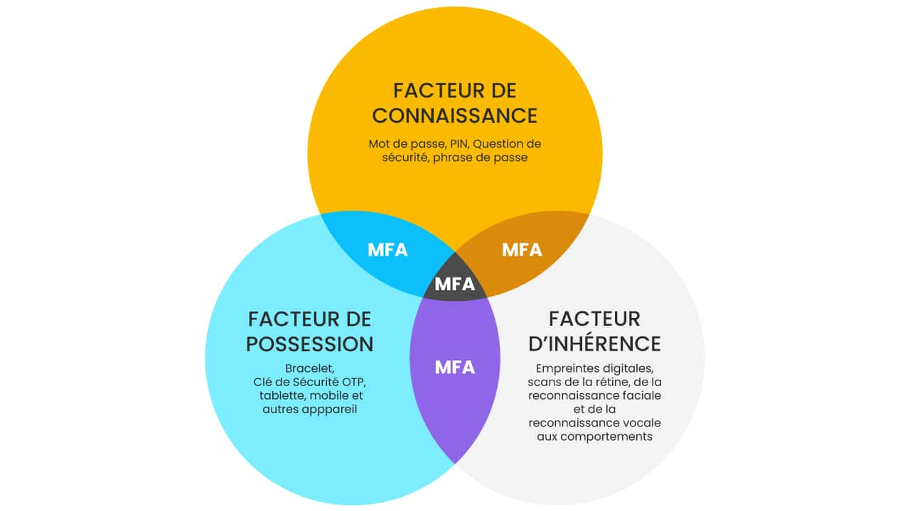
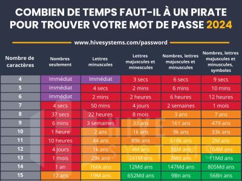
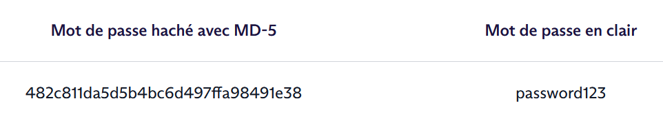
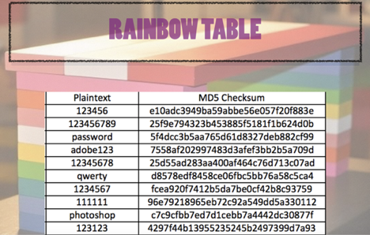
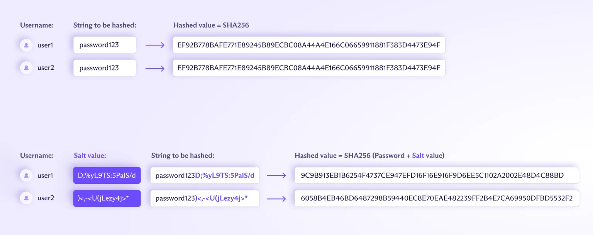

# Authentification 

## 1. Les facteurs d'authentification

• La connaissance :point_right: JE CONNAIS<br/>
• La possession :point_right: JE POSSEDE<br/>
• Les caractéristiques biométriques :point_right: JE SUIS<br/>

{: .center width=90%}

## 2. Authentification simple : le mot de passe

👉 facteur d'authentification : la connaissance

??? note "Source"
    - Contenu extrait du MOOC [SecNumAcadémie](https://secnumacademie.gouv.fr/) de l’[ANSSI](https://cyber.gouv.fr/)
    - [CNIL](https://www.cnil.fr/)

### 2.1 A quoi sert un mot de passe ?

• **Accès** à des services en ligne grâce au contrôle d’accès.<br/>
• **Imputabilité**, preuve de qui a fait quoi.<br/>
• **Traçabilité** des actions, historique des actions.<br/>

Exemple, <br/>
^^télédéclaration de l’impôt :^^ **imputabilité** = lien entre la déclaration et la personne *ET* **traçabilité** = connaître l’heure et la date de la déclaration.

### 2.2 Les risques d'un mot de passe

• **Divulgation :**<br/>

> - Par négligence : faiblesse d’une personne, support amovible, diffusion à un tiers.<br/>
> - Par un service non sécurisé : protocoles https, imaps, pop3s, etc… à privilégier.<br/>
> - Par l’utilisation d’un vecteur infecté.<br/>
> - Mot de passe enregistré sans protection.<br/>

• **Malveillance :**<br/>

> - Authentification sur un service illégitime.<br/>
> - Attaque par ingénierie sociale, piège.<br/>
> - Attaque par force brute ou divulgation d’une base de données mal sécurisée.<br/>

• Ces deux cas de figure peuvent entraîner :<br/>

> - La compromission des messages personnels.<br/>
> - La destruction de données.<br/>
> - La publication de messages ou photos préjudiciables sur les réseaux sociaux par exemple.<br/>
> - Des achats.<br/>
> - Des virements bancaires.<br/>

### 2.3 Craquer un mot de passe

- Par **force brute**<br/>
- Par **dictionnaire**, en général avant l’attaque par force brute<br/>
- Par **permutation** en échangeant des caractères (exemple : E par 3 ou O par 0).<br/>

Mais un souci de temps ...

{: .center width=50%}

### 2.4 Comment construire un mot de passe fort ?

Le mot de passe doit apporter un niveau de sécurité suffisant, c’est-à-dire difficile à découvrir par un attaquant dans un temps raisonnable à  l’aide d’outils automatisés de recherche qui mettent en oeuvre les différentes techniques d’attaque. Il doit être composé au minimum de *10 caractères* et ceux-ci doivent être de tout type.

!!! info "Préconisations ANSI"
    Créez un mot de passe suffisamment long, complexe et inattendu : de 8 caractères minimum et contenant des minuscules, des majuscules, des chiffres et des caractères spéciaux. [source](https://cyber.gouv.fr/bonnes-pratiques-protegez-vous)

Quelques astuces : 

- Grâce à une [phrase de passe](https://www.cnil.fr/fr/generer-un-mot-de-passe-solide) avec des mots concaténés.
- Par phonétique.
- Les premières lettres des mots d’une phrase, citation, chanson, etc…
- Mixer les trois méthodes.

!!! danger "Coffre fort"
    AUjourd'hui, rien de mieux que l'utilisation d'un coffre électronique de mot de passe (keypass, bitwarden, Cosy pass, ...) et la génération aléatoire de mot de passe complexe et unique par usage.<br />
    **Seule précaution 🔥 :** ne pas oublier le mot de passe du coffre fort ...

### 2.5 Les rainbows Tables

#### 2.5.1 À quoi sert une Rainbow Table ?

Une Rainbow Table est un fichier volumineux contenant une multitude de mots de passe reliés à leur valeur de hachage (empreinte). 



Les cybercriminels s’en servent pour cracker des mots de passe. Les Rainbow Tables permettent généralement de réduire le temps et la mémoire nécessaires à l’attaque, contrairement aux attaques par force brute qui requièrent beaucoup de temps et aux attaques par dictionnaires qui nécessitent beaucoup de mémoire. 


À noter que les Rainbow Table peuvent également être utilisées par des experts en cybersécurité pour identifier des failles ou effectuer des tests de sécurité. 

#### 2.5.2 Comment fonctionne une Rainbow Table ? 

Lors de la génération d’une Table arc-en-ciel, chaque mot de passe est haché (le procédé peut être répété plusieurs fois en fonction des cas).  

Seul le mot de passe initial et la valeur finale sont conservés dans la Table. Ce processus est ensuite répété à partir de nouveaux mots de passe, jusqu’à obtenir une Table importante. 

Pour cracker un mot de passe, le cybercriminel va chercher son empreinte dans la Table arc-en-ciel. Une fois trouvée, il peut donc récupérer le mot de passe initial de cette empreinte.

???+ note "Activité : Génération et utilisation d'une rainbow Table"
    
    {: .center width=50%}
    
    **Etape 1 :** génération d'une rainbow Table
    
    Le projet [Richelieu](https://github.com/tarraschk/richelieu/), créé par les développeurs Maxime Alay-Eddine et Paul Barbaste, établit une liste des mots de passe français les plus courants. Ceux-ci proviennent de fuites de données rendues publiques, filtrées sur les adresses e-mail en « .fr ».
        
    Par simplication de performance, nous utiliserons un fichier réduit contenant les 1000 mots de passe français les plus utilisés [ici](./data/french_passwords_top1000.txt).
    
    **construction de la rainbow Table**
    
    - Ouverture et lecture du fichier txt [french_passwords_top1000.txt](./data/french_passwords_top1000.txt)
    - Création d'un dictionnaire clé-valeur, dont la **clé** est le mot de passe en clair et la **valeur** l'empreinte du mot de passe.
    - Pour chaque ligne, on calcule l'empreinte MD5 du mot de passe.
    - Ecriture d'un fichier CSV pour sauvegarder le dictionnaire
    
    ??? tips "Correction"
    
        ```python
        import hashlib
    
        # Dictionnaire pour stocker les mots de passe générés et leurs hachages MD5
        passwords = {}
    
        #ouverture du fichier contenant les mots de passe
        with open("./data/french_passwords_top1000.txt", "r") as file:
            #pour chaque mot de passe, on créé un hachage MD5 et on stocke le mot de passe et son hachage dans le dictionnaire
            for line in file:   
                password = line.strip()
                password_hash = hashlib.md5(password.encode()).hexdigest()
                passwords[password] = password_hash 
                
        #Sauvegarde des hachages dans un fichier
        with open("./data/md5_passwords.csv", "w") as file:
            for password, hash in passwords.items():
                file.write(password + ';' +hash + "\n")
                
        #fermeture du fichier
        file.close()
        ```
    
    **Utilisation de la rainbow Table**
    
    **Scénario :** un utilisateur saisi un mot de passe dans un formulaire, qui est immédiatement chiffrer à l'aide l'algorithme MD5. Un hacker réussit grâce à une lecture de trame réseau à capter cette empreinte. 
    
    **Activité supplémentaire :**
    
    Créer une fonction `find_password` qui prend en paramètre une rainbow Table sous forme de dictionnaire et une empreinte et qui retourne le mot de passe en clair ou "non trouvé" sinon.
    
    - Ouverture et lecture du fichier csv contenant la rainbow Table
    - Pour chaque ligne, comparaison de l'empreinte captée et de la valeur dans le dictionnaire.
    - Si on trouve l'empreinte, retournez le mot de passe en clair, sinon retournez "Non trouvé"
    
    ??? tips "Correction"
    
        ```python
        def find_password(passwords, hash):
        
            #On vérifie si le hachage est dans le dictionnaire
            if hash in passwords.values():
                #si le hachage est dans le dictionnaire, on affiche le mot de passe correspondant
                for password, password_hash in passwords.items():
                    if password_hash == hash:
                        return (f"Le mot de passe associé au hachage {hash} est {password}")
                    #sinon on affiche que le mot de passe n'a pas été trouvé
            return(f"Le mot de passe associé au hachage {hash} n'a pas été trouvé")
    
        hash = hashlib.md5("secret".encode()).hexdigest() #5ebe2294ecd0e0f08eab7690d2a6ee69
        find_password(hash)
        ```
    
        Exemple pour : 5ebe2294ecd0e0f08eab7690d2a6ee69
        
        'Le mot de passe associé au hachage 5ebe2294ecd0e0f08eab7690d2a6ee69 est secret'   
    
### 2.6 Stockage d'un mot de passe

La règle de "base" en hygiène de codeur est de ne **JAMAiS** stocké un mot de passe en clair, que ce soit dans un fichier ou pire dans une base de données. Un site ne doit jamais être en capacité de vous communiquer votre mot de passe initial !

Le seul moment où un mot de passe est en clair est quand il est saisi dans le champ du formulaire. <br />
Imaginons ... Si tous les sites avaient tous la même méthode de chiffrement (MD5 ou SH256) et qu'un utilisateur utilisait le même mot de passe sur tous ces sites ...

Il existe des fuites de données recensant le couple identifiant/mot de passe d'un grand nombre de personne ! <br />
Vous pouvez tester votre adresse mail sur le site [';--have i been pwned?](https://haveibeenpwned.com/) pour savoir si celle ci appartient à une fuite de données connue.

^^Mise en exemple :^^ <br />
Alphonse (al@mail.com) utilise le mot de passe "secret" pour les sites monsite.fr et concurrent.fr<br />
Chacun des deux sites utilise la même méthode de chiffrement MD5.<br />
Donc chacun des deux sites possèdent dans sa base le couple `al@mail.com` et `5ebe2294ecd0e0f08eab7690d2a6ee69`.<br />
monsite.fr subit une attaque et une fuite de données massive.<br />
le pirate possède donc le moyen de se connecter à concurrent.fr avec le compte d'alphonse...

C'est la que l'on introduit la notion de **salage**.

^^Définition :^^ Le salage est un procédé utilisé en cryptographie pour renforcer la sécurité des mots de passe stockés. Il consiste à ajouter une valeur aléatoire unique (appelée "sel" ou "salt") à chaque mot de passe avant de le hacher. Cela rend plus difficile pour les attaquants d'utiliser des attaques par table arc-en-ciel ou par dictionnaire, car même si deux utilisateurs ont le même mot de passe, leurs hashs seront différents grâce aux sels uniques.

{: .center width=80%}

```python linenums='1'
import hashlib

# generate new salt, hash password
# h est le sel qui sera utilisé pour le hachage
h = b"monsite.fr"
# Hash du mot de passe classique sans salage
pwd_md5 = hashlib.md5(b"secret").hexdigest()
print(pwd_md5)
# Hash du mot de passe classique avec salage
pwd = hashlib.pbkdf2_hmac('md5', b"secret", h, 100000)
print(pwd)
```
```
5ebe2294ecd0e0f08eab7690d2a6ee69
b'\xc3;K\xc2\xfb\xb4z\xca`f\xc4T\xc9I\x1b.'
```
## 3. L'authentification multi-facteur (MFA)🔐

### 3.1 Introduction au MFA

L’**authentification multi-facteur (MFA)** est une méthode de sécurité qui exige l’utilisation d’au moins **deux facteurs d’authentification différents** pour accéder à un système ou une application.
Elle permet de renforcer la sécurité en rendant beaucoup plus difficile l’usurpation d’identité.

{: .center width=90%}

#### Exemple

* **Authentification simple** : identifiant + mot de passe.
* **Authentification multi-facteur** : identifiant + mot de passe **et** code à usage unique envoyé par SMS ou généré par une application mobile.

👉 Objectif : limiter les risques en cas de vol ou de fuite de mot de passe.

#### Limites du mot de passe seul

* **Attaques par force brute** (essais massifs de combinaisons).
* **Réutilisation** d’un même mot de passe sur plusieurs sites.
* **Phishing** (vol par fausse page de connexion).

Le MFA répond à ces problèmes en ajoutant une **seconde barrière**.

### 3.2 Les principaux mécanismes MFA

Les développeurs disposent de plusieurs solutions pour mettre en œuvre l’authentification multi-facteur.

#### a) OTP (One-Time Password)

* **TOTP (Time-based One-Time Password)** : mot de passe temporaire, généré toutes les 30 secondes (ex. Google Authenticator, Authy, FreeOTP).
* **HOTP (HMAC-based One-Time Password)** : mot de passe unique basé sur un compteur.

➕ Avantage : ne nécessite pas de connexion Internet.

#### b) SMS ou e-mail

* Envoi d’un code à usage unique par SMS ou e-mail.
* Simple à mettre en place, mais vulnérable (interception SMS, piratage boîte mail, [SIM swapping](https://www.trendmicro.com/fr_fr/what-is/cyber-attack/types-of-cyber-attacks/sim-swapping-scams.html){target="_blank"}).

#### c) Applications mobiles d’authentification

* Génération de codes via des applis comme **Microsoft Authenticator** ou **Google Authenticator**.
* Fonctionnent même hors ligne.
* Solution robuste et gratuite.

#### d) Clés physiques (U2F / FIDO2 / YubiKey)

* Dispositifs USB ou NFC servant de second facteur.

➕ Très sécurisés (résistent au phishing et aux attaques distantes).<br />
➖ Limite : coût d’achat du matériel.

#### e) Notifications push

* Une demande de validation est envoyée directement sur le smartphone de l’utilisateur.
* Exemple : connexion à un compte Google → “Accepter la connexion ?” ou github → se connecter à l'application

➕ Confortable pour l’utilisateur, mais ➖ nécessite un smartphone connecté.

### 4. Mise en œuvre côté développeur

Un développeur doit savoir intégrer du MFA dans ses applications.<br />
L’exemple le plus simple est le **TOTP** avec une application mobile comme Google Authenticator.

#### Principe

1. Le serveur génère une **clé secrète unique** pour chaque utilisateur.
2. L’utilisateur scanne un **QR code** dans son application d’authentification.
3. Lors de la connexion, le serveur vérifie le code généré par l’application.

#### Exemple avec Python

```python
import pyotp
import qrcode

# Étape 1 : Générer un secret unique pour un utilisateur
secret = pyotp.random_base32()
print("Secret partagé :", secret)

# Étape 2 : Générer un QR Code compatible Google Authenticator
uri = pyotp.totp.TOTP(secret).provisioning_uri(
    name="etudiant@bts-sio.fr",
    issuer_name="DemoMFA"
)
qrcode.make(uri).show()

# Étape 3 : Vérification lors de la connexion
totp = pyotp.TOTP(secret)
code = input("Entrez le code affiché par votre application: ")
if totp.verify(code):
    print("✅ Authentification réussie")
else:
    print("❌ Code invalide")
```

👉 A faire : 

* Lancer ce script.
* Scanner le QR code avec **Google Authenticator**.
* Tester la saisie d’un code valide.

!!! warning "Bonnes pratiques 👑"

    * Toujours combiner MFA avec un mot de passe **fort**.
    * Éviter l’usage du **SMS seul** (faible sécurité).
    * Prévoir des **codes de secours** pour l’utilisateur.
    * Mettre en place une procédure de récupération sécurisée.
    * Ne jamais stocker les **clés secrètes en clair** (utiliser un chiffrement).

!!! warning "✅ **Résumé**"
    L’authentification multi-facteur est une mesure de sécurité indispensable.<br />
    Elle peut être mise en œuvre facilement par les développeurs via des solutions comme **TOTP** et améliore grandement la sécurité des applications contre les attaques les plus courantes.

## 5. Détection et stratégie d'authentification sécurisée

*Scénario 1 :* Paul, un peu fatigué, galère à se connecter à son site web favori. Il en est à sa troisième tentative. <br />
*Scénario 2 :* Pierre tente une attaque par force brut sur le même site web en utilisant une attaque par permutation.

### 5.1 Principes généraux

- **Détecter** : mesurer tentatives par **compte**, par **IP**, et par couple **IP+compte**.
- **Réagir graduellement** (défense en profondeur) : ne pas verrouiller immédiatement l’utilisateur légitime, mais rendre l’attaque coûteuse.
- **Journaliser & alerter** : conserver logs (IP, user agent, timestamp, résultat) et déclencher alertes si pic anormal.
- **Ne pas divulguer d’information** : messages génériques (« Identifiants incorrects ») pour éviter l’énumération d’utilisateurs.
- **Prévoir remédiation** : procédure assistée pour utilisateur légitime (codes secours, support).

### 5.2 Stratégie recommandée (défense en couches — ordonnée par priorité)

1.**Limiter les tentatives par compte** (user)

* *Objectif* : empêcher un attaquant d’utiliser une attaque par force brut.
* Toujours enregistrer `failed_attempts`, `last_failed_at`, `lock_until`.
* Politique conseillée (exemple) :

    * 0–4 échecs consécutifs : rien.
    * 5–9 échecs : afficher CAPTCHA + délai progressif (ex. 2s → 4s → 8s).
    * ≥10 échecs : verrouillage temporaire du compte 15 minutes.
    * ≥20 échecs : verrouillage plus long (24 h) + notification par email.

2.**Limiter les tentatives par IP**

* *Objectif* : ralentir les attaques distribuées depuis une même IP (ou NAT).
* Exemples :

    * 100 tentatives par IP / heure → challenge CAPTCHA.
    * 500 tentatives par IP / heure → blocage temporaire IP (ex. 1 heure) ou rate-limit au proxy/WAF.

⚠️ Attention au NAT/partage : soyez pondéré (ne pas bloquer un domaine entier).

3.**Limiter par couple IP+username**

* Empêche un attaquant distribué d’attaquer un seul compte depuis plusieurs IP sans coût.
* Par ex. 20 tentatives IP+user en 1 heure → bloqueo temporaire pour ce couple.

4.**Progressive delays / exponential backoff**

* Après chaque échec, ajouter un délai croissant côté serveur avant de répondre (p. ex. 0s, 1s, 2s, 4s, 8s).
* Plus efficace et moins disruptif qu’un blocage immédiat.

5.**CAPTCHA / challenge adaptatif**

* Afficher un CAPTCHA après X échecs ou comportement suspect.
* Utile pour différencier bot / humain.
* Préférer des CAPTCHAs modernes (reCAPTCHA v3 ou invisible) pour UX.

6.**Verrouillage à double sens & codes de secours**

* Si compte verrouillé, envoyer email avec lien de déverrouillage (avec OTP) ou codes de secours pré-générés.
* Ne jamais envoyer le secret MFA ou mot de passe.

7.**Surveillance & alerting**

* Surveiller pics d’échecs, login success après échecs répétés, pattern d’énumération.
* Alerter SOC / admin quand seuils critiques franchis.

### 5.2 UX & sécurité : règles pratiques

* **Messages génériques** : « Identifiants incorrects. » Ne dire ni « email inconnu » ni « mot de passe incorrect ».
* **Procédure support** : autoriser un canal support pour déverrouiller après vérifs (ne pas faire de verrouillage permanent sans recours) : mail, SMS, ...
* **Pas de lockout permanent** : privilégier lockout temporaire, puis escalade.
* **Notifiez l’utilisateur** (email) en cas de verrouillage prolongé ou d’activités suspectes.

Il faut arbitrer entre la sécurité et le confort des utilisateurs. Il ne s'agit pas de faire fuire ces derniers avec un processus de connexion/récupération trop compliqué.

??? example "Paramètres conseillés (à adapter selon contexte)"

    * Tentatives consécutives tolérées avant challenge : **5**
    * Tentatives avant verrouillage temporaire : **10**
    * Durée lockout temporaire : **15 minutes**
    * Durée lockout prolongé (abuse confirmé) : **24 heures**
    * Fenêtre pour compter tentatives (sliding window) : **15–60 minutes**
    * Rate limit IP (soft) : **100–200 req/h** sur endpoint `/login`
    * Window IP+user : **20 tentatives / heure → blocage**


??? info "Outils & composants utiles"

    * **Reverse proxy / WAF**: Nginx `limit_req`, Cloudflare Rate Limiting, AWS WAF.
    * **fail2ban**: pour bloquer IPs après patterns d’échec (utile si logs accessibles).
    * **Redis**: pour compteurs et token bucket (rate limiting).
    * **reCAPTCHA / hCaptcha**: pour challenge adaptatif.
    * **SIEM / ELK**: agrégation logs + alertes.
    * **Services anti-bot / Bot-management** (Cloudflare Bot Management, Akamai).

!!! warning "checklist à appliquer 📋"

    * [ ] Compteurs par user, par IP, et IP+user.
    * [ ] Stratégie progressive : CAPTCHA → Retard → Lock temporaire → Lock long.
    * [ ] Messages génériques pour éviter l’énumération.
    * [ ] Procédure de récupération & notifications.
    * [ ] Logging centralisé + alertes.
    * [ ] Rate-limiting aussi au niveau infra (WAF / reverse proxy).
    * [ ] Tester les faux positifs & l’impact sur utilisateurs légitimes.


