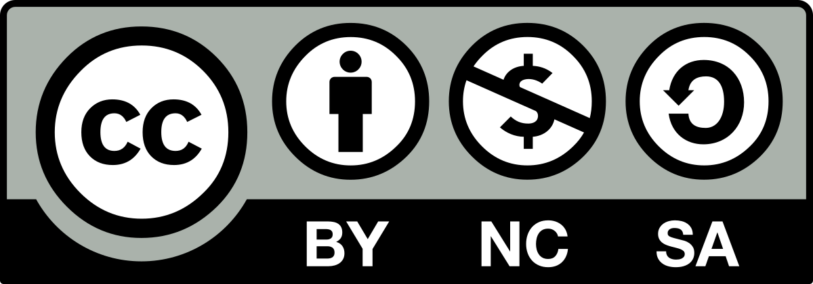
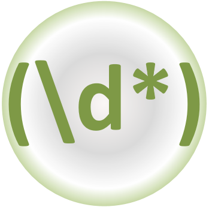
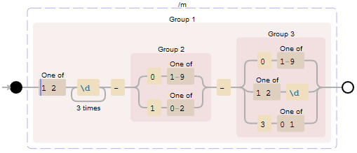
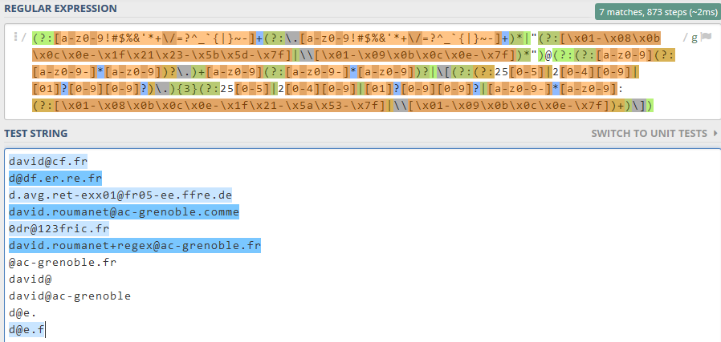
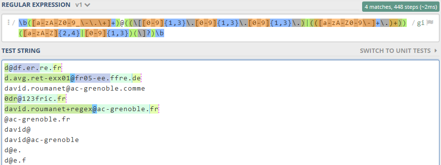
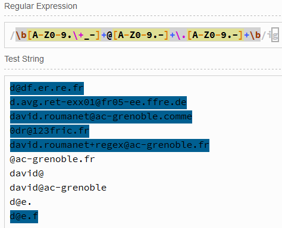
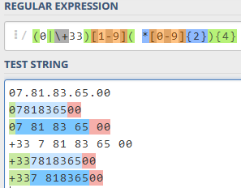
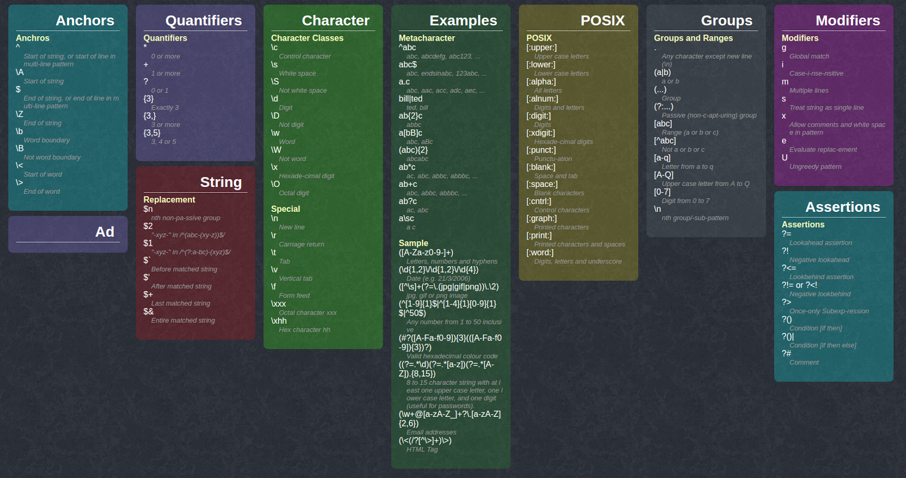

# Initiation aux Regex

!!! note "Crédits"
    Cours élaboré par David Roumanet - Lycée Louise Michel (Grenoble) <br />
    Partage sous [licence Creative Commons](https://creativecommons.org/share-your-work/cclicenses/) "by-nc-sa" {: width=10%}

!!! note "Compétences : B3 Cyber"
    **Mots de passe & authentification** : Politique de mots de passe robustes (M10), Protection des mots de passe stockés (M11), MFA (M13)  

{: width=30% .center}

## 1. Introduction

Les expressions régulières (aussi appelées **REGEX** pour REGular Exression) ne sont pas liées à un langage particulier mais au contraire, sont utilisées dans plusieurs langages.<br />

En réalité, les expressions régulières décrivent un motif présent dans une chaîne de caractères et sont issues des langages formels développés en mathématiques dans les années 1940. La lecture ou la rédaction d'une expression régulière dépend de sa complexité, mais son fonctionnement évite généralement le développement de nombreuses fonctions.

Vous rencontrerez inévitablement des expressions régulières dans votre vie de développeur ou de sysAdmin.

## 2. fonctionnement

Voici un exemple de REGEX (pris sur Wikipedia) qui permet de déterminer si une chaîne est une adresse de messagerie :
``/[\w+.-]+@[\w.-]+\.[a-zA-Z]{2,}/gi``

La lecture serait une phrase du genre :

|Symbole REGEX	|signification|
|:--|:--|
|[ ]	|Définis un intervalle de caractères tel que…|
|\w	|le motif de caractères alphanumériques de a à z, A à Z et 0 à 9|
|+	|Pouvant se répéter (plusieurs occurrences)|
|.-	|Et contenant aussi des tirets et des points|
|@	|Puis un caractère arobase|
|etc|	etc|

Ce n'est clairement pas l'expression la plus simple mais cela donne rapidement une idée de la puissance de cette forme d'écriture !
Il faut pour cela utiliser des fonctions spéciales : 

▶️ en PHP : ``preg_filter()``, ``preg_grep()``, ``preg_match()``, etc. <br />
▶️ en Python : ``re.match()``, ``re.search()``, ``re.findall()``, etc.

Bien entendu, il existe des fonctions dans d'autres langages (Java ou JavaScript) et en C# :<br />
```javaScript
var regex = new Regex(expression) ;
return regex.Matches(maChaine) ;
```

Le symbole ``\`` a un rôle capital, car il permet d'échapper certains caractères (``*``, ``.``, ``+``, ``{`` etc) mais rend également d'autres caractères spéciaux (``\n``, ``\r``, ``\t``...)

## 3. La syntaxe

### 3.1  Les éléments principaux

Les expressions régulières s'appuient sur un langage ayant plusieurs groupes d'éléments :<br />

|Ancres|	Quantificateurs	|Caractères	|Groupes	|Assertions|	Modificateurs|
|:--|:--|:--|:--|:--|:--|
|Décrivent le début ou la fin d'un mot ou d'une chaîne.	|Permettent la répétition un nombre de fois défini ou non.	|Détermine les caractères spéciaux ayant un rôle particulier.	|Délimiteurs facilitant la notion de groupe de symboles.|	Capacité à répondre à une condition	|Caractères hors de la recherche mais modifiant celle-ci|
|Ex : ``^`` signifie début de chaîne.	|Ex : ``{2,5}`` indique une répétition de 2 à 5 fois max.	|Ex : ``\s`` cible tous les espaces ensembles	|Ex : ``(a|b)`` indique un caractère comme a ou b.	|Ex : ``?!`` es une assertion négative|	Ex : i est insensible à la casse.|

L'association de ces différents groupes permet des expressions complexes capables de valider si une chaîne de caractères contient un motif précis (adresse courriel, URL, date…)

#### 3.1.1  Les ancres (anchors)

Il s'agit de définir une position à partir de laquelle chercher le motif voulu. Les principales sont :

|caractère	|signification|	exemple|
|:--|:--|:--|
|``^``	|Indique le début de la séquence de recherche (ligne)|	``^A`` accepte Arceau mais pas BANANA|
|``$``	|Indique la fin de la séquence de recherche (fin ligne)|	``A$`` accepte BANANA mais pas Arceau|
|``\b``	|Indique le bord d'un mot (à gauche = début, à droite = fin). En effet, ``^`` et ``$`` s'applique à toute la chaîne.	|``\b[D][\w]*`` accepte les mots comme Dans|

#### 3.1.2  Les quantificateurs (quantifiers)

Ils permettent de définir un critère de répétition.

|caractère	|signification|	exemple|
|:--|:--|:--|
|``*``	|Indique 0 ou plus	|``/fo*/`` accepte football et fort|
|``+``	|Indique 1 ou plus	|``/ma+/`` accepte maison et maaison|
|``?``	|0 ou 1 caractère seulement|	/ba?c/ accepte bc bac mais pas baac, barc
|``{ }``|	Selon le contenu des crochets : ``{2}`` pour 2 caractères uniquement, ``{2,}`` pour 2 et plus, ``{2,4} ``entre 2 et 4 caractères.|	``/w{3}/`` accepte www mais pas ww ou wwww|

#### 3.1.3  Les classes de caractères
Généralement précédés du symbole ``\,`` ces caractères correspondent à un ensemble de symboles.

|caractère|	signification	|exemple|
|:--|:--|:--|
|``\w`` <br /> ``\W``|	``\w`` correspond à un caractère alphanumérique, <br />``\W`` ne doit pas correspondre à un caractère alphanu.	||
|``\d`` <br /> ``\D``	|``\d`` correspond à un symbole numérique (0 à 9)<br /> ``\D`` ne doit pas correspondre à un symbole numérique	|``\d\d\d\d`` accepte 2018 mais pas 1c21|
|``\b`` <br/> ``\B``	|``\b`` correspond à un mot <br /> \B ne doit pas correspondre à un mot	||
|``\s`` <br /> ``\S``|	``\s`` correspond à tout type d'espace (plusieurs espaces consécutifs, tabulation…) <br /> ``\S`` ne doit pas correspondre à tout type d'espace.	||
|``.``	|Correspond à n'importe quel symbole (une fois)	||

#### 3.1.4  Les caractères (caractères de contrôle)

L'association du symbole ``\`` avec ces symboles remplacent un caractère qui n'est pas accessible directement à l'utilisateur.

|caractère|	signification	|exemple|
|:--|:--|:--|
|``\n``	|Un saut de ligne, caractère [Line Feed]	||
|``\r``	|Un retour chariot, caractère [Carriage Return]	||
|``\t``	|Une tabulation, caractère ++tab++	||
|``\x{N}``	|Le caractère ayant pour code hexadécimal ``N``	|Le symbole ``€`` est ``\x{20AC}``|

#### 3.1.5  Les groupes

Encadrés par les crochets ``[`` et ``]``, les symboles définissent un ensemble de valeurs autorisées ou non.

|caractère	|signification	|exemple|
|:--|:--|:--|
|``[0-7]``	|Le symbole peut prendre les valeurs de 0 à 7|	``[0-7]`` Accepte 2 mais pas 8|
|``[abcdef]`` <br /> ``[^abc]``|	Le symbole peut être une valeur entre a et f <br /> Le ^ est un complément : le symbole n'est pas a, b, c ||
|``[a-zA-Z]``|	Le symbole est une lettre en minuscule ou majuscule	||
|``[0-9\-]``	|Le symbole peut être un chiffre ou un signe moins	||
|``(a|b)``|	Le symbole peut être un a ou un b	|``ch(at|ien)`` accepte chat ou chien. Pas char|

Les groupes sont généralement suivis d'un quantificateur pour que le motif accepte plusieurs fois le groupe. Un numéro de téléphone à 10 chiffres sera ``[0-9]{10}``.

### 3.2  Expressions simples

Une expression régulière ne donne pas toute sa puissance si on recherche uniquement un mot.<br />

Vous pouvez vous entraîner en ligne avec le site : [https://regex101.com/](https://regex101.com/) ou  [https://www.debuggex.com/](https://www.debuggex.com/) 

Voici un morceau de texte que nous utiliserons pour nos tests :<br />

```text
Les expressions régulières (aussi appelées REGEX pour REGular Exression) ne sont pas liées à un langage particulier mais au contraire, sont utilisées dans plusieurs langages.

En réalité, les expressions régulières décrivent un motif présent dans une chaîne de caractères et sont issues des langages formels développés en mathématiques dans les années 1940.
```

#### 3.2.1  Recherche sur 're' et 'RE'

En programmation, il faudrait basculer le texte d'origine en majuscules ou minuscules puis faire une recherche sur 'RE' ou 're' selon le cas choisi.

L'expression régulière suivante règle le problème :
``[rR][eE]``

Cependant il existe aussi des **modificateurs** de motifs. L'expression suivante devrait fonctionner aussi :
``/re/i``

#### 3.2.2  Recherche sur 'les' ou 'un'

On utilise le caractère ``|`` pour séparer les occurrences à accepter.
``les|un``

#### 3.2.3  Recherche sur les mots contenant 2 voyelles consécutives

La solution est relativement simple : on commence par créer un intervalle ne contenant que des voyelles et on précise ensuite qu'il doit y avoir 2 occurrences consécutives.
``[aeiou]{2}``

#### 3.2.4  Recherche sur les mots finissant par 're'

Le mauvais réflexe est d'utiliser le symbole ``$`` : il ne fonctionne que pour les fins de ligne. À la place :
``re\b``

#### 3.2.5  Recherche sur les mots commençant par 'la'

Dans le même registre, le symbole ``^`` concerne le début de ligne. Pour les mots ``\b`` puis l'occurrence :
``\bla``


### 3.3  Expressions Intermédiaires

#### 3.3.1  Analyse d'une date

Voici le cas d'une date dans un format pratique pour les informaticiens : ``YYYY-MM-DD``<br />

Si on veut tester une date de naissance ou actuelle, on part de l'année 1000 à 2999, du mois 01 à 12 et du jour 01 à 31.
Voici la présentation du raisonnement en REGEX :

{: width=70% .center}

et voici l'expression régulière :
```shell
([12]\d{3}-(0[1-9]|1[0-2])-(0[1-9]|[12]\d|3[01]))
```
 
### 3.4  Expression Ccomplexes

Dans ce paragraphe, les expressions sont fournies "clé en main" : cela signifie qu'elles correspondent à des requêtes fréquentes. Par exemple de manière classique en JavaScript, la vérification de champs de saisies.

#### 3.4.1  Valider la syntaxe d'une adresse de courrier

Le format d'une adresse email est très reconnaissable au symbole ``@`` entre deux chaînes de caractères.
Malheureusement, aucune expression régulière ne donnera un résultat parfait.

##### 3.4.1.1  Expression 1
L'expression régulière de Wikipedia est intéressante mais simplifiée. Voici une autre [expression](http://emailregex.com/) , compatible RFC 5322, un peu plus complète : 
```text
(?:[a-z0-9!#$%&'*+\/=?^_`{|}~-]+(?:\.[a-z0-9!#$%&'*+\/=?^_`{|}~-]+)*|"(?:[\x01-\x08\x0b\x0c\x0e-\x1f\x21\x23-\x5b\x5d-\x7f]|\\[\x01-\x09\x0b\x0c\x0e-\x7f])*")@(?:(?:[a-z0-9](?:[a-z0-9-]*[a-z0-9])?\.)+[a-z0-9](?:[a-z0-9-]*[a-z0-9])?|\[(?:(?:25[0-5]|2[0-4][0-9]|[01]?[0-9][0-9]?)\.){3}(?:25[0-5]|2[0-4][0-9]|[01]?[0-9][0-9]?|[a-z0-9-]*[a-z0-9]:(?:[\x01-\x08\x0b\x0c\x0e-\x1f\x21-\x5a\x53-\x7f]|\\[\x01-\x09\x0b\x0c\x0e-\x7f])+)\])
```
{: width=50% .center}

Le résultat reste imparfait, notamment le domaine racine (.com, .fr, etc.) mais exploitable.

#####  3.4.1.2  Expression 2
Si vous souhaitez une expression moins rébarbative :
```
\b([a-zA-Z0-9_\-\.\+]+)@((\[[0-9]{1,3}\.[0-9]{1,3}\.[0-9]{1,3}\.)|(([a-zA-Z0-9\-]+\.)+))([a-zA-Z]{2,4}|[0-9]{1,3})(\]?)\b
```
Cette expression est relativement correcte. Notez également que l'expression doit être comprise entre les délimiteurs ``/`` et qu'il doit y avoir le modificateur ``/i`` pour ne pas être sensible à la casse.
Résultat :
{: width=50% .center}

#####  3.4.1.3  Expression 3
Dernière expression, la plus courte : 
```
\b[A-Z0-9.\+_-]+@[A-Z0-9.-]+\.[A-Z0-9.-]+\b
```
et son résultat :
{: width=50% .center}


#### 3.4.2  Valider la syntaxe d'un numéro de téléphone
Cette expression provient du site de [Lucas WILLEMS](https://www.lucaswillems.com/fr/articles/25/tutoriel-pour-maitriser-les-expressions-regulieres)  et permet de valider un téléphone en France.

```
(0|\+33)[1-9]( *[0-9]{2}){4}
```

{: width=50% .center}

Elle n'est cependant pas parfaite et nécessite de guider l'utilisateur dans la saisie.
Elle attend **0** ou **+33** en début puis un chiffre. Ensuite elle accepte un espace et des chiffres par pair, 4 fois.

#### 3.4.3  Valider un mot de passe 
Cette [expression](http://codes-sources.commentcamarche.net/source/49715-validation-de-mot-de-passe)  force un mot de passe ayant entre 8 et 15 caractères :

-	au moins un caractère spécial $ @ % * + - _ !
-	au moins une minuscule
-	au moins une majuscule
-	au moins un chiffre

Voici l'expression codée :
`\b(?=.*[A-Z])(?=.*[a-z])(?=.*\d)(?=.*[-+!*$@%_])([-+!*$@%_\w]{8,15})\b`

Cette expression introduit un concept intéressant de conditions, sous la forme
 ``(?=expression1)(?=expression2)`` etc. : prenez le temps de la décortiquer.

 
## 4  ANNEXE

### 4.1  Regex cheat sheet

{: width=50% .center}

### 4.2  REGEX en javaScript

JavaScript propose une classe RegExp qui fonctionne comme suit :
```JavaScript
function checkZorg(chaine) {
    var motif = /[M-Z]or.$/g ;
    return motif.test(chaine) ;
}
```
### 4.3  Regex en shell linux
L'usage de commande ou de script en Shell permet d'utiliser les expressions régulières. Elles sont alors précédées du symbole ~ :
nom="Zorg"

```bash
if [[  $nom =~ [M-Z]or.$ ]] ; then
  echo vrai
fi
```

### 4.4  Regex en Powershell
La commande -match utilise les expressions régulières :

```bash
$nom = "Zorg"
if ($nom -match "[M-Z]or.$") {
  write-host "il y a correspondance"
}
```
A noter : en PowerShell, le caractère d'échappement est ==`== : il s'obtient avec ++alt-graph+7++

### 4.5  Regex en PHP
La commande -match utilise les expressions régulières :

```php
<?php
if (preg_match("/[M-Z]or.$/g", "Zorg")) {
    echo "A match was found.";
} else {
    echo "A match was not found.";
}
?>
```
### 4.6  Regex en JAVA
Voici un code complet :

```java
import java.io.*;
import java.util.regex.*;

public class testRegex {
    private static Pattern motif;
    private static Matcher matcher;

    public static void main(String args[]) {
        motif = Pattern.compile("[M-Z]or.$");
        matcher = pattern.matcher("Zorg mon ami Zorg");
        while(matcher.find()) {
            System.out.println("Trouvé !");
        }
    }
```