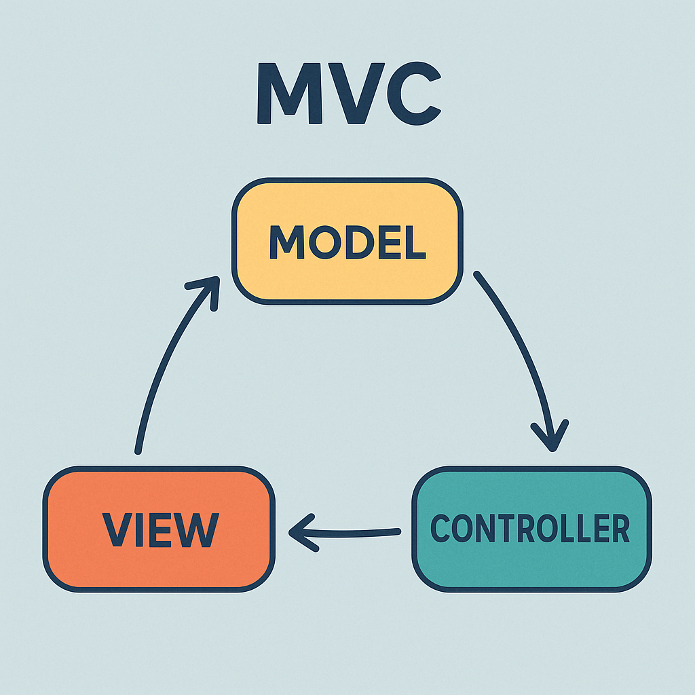
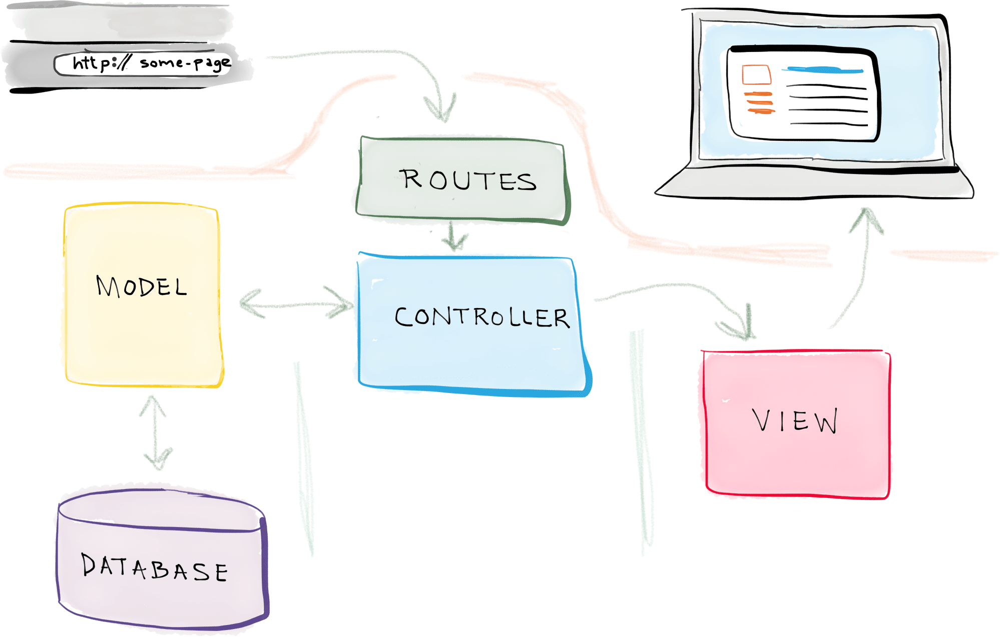

# 🌐 Cours MVC avec Laravel

!!! note "Compétences"

    **B2.1. Conception et développement d’une solution applicative**

    * Participation à la conception de l’architecture d’une solution applicative
    * Exploitation des ressources du cadre applicatif (framework)
    * Exploitation des technologies Web et mobile pour mettre en oeuvre les échanges entre applications
    * Utilisation de composants d’accès aux données

🎯 **Objectifs** 

* Comprendre ce qu’est le **pattern MVC**
* Identifier le rôle du **Modèle**, de la **Vue** et du **Contrôleur**
* Introduire la notion de **routes**
* Illustrer chaque notion avec un **exemple Laravel**


## 1. Qu’est-ce que MVC ?

**MVC = Modèle – Vue – Contrôleur**

👉 C’est un **patron d’architecture logicielle** qui sépare une application en **3 parties distinctes** .

 !!! note "Notes"
    ce pattern permet une bonne organisation du son code source. Pour l'instant vous codiez sans vraiment de structure, avec globalement, même si c'était rangé ; des pages Web qui mélangent traitement (PHP), accès aux données (SQL) et présentation (balises HTML). Même si c'est complètement fonctionnel, nous allons nous efforcer à partir de maintenant à séparer ces parties.

* 🗂️ **Modèle (M)** : gère les **données** et la **logique métier** (accès BD, règles de validation).
* 🎨 **Vue (V)** : l’**interface utilisateur** (HTML, Blade, CSS, JS).
* 🧭 **Contrôleur (C)** : reçoit la requête, interagit avec le Modèle, choisit la Vue à afficher.

⚡ Idée clé : **séparer les responsabilités** → code plus clair, plus facile à tester et à maintenir.

{: .center width=50%}

## 2. Le Contrôleur (C)

* 👂 Rôle : recevoir la **requête HTTP** (ex. URL `/accounts`).
* 📞 Appelle le Modèle pour récupérer ou modifier des données.
* 📤 Transmet ces données à une Vue.

#### 📌 Exemple Laravel

```php
// routes/web.php
use App\Http\Controllers\AccountController;

Route::get('/accounts', [AccountController::class, 'index']);
```

```php
// app/Http/Controllers/AccountController.php
namespace App\Http\Controllers;
use App\Models\Account;

class AccountController extends Controller {
    public function index() {
        $accounts = Account::all();
        return view('accounts.index', compact('accounts'));
    }
}
```
## 3. La Vue (V)

* 🎨 Rôle : afficher les données passées par le contrôleur.
* ❌ Pas de logique métier → uniquement présentation.

#### 📌 Exemple Laravel (Blade)

```blade
{{-- resources/views/accounts/index.blade.php --}}
<h1>💳 Liste des comptes</h1>
<ul>
@foreach ($accounts as $a)
  <li>{{ $a->owner }} : {{ number_format($a->balance, 2, ',', ' ') }} €</li>
@endforeach
</ul>
```

## 4. Le Modèle (M)

* 🗂️ Rôle : gérer les données et la logique métier.
* 🔗 Connecté à la base via **Eloquent ORM** sous Laravel.

#### 📌 Exemple Laravel

```php
// app/Models/Account.php
namespace App\Models;
use Illuminate\Database\Eloquent\Model;

class Account extends Model {
    protected $fillable = ['owner', 'balance'];
    public $timestamps = false;
}
```

---

## 5. Les Routes

* 🧭 Une **route** associe une **URL** + une **méthode HTTP** à un **contrôleur**.
* 📍 Définies dans `routes/web.php`.

#### 📌 Exemple Laravel

```php
Route::get('/accounts', [AccountController::class, 'index']);
Route::post('/accounts/transfer', [AccountController::class, 'transfer']);
```

---

## 6. Schéma de synthèse

```
🌍 Navigateur → 🧭 Route → 🧑‍💻 Contrôleur → 🗂️ Modèle → 🗄️ Base de données
         ↑                                        ↓
         └────────────── 🎨 Vue (HTML/Blade) ←─────┘
```

✅ **Récap rapide**

1. **Route** → indique quel contrôleur appeler
2. **Contrôleur** → reçoit la requête, appelle le modèle
3. **Modèle** → gère données et règles métier
4. **Vue** → affiche la réponse

👉 Dans Laravel, tout est déjà structuré pour appliquer MVC.

{: .center}