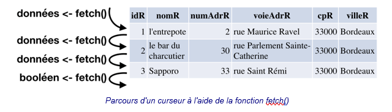
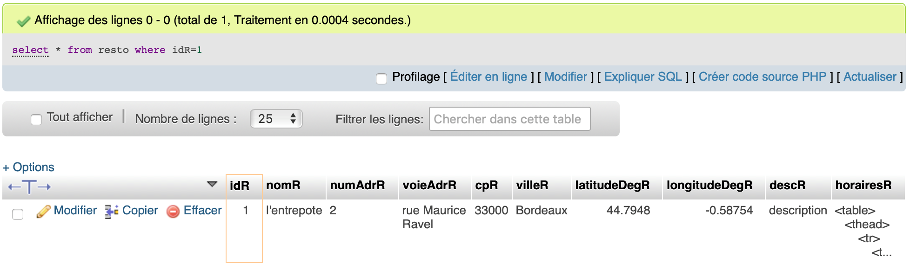
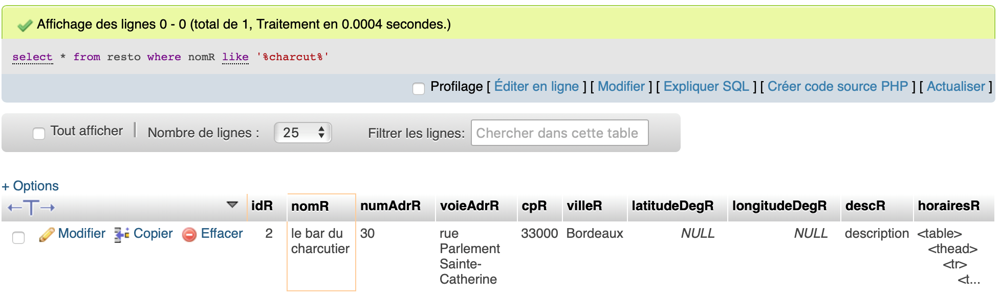
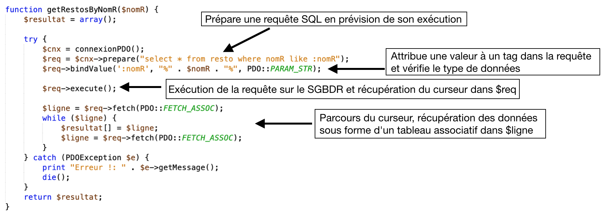
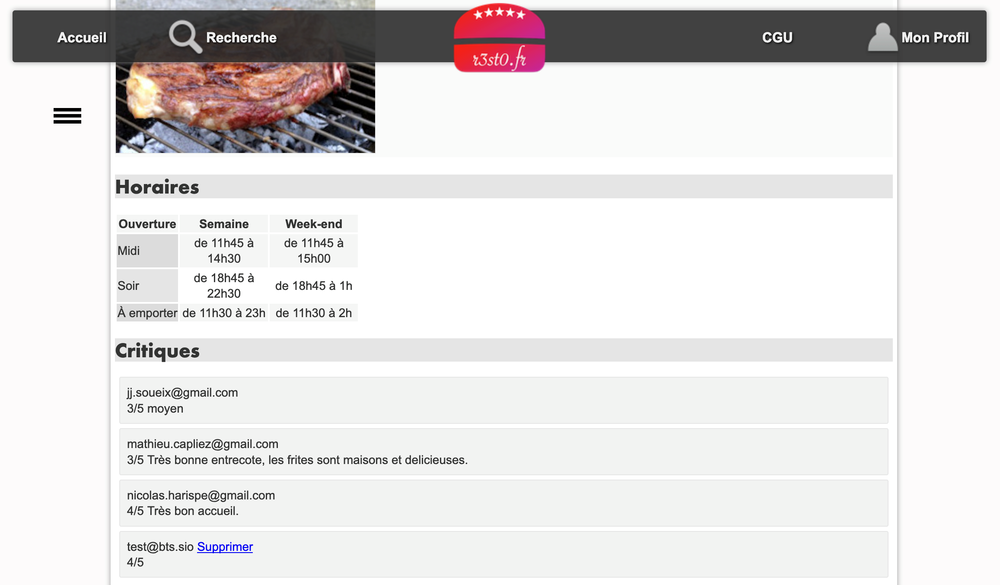

# 4. Le modèle et PDO 🗄️

Le **modèle** est la couche de l'architecture MVC dédiée à l'**accès aux données**. Dans ce TP, nous étudions comment PHP dialogue avec la base de données MariaDB/MySQL via l'interface **PDO** (PHP Data Objects).

## 1. PDO

PDO, c'est l'interface universelle d'accès aux données

PDO fonctionne avec de multiples SGBDR : MySQL, MariaDB, PostgreSQL, SQLite…

> 💡 L'avantage de PDO : si vous changez de SGBDR, vous n'avez pas à réécrire toutes les fonctions d'accès aux données.

#### Fonctions de base PDO

| Étape | Fonction PDO | Rôle |
|-------|-------------|------|
| 1 | `new PDO(...)` | Connexion à la base de données |
| 2 | `$cnx->prepare($sql)` | Prépare la requête SQL |
| 3 | `$req->bindValue(...)` | Associe une valeur à un paramètre |
| 4 | `$req->execute()` | Exécute la requête |
| 5 | `$req->fetch(PDO::FETCH_ASSOC)` | Récupère une ligne de résultat |

{: .center width=80%}

## 2. Analyse d'un modèle 🔎

Nous allons analyser de `getRestoByIdR()` dans `bd.resto.inc.php` 🔎

**Documents à utiliser :** fichiers du projet, annexes 1, 2, 4, 5 et 7

??? info "Annexe 1 - bd.inc.php 📄"

    ```php
    <?php

    function connexionPDO() {
        $login = "votre login";
        $mdp = "votre mot de passe";
        $bd = "nom de la base de données";
        $serveur = "adresse IP ou nom du serveur de base de données";

        try {
            $conn = new PDO("mysql:host=$serveur;dbname=$bd", $login, $mdp, array(PDO::MYSQL_ATTR_INIT_COMMAND => 'SET NAMES \'UTF8\''));
            $conn->setAttribute(PDO::ATTR_ERRMODE, PDO::ERRMODE_EXCEPTION);
            return $conn;
        } catch (PDOException $e) {
            print "Erreur de connexion PDO ";
            die();
        }
    }

    if ($_SERVER["SCRIPT_FILENAME"] == __FILE__) {
        // prog de test
        header('Content-Type:text/plain');

        echo "connexionPDO() : \n";
        print_r(connexionPDO());
    }
    ?>
    ```
??? info "Annexe 2 - extrait du modèle bd.resto.inc.php 📄"

    ```php
    function getRestoByIdR($idR) {

        try {
            $cnx = connexionPDO();
            $req = $cnx->prepare("select * from resto where idR=:idR");
            $req->bindValue(':idR', $idR, PDO::PARAM_INT);

            $req->execute();

            $resultat = $req->fetch(PDO::FETCH_ASSOC);
        } catch (PDOException $e) {
            print "Erreur !: " . $e->getMessage();
            die();
        }
        return $resultat;
    }

    function getRestosByNomR($nomR) {
        $resultat = array();

        try {
            $cnx = connexionPDO();
            $req = $cnx->prepare("select * from resto where nomR like :nomR");
            $req->bindValue(':nomR', "%".$nomR."%", PDO::PARAM_STR);

            $req->execute();

            $ligne = $req->fetch() ;
            while ($ligne) {
            $resultat[] = $ligne;
            $ligne = $req->fetch() ;
            }
        } catch (PDOException $e) {
            print "Erreur !: " . $e->getMessage();
            die();
        }
        return $resultat;
    }

    if ($_SERVER["SCRIPT_FILENAME"] == __FILE__) {
        // prog principal de test
        header('Content-Type:text/plain');

        echo "getRestoByIdR(1) : \n";
        print_r(getRestoByIdR(1));

        echo "getRestosByNomR('charcut') : \n";
        print_r(getRestosByNomR("charcut"));

    }
    ?>
    ```
??? info "Annexe 4 - extrait du résultat d'exécution du script bd.resto.inc.php 📄"

    ```php
    getRestoByIdR(1) :
    Array
    (
        [idR] => 1
        [nomR] => l'entrepote
        [numAdrR] => 2
        [voieAdrR] => rue Maurice Ravel
        [cpR] => 33000
        [villeR] => Bordeaux
        [latitudeDegR] => 44.7948
        [longitudeDegR] => -0.58754
        [descR] => description
        [horairesR] => <table>...</table>
    )

    getRestosByNomR('charcut') :
    Array
    (
        [0] => Array
            (
                [idR] => 2
                [nomR] => le bar du charcutier
                [numAdrR] => 30
                [voieAdrR] => rue Parlement Sainte-Catherine
                [cpR] => 33000
                [villeR] => Bordeaux
                [latitudeDegR] =>
                [longitudeDegR] =>
                [descR] => description
                [horairesR] => <table>...</table>
            )
    )
    ```
??? info "Annexe 5 - résultat d'exécution de la requête SQL : select * from resto where idR=1 📄"
    {: .center width=80%}

??? info "Annexe 7 - extrait du script SQL de création de la base de données 📄"

    ```sql
    create table resto (
        idR bigint,
        nomR varchar(255),
        numAdrR varchar(20),
        voieAdrR varchar(255),
        cpR char(5),
        villeR varchar(255),
        latitudeDegR float,
        longitudeDegR float,
        descR text,
        horairesR text,
        primary key (idR)
    );
    ```

### 2.1 Requêtes préparées

```php
function getRestoByIdR($idR) {
    $cnx = connexionPDO();
    $req = $cnx->prepare("SELECT * FROM resto WHERE idR = :idR");
    $req->bindValue(':idR', $idR, PDO::PARAM_INT);
    $req->execute();
    $resultat = $req->fetch(PDO::FETCH_ASSOC);
    return $resultat;
}
```

Le tag `:idR` dans la requête est un **paramètre nommé**. La fonction `bindValue()` l'associe à la variable PHP.

La constante `PDO::PARAM_INT` vérifie que la valeur est bien un entier. S'il y avait plusieurs paramètres, on ferait plusieurs appels à `bindValue()`.

❓**Indiquer le nom du paramètre de la fonction et sa valeur dans l'exemple d'utilisation de l'annexe 4. 🔎**

??? question "Éléments de réponses ✅"
    Le paramètre de la fonction est **`$idR`**. Dans l'exemple de l'annexe 4, cet appel est `getRestoByIdR(1)` donc `$idR` vaut **1**.

❓ **À l'aide des annexes, retrouver la requête SQL exécutée par la fonction** `getRestoByIdR()`.🗄️

??? question "Éléments de réponses ✅"
    ```sql
    SELECT * FROM resto WHERE idR = :idR
    ```
    Après l'appel à `bindValue()`, la requête réellement exécutée avec l'exemple est :
    ```sql
    SELECT * FROM resto WHERE idR = 1
    ```

❓ **Expliquer pourquoi cette requête SQL ne retourne qu'une seule ligne. **🤔

??? question "Éléments de réponses ✅"
    La requête ne retourne qu'une seule ligne car la condition `WHERE idR = :idR` est basée sur la valeur de la **clé primaire** de la table `resto`. Par définition, la clé primaire est unique : il ne peut exister qu'un seul restaurant avec un `idR` donné.

### 2.2 Le curseur et `fetch()`

Quand une requête SQL est exécutée, le SGBDR renvoie un **curseur** : un ensemble de lignes et de colonnes organisées comme un tableau.

**Exemple pour `SELECT idR, nomR, villeR FROM resto` :**

| idR | nomR | villeR |
|-----|------|--------|
| 1 | l'entrepote | Bordeaux |
| 2 | le bar du charcutier | Bordeaux |
| 3 | Sapporo | Bordeaux |

Ce curseur contient 3 lignes et 3 colonnes. Il est lu **ligne par ligne** avec `fetch()`.

```php
$resultat = $req->fetch(PDO::FETCH_ASSOC);
// Résultat : ['idR' => 1, 'nomR' => "l'entrepote", 'villeR' => 'Bordeaux']
```

### 2.3 Parcours complet d'un curseur (`while`)

```php
$ligne = $req->fetch(PDO::FETCH_ASSOC);
while ($ligne) {
    $resultat[] = $ligne;
    $ligne = $req->fetch(PDO::FETCH_ASSOC);
}
// Quand fetch() retourne false, la boucle s'arrête
```
{: .cnenter width=80%}

❓ **Rappeler la syntaxe utilisée pour accéder à un champ d'un tableau associatif.**⌨️

??? question "Éléments de réponses ✅"
    ```php
    $nomTableauAssociatif['nomDuChamp']
    ```
    Par exemple : `$unResto['nomR']`

❓ **Rappeler comment accéder au nom du restaurant dans la variable retournée par** `getRestoByIdR()`. ⌨️

??? question "Éléments de réponses ✅"
    ```php
    $unResto['nomR']
    ```

## 3. Analyse de `getRestosByNomR()` 🔎

**Documents à utiliser :** fichiers du projet, annexes 2, 4, 6 et 7

??? info "Annexe 2 - extrait du modèle bd.resto.inc.php 📄"

    ```php
    function getRestoByIdR($idR) {

        try {
            $cnx = connexionPDO();
            $req = $cnx->prepare("select * from resto where idR=:idR");
            $req->bindValue(':idR', $idR, PDO::PARAM_INT);

            $req->execute();

            $resultat = $req->fetch(PDO::FETCH_ASSOC);
        } catch (PDOException $e) {
            print "Erreur !: " . $e->getMessage();
            die();
        }
        return $resultat;
    }

    function getRestosByNomR($nomR) {
        $resultat = array();

        try {
            $cnx = connexionPDO();
            $req = $cnx->prepare("select * from resto where nomR like :nomR");
            $req->bindValue(':nomR', "%".$nomR."%", PDO::PARAM_STR);

            $req->execute();

            $ligne = $req->fetch() ;
            while ($ligne) {
            $resultat[] = $ligne;
            $ligne = $req->fetch() ;
            }
        } catch (PDOException $e) {
            print "Erreur !: " . $e->getMessage();
            die();
        }
        return $resultat;
    }

    if ($_SERVER["SCRIPT_FILENAME"] == __FILE__) {
        // prog principal de test
        header('Content-Type:text/plain');

        echo "getRestoByIdR(1) : \n";
        print_r(getRestoByIdR(1));

        echo "getRestosByNomR('charcut') : \n";
        print_r(getRestosByNomR("charcut"));

    }
    ?>
    ```
??? info "Annexe 4 - extrait du résultat d'exécution du script bd.resto.inc.php 📄"

    ```php
    getRestoByIdR(1) :
    Array
    (
        [idR] => 1
        [nomR] => l'entrepote
        [numAdrR] => 2
        [voieAdrR] => rue Maurice Ravel
        [cpR] => 33000
        [villeR] => Bordeaux
        [latitudeDegR] => 44.7948
        [longitudeDegR] => -0.58754
        [descR] => description
        [horairesR] => <table>...</table>
    )

    getRestosByNomR('charcut') :
    Array
    (
        [0] => Array
            (
                [idR] => 2
                [nomR] => le bar du charcutier
                [numAdrR] => 30
                [voieAdrR] => rue Parlement Sainte-Catherine
                [cpR] => 33000
                [villeR] => Bordeaux
                [latitudeDegR] =>
                [longitudeDegR] =>
                [descR] => description
                [horairesR] => <table>...</table>
            )
    )
    ```
??? info "Annexe 6 - résultat d'exécution de la requête SQL : select * from resto where nomR like '%charcut%' 📄"
    {: .center width=80%}

??? info "Annexe 7 - extrait du script SQL de création de la base de données 📄"

    ```sql
    create table resto (
        idR bigint,
        nomR varchar(255),
        numAdrR varchar(20),
        voieAdrR varchar(255),
        cpR char(5),
        villeR varchar(255),
        latitudeDegR float,
        longitudeDegR float,
        descR text,
        horairesR text,
        primary key (idR)
    );
    ```

❓ **Quelle requête SQL est envoyée à `prepare()` dans `getRestosByNomR()` ?**

??? question "Éléments de réponses ✅"
    ```sql
    SELECT * FROM resto WHERE nomR LIKE :nomR
    ```

❓ **Si on appelle `getRestosByNomR('charcut')`, quelle requête SQL est réellement exécutée après l'appel à `bindValue()` ?**🗄️

> 💡 Penser à l'opérateur SQL `LIKE` et aux wildcards `%`.

??? question "Éléments de réponses ✅"
    ```sql
    SELECT * FROM resto WHERE nomR LIKE '%charcut%'
    ```
    Le `bindValue()` associe `"%charcut%"` au paramètre `:nomR`. Les `%` permettent de trouver tous les restaurants dont le nom **contient** la chaîne `charcut`.

❓ **Parmi les deux propositions, laquelle est correcte ? Justifier à l'aide du code et de vos connaissances.** 🤔

**a)** La variable `$resultat` retournée est un **tableau associatif** contenant les informations d'un restaurant.

**b)** La variable `$resultat` retournée est un **tableau de tableaux associatifs**. Chaque case contient les informations d'un restaurant.

??? question "Éléments de réponses ✅"
    La proposition **b)** est correcte. Dans le code de `getRestosByNomR()`, une boucle `while` parcourt le curseur et construit un **tableau de tableaux associatifs** :
    ```php
    while ($ligne = $req->fetch(PDO::FETCH_ASSOC)) {
        $resultat[] = $ligne;
    }
    ```
    Chaque `$ligne` est un tableau associatif (un restaurant), et `$resultat[]` accumule toutes les lignes. La requête pouvant retourner plusieurs restaurants, `$resultat` peut donc contenir plusieurs tableaux associatifs.

## 4. Analyse de `getNoteMoyenneByIdR()`  📊

La fonction se trouve dans `bd.critiquer.inc.php`

**Documents à utiliser :** fichiers du projet, annexe 8

??? info "Annexe 8 - extrait du modèle bd.critiquer.inc.php 📄"

    ```php
    function getNoteMoyenneByIdR($idR) {
        try {
            $cnx = connexionPDO();
            $req = $cnx->prepare("select avg(note) from critiquer where idR=:idR");
            $req->bindValue(':idR', $idR, PDO::PARAM_INT);

            $req->execute();

            $resultat = $req->fetch(PDO::FETCH_ASSOC);
        } catch (PDOException $e) {
            print "Erreur !: " . $e->getMessage();
            die();
        }
        if ($resultat["avg(note)"] != NULL) {
            return $resultat["avg(note)"];
        } else {
            return 0;
        }
    }
    ```

❓ **Expliquer le rôle de cette requête :**🤔

```sql
SELECT AVG(note) FROM critiquer WHERE idR = :idR
```

??? question "Éléments de réponses ✅"
    Cette requête **calcule la note moyenne** d'un restaurant en faisant la moyenne de toutes les critiques reçues (colonne `note` de la table `critiquer`), pour le restaurant dont l'identifiant `idR` est passé en paramètre.

❓ **Combien de résultats cette requête SQL retourne-t-elle ?** 🔢

??? question "Éléments de réponses ✅"
    La fonction `AVG()` est une fonction d'agrégation : elle retourne **un seul résultat** (la moyenne calculée), peu importe le nombre de critiques du restaurant.

❓ **Exécuter la requête (en remplaçant `:idR` par `2`) dans phpMyAdmin. Comment est nommée la colonne affichée dans le résultat ?** 🔎

??? question "Éléments de réponses ✅"
    La colonne est nommée **`avg(note)`** — SQL utilise le nom de la fonction comme nom de colonne par défaut lorsqu'aucun alias n'est défini. C'est pourquoi dans le code PHP on accède au résultat via `$resultat["avg(note)"]`.

❓ **Exécuter la requête** avec un identifiant **existant**, puis avec un identifiant **impossible** (ex: `0` ou `-1`). 🔎

| Cas | Valeur retournée |
|-----|-----------------|
| Restaurant existant avec critiques | |
| Restaurant sans critiques ou inexistant | |

??? question "Éléments de réponses ✅"
    | Cas | Valeur retournée |
    |-----|-----------------|
    | Restaurant existant avec critiques | Un **nombre réel** (ex: `3.67`) |
    | Restaurant sans critiques ou inexistant | **`NULL`** |

❓ À partir des questions précédentes, **indiquer quel résultat sera retourné par la fonction selon les cas.** 🔎

??? question "Éléments de réponses ✅"
    - Si le restaurant a des critiques → la fonction retourne sa **note moyenne** (nombre réel).
    - Si le restaurant n'a pas de critiques ou n'existe pas → la fonction retourne **`0`** (grâce à la condition finale qui intercepte le `NULL`).

❓ **Expliquer la condition suivante en fin de fonction :**🤔

```php
if ($resultat["avg(note)"] != NULL) {
    return $resultat["avg(note)"];
} else {
    return 0;
}
```

??? question "Éléments de réponses ✅"
    `$resultat["avg(note)"]` contient la valeur renvoyée par la requête SQL :

    - Si le restaurant a des critiques, `AVG()` retourne un nombre → la condition est vraie → on retourne ce nombre.
    - Si le restaurant n'a pas de critiques (ou n'existe pas), `AVG()` retourne `NULL` → la condition est fausse → on retourne `0` pour éviter d'afficher `NULL` dans la vue.

## 5. Insertion de données : `addAimer()` ⭐

`addAimer()` se trouve dans `bd.aimer.inc.php`

**Documents à utiliser :** fichiers du projet, annexes 9, 10 et 11

??? info "Annexe 9 - extrait du modèle bd.aimer.inc.php 📄"

    ```php
    function addAimer($mailU, $idR) {
        try {
            $cnx = connexionPDO();
            $req = $cnx->prepare("insert into aimer (mailU, idR) values(:mailU,:idR)");
            $req->bindValue(':idR', $idR, PDO::PARAM_INT);
            $req->bindValue(':mailU', $mailU, PDO::PARAM_STR);
            
            $resultat = $req->execute();
        } catch (PDOException $e) {
            print "Erreur !: " . $e->getMessage();
            die();
        }
        return $resultat;
    }
    ```

??? info "Annexe 10 - extrait du script de création de la base de données 📄"

    ```sql
    create table aimer (
        idR bigint,
        mailU varchar(100),
        primary key (idR,mailU),
        foreign key(idR) references resto(idR),
        foreign key(mailU) references utilisateur(mailU)
    );
    ```

??? info "Annexe 11 - extrait de la documentation PHP 📄"
    [PDOStatement::execute](https://www.php.net/manual/fr/pdostatement.execute.php){: target="_blank"}

    (PHP 5 >= 5.1.0, PHP 7, PECL pdo >= 0.1.0)

    **PDOStatement::execute — Exécute une requête préparée**

    **Description**<br />
    public PDOStatement::execute ([ array $input_parameters ] ) : bool

    Exécute une requête préparée. Si la requête préparée inclut des marqueurs de positionnement, vous pouvez :
    
    - PDOStatement::bindParam() et/ou PDOStatement::bindValue() doit être appelé pour lier des variables ou des valeurs (respectivement) aux marqueurs de paramètres. Les variables liées passent leurs valeurs en entrée et reçoivent les valeurs de sortie, s'il y en a, de leurs marqueurs de positionnement respectifs
    - ou passer un tableau de valeurs de paramètres, uniquement en entrée

    **Liste de paramètres**<br />
    ``input_parameters``<br />
    Un tableau de valeurs avec autant d'éléments qu'il y a de paramètres à associer dans la requête SQL qui sera exécutée. Toutes les valeurs sont traitées comme des constantes PDO::PARAM_STR.

    Les valeurs multiples ne peuvent pas être liées à un seul paramètre; par exemple, il n'est pas autorisé de lier deux valeurs à un seul paramètre nommé dans une clause IN().

    La liaison de plus de valeurs que spécifié n'est pas possible ; s'il y a plus de clés dans input_parameters que dans le code SQL utilisé pour PDO::prepare(), alors la requête préparée échouera et une erreur sera levée.

    **Valeurs de retour**<br />
    Cette fonction retourne TRUE en cas de succès ou FALSE si une erreur survient.

### Contexte

Dans la base, la table `aimer` indique qu'un utilisateur aime un restaurant. Pour "aimer" un restaurant, l'utilisateur clique sur l'étoile ⭐ dans la fiche du restaurant.

```php
function addAimer($idR, $mailU) {
    $cnx = connexionPDO();
    $req = $cnx->prepare("INSERT INTO aimer (idR, mailU) VALUES (:idR, :mailU)");
    $req->bindValue(':idR',   $idR,   PDO::PARAM_INT);
    $req->bindValue(':mailU', $mailU, PDO::PARAM_STR);
    return $req->execute();
}
```

❓ **Expliquer le rôle de la requête présente dans** `addAimer()`. 🗄️

??? question "Éléments de réponses ✅"
    La requête `INSERT INTO aimer (idR, mailU) VALUES (:idR, :mailU)` **insère une nouvelle ligne** dans la table `aimer`. Cette ligne signifie qu'un utilisateur (identifié par son `mailU`) aime un restaurant (identifié par son `idR`).

❓ **Pourquoi les deux appels à `bindValue()` n'utilisent-ils pas la même constante PDO en 3ème paramètre ?**

| Paramètre | Constante PDO | Raison |
|-----------|--------------|--------|
| `:idR` | `PDO::PARAM_INT` | |
| `:mailU` | `PDO::PARAM_STR` | |

??? question "Éléments de réponses ✅"
    | Paramètre | Constante PDO | Raison |
    |-----------|--------------|--------|
    | `:idR` | `PDO::PARAM_INT` | `idR` est un **entier** dans la base de données (clé primaire numérique). |
    | `:mailU` | `PDO::PARAM_STR` | `mailU` est une **chaîne de caractères** (adresse email). |

    La constante PDO indique à la bibliothèque le type de la valeur, afin de valider et formater correctement les paramètres avant exécution.

❓ **À l'aide de l'annexe 11 (documentation PHP), déterminer quelle valeur est retournée par `execute()` en cas de réussite ou d'échec.** 🔎

??? question "Éléments de réponses ✅"
    La fonction `execute()` retourne :
    - **`true`** en cas de réussite de l'exécution
    - **`false`** en cas d'échec

❓ Déduire de la question précédente le type de données retourné par `addAimer()`. 🔎

??? question "Éléments de réponses ✅"
    La fonction `addAimer()` retourne directement la valeur renvoyée par `execute()`. Elle retourne donc un **booléen** (`true` ou `false`).

❓ Si un utilisateur tente d'aimer un restaurant qu'il **aime déjà**, **quelle sera la valeur retournée par `addAimer()` ? Pourquoi ?**

> 💡 Rappel : `(idR, mailU)` est la clé primaire de la table `aimer`.

??? question "Éléments de réponses ✅"
    La fonction retournera **`false`**. En effet, `(idR, mailU)` est la clé primaire de la table `aimer` : il est impossible d'insérer deux fois la même paire de valeurs. La tentative d'insertion échoue avec une violation de contrainte de clé primaire, et `execute()` retourne `false`.

    > ⚠️ En mode debug PDO (`PDO::ERRMODE_EXCEPTION`), une **exception est levée** et le programme s'arrête au lieu de retourner `false`.

## 6. Synthèse — PDO et connexion 📌

### 6.1 Connexion à la base de données

 Avant de pouvoir exécuter des requêtes SQL, le script PHP doit se connecter au SGBDR, c'est le rôle de la fonction ``connexionPDO()``. Cette fonction retourne un descripteur d'accès à la base de données : la variable ``$cnx``.
Cette variable est créée par l'instruction : ``new PDO("mysql:host=$serveur;dbname=$bd", $login, $mdp);``

Les paramètres de la fonction ``PDO()`` permettent de spécifier :

- le driver de base de données à utiliser : mysql
- l'adresse ou le nom du serveur : $serveur
- le nom de la base de données à utiliser : $bd
- le nom d'utilisateur pour se connecter au SGBDR : $login
- le mot de passe de l'utilisateur : $mdp

La ligne suivante permet de configurer la connexion en mode debug.
``$conn->setAttribute(PDO::ATTR_ERRMODE, PDO::ERRMODE_EXCEPTION);``

Dans ce mode, les erreurs SQL et les erreurs d'accès à la base de données sont interceptées et peuvent être affichées à l'utilisateur. Ce mode est préférable pendant les phases de développement ou de maintenance. Cette instruction peut être désactivée lorsque le site passe en production.

PDO est une **interface d'accès aux bases de données en PHP**. PDO fonctionne avec de multiples SGBDR, il peut fonctionner avec MySQL, MariaDB, Postgres etc. L'avantage d'une telle solution est qu'il n'est pas utile de ré-écrire toutes les fonctions d'accès aux données si on change de SGBDR.

PDO fournit un ensemble de fonctions permettant d'exécuter des requêtes SQL dans un programme PHP. On peut ainsi exécuter des requêtes, récupérer leur résultat, connaître le nombre de lignes dans ce résultat, annuler une transaction, récupérer les messages d'erreur SQL etc.

{: .center witdh=100%}

```php
function connexionPDO() {
    global $login, $mdp, $bd, $serveur;
    $conn = new PDO("mysql:host=$serveur;dbname=$bd", $login, $mdp);
    $conn->setAttribute(PDO::ATTR_ERRMODE, PDO::ERRMODE_EXCEPTION);
    return $conn;
}
```

| Paramètre `new PDO()` | Rôle |
|----------------------|------|
| `mysql:host=$serveur` | Driver et adresse du serveur |
| `dbname=$bd` | Nom de la base de données |
| `$login` | Utilisateur MySQL |
| `$mdp` | Mot de passe |

> ⚠️ `PDO::ERRMODE_EXCEPTION` est utile en **développement**. En production, il est préférable de le désactiver pour ne pas exposer les informations de la base de données.

### 6.2 Gestion des exceptions

L'accès à un SGBDR dans une application n'est pas garanti. Il faut donc prévoir des mécanismes en cas de perte de la connexion, d'erreur d'authentification à la base de données, de droits d'accès insuffisants, etc... Le mécanisme d'exception permet de prendre en compte ces situations.

Ce document n'explique pas le fonctionnement des exceptions, mais illustre comment on peut s'en servir dans une fonction du modèle. On observe deux blocs bien distincts dans l'exemple au dessus :

- **try** : bloc de code à exécuter sous condition qu'il n'y ait pas d'erreur PDO ;
- **catch** : interception du type d'erreur PDOException dans le bloc try. Si une erreur est détectée, le bloc d'instruction du catch est exécuté. Le code présent ici permet d'afficher le message d'erreur puis d'arrêter l'exécution du programme.

Par exemple, si une erreur de type **PDOException** se produit pendant la préparation de la requête, le bloc d'instruction catch est exécuté.


| Bloc | Rôle |
|------|------|
| `try` | Code à exécuter sous condition d'absence d'erreur |
| `catch (PDOException $e)` | Interception des erreurs PDO : affichage et arrêt |

## 7. Ajout de fonctionnalités au modèle ✏️

🔨 Créer la fonction `delAimer()` 🗑️

**Documents à utiliser :** fichiers du projet, annexes 9 et 10

??? info "Annexe 9 - extrait du modèle bd.aimer.inc.php 📄"

    ```php
    function addAimer($mailU, $idR) {
        try {
            $cnx = connexionPDO();
            $req = $cnx->prepare("insert into aimer (mailU, idR) values(:mailU,:idR)");
            $req->bindValue(':idR', $idR, PDO::PARAM_INT);
            $req->bindValue(':mailU', $mailU, PDO::PARAM_STR);
            
            $resultat = $req->execute();
        } catch (PDOException $e) {
            print "Erreur !: " . $e->getMessage();
            die();
        }
        return $resultat;
    }
    ```

??? info "Annexe 10 - extrait du script de création de la base de données 📄"

    ```sql
    create table aimer (
        idR bigint,
        mailU varchar(100),
        primary key (idR,mailU),
        foreign key(idR) references resto(idR),
        foreign key(mailU) references utilisateur(mailU)
    );
    ```

❓ **Quelle est la clé primaire de la table `aimer` ? **🔎

??? question "Éléments de réponses ✅"
    La clé primaire est **composée** de deux champs : **`idR`** et **`mailU`**. Les deux ensemble identifient de façon unique qu'un utilisateur aime un restaurant précis.

❓ Rappeler la syntaxe SQL de la requête de suppression en SQL 🗄️

??? question "Éléments de réponses ✅"
    ```sql
    DELETE FROM table WHERE condition;
    ```
    Avec clé primaire composée :
    ```sql
    DELETE FROM table WHERE champ1 = valeur1 AND champ2 = valeur2;
    ```

❓ **Écrire la requête SQL permettant de supprimer **une occurrence précise** de la table**`aimer` 🗄️

??? question "Éléments de réponses ✅"
    ```sql
    DELETE FROM aimer WHERE idR = 1 AND mailU = 'test@bts.sio';
    ```
    Avec des paramètres PDO :
    ```sql
    DELETE FROM aimer WHERE idR = :idR AND mailU = :mailU
    ```

❓ Se connecter à phpMyAdmin et **tester la requête avec un exemple concret**. 🧪

❓ **Dans quel script du modèle doit être placée la fonction** `delAimer()` ? Justifier. 📁

??? question "Éléments de réponses ✅"
    La fonction `delAimer()` doit être placée dans le script **`bd.aimer.inc.php`**. C'est dans ce fichier que se trouvent toutes les fonctions d'accès à la table `aimer` (`addAimer()`…). Regrouper les fonctions d'accès à une même table dans un même fichier est un principe fondamental du MVC.

❓ **Quels paramètres sont nécessaires à `delAimer()` pour supprimer précisément une occurrence ?** En déduire le prototype : ⌨️

```php
function delAimer(_____, _____) {
    // ...
}
```

??? question "Éléments de réponses ✅"
    La fonction a besoin des deux champs de la clé primaire pour cibler une occurrence précise :

    ```text
    fonction delAimer(mailU : chaîne, idR : entier) : booléen
    ```

    En PHP :
    ```php
    function delAimer($mailU, $idR) { ... }
    ```

🔨 **Écrire le code de** `delAimer()` ✏️

Écrire le code complet de la fonction, en vous inspirant de `addAimer()`. Ajouter un appel de test dans la section de test du script.

```php
function delAimer($idR, $mailU) {
    $cnx = connexionPDO();

    $req = $cnx->prepare("/* requête à compléter */");

    // bindValue à compléter

    return $req->execute();
}
```

??? question "Éléments de réponses ✅"
    ```php
    function delAimer($mailU, $idR) {
        $resultat = -1;
        try {
            $cnx = connexionPDO();
            $req = $cnx->prepare("DELETE FROM aimer WHERE idR = :idR AND mailU = :mailU");
            $req->bindValue(':idR',   $idR,   PDO::PARAM_INT);
            $req->bindValue(':mailU', $mailU, PDO::PARAM_STR);
            $resultat = $req->execute();
        } catch (PDOException $e) {
            print "Erreur !: " . $e->getMessage();
            die();
        }
        return $resultat;
    }
    ```

    Dans la section de test :
    ```php
    echo "\n delAimer(\"test@bts.sio\", 2) : \n";
    print_r(delAimer("test@bts.sio", 2));
    ```

### 7. Consultation des critiques d'un restaurant 💬

**Documents à utiliser :** fichiers du projet, annexe 12

??? info "Annexe 12 - extrait du script de création de la base de données 📄"

    ```sql
    create table critiquer (
        idR bigint,
        mailU varchar(100),
        note integer,
        commentaire varchar(4096),
        primary key (idR,mailU),
        foreign key(idR) references resto(idR),
        foreign key(mailU) references utilisateur(mailU)
    );
    ```
La fiche descriptive d'un restaurant doit afficher en bas de page la **liste des critiques** (notes et commentaires) laissées par les utilisateurs.

{: .center width=80%}

La vue et le contrôleur sont déjà codés, mais la fonction du modèle retourne pour l'instant une liste vide.

🔨 Ecrire la fonction `getCritiquerByIdR()`

À partir de la structure de la table `critiquer` :

```
critiquer (idR, mailU, note, commentaire)
```

??? question "Éléments de réponses ✅"
    **Prototype de la fonction :**
    ```
    fonction getCritiquerByIdR(idR : entier) : tableau de tableaux associatifs
    ```

    **Requête SQL :**
    ```sql
    SELECT * FROM critiquer WHERE idR = 1
    ```

    **Structure de données retournée :**
    ```
    $critiques
    ├── [0] → ['idR' => 1, 'mailU' => 'user@mail.com', 'note' => 4, 'commentaire' => '...']
    ├── [1] → ['idR' => 1, 'mailU' => 'autre@mail.com', 'note' => 3, 'commentaire' => '...']
    └── ...
    ```

    **Code complet de `getCritiquerByIdR()` :**

    ```php
    function getCritiquerByIdR($idR) {
        $resultat = array();
        try {
            $cnx = connexionPDO();
            $req = $cnx->prepare("SELECT * FROM critiquer WHERE idR = :idR");
            $req->bindValue(':idR', $idR, PDO::PARAM_INT);
            $req->execute();
            $ligne = $req->fetch(PDO::FETCH_ASSOC);
            while ($ligne) {
                $resultat[] = $ligne;
                $ligne = $req->fetch(PDO::FETCH_ASSOC);
            }
        } catch (PDOException $e) {
            print "Erreur !: " . $e->getMessage();
            die();
        }
        return $resultat;
    }
    ```

    Dans la section de test :
    ```php
    echo "\n getCritiquerByIdR(1) : \n";
    print_r(getCritiquerByIdR(1));
    ```

*[Partie 5 — Contrôleur principal →](./05_controleur_principal.md)*
