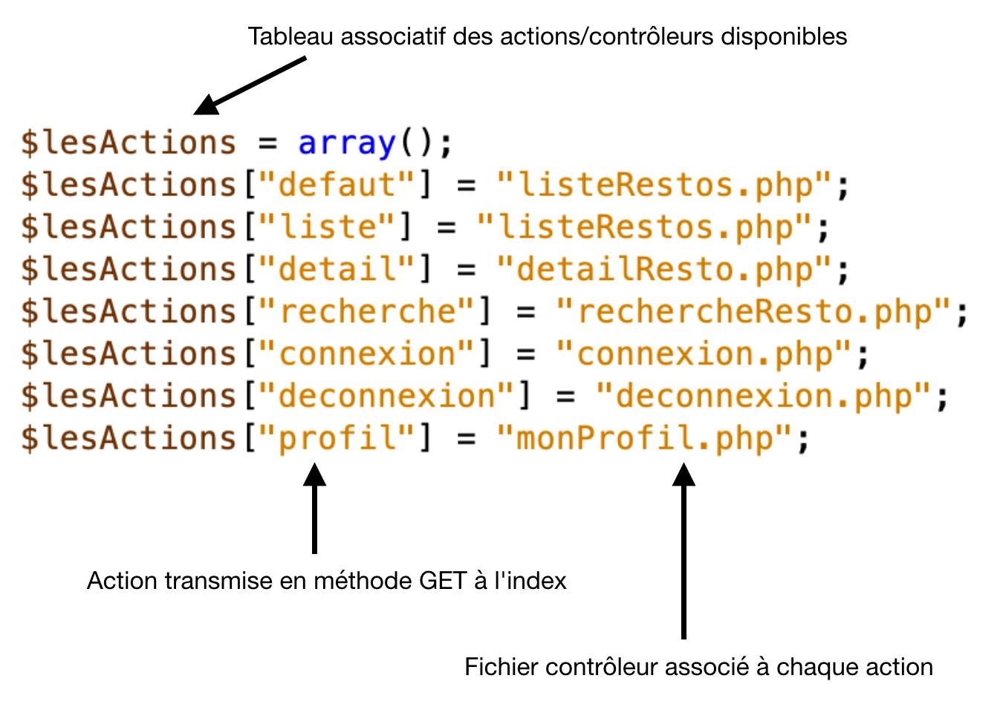
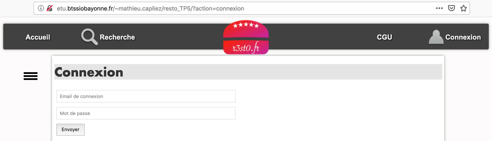
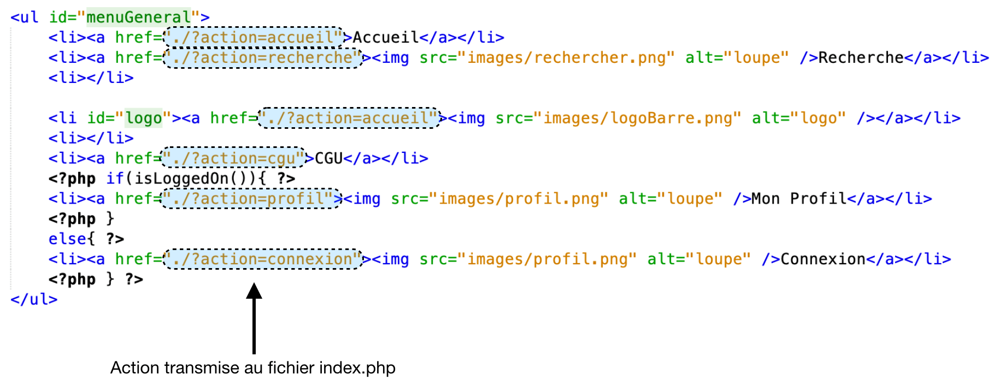
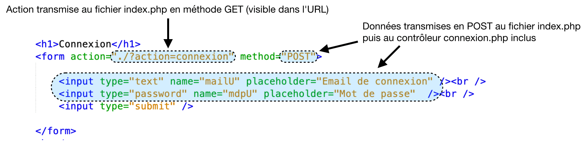
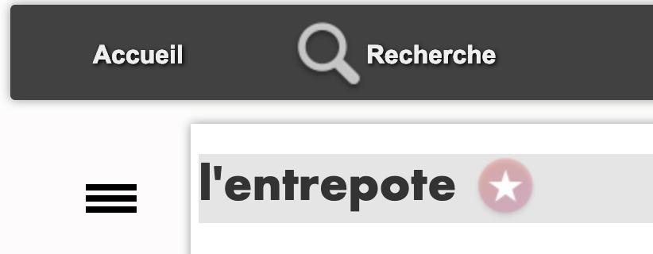
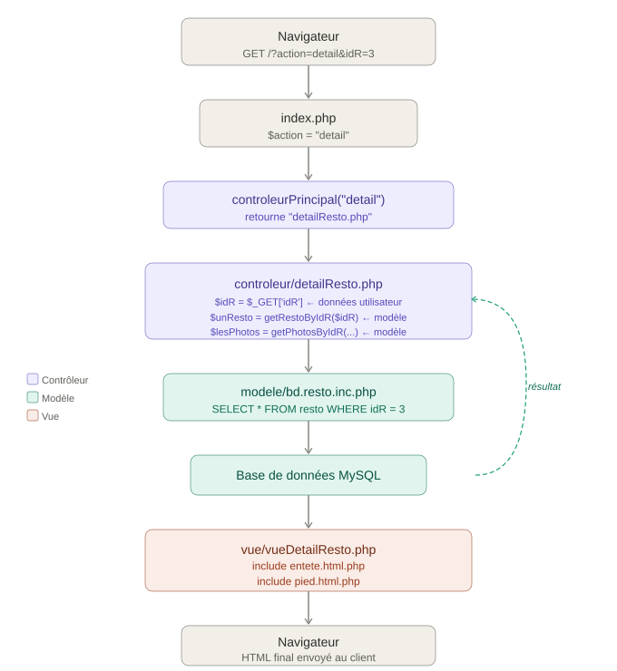

# 5. Le contrôleur principal 🚦

Jusqu'ici, chaque contrôleur était étudié individuellement. Dans une application MVC réelle, il existe un **contrôleur principal** (ou *front controller*) qui sert de **point d'entrée unique** : toutes les requêtes passent par lui, et c'est lui qui délègue le traitement au bon contrôleur.

Dans notre application, ce rôle est joué par `index.php` + `controleurPrincipal.php`.

## 1. Analyse du fonctionnement du contrôleur principal 🔍

### 1.1 Analyse de l'existant 🔎

**Documents à utiliser :** fichiers du projet, annexes 1, 2 et 3

??? info "Annexe 1 - index.php 📄"

    ```php
    <?php
    include "getRacine.php";
    include "$racine/controleur/controleurPrincipal.php";
    include_once "$racine/modele/authentification.inc.php";

    if (isset($_GET["action"])) {
        $action = $_GET["action"];
    }
    else {
        $action = "defaut";
    }

    $fichier = controleurPrincipal($action);
    include "$racine/controleur/$fichier";
    ?>
    ```
??? info "Annexe 2 - controleurPrincipal.php 📄"

    ```php
    <?php

    function controleurPrincipal($action) {
        $lesActions = array();
        $lesActions["defaut"] = "listeRestos.php";
        $lesActions["liste"] = "listeRestos.php";
        $lesActions["detail"] = "detailResto.php";
        $lesActions["recherche"] = "rechercheResto.php";
        $lesActions["connexion"] = "connexion.php";
        $lesActions["deconnexion"] = "deconnexion.php";
        $lesActions["profil"] = "monProfil.php";

        if (array_key_exists($action, $lesActions)) {
            return $lesActions[$action];
        }
        else {
            return $lesActions["defaut"];
        }
    }

    ?>
    ```
??? info "Annexe 3 - extrait de la documentation PHP 📄"

    ``array_key_exists``    (PHP 4 >= 4.0.7, PHP 5, PHP 7)

    ``array_key_exists`` — Vérifie si une clé existe dans un tableau

    **Description** : ``array_key_exists ( mixed $key , array $array ) : bool``

    ``array_key_exists()`` retourne ``TRUE`` s'il existe une clé du nom de ``key`` dans le tableau ``array``. ``key`` peut être n'importe quelle valeur valide d'index de tableau.

    **Liste de paramètres**<br />
    ``key`` Valeur à vérifier.<br />
    ``array``   Un tableau contenant les clés à vérifier.<br />

    **Valeurs de retour** Cette fonction retourne ``TRUE`` en cas de succès ou ``FALSE`` si une erreur survient.


!!! note "Rappel : transmission en méthode GET"

    Les paramètres GET sont visibles dans l'URL :

    ```
    http://serveur/dossier/index.php?action=connexion
    ```

    Dans cet exemple : le paramètre `action` a la valeur `connexion`.

❓ Naviguer successivement sur les écrans de connexion, recherche et accueil. **Relever les URL et compléter le tableau :** 📨

| Écran | URL complète | Paramètre GET | Valeur |
|-------|-------------|---------------|--------|
| Connexion | | | |
| Recherche | | | |
| Accueil | | | |

??? question "Éléments de réponses ✅"
    | Écran | URL complète | Paramètre GET | Valeur |
    |-------|-------------|---------------|--------|
    | Connexion | `http://serveur/resto/?action=connexion` | `action` | `connexion` |
    | Recherche | `http://serveur/resto/?action=recherche` | `action` | `recherche` |
    | Accueil | `http://serveur/resto/?action=accueil` | `action` | `accueil` |

❓ **Valeurs possibles de**`$action` 🔎

Le fichier `index.php` reçoit tous les paramètres GET :

```php
if (isset($_GET["action"])) {
    $action = $_GET["action"];
} else {
    $action = "defaut";
}

$fichier = controleurPrincipal($action);
include "$racine/controleur/$fichier";
```

À l'aide de l'annexe 1 et de la réponse à la question précédente, **indiquer les valeurs que peut prendre la variable** `$action`.

??? question "Éléments de réponses ✅"
    La variable `$action` peut prendre les valeurs suivantes : `"defaut"`, `"recherche"`, `"accueil"` et `"connexion"` (et toutes les autres actions définies dans `$lesActions`).

❓ **Structure de** `$lesActions` 🗺️

La fonction `controleurPrincipal()` (annexe 2) :

```php
function controleurPrincipal($action) {
    $lesActions = array();

    $lesActions["defaut"]      = "listeRestos.php";
    $lesActions["liste"]       = "listeRestos.php";
    $lesActions["detail"]      = "detailResto.php";
    $lesActions["recherche"]   = "rechercheResto.php";
    $lesActions["connexion"]   = "connexion.php";
    $lesActions["deconnexion"] = "deconnexion.php";
    $lesActions["profil"]      = "monProfil.php";

    if (array_key_exists($action, $lesActions)) {
        return $lesActions[$action];
    } else {
        return $lesActions["defaut"];
    }
}
```

**Schématiser la structure de la variable** `$lesActions` :

```text
$lesActions
├── "defaut"      → "listeRestos.php"
├── "liste"       → "listeRestos.php"
├── ...
```

??? question "Éléments de réponses ✅"

    ```text
    $lesActions (tableau associatif)
    ├── "defaut"      → "listeRestos.php"
    ├── "liste"       → "listeRestos.php"
    ├── "detail"      → "detailResto.php"
    ├── "recherche"   → "rechercheResto.php"
    ├── "connexion"   → "connexion.php"
    ├── "deconnexion" → "deconnexion.php"
    └── "profil"      → "monProfil.php"
    ```

❓ **Quelle partie de la structure `$lesActions` est similaire aux données trouvées en question 1.1 ?** 🔗

??? question "Éléments de réponses ✅"
    Les **clés** du tableau associatif `$lesActions` (`"connexion"`, `"recherche"`, `"accueil"`…) sont similaires aux **valeurs du paramètre `action`** transmises dans les URL en méthode GET. C'est bien l'action reçue qui sert de clé pour retrouver le fichier contrôleur à charger.

❓ À partir des questions précédentes, **indiquer quelles valeurs peuvent être transmises à la fonction** `controleurPrincipal()` 📋

??? question "Éléments de réponses ✅"
    Les valeurs pouvant être transmises correspondent aux **clés du tableau `$lesActions`** :
    `"defaut"`, `"liste"`, `"detail"`, `"recherche"`, `"connexion"`, `"deconnexion"`, `"profil"`.

❓ **Pour chaque valeur transmise, indiquer quelle valeur sera retournée :** 📋

| Valeur de `$action` | Valeur retournée |
|--------------------|-----------------|
| `"liste"` | `"listeRestos.php"` |
| `"connexion"` | |
| `"detail"` | |
| `"recherche"` | |
| `"profil"` | |
| `"defaut"` | |

??? question "Éléments de réponses ✅"
    | Valeur de `$action` | Valeur retournée |
    |--------------------|-----------------|
    | `"liste"` | `"listeRestos.php"` |
    | `"connexion"` | `"connexion.php"` |
    | `"detail"` | `"detailResto.php"` |
    | `"recherche"` | `"rechercheResto.php"` |
    | `"profil"` | `"monProfil.php"` |
    | `"defaut"` | `"listeRestos.php"` |

❓ **Que se passe-t-il si l'action transmise n'existe *pas* dans `$lesActions` ? Quelle valeur est retournée ?** 🤔

??? question "Éléments de réponses ✅"
    Lorsque l'action transmise n'existe pas dans `$lesActions`, le bloc `else` est exécuté et la fonction retourne **`$lesActions["defaut"]`**, c'est-à-dire **`"listeRestos.php"`**. L'utilisateur voit donc la liste des restaurants par défaut.

❓ **Expliquer l'utilité de la condition utilisant `array_key_exists()` dans la fonction.** 🤔

> Documentation PHP : `array_key_exists(mixed $key, array $array) : bool`  
> Retourne `true` si la clé `$key` existe dans le tableau `$array`.

??? question "Éléments de réponses ✅"
    `array_key_exists()` permet de **vérifier si l'action demandée existe** dans le tableau `$lesActions` avant d'y accéder. Sans cette vérification, accéder à une clé inexistante (`$lesActions["actionInexistante"]`) générerait un avertissement PHP et retournerait `null`. La fonction protège ainsi contre les URL mal formées ou les tentatives d'accès à des actions non définies.

❓ **Quel script contrôleur est appelé par `index.php` lorsque la variable GET `action` *n'est pas renseignée* ?** 🔎

??? question "Éléments de réponses ✅"
    Lorsque `action` n'est pas renseignée, `index.php` affecte `"defaut"` à `$action`. La fonction `controleurPrincipal("defaut")` retourne **`"listeRestos.php"`** : c'est la liste des restaurants qui s'affiche.

❓ **Quel script contrôleur est appelé par `index.php` lorsque `action` vaut `"liste"` ?** 🔎

??? question "Éléments de réponses ✅"
    Lorsque `action` vaut `"liste"`, la fonction retourne **`"listeRestos.php"`** — même résultat que `"defaut"`, car les deux clés pointent vers le même fichier contrôleur.

### 1.2 Le contrôleur principal 📌

La variable `$lesActions` contient l'ensemble des **contrôleurs accessibles** sur le site. Chaque clé correspond à un script contrôleur.

{: .center width=60%}

🔨 **Ajouter une nouvelle fonctionnalité**

Pour intégrer une nouvelle fonctionnalité, il faut :

1. **Créer le contrôleur** dans le dossier `controleur/`
2. **Créer la vue** dans le dossier `vue/`
3. **Créer les fonctions modèle** si nécessaire dans `modele/`
4. **Déclarer l'action** dans `controleurPrincipal()` : `$lesActions['uneAction'] = "scriptControleur.php";`
5. **Créer le lien** pointant vers la nouvelle action : `<a href="./?action=uneAction">Lien vers la fonctionnalité</a>`

⚠️ Règle importante : Les contrôleurs ne sont ==jamais== appelés directement dans l'URL. On passe **toujours** par `index.php` et le paramètre `action`.

Exemple avec connexion :

{: .center width=60%}

<br />

{: .center width=80%}

Dans l'exemple ci dessus, le nom du fichier index.php n'est pas visible, on peut soit l'indiquer, soit faire référence à l'emplacement "/" qui désigne le fichier index.php dans la configuration du serveur web Apache .


Les contrôleurs ne sont jamais directement appelés dans l'URL, on doit toujours passer par le contrôleur principal, et donc par index.php. Il en est de même avec les formulaires, comme celui de connexion.

 
{: .center width=80%}

On remarque que les données du formulaire sont transmises en méthode POST à index.php. Lors de l'inclusion du fichier contrôleur (connexion.php), ces données seront aussi accessibles dans le contrôleur.

Pour intégrer une nouvelle fonctionnalité au site web, il faut donc :

- créer un nouveau contrôleur dans le dossier approprié,
- créer la vue et le modèle associé si besoin,
- ajouter une action dans la variable $lesActions associant le nom de l'action au nom du script contrôleur,
- donner l'accès à ce contrôleur par l'intermédiaire d'un lien ou d'un formulaire transmettant l'action en méthode GET.

## 2. Intégration de contrôleurs pré-existants 🔧

### 2.1 CGU (Conditions Générales d'Utilisation) 📜

**Documents à utiliser :** fichiers du projet, annexe 4

??? info "Annexe 4 - extrait du fichier entete.html.php 📄"
    ```php
    <ul id="menuGeneral">
        <li><a href="./?action=accueil">Accueil</a></li>
        <li><a href="./?action=recherche">Recherche</a></li>
        <li></li>

        <li id="logo"><a href="./?action=accueil"></a></li>
        <li></li>
        <li><a href="./?action=cgu">CGU</a></li>
        <?php if(isLoggedOn()){ ?>
        <li><a href="./?action=profil">Mon Profil</a></li>
        <?php }
        else{ ?>
        <li><a href="./?action=connexion">Connexion</a></li>
        <?php } ?>

    </ul>
    ```

Les conditions générales d'utilisations ont déjà été écrites. La vue et le contrôleur associés sont disponibles. De même, le menu général propose un lien vers celles ci.

Lorsque l'on clique sur ce lien les CGU ne sont pas affichées, le contrôleur par défaut est chargé à la place.

❓ **Repérer dans le menu général l'**action** correspondant au contrôleur des CGU.** 🔎

??? question "Éléments de réponses ✅"
    Dans le menu général, le lien vers les CGU est :
    ```html
    <li><a href="./?action=cgu">CGU</a></li>
    ```
    L'action associée est **`"cgu"`**.

❓ **Placer les fichiers fournis en ressource dans les *dossiers appropriés*** (`controleur/` et `vue/`). 📁

??? question "Éléments de réponses ✅"
    - **`cgu.php`** → dossier `controleur/`
    - **`vueCgu.php`** → dossier `vue/`

❓ **Rédiger l'instruction à ajouter dans `controleurPrincipal()` pour intégrer les CGU :**✏️

```php
$lesActions["___"] = "___";
```

??? question "Éléments de réponses ✅"
    ```php
    $lesActions["cgu"] = "cgu.php";
    ```
    Cette ligne est à insérer dans la fonction `controleurPrincipal()`, juste après les autres initialisations de `$lesActions`.

❓ **Ajouter la nouvelle action à la fonction**, puis **tester** le lien CGU dans le menu. 🧪

### 2.2 Aimer un restaurant ⭐

**Documents à utiliser :** fichiers du projet, annexe 5

??? info "Annexe 5 - contrôleur aimer.php 📄"
    ```php
    <?php

    if ($_SERVER["SCRIPT_FILENAME"] == __FILE__) {
        $racine = "..";
    }
    include_once "$racine/modele/bd.aimer.inc.php";

    // recuperation des donnees GET, POST, et SESSION
    $idR = $_GET["idR"];

    // appel des fonctions permettant de recuperer les donnees utiles a l'affichage

    $mailU = getMailULoggedOn();
    if ($mailU != "") {
        $aimer = getAimerById($mailU, $idR);

    // traitement si necessaire des donnees recuperees
        ;
        if ($aimer == false) {
            addAimer($mailU, $idR);
        } else {
            delAimer($mailU, $idR);
        }
    }

    // redirection vers le referer
    header('Location: ' . $_SERVER['HTTP_REFERER']);
    ?>
    ```

Lorsqu'un utilisateur connecté consulte la fiche descriptive d'un restaurant, il a la possibilité d'ajouter celui-ci dans la liste des restaurants qu'il aime. Cette action se fait en cliquant sur l'étoile située à droite du nom du restaurant. Tant que l'utilisateur n'a pas aimé ce restaurant, l'étoile est grisée.

{: .center width=60% }

Lorsqu’on clique sur ce lien, le traitement n'est pas effectué, rien n'est enregistré dans la table aimer. Le contrôleur par défaut est chargé à la place.

❓ **Quelle vue permet d'afficher la fiche descriptive d'un restaurant ?** 🖼️

??? question "Éléments de réponses ✅"
    Le fichier **`vueDetailResto.php`** permet d'afficher la fiche descriptive d'un restaurant.

❓ **Repérer dans le code de la vue le lien correspondant à l'étoile** ⭐.

??? question "Éléments de réponses ✅"
    ```php
    <?php if ($aimer != false) { ?>
        <a href="./?action=aimer&idR=<?= $unResto['idR']; ?>">
            
        </a>
    <?php } else { ?>
        <a href="./?action=aimer&idR=<?= $unResto['idR']; ?>">
            
        </a>
    <?php } ?>
    ```

❓ **Quels sont les paramètres envoyés en méthode GET lors du clic sur l'étoile ?** Préciser le **nom** et la **valeur** de chaque paramètre.📨

| Paramètre | Valeur |
|-----------|--------|
| | |
| | |

??? question "Éléments de réponses ✅"
    | Paramètre | Valeur |
    |-----------|--------|
    | `action` | `"aimer"` |
    | `idR` | identifiant du restaurant affiché (ex: `7`) |

❓ À partir du script contrôleur fourni, **déterminer dans quels scripts sont utilisées les deux variables transmises en GET**. 🔎

??? question "Éléments de réponses ✅"
    - Le paramètre **`action`** est utilisé par **`index.php`** pour sélectionner le contrôleur à charger.
    - Le paramètre **`idR`** est utilisé par le contrôleur **`aimer.php`** pour savoir quel restaurant l'utilisateur souhaite aimer.

🔨 **Placer le fichier contrôleur fourni dans le dossier approprié.** 📁

??? question "Éléments de réponses ✅"
    `aimer.php` est un fichier contrôleur → il doit être placé dans le dossier **`controleur/`**.

🔨 **Rédiger l'instruction à ajouter dans `controleurPrincipal()` pour la nouvelle action "aimer" :** ✏️

```php
$lesActions["___"] = "___";
```

??? question "Éléments de réponses ✅"
    ```php
    $lesActions["aimer"] = "aimer.php";
    ```

🔨 **Ajouter la nouvelle action**, puis tester en cliquant sur l'étoile (vous devez être **authentifié**). 🧪

🔨 **Le contrôleur `aimer.php` fait-il appel à une vue ?**🖼️

??? question "Éléments de réponses ✅"
    **Non.** Le contrôleur `aimer.php` ne contient aucune inclusion de vue. Il effectue l'action (enregistrer le "j'aime" en base), puis redirige l'utilisateur vers la page précédente.

❓ **Le `referer` HTTP 🌐**

En fin de contrôleur se trouve cette instruction :

```php
header('Location: ' . $_SERVER['HTTP_REFERER']);
```

🔎 Rechercher la signification du terme **referer** en HTTP.

Pour comprendre son fonctionnement :

1. Commenter l'instruction `header()` ci-dessus
2. Afficher à la place la valeur de `$_SERVER['HTTP_REFERER']`
3. Tester l'action d'aimer sur un restaurant

??? question "Éléments de réponses ✅"
    Le **referer** (ou *referrer*) HTTP est l'**URL de la page sur laquelle se trouvait le lien** qui a mené à la page actuelle. C'est le navigateur qui transmet cette information au serveur dans l'en-tête HTTP `Referer`.

❓ **Que contient la variable** `$_SERVER['HTTP_REFERER']` ? 🔎

??? question "Éléments de réponses ✅"
    La variable contient l'URL de la fiche restaurant que l'on consultait, par exemple [http://serveur/resto/?action=detail&idR=7]

❓ **Déduire de vos observations le rôle de** `header('Location: ' . $_SERVER['HTTP_REFERER']);` 🤔

??? question "Éléments de réponses ✅"
    Cette instruction **redirige le navigateur vers la page précédente** (la fiche du restaurant). Ainsi, après avoir cliqué sur l'étoile, l'utilisateur revient automatiquement sur la fiche du restaurant, sans que la page change visuellement — seule l'étoile change d'état.

### 2.3 Inscription 📝

Le formulaire d'inscription est accessible par l'intermédiaire d'un lien dans la section "connexion" du site.

❓ Analyser le lien d'inscription, puis apporter les modifications nécessaires pour rendre l'inscription fonctionnelle.✏️

🚩 Le modèle, la vue et le contrôleur sont déjà disponibles. Reprendre la même logique que pour les exercices précédents :

> 1. Identifier l'action dans le lien
> 2. Placer les fichiers dans les bons dossiers
> 3. Ajouter l'action dans `controleurPrincipal()`
> 4. Tester

??? question "Éléments de réponses ✅"
    1. Le lien d'inscription utilise l'action **`"inscription"`**.
    2. Placer les fichiers :
        - `inscription.php` → dossier `controleur/`
        - `vueInscription.php` → dossier `vue/`
    3. Ajouter dans `controleurPrincipal()` :
        ```php
        $lesActions["inscription"] = "inscription.php";
        ```
    4. Tester en cliquant sur le lien "Inscription" dans la page de connexion.

## 3. Bilan de la série de TP 🏆

[Download zip du projet Resto ⤵️](./data/siteComplet.zip){ .md-button }

Vous avez maintenant étudié et manipulé les **4 composants** d'une application MVC en PHP :

| Composant | Fichiers | Rôle |
|-----------|----------|------|
| **Contrôleur principal** | `index.php`, `controleurPrincipal.php` | Point d'entrée, routage |
| **Contrôleur** | `controleur/*.php` | Logique applicative, coordination |
| **Vue** | `vue/*.php` | Affichage HTML |
| **Modèle** | `modele/bd.*.inc.php` | Accès aux données (PDO) |

***Flux complet d'une requête***
{: .center width=60%}