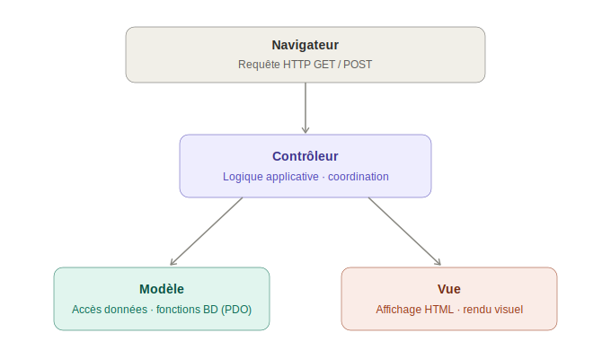
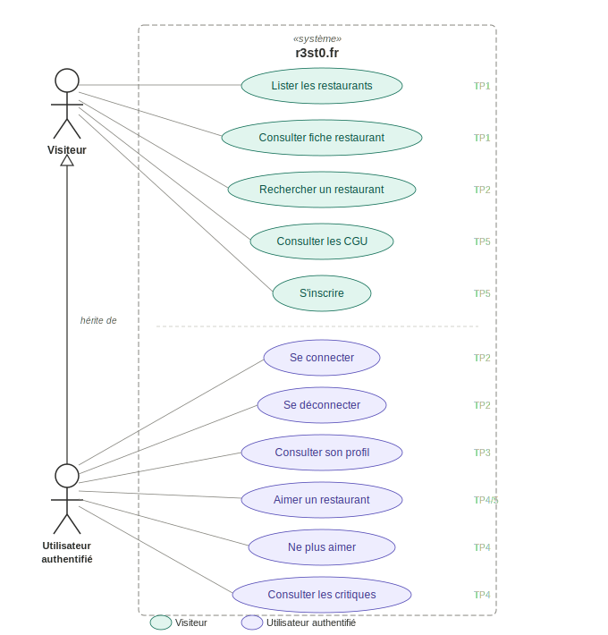

# 0. Architecture MVC

!!! note "Contexte"
    **Thème du cours :** Découverte du patron de conception **MVC** et de l'accès aux données dans une application web en PHP.

    @crédit : Suite de TP cré par Mathieu Capliez avec les relectures de Yann Barrot, Roger Sanchez et Fabricec Missonnier Pour le [Certa](https://www.reseaucerta.org/) en 2019

    **Compétences :**

    - Activité 1.2. Réponse aux incidents et aux demandes d’assistance et d’évolution > Traitement des demandes concernant les applications
    - Activité 1.3. Développement de la présence en ligne de l’organisation > Participation à l’évolution d’un site Web exploitant les données de l’organisation
  
    **Savoirs-faire :**

    - Conception et réalisation d’une solution applicative
    - Concevoir une interface utilisateur
    - Identification, développement, utilisation ou adaptation de composants logiciels
    - Interpréter un schéma de base de données
    - Développer et maintenir une application exploitant une base de données partagée

    **Objectifs pédagogiques :**

    - Appréhender les **principes du patron de conception MVC**
    - Comprendre comment **accéder à une base de données** depuis une application PHP
    - Analyser une application web existante, puis la modifier et l'enrichir

    La démarche est **inductive** (O.A.C. — Observation · Analyse · Conceptualisation) : vous partez d'une application fonctionnelle que vous analysez avant d'y apporter des modifications.

    **Prérequis :**

    - Bases du développement PHP/HTML : variables, formulaires, structures de contrôle, tableaux, fonctions
    - Exploitation d'une base de données MariaDB/MySQL : import de base, requêtes SQL

## 1. Organisation en 5 parties

| Partie | Thème |
|--|-|
| [Partie 1](./01_generalites.md) | Généralités sur le MVC et analyse de la structure du site existant |
| [Partie 2](./02_controleur.md) | Analyse du fonctionnement du contrôleur et ajout de fonctionnalités |
| [Partie 3](./03_vue.md) | Analyse du fonctionnement d'une vue puis ajout de nouvelles fonctionnalités |
| [Partie 4](./04_modele.md) | Fonctionnement du modèle et principes de l'accès aux données en PHP avec PDO |
| [Partie 5](./05_controleur_principal.md) | Analyse du contrôleur principal et intégration de nouvelles fonctionnalités |

L'application web finale est consultable sur le serveur de la classe : `http://r3st0.srv-debian.local/`

??? info "Vhots"
  Pour avoir acces à `http://r3st0.srv-debian.local/`, il faut que votre puisse savoir sur quel IP est hébergé le serveur web (au lycée, ``192.168.0.119``), il faut donc créer un Vhost sur votre poste.

  Dans un powershell lancé en administrateur, lancer la commande suivante :
  `Add-Content -Path "C:\Windows\System32\drivers\etc\hosts" -Value "192.168.0.119   r3st0.srv-debian.local"`

## 2. Le patron de conception MVC

Le développement d'une application web complexe, proposant de multiples fonctionnalités par des équipes de plusieurs informaticiens, nécessite d'établir des règles dans les étapes du développement et dans l'organisation du projet.

Pour passer de l'écriture d'un simple programme au développement d'une application **maintenable et évolutive**, il est indispensable d'industrialiser et de rationaliser son codage. C'est ce que proposent les patrons de conception, notamment **MVC**.

### 2.1 Trois composants fondamentaux

{: .center width=50%}

| Composant | Rôle |
|--||
| **Modèle** | Fonctions d'accès à la base de données |
| **Vue** | Affichage des données à l'utilisateur (HTML/CSS) |
| **Contrôleur** | Coordination : récupère les données, applique la logique, appelle la vue |

### 2.2 Avantages du MVC

- **Travail en équipe** : les composants peuvent être écrits par différentes personnes
- **Test fonctionnel** : chaque composant peut être testé séparément
- **Maintenance et évolutivité** : on peut modifier un composant sans toucher aux autres

## 3. Contexte applicatif : le site r3st0.fr

Le site **r3st0.fr** est construit à l'image des sites de critique de restaurants existants (LaFourchette, TripAdvisor…).

Son objectif : recenser les caractéristiques des restaurants, collecter les avis des consommateurs, et diffuser ces informations aux visiteurs.

### 3.1 Types d'utilisateurs

**Visiteur non authentifié**

- Module de recherche (par nom, adresse, type de cuisine, multi-critères)
- Module d'inscription
- Accès aux fiches restaurant : caractéristiques, types de cuisine, évaluations

**Utilisateur authentifié**

- Personnalisation du profil
- Choix de ses types de cuisine préférés
- Aimer des restaurants ⭐
- Noter et critiquer des restaurants

{: .center width=50%}

## 3.2 Modèle de données

Schéma relationnel de la base de données :

```
resto (idR, nomR, numAdrR, voieAdrR, cpR, villeR,
       latitudeDegR, longitudeDegR, descR, horairesR)
  clé primaire : idR

utilisateur (mailU, mdpU, pseudoU)
  clé primaire : mailU

typeCuisine (idTC, libelleTC)
  clé primaire : idTC

photo (idP, cheminP, idR)
  clé primaire : idP
  clé étrangère : idR → resto(idR)

critiquer (idR, mailU, note, commentaire)
  clé primaire : idR, mailU
  clé étrangère : idR → resto(idR)
  clé étrangère : mailU → utilisateur(mailU)

aimer (idR, mailU)
  clé primaire : idR, mailU
  clé étrangère : idR → resto(idR)
  clé étrangère : mailU → utilisateur(mailU)

proposer (idR, idTC)
  clé primaire : idR, idTC
  clé étrangère : idR → resto(idR)
  clé étrangère : idTC → typeCuisine(idTC)

preferer (mailU, idTC)
  clé primaire : mailU, idTC
  clé étrangère : mailU → utilisateur(mailU)
  clé étrangère : idTC → typeCuisine(idTC)
```

## 3.3 Fonctionnalités hors périmètre du TP

Les fonctionnalités suivantes sont présentes dans la version finale mais ne font **pas** l'objet d'exercices :

- Écran d'accueil avec les meilleurs restaurants
- Gestion des types de cuisine préférés
- Affichage des restaurants préférés
- Administration de ses propres critiques
- Recherches adaptées aux goûts de l'utilisateur
