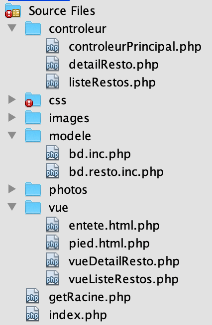
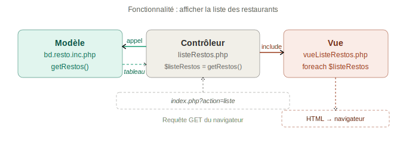

# 1. Généralités sur le MVC 🏗️

!!! note "Rappel du contexte"

    **R3st0.fr** est un site web de critique de restaurants. Développé en PHP selon le patron MVC, il permet le recensement et la diffusion d'avis sur les restaurants.

    L'objectif de cette partie est d'**analyser globalement l'organisation du site** avant d'étudier chaque composant MVC en détail.

    {: .center width=50%}

## 1.1 Mise en place 🛠️

### 1.1.1 Partie SQL 🗄️

1. Créer la base de données `resto` avec l'encodage `utf8mb4`
2. Importer le fichier `base.sql`
3. Créer un utilisateur MySQL ayant les droits sur la base `resto`

??? note "Créer un utilisateur 👤"
    On applique le principe de moindre privilèges en créant un utilisateur spécifiquement pour la base de données associée à votre application.

    ```sql
    CREATE USER 'resto'@'localhost' IDENTIFIED BY 'resto%2026';
    GRANT SELECT, INSERT, UPDATE, DELETE ON `resto`.* TO 'resto'@'localhost';
    FLUSH PRIVILEGES;
    ```

### 1.1.2 Partie code 📁

1. Copier le dossier `/site` dans `/var/www/` et le renommer en `resto`
2. Ouvrir `http://localhost/resto/` dans le navigateur

L'arborescence du projet est la suivante :

```
resto/
├── index.php
├── getRacine.php
├── controleur/
│   ├── controleurPrincipal.php
│   ├── listeRestos.php
│   ├── detailResto.php
│   ├── rechercheResto.php
│   ├── connexion.php
│   ├── deconnexion.php
│   └── monProfil.php
├── modele/
│   ├── bd.inc.php
│   ├── bd.resto.inc.php
│   ├── bd.utilisateur.inc.php
│   ├── bd.critiquer.inc.php
│   ├── bd.aimer.inc.php
│   └── authentification.inc.php
└── vue/
    ├── entete.html.php
    ├── pied.html.php
    ├── vueListeRestos.php
    ├── vueDetailResto.php
    └── ...
```

### 1.1.3 Configuration de la base de données ⚙️

Avant de commencer, paramétrer le fichier `modele/bd.inc.php` :

```php
$login   = "resto";
$mdp     = "resto%2026";
$bd      = "resto";
$serveur = "localhost";
```

## 2. Questions — Analyse de l'affichage de la liste des restaurants 🔍

**Documents à utiliser :** fichiers du projet, annexes 1, 2, 3, 4, 5, 10 et 11

??? info "Annexe 1 : listeRestos.php 📄"

    ```php
    <?php
    if ( $_SERVER["SCRIPT_FILENAME"] == __FILE__ ){
        $racine="..";
    }
    include_once "$racine/modele/bd.resto.inc.php";
    // recuperation des donnees GET, POST, et SESSION
    ;

    // appel des fonctions permettant de recuperer les donnees utiles a l'affichage
    $listeRestos = getRestos();

    // traitement si necessaire des donnees recuperees
    ;

    // appel du script de vue qui permet de gerer l'affichage des donnees
    $titre = "Liste des restaurants répertoriés";
    include "$racine/vue/entete.html.php";
    include "$racine/vue/vueListeRestos.php";
    include "$racine/vue/pied.html.php";
    ?>
    ```

??? info "Annexe 2 : vueListeRestos.php 📄"

    ```php
    <h1>Liste des restaurants</h1>
    <?php
    for ($i = 0; $i < count($listeRestos); $i++) {
        ?>
        <div class="card">
            <div class="photoCard">
            </div>
            <div class="descrCard"><?php echo "<a href='./?action=detail&idR=" . $listeRestos[$i]['idR'] . "'>" . $listeRestos[$i]['nomR'] . "</a>"; ?>
                <br />
                <?= $listeRestos[$i]["numAdrR"] ?>
                <?= $listeRestos[$i]["voieAdrR"] ?>
                <br />
                <?= $listeRestos[$i]["cpR"] ?>
                <?= $listeRestos[$i]["villeR"] ?>
            </div>
            <div class="tagCard">
                <ul id="tagFood">		
                </ul>
            </div>
        </div>
        <?php
    }
    ?>
    ```

??? info "Annexe 3 : entete.html.php 📄"

    ```php
    <!DOCTYPE html PUBLIC "-//W3C//DTD HTML 4.01 Transitional//EN" "http://www.w3.org/TR/html4/loose.dtd">
    <html>
        <head>
            <meta http-equiv="Content-Type" content="text/html; charset=iso-8859-1">
            <title><?php echo $titre ?></title>
            <style type="text/css">
                @import url("css/base.css");
                @import url("css/form.css");
                @import url("css/cgu.css");
                @import url("css/corps.css");
            </style>
            <link href="https://fonts.googleapis.com/css?family=Lobster" rel="stylesheet">
        </head>
        <body>
        <nav>
            <ul id="menuGeneral">
                <li><a href="./?action=accueil">Accueil</a></li>
                <li><a href="./?action=recherche">Recherche</a></li>
                <li><a href="./?action=liste">Liste</a></li>
                <li id="logo"><a href="./?action=accueil"></a></li>
                <li></li>
                <li><a href="./?action=cgu">CGU</a></li>
                <li><a href="./?action=connexion">Connexion</a></li>
            </ul>
        </nav>
        <div id="corps">
    ```

??? info "Annexe 4 : pied.html.php 📄"
    ```php
    </div>
    </body>
    </html>
    ```

??? info "Annexe 5 : bd.resto.inc.php 📄"

    ```php
    <?php
    include_once "bd.inc.php";

    function getRestoByIdR($idR) {
        try {
            $cnx = connexionPDO();
            $req = $cnx->prepare("select * from resto where idR=:idR");
            $req->bindValue(':idR', $idR, PDO::PARAM_INT);
            $req->execute();
            $resultat = $req->fetch(PDO::FETCH_ASSOC);
        } catch (PDOException $e) {
            print "Erreur !: " . $e->getMessage();
            die();
        }
        return $resultat;
    }

    function getRestos() {
        $resultat = array();
        try {
            $cnx = connexionPDO();
            $req = $cnx->prepare("select * from resto");
            $req->execute();
            while ($ligne = $req->fetch(PDO::FETCH_ASSOC)) {
                $resultat[] = $ligne;
            }
        } catch (PDOException $e) {
            print "Erreur !: " . $e->getMessage();
            die();
        }
        return $resultat;
    }

    function getRestosByNomR($nomR) {
        $resultat = array();
        try {
            $cnx = connexionPDO();
            $req = $cnx->prepare("select * from resto where nomR like :nomR");
            $req->bindValue(':nomR', "%".$nomR."%", PDO::PARAM_STR);
            $req->execute();
            while ($ligne = $req->fetch(PDO::FETCH_ASSOC)) {
                $resultat[] = $ligne;
            }
        } catch (PDOException $e) {
            print "Erreur !: " . $e->getMessage();
            die();
        }
        return $resultat;
    }

    function getRestosByAdresse($voieAdrR, $cpR, $villeR) {
        $resultat = array();
        try {
            $cnx = connexionPDO();
            $req = $cnx->prepare("select * from resto where voieAdrR like :voieAdrR and cpR like :cpR and villeR like :villeR");
            $req->bindValue(':voieAdrR', "%".$voieAdrR."%", PDO::PARAM_STR);
            $req->bindValue(':cpR', $cpR."%", PDO::PARAM_STR);
            $req->bindValue(':villeR', "%".$villeR."%", PDO::PARAM_STR);
            $req->execute();
            while ($ligne = $req->fetch(PDO::FETCH_ASSOC)) {
                $resultat[] = $ligne;
            }
        } catch (PDOException $e) {
            print "Erreur !: " . $e->getMessage();
            die();
        }
        return $resultat;
    }

    if ($_SERVER["SCRIPT_FILENAME"] == __FILE__) {
        header('Content-Type:text/plain');
        echo "getRestos() : \n";
        print_r(getRestos());
        echo "getRestoByIdR(idR) : \n";
        print_r(getRestoByIdR(1));
        echo "getRestosByNomR(nomR) : \n";
        print_r(getRestosByNomR("charcut"));
        echo "getRestosByAdresse(voieAdrR, cpR, villeR) : \n";
        print_r(getRestosByAdresse("Ravel", "33000", "Bordeaux"));
    }
    ?>
    ```

??? info "Annexe 10 : index.php 📄"

    ```php
    <?php
    include "getRacine.php";
    include "$racine/controleur/controleurPrincipal.php";

    if (isset($_GET["action"])){
        $action = $_GET["action"];
    } else {
        $action = "defaut";
    }

    $fichier = controleurPrincipal($action);
    include "$racine/controleur/$fichier";
    ?>
    ```

??? info "Annexe 11 🌳"
    

Exécuter le projet et accéder à l'URL `http://localhost/resto/index.php?action=liste`

### 2.1 — Rôle des mots-clés PHP 📖

À l'aide de la documentation officielle PHP, rappeler le rôle des instructions :

| Instruction | Rôle |
|-||
| `include` | |
| `include_once` | |

??? question "Éléments de réponses ✅"
    Ces deux instructions permettent d'assembler plusieurs scripts et de les exécuter comme un script global. On peut ainsi inclure des fichiers contenant des fonctions pour les utiliser dans le script source.

    | Instruction | Rôle |
    |-|-|
    | `include` | Assemble et exécute le fichier lié à chaque fois que l'instruction est rencontrée. |
    | `include_once` | N'assemble le fichier que s'il n'a pas déjà été inclus. Évite les doublons qui généreraient des erreurs (ex : redéclaration de fonction). |

### 2.2 — Valeur de la variable `$fichier` 🔎

Déterminer la valeur de la variable `$fichier` en affichant son contenu **à la ligne précédant la balise de fin PHP** dans `index.php`.

```php
// Ajouter avant la balise ?>
echo $fichier;
```

??? question "Éléments de réponses ✅"
    Lors de l'appel à `index.php?action=liste`, la variable `$fichier` contient :

    ```
    listeRestos.php
    ```

    C'est le nom du contrôleur associé à l'action `liste`, retourné par la fonction `controleurPrincipal()`.

### 2.3 — Schéma des inclusions de fichiers 🗺️

En partant de `index.php`, schématiser l'ensemble des fichiers utilisés (`include` ou `include_once`) pour afficher la liste des restaurants.

Utiliser :
- Des **rectangles** portant le nom de chaque fichier
- Des **flèches** pointant vers le fichier inclus, avec le numéro de ligne correspondant

**Exemple :**

Le fichier1 fait appel au fichier2 dans sa ligne 18.

```text
┌────────────┐  ligne 18   ┌────────────┐
│  fichier1  │ ──────────► │  fichier2  │
└────────────┘             └────────────┘
```

??? question "Éléments de réponses ✅"
    ```text
    ┌─────────────┐  l.2  ┌──────────────────────────┐
    │  index.php  │──────►│  controleurPrincipal.php  │
    └──────┬──────┘       └──────────────────────────┘
           │ l.12
           ▼
    ┌──────────────────┐  l.1  ┌─────────────────────┐
    │  listeRestos.php │──────►│  bd.resto.inc.php    │
    └────────┬─────────┘       └─────────────────────┘
             │ l.16                    │ l.2
             │                        ▼
             │                 ┌──────────────┐
             │                 │  bd.inc.php  │
             │                 └──────────────┘
             │ l.17
             ├──────────────► entete.html.php
             │ l.18
             ├──────────────► vueListeRestos.php
             │ l.19
             └──────────────► pied.html.php
    ```

### 2.4 — Requêtes SQL dans `bd.resto.inc.php` 🗄️

Après avoir observé les fichiers `bd.resto.inc.php` et `listeRestos.php`, relever l'ensemble des requêtes SQL :

| Fonction | Requête SQL |
|-|-|
| | |
| | |
| | |
| | |

??? question "Éléments de réponses ✅"
    | Fonction | Requête SQL |
    |-|-|
    | `getRestoByIdR()` | `SELECT * FROM resto WHERE idR = :idR` |
    | `getRestos()` | `SELECT * FROM resto` |
    | `getRestosByNomR()` | `SELECT * FROM resto WHERE nomR LIKE :nomR` |
    | `getRestosByAdresse()` | `SELECT * FROM resto WHERE voieAdrR LIKE :voieAdrR AND cpR LIKE :cpR AND villeR LIKE :villeR` |

### 2.5 — Points communs des requêtes 🔗

Quels sont les points communs entre toutes les requêtes SQL trouvées ?

??? info "Zoom : section de test dans `bd.resto.inc.php` 🔬"

    À la fin du script se trouve cette section :

    ```php
    if ($_SERVER["SCRIPT_FILENAME"] == __FILE__) {
        // prog principal de test
        echo "getRestos() : \n";
        print_r(getRestos());
    }
    ```

    Cette section permet de tester les fonctions **indépendamment du reste du site**. Elle n'est **pas exécutée** quand le fichier est inclus depuis un autre script.

    > ⚠️ Cette section ne fonctionne que dans un environnement **Linux**. Sous Windows, le test renvoie toujours `false`.

    Exemple de résultat de `getRestoByIdR(1)` :

    ```
    Array (
        [idR]           => 1
        [nomR]          => l'entrepote
        [numAdrR]       => 2
        [voieAdrR]      => rue Maurice Ravel
        [cpR]           => 33000
        [villeR]        => Bordeaux
        [latitudeDegR]  => 44.7948
        [longitudeDegR] => -0.58754
        [descR]         => description
        [horairesR]     => <table>...</table>
    )
    ```

??? question "Éléments de réponses ✅"
    Deux points communs essentiels :

    - Toutes les requêtes portent sur la **table `resto`** — on retrouve d'ailleurs le nom de la table dans le nom du fichier `bd.resto.inc.php`.
    - Ce sont toutes des requêtes de type **`SELECT`** : elles lisent des données sans les modifier.

### 2.6 — Rôle des fonctions de `bd.resto.inc.php` ⚙️

En observant le nom des fonctions, le résultat affiché et la requête SQL contenue, expliquer globalement le rôle de chaque fonction :

| Fonction | Rôle |
|-||
| `getRestos()` | |
| `getRestoByIdR($idR)` | Récupère les informations d'un restaurant à partir de son identifiant |
| `getRestosByNomR($nomR)` | |
| `getRestosByAdresse(...)` | |

??? question "Éléments de réponses ✅"
    | Fonction | Rôle |
    |-|-|
    | `getRestos()` | Récupère **tous** les restaurants de la base. |
    | `getRestoByIdR($idR)` | Récupère **un seul** restaurant à partir de son identifiant `idR`. |
    | `getRestosByNomR($nomR)` | Récupère les restaurants dont le **nom contient** la chaîne passée en paramètre (recherche avec `LIKE`). |
    | `getRestosByAdresse($voie, $cp, $ville)` | Récupère les restaurants dont l'**adresse** correspond aux critères passés en paramètre (rue, code postal, ville). |

### 2.7 — Fonction utilisée dans `listeRestos.php` 🎯

Quelle fonction définie dans `bd.resto.inc.php` est utilisée dans `listeRestos.php` ?

??? question "Éléments de réponses ✅"
    La fonction `getRestos()` est utilisée dans `listeRestos.php`. Elle est appelée à la ligne :

    ```php
    $listeRestos = getRestos();
    ```

    Elle retourne l'ensemble des restaurants de la base, stockés dans la variable `$listeRestos` qui sera ensuite utilisée par la vue.

## 3. Questions — Début d'analyse de la structure du site 🧩

**Documents à utiliser :** fichiers du projet, annexes 1, 2, 5, 7, 8 et 9

Le site respecte le pattern **MVC (Modèle Vue Contrôleur)**. Dans cette méthode, les différentes parties permettant de construire un site sont gérées de façon indépendante.

Observer le contenu des scripts dans les dossiers `controleur` et `vue` du projet.

### 3.1 — HTML et CSS dans les dossiers `controleur` et `modele` ? 🎨

Trouve-t-on des éléments de CSS ou de HTML dans les fichiers des dossiers `controleur` et `modele` ?

??? question "Éléments de réponses ✅"
    Non. Les dossiers `controleur` et `modele` ne contiennent **aucun élément HTML ou CSS**. On y trouve uniquement du code PHP (logique applicative et accès aux données). C'est le dossier `vue` qui concentre tout le HTML et le CSS.

### 3.2 — Dossier contenant le HTML et le CSS 📂

Dans quel dossier sont contenus les fichiers gérant les éléments HTML et CSS ?

??? question "Éléments de réponses ✅"
    Le dossier **`vue/`**. Les scripts de ce dossier contiennent majoritairement du HTML, avec quelques instructions PHP pour afficher les données dynamiquement.

### 3.3 — Code source de la page 🌐

Consulter le code source de la page lors d'une visite de l'URL `http://localhost/resto/index.php?action=liste`

Retrouve-t-on le même contenu que celui des scripts du dossier `vue` ?

??? question "Éléments de réponses ✅"
    Oui. On retrouve dans le code source HTML reçu par le navigateur le contenu des fichiers `entete.html.php`, `vueListeRestos.php` et `pied.html.php`, fusionnés en une seule page HTML.

### 3.4 — PHP dans la vue reçue par le navigateur 🖥️

Le code PHP contenu dans `vueListeRestos.php` est-il encore visible après réception par le navigateur ? Par quoi est-il remplacé ?

??? question "Éléments de réponses ✅"
    Non, le code PHP n'est **plus visible** dans le navigateur. Le serveur l'a interprété avant d'envoyer la réponse : les variables PHP sont remplacées par leurs valeurs et l'ensemble génère du **HTML pur**.

    Par exemple, `<?= $listeRestos[$i]['nomR'] ?>` devient le nom réel du restaurant dans le HTML final.

### 3.5 — Point commun des fonctions du modèle 🔗

Rappeler le point commun entre toutes les fonctions définies dans `bd.resto.inc.php`.

??? question "Éléments de réponses ✅"
    Toutes les fonctions de `bd.resto.inc.php` **gèrent l'accès à la table `resto`** de la base de données. C'est le principe de séparation des responsabilités dans le MVC : toutes les requêtes SQL liées à une table sont regroupées dans un même fichier modèle.

### 3.6 — Références à la base de données 🗄️

Trouve-t-on dans d'autres fichiers que ceux du dossier `modele` des références à la base de données ?

??? question "Éléments de réponses ✅"
    Non. Les références à la base de données (connexion, requêtes SQL) se trouvent **uniquement dans le dossier `modele/`**. Les contrôleurs font appel aux fonctions du modèle, mais ne contiennent aucune requête SQL directe. C'est l'un des avantages fondamentaux du patron MVC.

### Synthèse — Rôle des dossiers 📌

Expliquer globalement le rôle des scripts contenus dans les dossiers suivants :

| Dossier | Rôle |
|||
| `modele/` | |
| `vue/` | |

??? question "Éléments de réponses ✅"
    | Dossier | Rôle |
    |-|-|
    | `modele/` | Contient les scripts dont le rôle est de **gérer l'accès à la base de données**. Toutes les requêtes SQL sont encapsulées dans des fonctions de ce dossier. |
    | `vue/` | Contient les scripts dont le rôle est de **gérer l'affichage**. On y trouve du HTML brut et des instructions PHP minimales pour afficher les données préparées par le contrôleur. |

## 4. Questions — Début d'analyse de la partie contrôleur ⚙️

**Documents à utiliser :** fichiers du projet, annexes 1, 2, 3, 4 et 8


??? info "Annexe 1 : listeRestos.php 📄"

    ```php
    <?php
    if ( $_SERVER["SCRIPT_FILENAME"] == __FILE__ ){
        $racine="..";
    }
    include_once "$racine/modele/bd.resto.inc.php";
    // recuperation des donnees GET, POST, et SESSION
    ;

    // appel des fonctions permettant de recuperer les donnees utiles a l'affichage
    $listeRestos = getRestos();

    // traitement si necessaire des donnees recuperees
    ;

    // appel du script de vue qui permet de gerer l'affichage des donnees
    $titre = "Liste des restaurants répertoriés";
    include "$racine/vue/entete.html.php";
    include "$racine/vue/vueListeRestos.php";
    include "$racine/vue/pied.html.php";
    ?>
    ```

??? info "Annexe 8 : detailResto.php 📄"

    ```php
    <?php
    if ($_SERVER["SCRIPT_FILENAME"] == __FILE__) {
        $racine = "..";
    }
    include_once "$racine/modele/bd.resto.inc.php";

    // creation du menu burger
    $menuBurger = array();
    $menuBurger[] = Array("url"=>"#top","label"=>"Le restaurant");
    $menuBurger[] = Array("url"=>"#adresse","label"=>"Adresse");
    $menuBurger[] = Array("url"=>"#photos","label"=>"Photos");
    $menuBurger[] = Array("url"=>"#horaires","label"=>"Horaires");
    $menuBurger[] = Array("url"=>"#crit","label"=>"Critiques");

    // recuperation des donnees GET, POST, et SESSION
    $idR = $_GET["idR"];

    // appel des fonctions permettant de recuperer les donnees utiles a l'affichage
    $unResto = getRestoByIdR($idR);

    // appel du script de vue qui permet de gerer l'affichage des donnees
    $titre = "detail d'un restaurant";
    include "$racine/vue/entete.html.php";
    include "$racine/vue/vueDetailResto.php";
    include "$racine/vue/pied.html.php";
    ?>
    ```

### 4.1 Analyse de `listeRestos.php` 🔍

En observant les commentaires présents dans le fichier, quatre grandes parties sont prévues :

1. Récupération des données GET, POST et SESSION
2. Appel des fonctions permettant de récupérer les données utiles à l'affichage
3. Traitement si nécessaire des données récupérées
4. Appel du script de vue qui permet de gérer l'affichage

> 💡 Les contrôleurs suivent souvent ces étapes, parfois dans un ordre différent ou répétées.

#### 4.1.2 — Fonction d'accès aux données du contrôleur 🗄️

Quelle fonction d'accès aux données est utilisée dans ce contrôleur ? Que permet-elle de récupérer dans la base de données ?

??? question "Éléments de réponses ✅"
    C'est la fonction `getRestos()` (définie dans `bd.resto.inc.php`). Elle récupère **l'ensemble des restaurants** de la table `resto` de la base de données et les retourne sous forme d'un tableau.

#### 4.1.3 — Affichage dans le contrôleur 🖼️

Les données récupérées sont-elles affichées à l'écran ? L'affichage est-il fait dans le script contrôleur ?

??? question "Éléments de réponses ✅"
    Les données sont bien affichées à l'écran, mais **aucun code dans le contrôleur ne fait cet affichage**. C'est la vue `vueListeRestos.php` (incluse en fin de contrôleur) qui se charge de l'affichage à partir de la variable `$listeRestos`.

#### 4.1.4 — Scripts inclus en fin de contrôleur 📎

Quels scripts sont inclus dans les dernières lignes du contrôleur ? Quels sont leurs rôles ?

??? question "Éléments de réponses ✅"
    Trois scripts sont inclus en fin de contrôleur :

    | Script | Rôle |
    |-|-|
    | `entete.html.php` | Génère la structure fixe du site : balises HTML d'ouverture, menus de navigation, CSS. |
    | `vueListeRestos.php` | Affiche la variable `$listeRestos` : boucle sur les restaurants et génère les cartes HTML. |
    | `pied.html.php` | Ferme les balises HTML (`</div></body></html>`). |

### 4.2 Analyse de `detailResto.php` 🔍

**Documents à utiliser :** annexes 3, 5, 8 et 9

#### 4.2.1 — Donnée transmise en GET 📨

Quelle donnée est transmise au contrôleur en méthode GET ?

??? question "Éléments de réponses ✅"
    La variable `idR` est transmise en méthode GET. On le voit à la ligne :

    ```php
    $idR = $_GET["idR"];
    ```

    Elle correspond à l'identifiant du restaurant dont on souhaite afficher la fiche détaillée.

#### 4.2.2 — Rôle de `getRestoByIdR()` 🎯

Rappeler le rôle de la fonction `getRestoByIdR()`. Pourquoi cette méthode a-t-elle besoin d'un paramètre ?

??? question "Éléments de réponses ✅"
    La fonction `getRestoByIdR()` récupère les informations d'**un seul restaurant** grâce à la requête `SELECT * FROM resto WHERE idR = :idR`.

    Elle a besoin d'un paramètre car la requête doit cibler un restaurant précis. La valeur du paramètre `$idR` est injectée dans la clause `WHERE` pour filtrer les résultats.

#### 4.2.3 — Utilisation de `$unResto` dans la vue 🔎

La variable `$unResto` est créée lors de l'appel à `getRestoByIdR()`. Explorer les fichiers de vue inclus en fin de contrôleur et repérer les lignes où cette variable est utilisée.

??? question "Éléments de réponses ✅"
    Dans le fichier `vueDetailResto.php`, la variable `$unResto` est utilisée aux lignes **2, 9, 15 à 18 et 30**, pour afficher respectivement le nom du restaurant, sa description, son adresse et ses horaires.

#### 4.2.4 — Autres variables transmises à la vue 📤

Deux autres variables créées dans le contrôleur sont affichées dans la vue. Lesquelles ?

??? question "Éléments de réponses ✅"
    Les variables `$menuBurger` et `$titre` sont créées dans `detailResto.php` et utilisées dans `entete.html.php` :

    - `$titre` : alimente la balise `<title>` de la page.
    - `$menuBurger` : génère le menu contextuel latéral (liens vers les sections de la fiche : adresse, photos, horaires, critiques).

#### 4.2.5 — Accès direct aux données dans le contrôleur 🔒

Le contrôleur gère-t-il directement l'accès aux données ?

??? question "Éléments de réponses ✅"
    Non. Le contrôleur **ne contient aucune requête SQL**. L'accès aux données est délégué aux fonctions définies dans les scripts du dossier `modele/`. Le contrôleur se contente d'appeler ces fonctions et de stocker leurs résultats dans des variables.

## 5. Synthèse globale 📌

### 5.1 Le contrôleur ⚙️

| Question | Réponse attendue |
|-||
| Où sont affichées les données créées dans le contrôleur ? | |
| Comment les données de l'utilisateur arrivent au contrôleur ? | |
| Comment les données de la BD arrivent au contrôleur ? | |

??? question "Éléments de réponses ✅"
    | Question | Réponse |
    |-|-|
    | Où sont affichées les données ? | Par les scripts du dossier **`vue/`**, inclus en fin de contrôleur. |
    | Données utilisateur → contrôleur | Via les méthodes **GET** (`$_GET`) ou **POST** (`$_POST`). |
    | Données BD → contrôleur | Via les **fonctions du modèle** (`getRestos()`, `getRestoByIdR()`…) définies dans `modele/`. |

Le contrôleur fait **travailler ensemble** la partie affichage (vue) et la partie données (modèle). Il récupère les données transmises par l'utilisateur et effectue les traitements nécessaires.

### 5.2 MVC — Bilan 🏆

MVC est l'acronyme de **Modèle Vue Contrôleur**. La décomposition d'une page web en 3 composants apporte :

| Avantage | Explication |
|-|-|
| Travail en équipe | Les composants peuvent être écrits par différentes personnes |
| Test fonctionnel | Chaque composant peut être testé séparément |
| Maintenance | On peut modifier un composant sans changer les autres |

{: .center width=50%}
