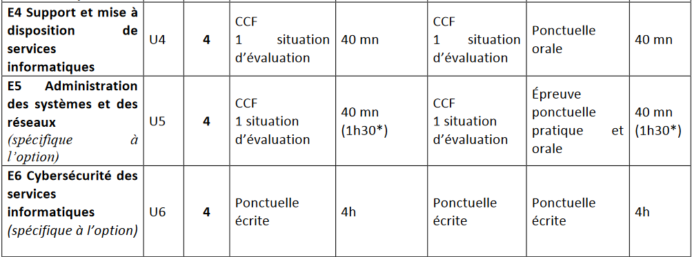

# Accueil

!!! abstract "Actualités"

    - [Lien vers les annales de l'épreuve E6](https://www.reseaucerta.org/sujet-examen)
    - [Lien vers le BO](https://www.reseaucerta.org/sites/default/files/sio/BTS_ServicesInformatiquesOrganisations2019.pdf)

!!! warning "Préparation de l'épreuve E4"

    ^^1 – Objectif^^ 
    Cette épreuve vise à évaluer chez la personne candidate l’acquisition des compétences décrites dans le bloc de compétences « Support et mise à disposition de services informatiques », à savoir : 
    - [ ] gérer le patrimoine informatique  
    - [ ] répondre aux incidents et demandes d’assistance et d’évolution  
    - [ ] développer la présence en ligne de l’organisation  
    - [ ]travailler en mode projet  
    - [ ] mettre à disposition des utilisateurs un service informatique  
    - [ ] organiser son développement professionnel 

    ^^2 – Modalités d’évaluation^^ 
    Cette épreuve est **orale**, Elle prend appui sur des réalisations professionnelles vécues par la personne candidate au cours de sa formation et recensées son **portfolio**.  
    La commission d’évaluation dispose d’un dossier remis par la personne candidate. 
    Contenu du dossier E4 : 
    - [ ] Attestations de stage 
    - [ ] Portfolio numerique, accessible en ligne 
    - [ ] Portefeuille de compétence 
    Vous trouverez la fiche d'évaluation [ici](./data/EvaluationE4.pdf)

!!! tip "Préparation de l'épreuve E5"

    ^^1 – Objectif^^  
    Cette épreuve vise à évaluer chez la personne candidate l’acquisition des compétences décrites dans le bloc de compétences « Conception et développement d’applications » propre à l’option «Solutions logicielles et applications métiers», à savoir : 
    - [ ] concevoir et développer une solution applicative  
    - [ ] assurer la maintenance corrective ou évolutive d’une solution applicative  
    - [ ] gérer les données  

    ^^2 - Préparation^^ 
    L’épreuve prend appui sur deux **réalisations professionnelles** réalisés en cours d'année en Atelier.  
    :clipboard: GNote (java + API Resful) 
    :pill: GSB (Laraval + MySQL) 
    
    La commission d’évaluation choisit une des deux réalisations pour laquelle elle va établir une expression de besoins que la personne candidate doit traiter. L’expression des besoins remise au candidat est rédigée préalablement par la commission à partir de l’une des situations professionnelles présentes dans le dossier. Le dossier est composé de :  
    - d'une fiche de contexte [modèle](./data/FicheContexteAP2024.pdf) pour chacun des contexte 
        - les spécifications fonctionnelles de la production attendue (au besoin illustrées par des schémas, diagrammes ou encore images écran)  
        - éventuellement la nature de la documentation professionnelle à présenter à l’appui de la solution (rapport de test, documentation technique, rapport d’incident, etc.) 

    ^^3 - Déroulement de l'épreuve^^ 
    **Première phase** – préparation de 30 minutes suivie d’un entretien de 20 minutes maximum 
    Sur la base de l'expression des besoins founi par le jury en début d'épreuves, le candidat doit : 
        - de présenter l’analyse et l’interprétation de l’expression des besoins  
        - de proposer des spécifications techniques et le choix des outils les plus adaptés pour la réalisation attendue  
        - de présenter la démarche envisagée pour répondre aux besoins exprimés 

    **Deuxième phase** – préparation d’une heure suivie d’un entretien de 20 minutes maximum  
    Réalisation de la solution attendue et présentée lors de la première phase. 
    Au terme de la préparation, le jury procède à la recette de la solution et mène un entretien d’explicitation 

    :boom: L’usage de l’environnement de travail est placé sous la seule responsabilité de la personne candidate, dans le respect des consignes de sécurité, de sauvegarde des données et des ressources utilisées.
