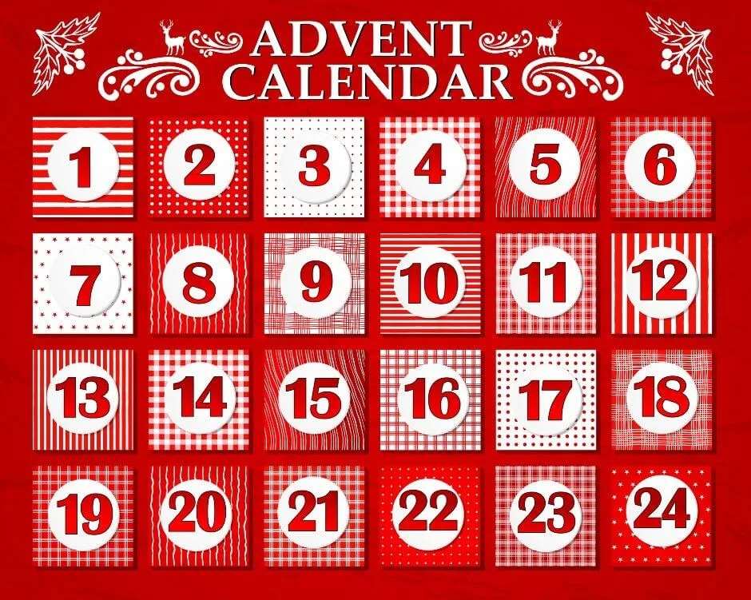

{ .center width=20%}

!!! warning "Actu SIO1 SLAM"

    :pushpin: Thème en cours : [UML](./3_UML/sommaire/)

    :closed_book: Deuxième série de DS : du 17 au 21 Mars 2025 
    :date: Stage SIO1 : 19 mai au 20 juin 2025

!!! warning "Actu SIO2 SLAM"

    :date: Stage SIO2 : 6 janvier au 14 février 2025 

    :pushpin: Thème en cours B2 :  
    :pushpin: Thème en cours B3 : 

    :closed_book: BTS Blanc : du 24 au 28 mars 2025 

    :mega: ^^liste des exposés^^ :

    :arrow_forward: Analyse de cas Cyber :  
    Analyser une attaque Cyber connue et documentée : point d'entrée, impacts de l'attaque, reprise de l'activité, actions à postériori

    - :pig: [fleury Michon 2019](https://www.lemagit.fr/etude/Fleury-Michon-histoire-dune-crise-de-cybersecurite-qui-a-bien-tourne)
    - :hospital: [hopital de rennes 2023](https://www.radiofrance.fr/francebleu/podcasts/l-invite-d-ici/cyberattaque-d-une-clinique-a-rennes-les-rancons-ne-sont-jamais-payees-selon-un-specialiste-9882547) 

    :calendar: date prévue des exposés : 

    |Date|Nom|Thème|
    |:--:|:--:|:--:|
    | ✅ |Vincent|Solarwind 2020 |
    | ✅ |Valentin| Maersh - Not Petya|
    | 25.02.25 |Evan| Change healthcare |
    | 04.03.25 |Enzo| Capgemini 2023 |
    | 11.03.25 |Léa| Centre hospitalier Corbeil Esssonne 2022|
    | 18.03.25 |Guillaume| Stuxnet 2010 |
    

!!! tip "les essentiels"
    - [Lien vers le BO](https://www.reseaucerta.org/sites/default/files/sio/BTS_ServicesInformatiquesOrganisations2019.pdf)

<!--
!!! warning "Calendrier de l'avent"

    {: width=50% .center}

    Pour cette période de Noël, je vous propose un petit jeu. 
    Chaque jour, je posterais une énigme en ligne. Le premier à y répondre par message Ecole Directe marquera 3️⃣ points, le second 2️⃣ points et le troisième 1️⃣ points. 
    Le vendredi 20 décembre, lors du secret 🎅's, je remettrais un prix aux trois gagnants 🏆.

    lien vers le calendrier : [ici !](./calendrier.md)
-->